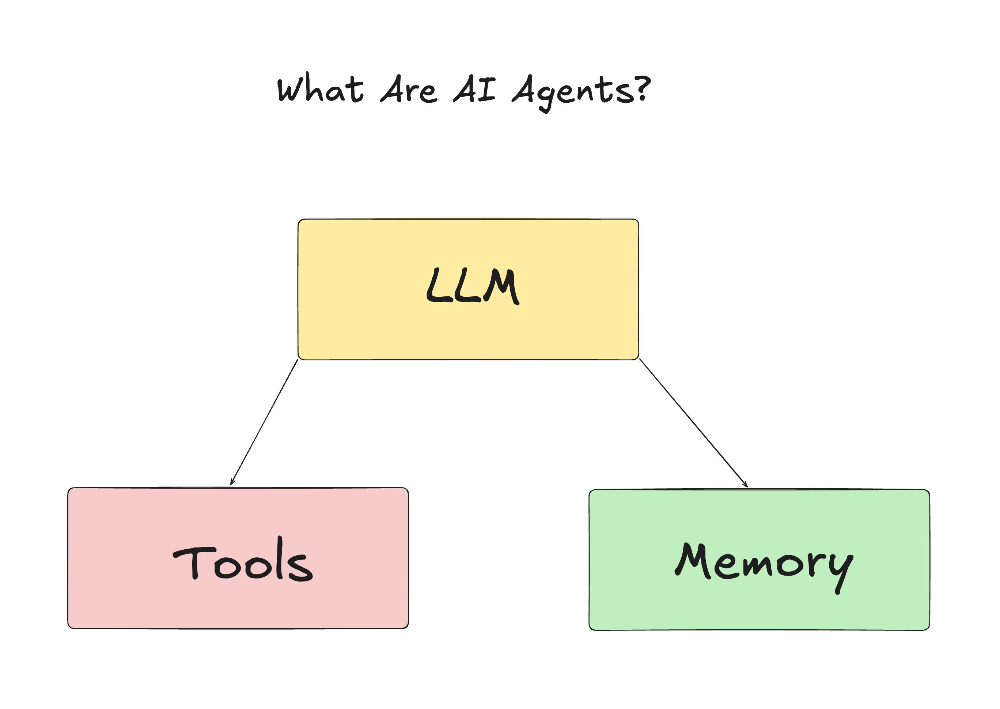
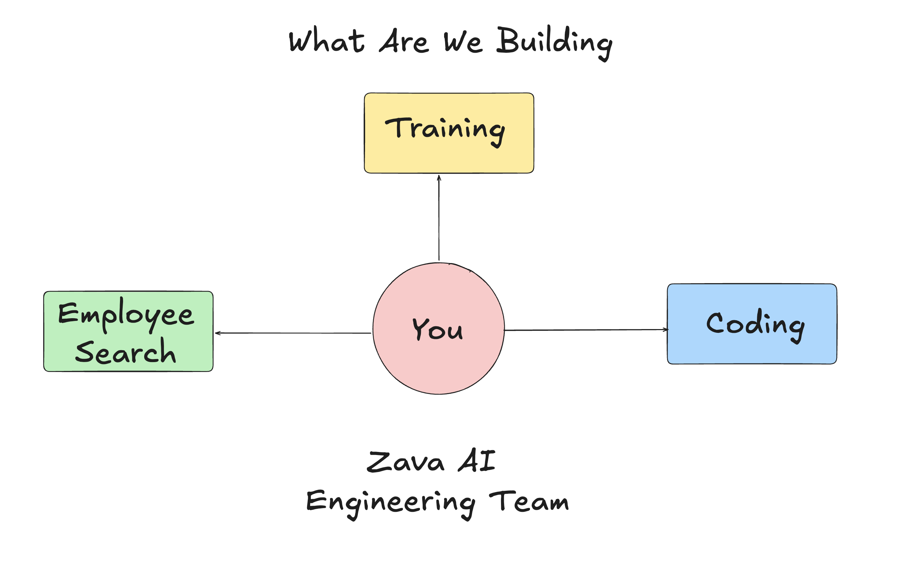
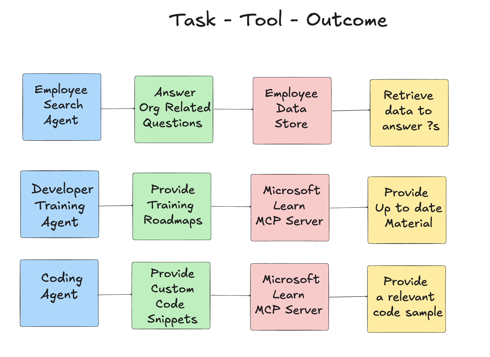
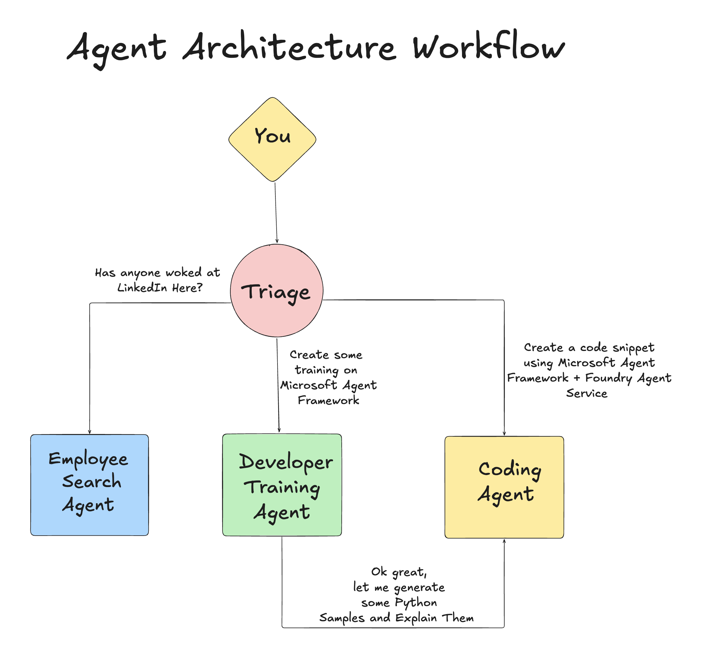

# Lesson 1: AI Agent Design

Welcome to the first lesson of the  "Building AI Agent from Zero to Production Course"!

In this lesson we will cover:

- Defining what AI Agents Are
  
- Discuss the AI Agent Application we are building  

- Identify the required tools and service for each agent
  
- Architect our Agent Application
  
Let's start by defining the what are agent and why we would use them inside an application.

## What Are AI Agents?

If this is your first time exploring how to build an AI Agent, you might have questions on how to exactly define what an AI Agent is.

For a simple way to define what an AI Agent is by the components that make it:

**Large Language Model** - The LLM will power both the ability to process natural language from the user to interpret the task they want to complete as well as interpret the descriptions of the tools available to complete those tasks.

**Tools** - These will be functions, APIs , data stores and other services that the LLM can choose to use to complete the tasks requested by the user.

**Memory** - This how we store both short term and long term interactions between the AI Agent and the user. Storing and retrieving this information is important to making improvements and saving user preferences over time.

## Our AI Agent Use Case

For this course, we are going to build an AI Agent application that helps new developers onboard to our AI Agent Development Team!

Before we do any development work, the first step to creating  a successful AI Agent application, is defining clear scenarios on how we expect our users to work with our AI Agents.

For this application, we will work with these scenarios:

**Scenario 1**:  A new employee joins our organization and wants to know more about the team they joined and how to connect with them.

**Scenario 2:** A new employee wants to know what would the best first task for them to start working on.

**Scenario 3:** A new employee wants to gather learning resources and code samples to help them get started on completing this task.

## Identifying the Tools and Services

Now that we have these scenarios created, the next step is to map them to the tools and services that our AI agents will need to complete these tasks.

This process falls under the category of Context Engineering as we will are going focus on making sure that our AI Agents have the right context at the right time to complete the tasks.

Let's do this scenario by scenario and perform good agentic design by listing each agent's task, tools and desired outcomes.

### Scenario 1 - Employee Search Agent

**Task** -   Answer questions about employees in the organization such as join date, current team, location and last position.

**Tools** - Datastore of current employee list and org chart

**Outcomes** - Able to retrieve information from the datastore to answer general organziational questions and specific questions about employees.

### Scenario 2 - Task Recommendation Agent

**Task** - Based on the new employee's developer experience, come up with 1-3 issues that the new employee can work on.

**Tools** - GitHub MCP Server to get open issues and build a developer profile

**Outcomes** - Able to read the last 5 commits of a GitHub Profile and open issues on a GitHub project and make recommendations based on a match

### Scenario 3 -  Code Assistant Agent

**Task** - Based on the Open Issues that were recommended by the "Task Recommendation" Agent, research and provide resources and generate code snippets for to help the employee.

**Tools** - Microsoft Learn MCP to find resources and Code Interpreter to generate custom code snippets.

**Outcomes** - If the user ask for additional help, the workflow should use the Learn MCP Server to provide links and snippets to resources and then handoff to the Code Interpreter agent to generate small code snippets with explanations.

## Architecting our Agent Application

Now that we have defined each of our Agents, lets create an architecture diagram that will help us understand how each agent will work together and separately depending on the task:

## Next Steps

Now that we have design each agent and our agentic system, lets move on to the next lesson where we will develop each of these agents!
