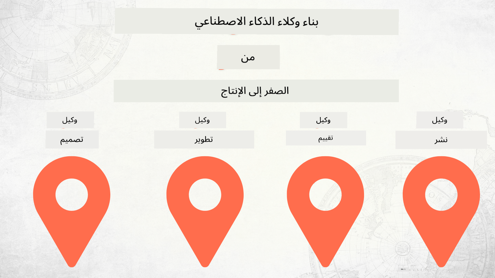

<!--
CO_OP_TRANSLATOR_METADATA:
{
  "original_hash": "2799ceaaefbd8571688459ac03eac5aa",
  "translation_date": "2025-12-12T16:52:23+00:00",
  "source_file": "README.md",
  "language_code": "ar"
}
-->
# بناء وكلاء الذكاء الاصطناعي من الصفر إلى الإنتاج

## دورة تعلمك أساسيات دورة حياة تطوير وكلاء الذكاء الاصطناعي

## 🌱 البدء

تحتوي هذه الدورة على دروس تغطي أساسيات بناء ونشر وكلاء الذكاء الاصطناعي.

كل درس يبني على الدرس السابق، لذلك نوصي بالبدء من البداية والعمل حتى النهاية.

إذا كنت ترغب في استكشاف المزيد حول موضوعات وكلاء الذكاء الاصطناعي، يمكنك الاطلاع على [دورة وكلاء الذكاء الاصطناعي للمبتدئين](https://aka.ms/ai-agents-beginners).

### التعرّف على متعلمين آخرين، والحصول على إجابات لأسئلتك

إذا واجهت صعوبة أو كان لديك أي أسئلة حول بناء وكلاء الذكاء الاصطناعي، انضم إلى قناة Discord المخصصة لنا في [Microsoft Foundry Discord](https://discord.gg/Kuaw3ktsu6).

### ما تحتاجه

كل درس يحتوي على نموذج كود خاص به يمكنك تشغيله محليًا. يمكنك [تفرع هذا المستودع](https://github.com/microsoft/Building-AI-Agents-From-Zero-To-Production/fork) لإنشاء نسختك الخاصة.

تستخدم هذه الدورة حاليًا ما يلي:

- [إطار عمل وكلاء Microsoft (MAF)](https://aka.ms/ai-agents-beginners/agent-framework)
- [Microsoft Foundry](https://azure.microsoft.com/products/ai-foundry)
- [خدمة Azure OpenAI](https://azure.microsoft.com/products/ai-foundry/models/openai)
- [Azure CLI](https://learn.microsoft.com/cli/azure/authenticate-azure-cli?view=azure-cli-latest)

يرجى التأكد من أن لديك حق الوصول إلى هذه الخدمات قبل البدء.

خيارات إضافية حول استضافة النماذج والخدمات قادمة قريبًا.

## 🗃️ الدروس

| **الدرس**         | **الوصف**                                                                                  |
|--------------------|--------------------------------------------------------------------------------------------------|
| [تصميم الوكيل](./lesson-1-agent-design/README.md)       | مقدمة إلى حالة استخدام "توجيه المطور" لوكيلنا وكيفية تصميم وكلاء فعالين  |
| [تطوير الوكيل](./lesson-2-agent-development/README.md)  | باستخدام إطار عمل وكلاء Microsoft (MAF)، إنشاء 3 وكلاء لمساعدة المطورين الجدد على التوجيه.       |
| [تقييم الوكيل](./lesson-3-agent-evals/README.md)  | باستخدام Microsoft Foundry، اكتشف مدى أداء وكلاء الذكاء الاصطناعي لدينا وكيفية تحسينهم. |
| [نشر الوكيل](./lesson-4-agent-deployment/README.md)   | باستخدام الوكلاء المستضافين وOpenAI Chatkit، شاهد كيفية نشر وكيل ذكاء اصطناعي في الإنتاج.       |

## المساهمة

يرحب هذا المشروع بالمساهمات والاقتراحات. تتطلب معظم المساهمات موافقتك على
اتفاقية ترخيص المساهم (CLA) التي تعلن أنك تملك الحق، وأنك تمنحنا فعليًا
الحقوق لاستخدام مساهمتك. للتفاصيل، قم بزيارة <https://cla.opensource.microsoft.com>.

عند تقديم طلب سحب، سيحدد بوت CLA تلقائيًا ما إذا كنت بحاجة إلى تقديم
اتفاقية CLA ويزين طلب السحب بشكل مناسب (مثل، فحص الحالة، تعليق). فقط اتبع التعليمات
المقدمة من البوت. ستحتاج إلى القيام بذلك مرة واحدة فقط عبر جميع المستودعات التي تستخدم اتفاقية CLA الخاصة بنا.

اعتمد هذا المشروع [مدونة قواعد السلوك مفتوحة المصدر من Microsoft](https://opensource.microsoft.com/codeofconduct/).
لمزيد من المعلومات، راجع [الأسئلة الشائعة حول مدونة قواعد السلوك](https://opensource.microsoft.com/codeofconduct/faq/) أو
اتصل بـ [opencode@microsoft.com](mailto:opencode@microsoft.com) لأي أسئلة أو تعليقات إضافية.

## العلامات التجارية

قد يحتوي هذا المشروع على علامات تجارية أو شعارات لمشاريع أو منتجات أو خدمات. الاستخدام المصرح به لعلامات Microsoft
التجارية أو الشعارات يخضع ويجب أن يتبع
[إرشادات العلامات التجارية والعلامات التجارية لشركة Microsoft](https://www.microsoft.com/legal/intellectualproperty/trademarks/usage/general).
يجب ألا يسبب استخدام علامات Microsoft التجارية أو الشعارات في نسخ معدلة من هذا المشروع ارتباكًا أو يوحي برعاية Microsoft.
أي استخدام لعلامات تجارية أو شعارات طرف ثالث يخضع لسياسات تلك الأطراف الثالثة.

## الحصول على المساعدة

إذا واجهت صعوبة أو كان لديك أي أسئلة حول بناء تطبيقات الذكاء الاصطناعي، انضم إلى:

إذا كان لديك ملاحظات على المنتج أو أخطاء أثناء البناء، قم بزيارة:

---

<!-- CO-OP TRANSLATOR DISCLAIMER START -->
**إخلاء المسؤولية**:  
تمت ترجمة هذا المستند باستخدام خدمة الترجمة الآلية [Co-op Translator](https://github.com/Azure/co-op-translator). بينما نسعى لتحقيق الدقة، يرجى العلم أن الترجمات الآلية قد تحتوي على أخطاء أو عدم دقة. يجب اعتبار المستند الأصلي بلغته الأصلية المصدر الموثوق به. للمعلومات الهامة، يُنصح بالاعتماد على الترجمة البشرية المهنية. نحن غير مسؤولين عن أي سوء فهم أو تفسير ناتج عن استخدام هذه الترجمة.
<!-- CO-OP TRANSLATOR DISCLAIMER END -->