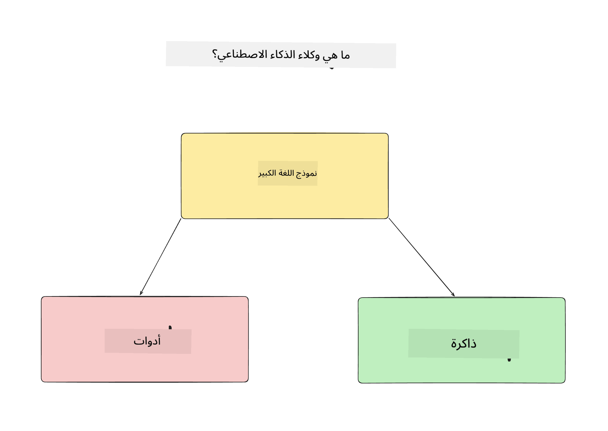
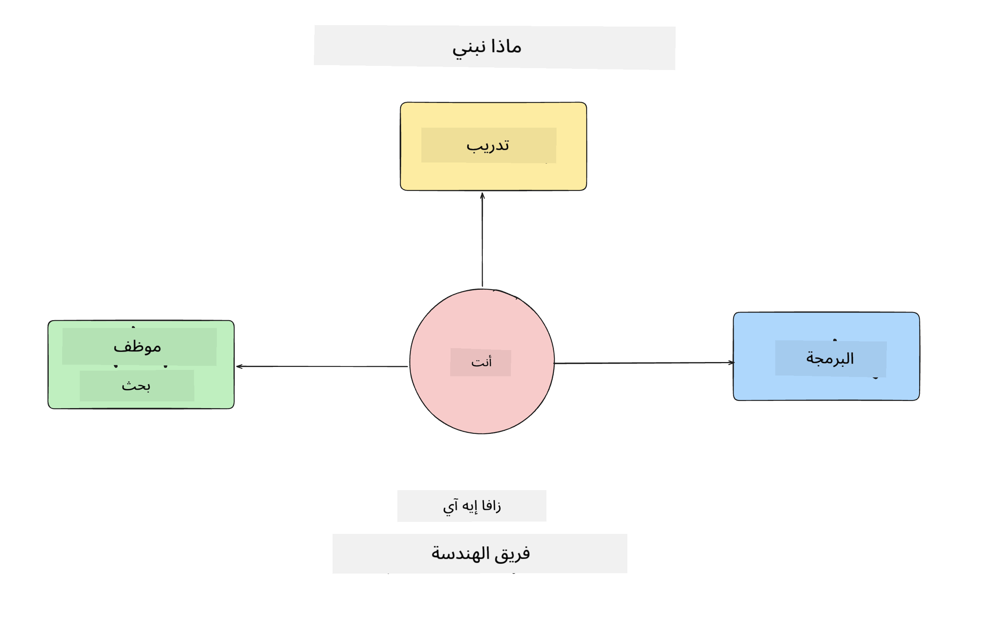
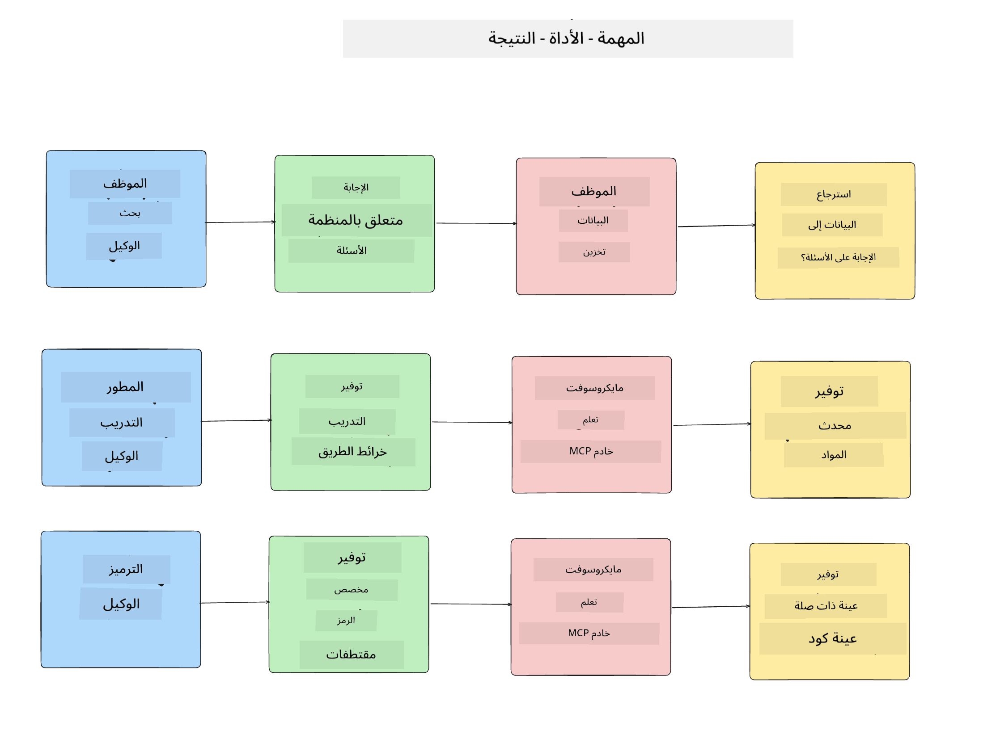
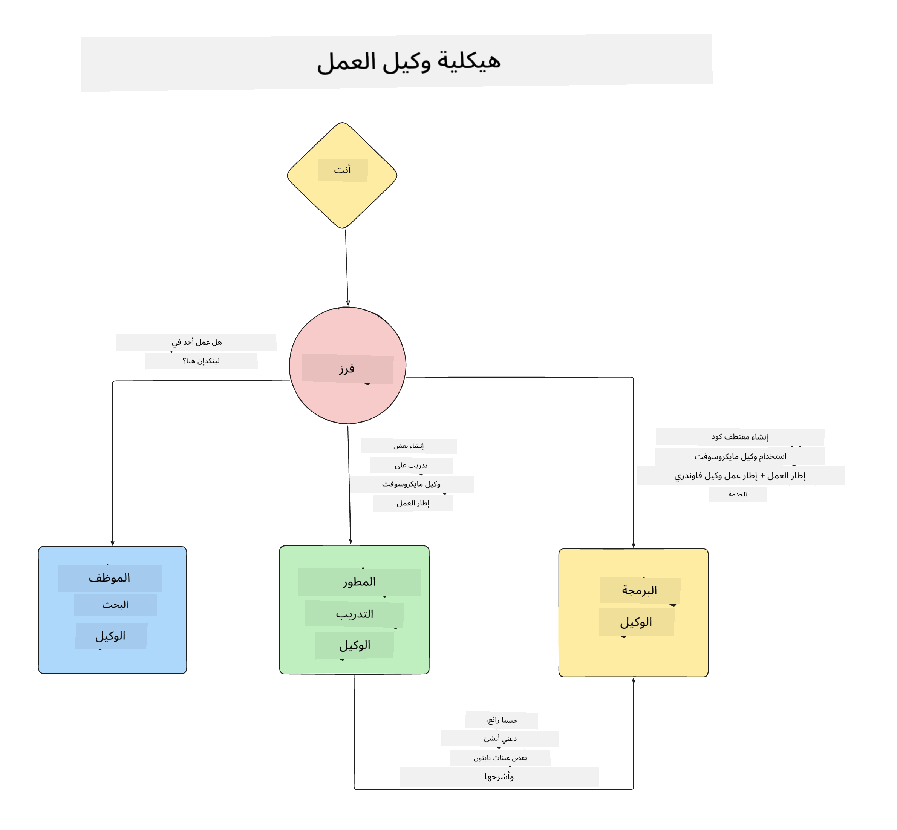

<!--
CO_OP_TRANSLATOR_METADATA:
{
  "original_hash": "99c07849641a850775c188c9333f31e5",
  "translation_date": "2025-12-12T18:16:20+00:00",
  "source_file": "lesson-1-agent-design/README.md",
  "language_code": "ar"
}
-->
# الدرس 1: تصميم وكيل الذكاء الاصطناعي

مرحبًا بكم في الدرس الأول من دورة "بناء وكيل ذكاء اصطناعي من الصفر إلى الإنتاج"!

في هذا الدرس سنغطي:

- تعريف ما هي وكلاء الذكاء الاصطناعي
  
- مناقشة تطبيق وكيل الذكاء الاصطناعي الذي نبنيه  

- تحديد الأدوات والخدمات المطلوبة لكل وكيل
  
- تصميم هيكل تطبيق الوكيل الخاص بنا
  
لنبدأ بتعريف ما هو الوكيل ولماذا نستخدمهم داخل التطبيق.

## ما هي وكلاء الذكاء الاصطناعي؟

إذا كانت هذه هي المرة الأولى التي تستكشف فيها كيفية بناء وكيل ذكاء اصطناعي، قد تكون لديك أسئلة حول كيفية تعريف ما هو وكيل الذكاء الاصطناعي بالضبط.

لتعريف بسيط لما هو وكيل الذكاء الاصطناعي من خلال المكونات التي تشكله:

**النموذج اللغوي الكبير** - سيزود النموذج اللغوي الكبير القدرة على معالجة اللغة الطبيعية من المستخدم لتفسير المهمة التي يريد إكمالها وكذلك تفسير أوصاف الأدوات المتاحة لإكمال تلك المهام.

**الأدوات** - ستكون هذه وظائف، واجهات برمجة التطبيقات، مخازن البيانات وخدمات أخرى يمكن للنموذج اللغوي الكبير اختيار استخدامها لإكمال المهام المطلوبة من المستخدم.

**الذاكرة** - هذه هي الطريقة التي نخزن بها التفاعلات قصيرة وطويلة الأمد بين وكيل الذكاء الاصطناعي والمستخدم. تخزين واسترجاع هذه المعلومات مهم لإجراء تحسينات وحفظ تفضيلات المستخدم مع مرور الوقت.

## حالة استخدام وكيل الذكاء الاصطناعي الخاص بنا

لهذه الدورة، سنبني تطبيق وكيل ذكاء اصطناعي يساعد المطورين الجدد على الانضمام إلى فريق تطوير وكلاء الذكاء الاصطناعي لدينا!

قبل أن نقوم بأي عمل تطوير، الخطوة الأولى لإنشاء تطبيق وكيل ذكاء اصطناعي ناجح هي تحديد سيناريوهات واضحة لكيفية توقعنا أن يعمل مستخدمونا مع وكلاء الذكاء الاصطناعي لدينا.

لهذا التطبيق، سنعمل مع هذه السيناريوهات:

**السيناريو 1**: ينضم موظف جديد إلى منظمتنا ويريد معرفة المزيد عن الفريق الذي انضم إليه وكيفية التواصل معهم.

**السيناريو 2:** يريد الموظف الجديد معرفة ما هي أفضل مهمة أولى يمكنه البدء بالعمل عليها.

**السيناريو 3:** يريد الموظف الجديد جمع موارد تعليمية وعينات من الشيفرة لمساعدته على البدء في إكمال هذه المهمة.

## تحديد الأدوات والخدمات

الآن بعد أن أنشأنا هذه السيناريوهات، الخطوة التالية هي ربطها بالأدوات والخدمات التي سيحتاجها وكلاء الذكاء الاصطناعي لدينا لإكمال هذه المهام.

يقع هذا الإجراء تحت فئة هندسة السياق حيث سنركز على التأكد من أن وكلاء الذكاء الاصطناعي لدينا لديهم السياق الصحيح في الوقت المناسب لإكمال المهام.

لنقم بذلك سيناريو تلو الآخر وننفذ تصميمًا وكيلًا جيدًا من خلال سرد مهمة كل وكيل، الأدوات والنتائج المرجوة.

### السيناريو 1 - وكيل البحث عن الموظف

**المهمة** - الإجابة على الأسئلة حول الموظفين في المنظمة مثل تاريخ الانضمام، الفريق الحالي، الموقع، والوظيفة الأخيرة.

**الأدوات** - مخزن بيانات قائمة الموظفين الحاليين ومخطط المنظمة

**النتائج** - القدرة على استرجاع المعلومات من مخزن البيانات للإجابة على الأسئلة العامة عن المنظمة والأسئلة المحددة حول الموظفين.

### السيناريو 2 - وكيل توصية المهام

**المهمة** - بناءً على خبرة المطور للموظف الجديد، اقتراح 1-3 قضايا يمكن للموظف الجديد العمل عليها.

**الأدوات** - خادم MCP الخاص بـ GitHub للحصول على القضايا المفتوحة وبناء ملف تعريف المطور

**النتائج** - القدرة على قراءة آخر 5 التزامات في ملف GitHub والقضايا المفتوحة في مشروع GitHub وتقديم توصيات بناءً على التطابق

### السيناريو 3 - وكيل مساعد الشيفرة

**المهمة** - بناءً على القضايا المفتوحة التي أوصى بها وكيل "توصية المهام"، البحث وتوفير الموارد وتوليد مقتطفات شيفرة لمساعدة الموظف.

**الأدوات** - Microsoft Learn MCP للعثور على الموارد وCode Interpreter لتوليد مقتطفات شيفرة مخصصة.

**النتائج** - إذا طلب المستخدم مساعدة إضافية، يجب أن يستخدم سير العمل خادم Learn MCP لتوفير روابط ومقتطفات للموارد ثم يسلم إلى وكيل Code Interpreter لتوليد مقتطفات شيفرة صغيرة مع شروحات.

## تصميم هيكل تطبيق الوكيل الخاص بنا

الآن بعد أن عرفنا كل وكيل من وكلائنا، دعونا ننشئ مخطط هيكلي يساعدنا على فهم كيف سيعمل كل وكيل معًا وبشكل منفصل اعتمادًا على المهمة:

## الخطوات التالية

الآن بعد أن صممنا كل وكيل ونظامنا الوكلي، دعونا ننتقل إلى الدرس التالي حيث سنطور كل واحد من هؤلاء الوكلاء!

---

<!-- CO-OP TRANSLATOR DISCLAIMER START -->
**إخلاء المسؤولية**:  
تمت ترجمة هذا المستند باستخدام خدمة الترجمة الآلية [Co-op Translator](https://github.com/Azure/co-op-translator). بينما نسعى لتحقيق الدقة، يرجى العلم أن الترجمات الآلية قد تحتوي على أخطاء أو عدم دقة. يجب اعتبار المستند الأصلي بلغته الأصلية المصدر الموثوق به. للمعلومات الهامة، يُنصح بالاعتماد على الترجمة البشرية المهنية. نحن غير مسؤولين عن أي سوء فهم أو تفسير ناتج عن استخدام هذه الترجمة.
<!-- CO-OP TRANSLATOR DISCLAIMER END -->