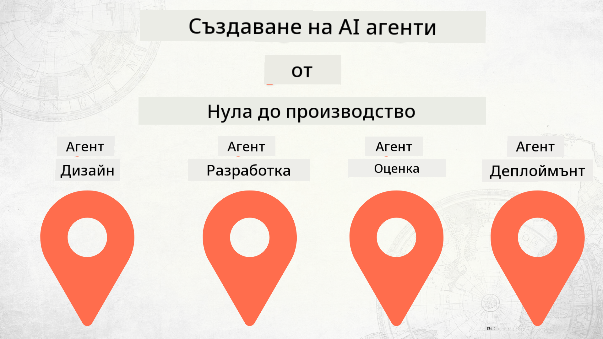

<!--
CO_OP_TRANSLATOR_METADATA:
{
  "original_hash": "f8ea8224e106540413202b4151bb2bcd",
  "translation_date": "2025-12-15T14:34:36+00:00",
  "source_file": "README.md",
  "language_code": "bg"
}
-->
# Създаване на AI агенти от нулата до продукция

### 🌐 Многоезична поддръжка

#### Поддържа се чрез GitHub Action (Автоматизирано и винаги актуално)

<!-- CO-OP TRANSLATOR LANGUAGES TABLE START -->
[Арабски](../ar/README.md) | [Бенгалски](../bn/README.md) | [Български](./README.md) | [Бирмански (Мианмар)](../my/README.md) | [Китайски (опростен)](../zh/README.md) | [Китайски (традиционен, Хонконг)](../hk/README.md) | [Китайски (традиционен, Макао)](../mo/README.md) | [Китайски (традиционен, Тайван)](../tw/README.md) | [Хърватски](../hr/README.md) | [Чешки](../cs/README.md) | [Датски](../da/README.md) | [Холандски](../nl/README.md) | [Естонски](../et/README.md) | [Фински](../fi/README.md) | [Френски](../fr/README.md) | [Немски](../de/README.md) | [Гръцки](../el/README.md) | [Иврит](../he/README.md) | [Хинди](../hi/README.md) | [Унгарски](../hu/README.md) | [Индонезийски](../id/README.md) | [Италиански](../it/README.md) | [Японски](../ja/README.md) | [Каннада](../kn/README.md) | [Корейски](../ko/README.md) | [Литовски](../lt/README.md) | [Малайски](../ms/README.md) | [Малаялам](../ml/README.md) | [Маратхи](../mr/README.md) | [Непалски](../ne/README.md) | [Нигерийски пиджин](../pcm/README.md) | [Норвежки](../no/README.md) | [Персийски (фарси)](../fa/README.md) | [Полски](../pl/README.md) | [Португалски (Бразилия)](../br/README.md) | [Португалски (Португалия)](../pt/README.md) | [Пенджабски (Гурмукхи)](../pa/README.md) | [Румънски](../ro/README.md) | [Руски](../ru/README.md) | [Сръбски (кирилица)](../sr/README.md) | [Словашки](../sk/README.md) | [Словенски](../sl/README.md) | [Испански](../es/README.md) | [Суахили](../sw/README.md) | [Шведски](../sv/README.md) | [Тагалог (Филипински)](../tl/README.md) | [Тамилски](../ta/README.md) | [Телугу](../te/README.md) | [Тайски](../th/README.md) | [Турски](../tr/README.md) | [Украински](../uk/README.md) | [Урду](../ur/README.md) | [Виетнамски](../vi/README.md)
<!-- CO-OP TRANSLATOR LANGUAGES TABLE END -->

## Курс, който ви учи на основите на жизнения цикъл на разработка на AI агенти

## 🌱 Започване

Този курс съдържа уроци, обхващащи основите на създаването и внедряването на AI агенти.

Всеки урок надгражда върху предишния, затова препоръчваме да започнете от началото и да продължите до края.

Ако искате да изследвате повече теми за AI агенти, можете да разгледате [Курс за AI агенти за начинаещи](https://aka.ms/ai-agents-beginners).

### Срещнете други учащи, получете отговори на въпросите си

Ако се затрудните или имате въпроси относно създаването на AI агенти, присъединете се към нашия специализиран Discord канал в [Microsoft Foundry Discord](https://discord.gg/Kuaw3ktsu6).

### Какво ви е необходимо

Всеки урок има собствен примерен код, който можете да стартирате локално. Можете да [форкнете това хранилище](https://github.com/microsoft/Building-AI-Agents-From-Zero-To-Production/fork), за да създадете свое копие.

Този курс в момента използва следното:

- [Microsoft Agent Framework (MAF)](https://aka.ms/ai-agents-beginners/agent-framework)
- [Microsoft Foundry](https://azure.microsoft.com/products/ai-foundry)
- [Azure OpenAI Service](https://azure.microsoft.com/products/ai-foundry/models/openai)
- [Azure CLI](https://learn.microsoft.com/cli/azure/authenticate-azure-cli?view=azure-cli-latest)

Моля, уверете се, че имате достъп до тези услуги преди да започнете.

Още опции за хостинг на модели и услуги предстоят скоро.

## 🗃️ Уроци

| **Урок**           | **Описание**                                                                                     |
|--------------------|-------------------------------------------------------------------------------------------------|
| [Дизайн на агент](./lesson-1-agent-design/README.md)       | Въведение в нашия случай на използване "Въвеждане на разработчик" и как да проектираме ефективни агенти  |
| [Разработка на агент](./lesson-2-agent-development/README.md)  | Използвайки Microsoft Agent Framework (MAF), създайте 3 агента, които да помагат на нови разработчици да се въведат.       |
| [Оценки на агенти](./lesson-3-agent-evals/README.md)  | Използвайки Microsoft Foundry, разберете колко добре се представят нашите AI агенти и как да ги подобрите. |
| [Внедряване на агент](./lesson-4-agent-deployment/README.md)   | Използвайки хостваните агенти и OpenAI Chatkit, вижте как да внедрите AI агент в продукция.       |

## Принос

Този проект приветства приноси и предложения. Повечето приноси изискват да се съгласите с
Лицензионно споразумение за приносител (CLA), което декларира, че имате правото и наистина предоставяте
правата ни да използваме вашия принос. За подробности посетете <https://cla.opensource.microsoft.com>.

Когато изпратите заявка за изтегляне, бот за CLA автоматично ще определи дали трябва да предоставите
CLA и ще маркира PR подходящо (например, проверка на статус, коментар). Просто следвайте инструкциите,
предоставени от бота. Това трябва да направите само веднъж за всички хранилища, използващи нашия CLA.

Този проект е приел [Кодекса за поведение на Microsoft Open Source](https://opensource.microsoft.com/codeofconduct/).
За повече информация вижте [Често задавани въпроси за Кодекса за поведение](https://opensource.microsoft.com/codeofconduct/faq/) или
се свържете с [opencode@microsoft.com](mailto:opencode@microsoft.com) при допълнителни въпроси или коментари.

## Търговски марки

Този проект може да съдържа търговски марки или лога на проекти, продукти или услуги. Употребата на търговски марки или лога на Microsoft е разрешена и трябва да следва
[Правилата за търговски марки и бранд на Microsoft](https://www.microsoft.com/legal/intellectualproperty/trademarks/usage/general).
Използването на търговски марки или лога на Microsoft в модифицирани версии на този проект не трябва да създава объркване или да предполага спонсорство от Microsoft.
Всяко използване на търговски марки или лога на трети страни е предмет на политиките на тези трети страни.

## Получаване на помощ

Ако се затрудните или имате въпроси относно създаването на AI приложения, присъединете се към:

Ако имате обратна връзка за продукта или грешки по време на разработка, посетете:

---

<!-- CO-OP TRANSLATOR DISCLAIMER START -->
**Отказ от отговорност**:
Този документ е преведен с помощта на AI преводаческа услуга [Co-op Translator](https://github.com/Azure/co-op-translator). Въпреки че се стремим към точност, моля, имайте предвид, че автоматизираните преводи могат да съдържат грешки или неточности. Оригиналният документ на неговия роден език трябва да се счита за авторитетен източник. За критична информация се препоръчва професионален човешки превод. Ние не носим отговорност за каквито и да е недоразумения или неправилни тълкувания, произтичащи от използването на този превод.
<!-- CO-OP TRANSLATOR DISCLAIMER END -->