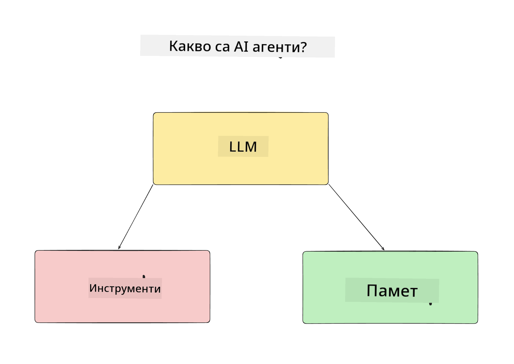
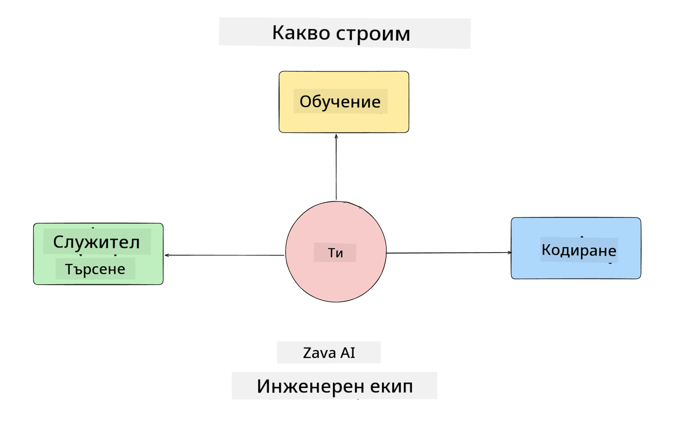
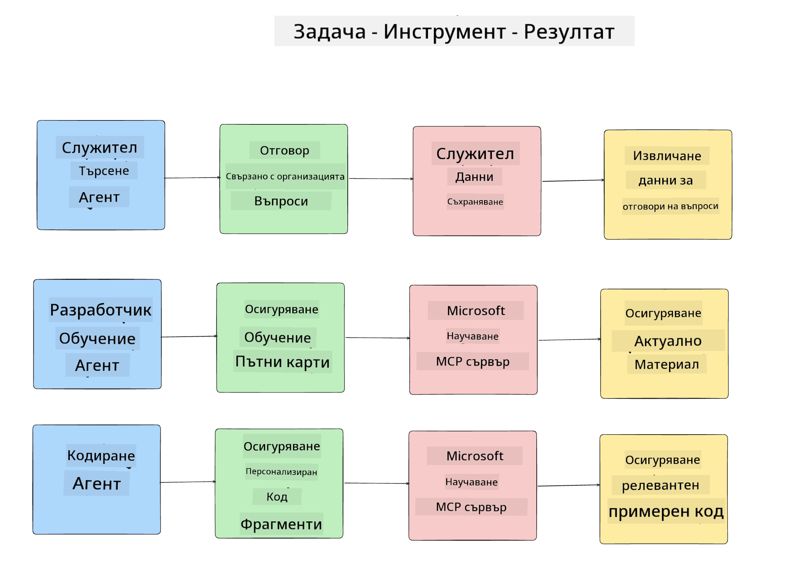
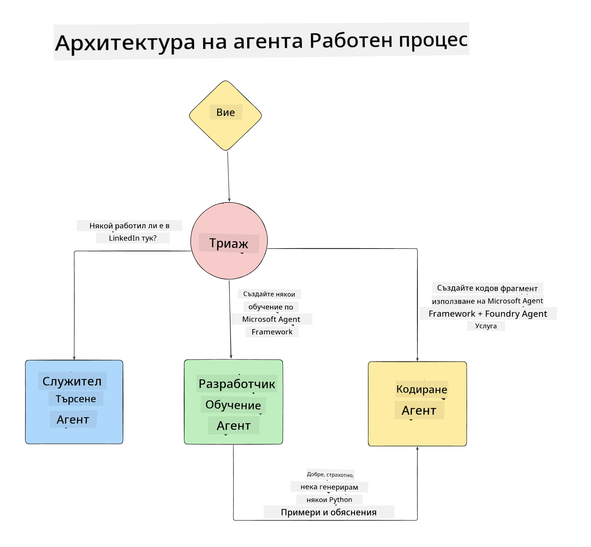

<!--
CO_OP_TRANSLATOR_METADATA:
{
  "original_hash": "99c07849641a850775c188c9333f31e5",
  "translation_date": "2025-12-12T18:39:51+00:00",
  "source_file": "lesson-1-agent-design/README.md",
  "language_code": "bg"
}
-->
# Урок 1: Проектиране на AI агент

Добре дошли в първия урок от курса "Създаване на AI агент от нулата до продукция"!

В този урок ще разгледаме:

- Дефиниране какво са AI агентите
  
- Обсъждане на AI агент приложението, което изграждаме  

- Идентифициране на необходимите инструменти и услуги за всеки агент
  
- Проектиране на нашето агент приложение
  
Нека започнем с дефиниране какво е агент и защо бихме ги използвали в едно приложение.

## Какво са AI агенти?

Ако това е първият път, когато изследвате как да създадете AI агент, може да имате въпроси как точно да дефинирате какво е AI агент.

За прост начин да дефинираме какво е AI агент чрез компонентите, които го съставят:

**Голям езиков модел** - LLM ще захранва както способността да обработва естествен език от потребителя, за да интерпретира задачата, която иска да изпълни, така и да интерпретира описанията на наличните инструменти за изпълнение на тези задачи.

**Инструменти** - Това ще бъдат функции, API-та, хранилища на данни и други услуги, които LLM може да избере да използва, за да изпълни задачите, поискани от потребителя.

**Памет** - Това е начинът, по който съхраняваме както краткосрочни, така и дългосрочни взаимодействия между AI агента и потребителя. Съхраняването и извличането на тази информация е важно за подобрения и запазване на предпочитанията на потребителя с течение на времето.

## Нашият AI агентен случай на употреба

За този курс ще изградим AI агент приложение, което помага на нови разработчици да се включат в нашия екип за разработка на AI агенти!

Преди да започнем с разработката, първата стъпка за създаване на успешно AI агент приложение е да дефинираме ясни сценарии за това как очакваме потребителите да работят с нашите AI агенти.

За това приложение ще работим със следните сценарии:

**Сценарий 1**: Нов служител се присъединява към нашата организация и иска да научи повече за екипа, към който се е присъединил, и как да се свърже с тях.

**Сценарий 2:** Нов служител иска да знае коя би била най-добрата първа задача, с която да започне работа.

**Сценарий 3:** Нов служител иска да събере учебни ресурси и примерен код, които да му помогнат да започне изпълнението на тази задача.

## Идентифициране на инструментите и услугите

Сега, когато имаме създадени тези сценарии, следващата стъпка е да ги свържем с инструментите и услугите, от които нашите AI агенти ще се нуждаят, за да изпълнят тези задачи.

Този процес попада в категорията Контекстно инженерство, тъй като ще се фокусираме върху това да осигурим на нашите AI агенти правилния контекст в правилния момент, за да изпълнят задачите.

Нека го направим сценарий по сценарий и да извършим добро агентско проектиране, като изброим задачите, инструментите и желаните резултати за всеки агент.

### Сценарий 1 - Агент за търсене на служители

**Задача** - Отговаряне на въпроси за служителите в организацията, като дата на присъединяване, текущ екип, местоположение и последна позиция.

**Инструменти** - Хранилище с текущ списък на служителите и организационна схема

**Резултати** - Способност за извличане на информация от хранилището, за да отговаря на общи организационни въпроси и конкретни въпроси за служителите.

### Сценарий 2 - Агент за препоръка на задачи

**Задача** - Въз основа на опита на новия служител като разработчик, да предложи 1-3 задачи, по които новият служител може да работи.

**Инструменти** - GitHub MCP сървър за получаване на отворени задачи и изграждане на профил на разработчика

**Резултати** - Способност да чете последните 5 комита на GitHub профил и отворени задачи в GitHub проект и да прави препоръки въз основа на съвпадение

### Сценарий 3 - Агент помощник за кодиране

**Задача** - Въз основа на отворените задачи, препоръчани от агента "Препоръка на задачи", да изследва и предоставя ресурси и да генерира кодови фрагменти, които да помогнат на служителя.

**Инструменти** - Microsoft Learn MCP за намиране на ресурси и Code Interpreter за генериране на персонализирани кодови фрагменти.

**Резултати** - Ако потребителят поиска допълнителна помощ, работният процес трябва да използва Learn MCP сървъра, за да предостави връзки и фрагменти към ресурси и след това да предаде на агента Code Interpreter, за да генерира малки кодови фрагменти с обяснения.

## Проектиране на нашето агент приложение

Сега, когато сме дефинирали всеки от нашите агенти, нека създадем архитектурна диаграма, която ще ни помогне да разберем как всеки агент ще работи заедно и поотделно в зависимост от задачата:

## Следващи стъпки

Сега, когато сме проектирали всеки агент и нашата агентска система, нека преминем към следващия урок, където ще разработим всеки от тези агенти!

---

<!-- CO-OP TRANSLATOR DISCLAIMER START -->
**Отказ от отговорност**:  
Този документ е преведен с помощта на AI преводаческа услуга [Co-op Translator](https://github.com/Azure/co-op-translator). Въпреки че се стремим към точност, моля, имайте предвид, че автоматизираните преводи могат да съдържат грешки или неточности. Оригиналният документ на неговия роден език трябва да се счита за авторитетен източник. За критична информация се препоръчва професионален човешки превод. Ние не носим отговорност за каквито и да е недоразумения или неправилни тълкувания, произтичащи от използването на този превод.
<!-- CO-OP TRANSLATOR DISCLAIMER END -->