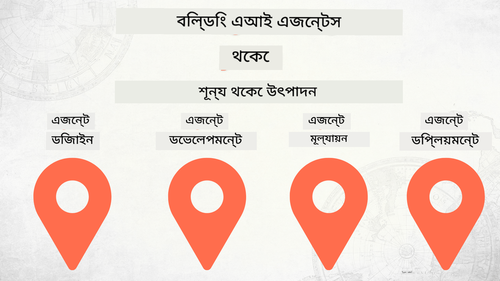

<!--
CO_OP_TRANSLATOR_METADATA:
{
  "original_hash": "d8cf941adeb146a5f00f04e4726c3033",
  "translation_date": "2025-12-19T10:04:41+00:00",
  "source_file": "README.md",
  "language_code": "bn"
}
-->
# শূন্য থেকে প্রোডাকশনে AI এজেন্ট তৈরি

### 🌐 বহুভাষিক সমর্থন

#### GitHub Action এর মাধ্যমে সমর্থিত (স্বয়ংক্রিয় ও সর্বদা আপ-টু-ডেট)

<!-- CO-OP TRANSLATOR LANGUAGES TABLE START -->
[Arabic](../ar/README.md) | [Bengali](./README.md) | [Bulgarian](../bg/README.md) | [Burmese (Myanmar)](../my/README.md) | [Chinese (Simplified)](../zh/README.md) | [Chinese (Traditional, Hong Kong)](../hk/README.md) | [Chinese (Traditional, Macau)](../mo/README.md) | [Chinese (Traditional, Taiwan)](../tw/README.md) | [Croatian](../hr/README.md) | [Czech](../cs/README.md) | [Danish](../da/README.md) | [Dutch](../nl/README.md) | [Estonian](../et/README.md) | [Finnish](../fi/README.md) | [French](../fr/README.md) | [German](../de/README.md) | [Greek](../el/README.md) | [Hebrew](../he/README.md) | [Hindi](../hi/README.md) | [Hungarian](../hu/README.md) | [Indonesian](../id/README.md) | [Italian](../it/README.md) | [Japanese](../ja/README.md) | [Kannada](../kn/README.md) | [Korean](../ko/README.md) | [Lithuanian](../lt/README.md) | [Malay](../ms/README.md) | [Malayalam](../ml/README.md) | [Marathi](../mr/README.md) | [Nepali](../ne/README.md) | [Nigerian Pidgin](../pcm/README.md) | [Norwegian](../no/README.md) | [Persian (Farsi)](../fa/README.md) | [Polish](../pl/README.md) | [Portuguese (Brazil)](../br/README.md) | [Portuguese (Portugal)](../pt/README.md) | [Punjabi (Gurmukhi)](../pa/README.md) | [Romanian](../ro/README.md) | [Russian](../ru/README.md) | [Serbian (Cyrillic)](../sr/README.md) | [Slovak](../sk/README.md) | [Slovenian](../sl/README.md) | [Spanish](../es/README.md) | [Swahili](../sw/README.md) | [Swedish](../sv/README.md) | [Tagalog (Filipino)](../tl/README.md) | [Tamil](../ta/README.md) | [Telugu](../te/README.md) | [Thai](../th/README.md) | [Turkish](../tr/README.md) | [Ukrainian](../uk/README.md) | [Urdu](../ur/README.md) | [Vietnamese](../vi/README.md)
<!-- CO-OP TRANSLATOR LANGUAGES TABLE END -->

## AI এজেন্ট ডেভেলপমেন্ট লাইফসাইকেলের মৌলিক বিষয় শেখানোর একটি কোর্স

## 🌱 শুরু করা

এই কোর্সে AI এজেন্ট তৈরি ও ডিপ্লয়মেন্টের মৌলিক বিষয়গুলি শেখানো হয়।

প্রতিটি পাঠ পূর্ববর্তীটির উপর ভিত্তি করে তৈরি, তাই আমরা শুরু থেকে শুরু করে শেষ পর্যন্ত কাজ করার পরামর্শ দিই।

আপনি যদি AI এজেন্ট বিষয়গুলি আরও অন্বেষণ করতে চান, তাহলে আপনি [AI Agents For Beginners Course](https://aka.ms/ai-agents-beginners) দেখতে পারেন।

### অন্যান্য শিক্ষার্থীদের সাথে পরিচিত হন, আপনার প্রশ্নের উত্তর পান

যদি আপনি আটকে যান বা AI এজেন্ট তৈরি সম্পর্কে কোনো প্রশ্ন থাকে, তাহলে আমাদের নিবেদিত Discord চ্যানেলে যোগ দিন [Microsoft Foundry Discord](https://discord.gg/Kuaw3ktsu6)।

### আপনার যা প্রয়োজন

প্রতিটি পাঠের নিজস্ব কোড নমুনা রয়েছে যা আপনি স্থানীয়ভাবে চালাতে পারেন। আপনি [এই রিপোটি fork করতে পারেন](https://github.com/microsoft/Building-AI-Agents-From-Zero-To-Production/fork) আপনার নিজস্ব কপি তৈরি করার জন্য।

এই কোর্স বর্তমানে নিম্নলিখিতগুলি ব্যবহার করে:

- [Microsoft Agent Framework (MAF)](https://aka.ms/ai-agents-beginners/agent-framework)
- [Microsoft Foundry](https://azure.microsoft.com/products/ai-foundry)
- [Azure OpenAI Service](https://azure.microsoft.com/products/ai-foundry/models/openai)
- [Azure CLI](https://learn.microsoft.com/cli/azure/authenticate-azure-cli?view=azure-cli-latest)

শুরু করার আগে নিশ্চিত করুন যে আপনার কাছে এই সেবাগুলির অ্যাক্সেস আছে।

মডেল হোস্টিং এবং সেবাগুলির আরও বিকল্প শীঘ্রই আসছে।

## 🗃️ পাঠসমূহ

| **পাঠ**         | **বর্ণনা**                                                                                  |
|--------------------|--------------------------------------------------------------------------------------------------|
| [Agent Design](./lesson-1-agent-design/README.md)       | আমাদের "ডেভেলপার অনবোর্ডিং" এজেন্ট ইউজ কেসের পরিচিতি এবং কার্যকর এজেন্ট ডিজাইন করার পদ্ধতি  |
| [Agent Development](./lesson-2-agent-development/README.md)  | Microsoft Agent Framework (MAF) ব্যবহার করে নতুন ডেভেলপারদের সাহায্যের জন্য ৩টি এজেন্ট তৈরি করা।       |
| [Agent Evaluations](./lesson-3-agent-evals/README.md)  | Microsoft Foundry ব্যবহার করে আমাদের AI এজেন্টগুলি কতটা কার্যকর তা নির্ণয় এবং উন্নতির উপায় খোঁজা। |
| [Agent Deployment](./lesson-4-agent-deployment/README.md)   | Hosted Agents এবং OpenAI Chatkit ব্যবহার করে AI এজেন্টকে প্রোডাকশনে ডিপ্লয় করার পদ্ধতি।       |

## 🎒 অন্যান্য কোর্স

আমাদের দল অন্যান্য কোর্সও তৈরি করে! দেখুন:

<!-- CO-OP TRANSLATOR OTHER COURSES START -->
### LangChain

---

### Azure / Edge / MCP / Agents

---
 
### Generative AI Series

[-9333EA?style=for-the-badge&labelColor=E5E7EB&color=9333EA)](https://github.com/microsoft/Generative-AI-for-beginners-dotnet?WT.mc_id=academic-105485-koreyst)
[-C084FC?style=for-the-badge&labelColor=E5E7EB&color=C084FC)](https://github.com/microsoft/generative-ai-for-beginners-java?WT.mc_id=academic-105485-koreyst)
[-E879F9?style=for-the-badge&labelColor=E5E7EB&color=E879F9)](https://github.com/microsoft/generative-ai-with-javascript?WT.mc_id=academic-105485-koreyst)

---
 
### মূল শিক্ষা

---
 
### কপাইলট সিরিজ

<!-- CO-OP TRANSLATOR OTHER COURSES END -->

## অবদান রাখা

এই প্রকল্পে অবদান এবং পরামর্শ স্বাগত। বেশিরভাগ অবদানের জন্য আপনাকে একটি
কন্ট্রিবিউটর লাইসেন্স এগ্রিমেন্ট (CLA) এ সম্মত হতে হবে যা ঘোষণা করে যে আপনার অধিকার আছে এবং আপনি প্রকৃতপক্ষে আমাদের
আপনার অবদান ব্যবহারের অধিকার প্রদান করছেন। বিস্তারিত জানতে, দেখুন <https://cla.opensource.microsoft.com>।

যখন আপনি একটি পুল রিকোয়েস্ট জমা দেন, একটি CLA বট স্বয়ংক্রিয়ভাবে নির্ধারণ করবে যে আপনাকে CLA প্রদান করতে হবে কিনা এবং PR-কে উপযুক্তভাবে সাজাবে (যেমন, স্ট্যাটাস চেক, মন্তব্য)। বটের নির্দেশনা অনুসরণ করুন। আমাদের CLA ব্যবহার করা সমস্ত রিপোজিটরির জন্য আপনাকে এটি একবারই করতে হবে।

এই প্রকল্পটি [Microsoft Open Source Code of Conduct](https://opensource.microsoft.com/codeofconduct/) গ্রহণ করেছে।
অধিক তথ্যের জন্য দেখুন [Code of Conduct FAQ](https://opensource.microsoft.com/codeofconduct/faq/) অথবা
যেকোনো অতিরিক্ত প্রশ্ন বা মন্তব্যের জন্য যোগাযোগ করুন [opencode@microsoft.com](mailto:opencode@microsoft.com)।

## ট্রেডমার্ক

এই প্রকল্পে প্রকল্প, পণ্য, বা সেবার ট্রেডমার্ক বা লোগো থাকতে পারে। Microsoft
ট্রেডমার্ক বা লোগোর অনুমোদিত ব্যবহার [Microsoft's Trademark & Brand Guidelines](https://www.microsoft.com/legal/intellectualproperty/trademarks/usage/general) অনুসরণ করতে হবে।
এই প্রকল্পের সংশোধিত সংস্করণে Microsoft ট্রেডমার্ক বা লোগোর ব্যবহার বিভ্রান্তি সৃষ্টি করা বা Microsoft স্পন্সরশিপ বোঝানো উচিত নয়।
তৃতীয় পক্ষের ট্রেডমার্ক বা লোগোর যেকোনো ব্যবহার সেই পক্ষের নীতিমালা অনুসরণ করবে।

## সাহায্য নেওয়া

যদি আপনি আটকে যান বা AI অ্যাপ তৈরি সম্পর্কে কোনো প্রশ্ন থাকে, যোগ দিন:

যদি আপনার পণ্য প্রতিক্রিয়া বা ত্রুটি থাকে, দেখুন:

---

<!-- CO-OP TRANSLATOR DISCLAIMER START -->
**অস্বীকৃতি**:  
এই নথিটি AI অনুবাদ সেবা [Co-op Translator](https://github.com/Azure/co-op-translator) ব্যবহার করে অনূদিত হয়েছে। আমরা যথাসাধ্য সঠিকতার চেষ্টা করি, তবে স্বয়ংক্রিয় অনুবাদে ত্রুটি বা অসঙ্গতি থাকতে পারে। মূল নথিটি তার নিজস্ব ভাষায়ই কর্তৃত্বপূর্ণ উৎস হিসেবে বিবেচিত হওয়া উচিত। গুরুত্বপূর্ণ তথ্যের জন্য পেশাদার মানব অনুবাদ গ্রহণ করার পরামর্শ দেওয়া হয়। এই অনুবাদের ব্যবহারে সৃষ্ট কোনো ভুল বোঝাবুঝি বা ভুল ব্যাখ্যার জন্য আমরা দায়ী নই।
<!-- CO-OP TRANSLATOR DISCLAIMER END -->