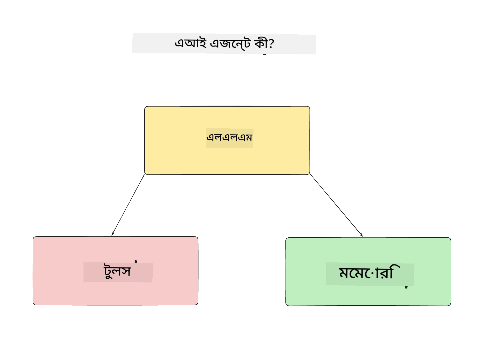
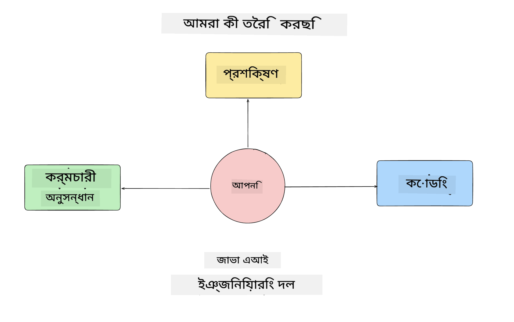
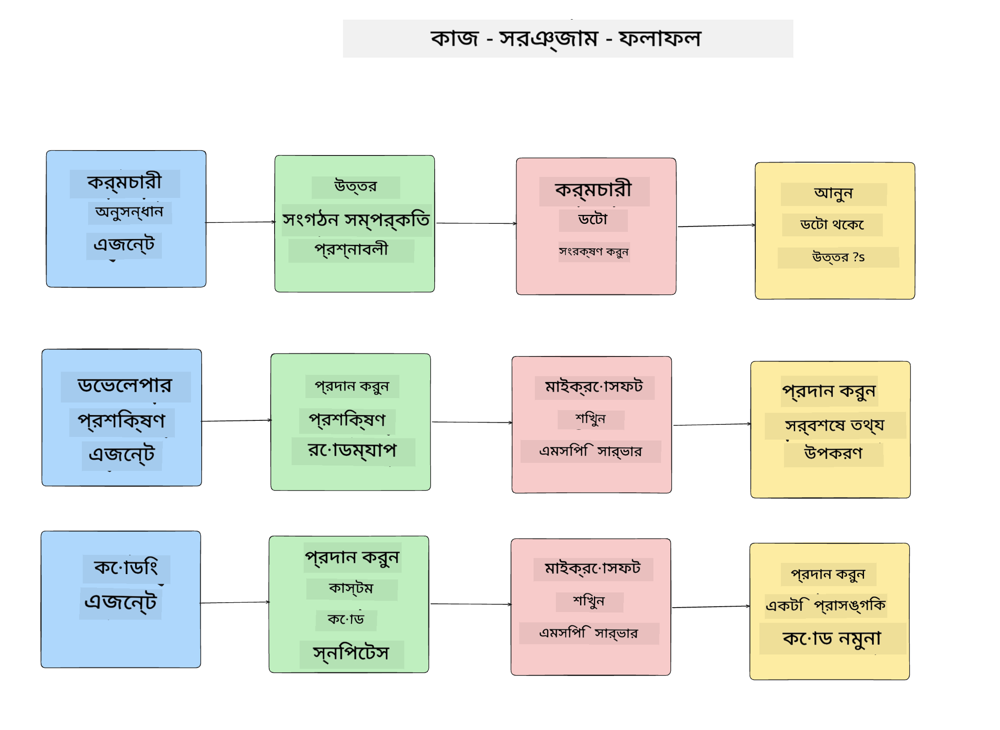
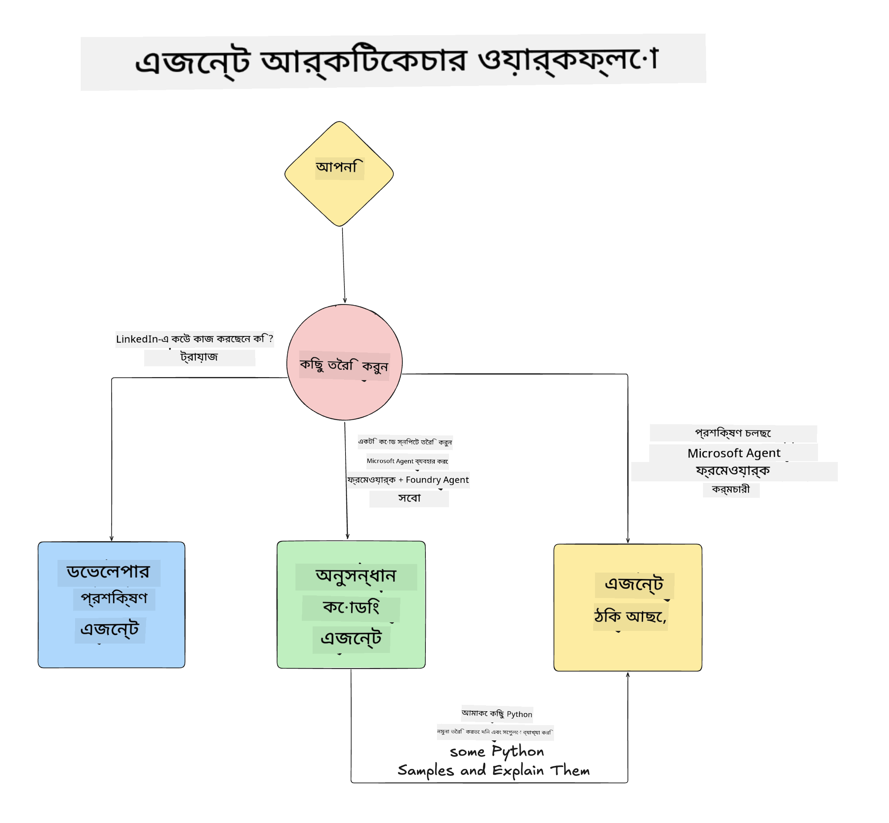

<!--
CO_OP_TRANSLATOR_METADATA:
{
  "original_hash": "99c07849641a850775c188c9333f31e5",
  "translation_date": "2025-12-12T18:22:31+00:00",
  "source_file": "lesson-1-agent-design/README.md",
  "language_code": "bn"
}
-->
# পাঠ ১: এআই এজেন্ট ডিজাইন

"শূন্য থেকে প্রোডাকশনে এআই এজেন্ট তৈরি কোর্স"-এর প্রথম পাঠে আপনাকে স্বাগতম!

এই পাঠে আমরা আলোচনা করব:

- এআই এজেন্ট কী তা সংজ্ঞায়িত করা
  
- আমরা যে এআই এজেন্ট অ্যাপ্লিকেশন তৈরি করছি তা আলোচনা করা  

- প্রতিটি এজেন্টের জন্য প্রয়োজনীয় টুলস এবং সার্ভিস চিহ্নিত করা
  
- আমাদের এজেন্ট অ্যাপ্লিকেশন আর্কিটেকচার করা
  
চলুন শুরু করি এজেন্ট কী এবং কেন আমরা একটি অ্যাপ্লিকেশনের মধ্যে তাদের ব্যবহার করব তা সংজ্ঞায়িত করে।

## এআই এজেন্ট কী?

যদি এটি আপনার প্রথমবার হয় এআই এজেন্ট কীভাবে তৈরি করতে হয় তা অন্বেষণ করা, তাহলে আপনার মনে প্রশ্ন থাকতে পারে এআই এজেন্ট কীভাবে সঠিকভাবে সংজ্ঞায়িত করা যায়।

সহজভাবে এআই এজেন্ট কী তা সংজ্ঞায়িত করার জন্য তার উপাদানগুলো হলো:

**বড় ভাষা মডেল** - এলএলএম ব্যবহারকারীর প্রাকৃতিক ভাষা প্রক্রিয়াকরণ ক্ষমতা চালিত করবে, যাতে তারা যে কাজটি সম্পন্ন করতে চায় তা ব্যাখ্যা করতে পারে এবং সেই কাজগুলি সম্পন্ন করার জন্য উপলব্ধ টুলসের বর্ণনাও ব্যাখ্যা করতে পারে।

**টুলস** - এগুলো হবে ফাংশন, এপিআই, ডেটা স্টোর এবং অন্যান্য সার্ভিস যা এলএলএম ব্যবহারকারী দ্বারা অনুরোধকৃত কাজগুলি সম্পন্ন করতে বেছে নিতে পারে।

**মেমোরি** - এটি হলো আমরা কীভাবে এআই এজেন্ট এবং ব্যবহারকারীর মধ্যে স্বল্পমেয়াদী এবং দীর্ঘমেয়াদী ইন্টারঅ্যাকশন সংরক্ষণ করি। এই তথ্য সংরক্ষণ এবং পুনরুদ্ধার করা উন্নতি সাধন এবং ব্যবহারকারীর পছন্দসমূহ সংরক্ষণে গুরুত্বপূর্ণ।

## আমাদের এআই এজেন্ট ব্যবহারের কেস

এই কোর্সের জন্য, আমরা একটি এআই এজেন্ট অ্যাপ্লিকেশন তৈরি করব যা নতুন ডেভেলপারদের আমাদের এআই এজেন্ট ডেভেলপমেন্ট টিমে অনবোর্ড করতে সাহায্য করবে!

কোনো ডেভেলপমেন্ট কাজ করার আগে, সফল একটি এআই এজেন্ট অ্যাপ্লিকেশন তৈরির প্রথম ধাপ হলো স্পষ্ট দৃশ্যপট সংজ্ঞায়িত করা যে আমরা আমাদের ব্যবহারকারীরা কীভাবে আমাদের এআই এজেন্টদের সাথে কাজ করবে বলে আশা করি।

এই অ্যাপ্লিকেশনের জন্য, আমরা এই দৃশ্যপটগুলো নিয়ে কাজ করব:

**দৃশ্যপট ১**: একজন নতুন কর্মচারী আমাদের প্রতিষ্ঠানে যোগদান করেছে এবং তারা যে টিমে যোগ দিয়েছে সে সম্পর্কে আরও জানতে চায় এবং কীভাবে তাদের সাথে সংযোগ স্থাপন করতে হয়।

**দৃশ্যপট ২:** একজন নতুন কর্মচারী জানতে চায় তাদের জন্য শুরু করার সেরা প্রথম কাজ কী হবে।

**দৃশ্যপট ৩:** একজন নতুন কর্মচারী শেখার রিসোর্স এবং কোড স্যাম্পল সংগ্রহ করতে চায় যাতে তারা এই কাজটি সম্পন্ন করতে শুরু করতে পারে।

## টুলস এবং সার্ভিস চিহ্নিতকরণ

এখন যেহেতু আমরা এই দৃশ্যপটগুলো তৈরি করেছি, পরবর্তী ধাপ হলো এগুলোকে টুলস এবং সার্ভিসের সাথে ম্যাপ করা যা আমাদের এআই এজেন্টদের এই কাজগুলি সম্পন্ন করতে প্রয়োজন হবে।

এই প্রক্রিয়াটি কনটেক্সট ইঞ্জিনিয়ারিং এর আওতায় পড়ে কারণ আমরা নিশ্চিত করব যে আমাদের এআই এজেন্টদের সঠিক সময়ে সঠিক প্রেক্ষাপট রয়েছে কাজগুলি সম্পন্ন করার জন্য।

চলুন দৃশ্যপট অনুযায়ী এটি করি এবং প্রতিটি এজেন্টের কাজ, টুলস এবং কাঙ্ক্ষিত ফলাফল তালিকাভুক্ত করে ভাল এজেন্টিক ডিজাইন করি।

### দৃশ্যপট ১ - কর্মচারী অনুসন্ধান এজেন্ট

**কাজ** - প্রতিষ্ঠানের কর্মচারীদের সম্পর্কে যেমন যোগদানের তারিখ, বর্তমান টিম, অবস্থান এবং শেষ পদ সম্পর্কে প্রশ্নের উত্তর দেওয়া।

**টুলস** - বর্তমান কর্মচারী তালিকা এবং অর্গ চার্টের ডেটাস্টোর

**ফলাফল** - সাধারণ সাংগঠনিক প্রশ্ন এবং কর্মচারীদের সম্পর্কে নির্দিষ্ট প্রশ্নের উত্তর দিতে ডেটাস্টোর থেকে তথ্য পুনরুদ্ধার করতে সক্ষম।

### দৃশ্যপট ২ - কাজের সুপারিশ এজেন্ট

**কাজ** - নতুন কর্মচারীর ডেভেলপার অভিজ্ঞতার ভিত্তিতে, ১-৩টি সমস্যা নিয়ে আসা যা নতুন কর্মচারী কাজ করতে পারে।

**টুলস** - গিটহাব এমসিপি সার্ভার থেকে ওপেন ইস্যুগুলো পাওয়া এবং ডেভেলপার প্রোফাইল তৈরি করা

**ফলাফল** - গিটহাব প্রোফাইলের শেষ ৫টি কমিট এবং গিটহাব প্রকল্পের ওপেন ইস্যুগুলো পড়তে সক্ষম এবং মিলের ভিত্তিতে সুপারিশ করতে সক্ষম।

### দৃশ্যপট ৩ - কোড সহকারী এজেন্ট

**কাজ** - "কাজের সুপারিশ" এজেন্ট দ্বারা সুপারিশকৃত ওপেন ইস্যুগুলোর ভিত্তিতে, গবেষণা করা এবং রিসোর্স সরবরাহ করা এবং কর্মচারীকে সাহায্য করার জন্য কোড স্নিপেট তৈরি করা।

**টুলস** - রিসোর্স খুঁজতে মাইক্রোসফট লার্ন এমসিপি এবং কাস্টম কোড স্নিপেট তৈরি করতে কোড ইন্টারপ্রেটার।

**ফলাফল** - যদি ব্যবহারকারী অতিরিক্ত সাহায্য চায়, ওয়ার্কফ্লো লার্ন এমসিপি সার্ভার ব্যবহার করবে রিসোর্সের লিঙ্ক এবং স্নিপেট সরবরাহ করতে এবং তারপর কোড ইন্টারপ্রেটার এজেন্টকে ছোট কোড স্নিপেট ব্যাখ্যাসহ তৈরি করার জন্য হ্যান্ডঅফ করবে।

## আমাদের এজেন্ট অ্যাপ্লিকেশন আর্কিটেকচার

এখন যেহেতু আমরা প্রতিটি এজেন্ট সংজ্ঞায়িত করেছি, চলুন একটি আর্কিটেকচার ডায়াগ্রাম তৈরি করি যা আমাদের বুঝতে সাহায্য করবে প্রতিটি এজেন্ট কীভাবে একসাথে এবং আলাদাভাবে কাজ করবে কাজের উপর নির্ভর করে:

## পরবর্তী ধাপ

এখন যেহেতু আমরা প্রতিটি এজেন্ট এবং আমাদের এজেন্টিক সিস্টেম ডিজাইন করেছি, চলুন পরবর্তী পাঠে যাই যেখানে আমরা এই প্রতিটি এজেন্ট তৈরি করব!

---

<!-- CO-OP TRANSLATOR DISCLAIMER START -->
**অস্বীকৃতি**:  
এই নথিটি AI অনুবাদ সেবা [Co-op Translator](https://github.com/Azure/co-op-translator) ব্যবহার করে অনূদিত হয়েছে। আমরা যথাসাধ্য সঠিকতার চেষ্টা করি, তবে স্বয়ংক্রিয় অনুবাদে ত্রুটি বা অসঙ্গতি থাকতে পারে। মূল নথিটি তার নিজস্ব ভাষায়ই কর্তৃত্বপূর্ণ উৎস হিসেবে বিবেচিত হওয়া উচিত। গুরুত্বপূর্ণ তথ্যের জন্য পেশাদার মানব অনুবাদ গ্রহণ করার পরামর্শ দেওয়া হয়। এই অনুবাদের ব্যবহারে সৃষ্ট কোনো ভুল বোঝাবুঝি বা ভুল ব্যাখ্যার জন্য আমরা দায়ী নই।
<!-- CO-OP TRANSLATOR DISCLAIMER END -->