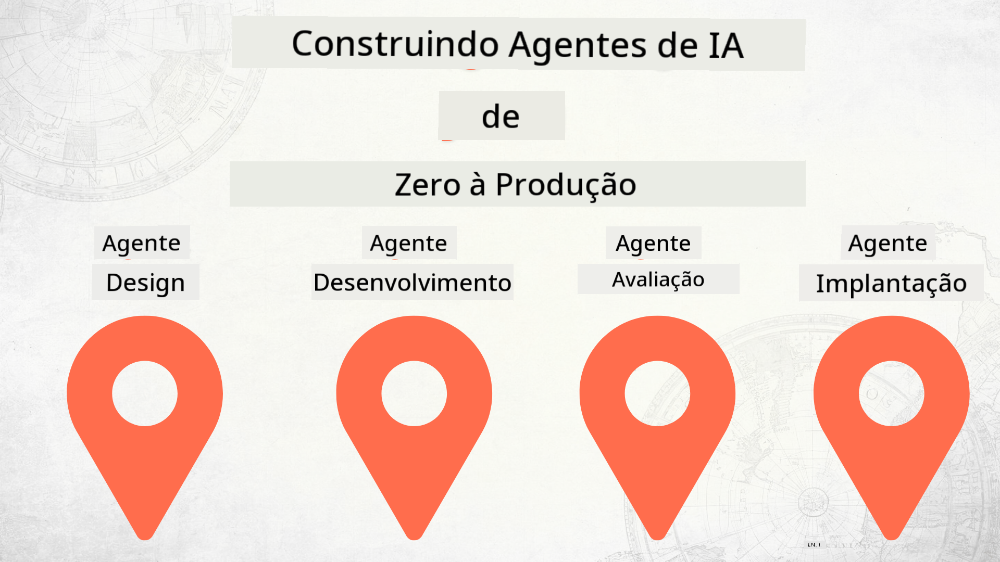

<!--
CO_OP_TRANSLATOR_METADATA:
{
  "original_hash": "f8ea8224e106540413202b4151bb2bcd",
  "translation_date": "2025-12-15T14:19:39+00:00",
  "source_file": "README.md",
  "language_code": "br"
}
-->
# Construindo Agentes de IA do Zero até a Produção

### 🌐 Suporte Multilíngue

#### Suportado via GitHub Action (Automatizado e Sempre Atualizado)

<!-- CO-OP TRANSLATOR LANGUAGES TABLE START -->
[Arabic](../ar/README.md) | [Bengali](../bn/README.md) | [Bulgarian](../bg/README.md) | [Burmese (Myanmar)](../my/README.md) | [Chinese (Simplified)](../zh/README.md) | [Chinese (Traditional, Hong Kong)](../hk/README.md) | [Chinese (Traditional, Macau)](../mo/README.md) | [Chinese (Traditional, Taiwan)](../tw/README.md) | [Croatian](../hr/README.md) | [Czech](../cs/README.md) | [Danish](../da/README.md) | [Dutch](../nl/README.md) | [Estonian](../et/README.md) | [Finnish](../fi/README.md) | [French](../fr/README.md) | [German](../de/README.md) | [Greek](../el/README.md) | [Hebrew](../he/README.md) | [Hindi](../hi/README.md) | [Hungarian](../hu/README.md) | [Indonesian](../id/README.md) | [Italian](../it/README.md) | [Japanese](../ja/README.md) | [Kannada](../kn/README.md) | [Korean](../ko/README.md) | [Lithuanian](../lt/README.md) | [Malay](../ms/README.md) | [Malayalam](../ml/README.md) | [Marathi](../mr/README.md) | [Nepali](../ne/README.md) | [Nigerian Pidgin](../pcm/README.md) | [Norwegian](../no/README.md) | [Persian (Farsi)](../fa/README.md) | [Polish](../pl/README.md) | [Portuguese (Brazil)](./README.md) | [Portuguese (Portugal)](../pt/README.md) | [Punjabi (Gurmukhi)](../pa/README.md) | [Romanian](../ro/README.md) | [Russian](../ru/README.md) | [Serbian (Cyrillic)](../sr/README.md) | [Slovak](../sk/README.md) | [Slovenian](../sl/README.md) | [Spanish](../es/README.md) | [Swahili](../sw/README.md) | [Swedish](../sv/README.md) | [Tagalog (Filipino)](../tl/README.md) | [Tamil](../ta/README.md) | [Telugu](../te/README.md) | [Thai](../th/README.md) | [Turkish](../tr/README.md) | [Ukrainian](../uk/README.md) | [Urdu](../ur/README.md) | [Vietnamese](../vi/README.md)
<!-- CO-OP TRANSLATOR LANGUAGES TABLE END -->

## Um curso que ensina os fundamentos do Ciclo de Vida do Desenvolvimento de Agentes de IA

## 🌱 Começando

Este curso possui lições que cobrem os fundamentos de construir e implantar Agentes de IA.

Cada lição se baseia na anterior, então recomendamos começar do início e seguir até o fim.

Se você quiser explorar mais sobre tópicos de Agentes de IA, pode conferir o [Curso de Agentes de IA para Iniciantes](https://aka.ms/ai-agents-beginners).

### Conheça Outros Estudantes, Tire Suas Dúvidas

Se você ficar preso ou tiver alguma dúvida sobre como construir Agentes de IA, junte-se ao nosso canal dedicado no Discord no [Microsoft Foundry Discord](https://discord.gg/Kuaw3ktsu6).

### O Que Você Precisa

Cada lição tem seu próprio exemplo de código que você pode executar localmente. Você pode [fazer um fork deste repositório](https://github.com/microsoft/Building-AI-Agents-From-Zero-To-Production/fork) para criar sua própria cópia.

Este curso atualmente usa o seguinte:

- [Microsoft Agent Framework (MAF)](https://aka.ms/ai-agents-beginners/agent-framework)
- [Microsoft Foundry](https://azure.microsoft.com/products/ai-foundry)
- [Azure OpenAI Service](https://azure.microsoft.com/products/ai-foundry/models/openai)
- [Azure CLI](https://learn.microsoft.com/cli/azure/authenticate-azure-cli?view=azure-cli-latest)

Por favor, certifique-se de ter acesso a esses serviços antes de começar.

Mais opções sobre hospedagem de modelos e serviços em breve.

## 🗃️ Lições

| **Lição**         | **Descrição**                                                                                  |
|--------------------|--------------------------------------------------------------------------------------------------|
| [Design do Agente](./lesson-1-agent-design/README.md)       | Uma introdução ao nosso Caso de Uso "Onboarding de Desenvolvedor" e como projetar agentes eficazes  |
| [Desenvolvimento do Agente](./lesson-2-agent-development/README.md)  | Usando o Microsoft Agent Framework (MAF), crie 3 agentes para ajudar novos desenvolvedores no onboarding.       |
| [Avaliações do Agente](./lesson-3-agent-evals/README.md)  | Usando o Microsoft Foundry, descubra o desempenho dos nossos Agentes de IA e como melhorá-los. |
| [Implantação do Agente](./lesson-4-agent-deployment/README.md)   | Usando os Agentes Hospedados e OpenAI Chatkit, veja como implantar um Agente de IA em produção.       |

## Contribuindo

Este projeto aceita contribuições e sugestões. A maioria das contribuições exige que você concorde com um
Acordo de Licença de Contribuidor (CLA) declarando que você tem o direito, e de fato concede,
os direitos para usarmos sua contribuição. Para detalhes, visite <https://cla.opensource.microsoft.com>.

Quando você enviar um pull request, um bot CLA determinará automaticamente se você precisa fornecer
um CLA e decorará o PR apropriadamente (por exemplo, verificação de status, comentário). Basta seguir as instruções
fornecidas pelo bot. Você precisará fazer isso apenas uma vez em todos os repositórios que usam nosso CLA.

Este projeto adotou o [Código de Conduta de Código Aberto da Microsoft](https://opensource.microsoft.com/codeofconduct/).
Para mais informações, veja o [FAQ do Código de Conduta](https://opensource.microsoft.com/codeofconduct/faq/) ou
contate [opencode@microsoft.com](mailto:opencode@microsoft.com) para quaisquer dúvidas ou comentários adicionais.

## Marcas Registradas

Este projeto pode conter marcas registradas ou logotipos de projetos, produtos ou serviços. O uso autorizado das marcas
ou logotipos da Microsoft está sujeito e deve seguir
[Diretrizes de Marcas e Marca da Microsoft](https://www.microsoft.com/legal/intellectualproperty/trademarks/usage/general).
O uso de marcas ou logotipos da Microsoft em versões modificadas deste projeto não deve causar confusão nem implicar patrocínio da Microsoft.
Qualquer uso de marcas ou logotipos de terceiros está sujeito às políticas desses terceiros.

## Obtendo Ajuda

Se você ficar preso ou tiver dúvidas sobre como construir aplicativos de IA, junte-se a:

Se você tiver feedback sobre o produto ou erros durante a construção, visite:

---

<!-- CO-OP TRANSLATOR DISCLAIMER START -->
**Aviso Legal**:  
Este documento foi traduzido utilizando o serviço de tradução por IA [Co-op Translator](https://github.com/Azure/co-op-translator). Embora nos esforcemos para garantir a precisão, esteja ciente de que traduções automáticas podem conter erros ou imprecisões. O documento original em seu idioma nativo deve ser considerado a fonte autorizada. Para informações críticas, recomenda-se a tradução profissional realizada por humanos. Não nos responsabilizamos por quaisquer mal-entendidos ou interpretações incorretas decorrentes do uso desta tradução.
<!-- CO-OP TRANSLATOR DISCLAIMER END -->