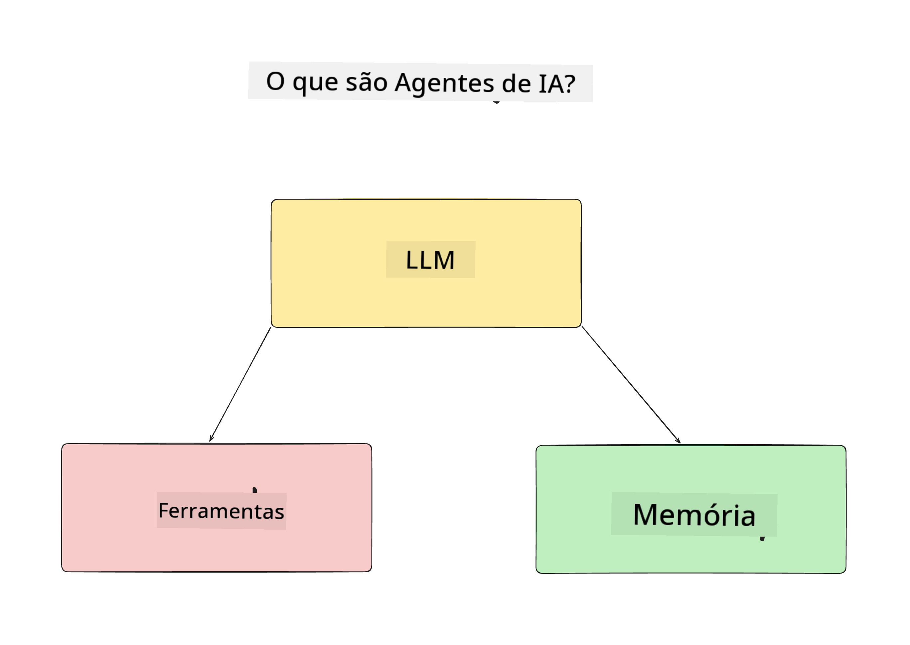
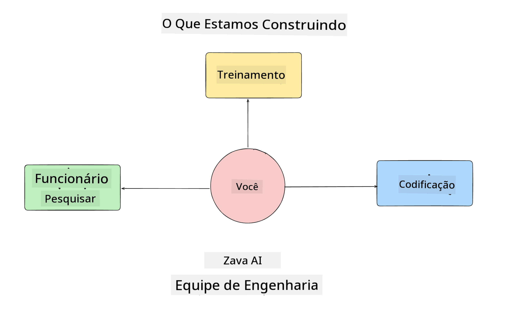
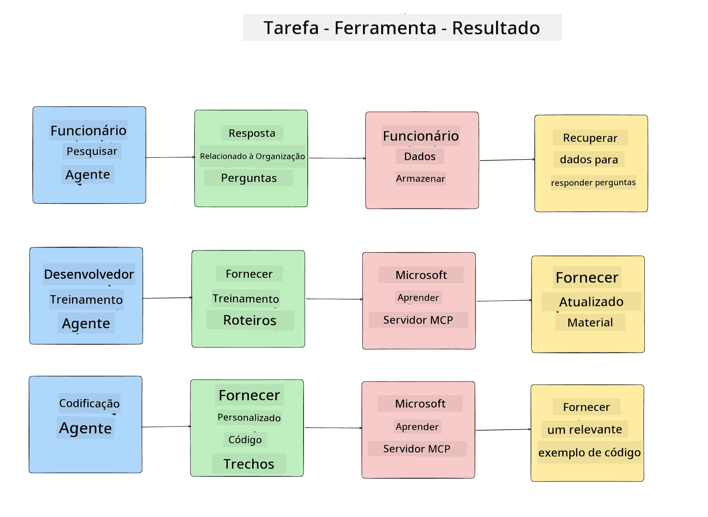
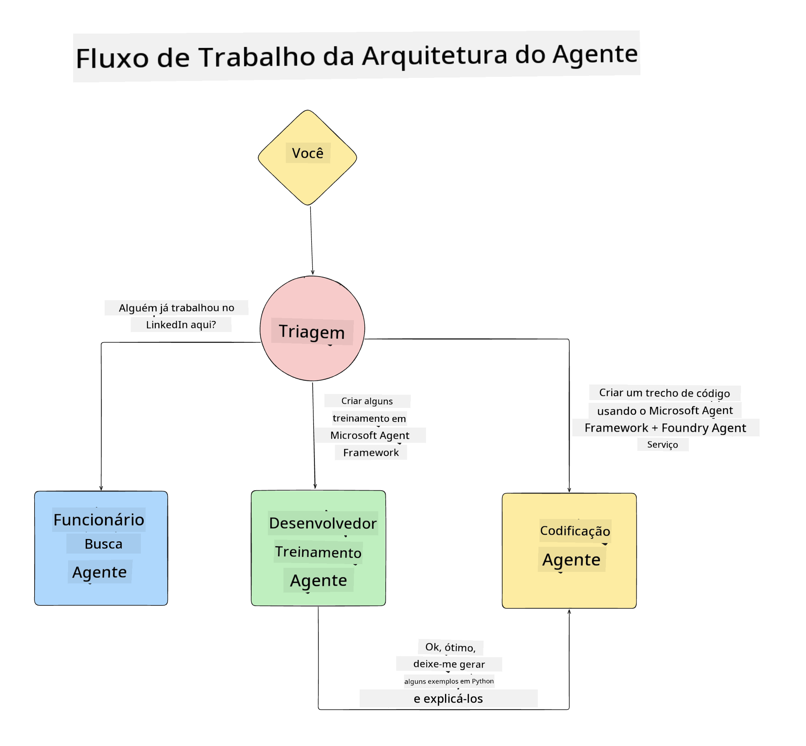

<!--
CO_OP_TRANSLATOR_METADATA:
{
  "original_hash": "99c07849641a850775c188c9333f31e5",
  "translation_date": "2025-12-12T18:26:17+00:00",
  "source_file": "lesson-1-agent-design/README.md",
  "language_code": "br"
}
-->
# Lesson 1: Design de Agente de IA

Bem-vindo à primeira lição do curso "Construindo Agentes de IA do Zero à Produção"!

Nesta lição, vamos cobrir:

- Definindo o que são Agentes de IA
  
- Discutir a Aplicação de Agente de IA que estamos construindo  

- Identificar as ferramentas e serviços necessários para cada agente
  
- Arquitetar nossa Aplicação de Agente
  
Vamos começar definindo o que são agentes e por que os usaríamos dentro de uma aplicação.

## O que são Agentes de IA?

Se esta é sua primeira vez explorando como construir um Agente de IA, você pode ter dúvidas sobre como definir exatamente o que é um Agente de IA.

Uma forma simples de definir o que é um Agente de IA é pelos componentes que o compõem:

**Modelo de Linguagem Grande** - O LLM alimentará tanto a capacidade de processar linguagem natural do usuário para interpretar a tarefa que ele deseja completar quanto interpretar as descrições das ferramentas disponíveis para realizar essas tarefas.

**Ferramentas** - Estas serão funções, APIs, armazenamentos de dados e outros serviços que o LLM pode escolher usar para completar as tarefas solicitadas pelo usuário.

**Memória** - É assim que armazenamos tanto as interações de curto quanto de longo prazo entre o Agente de IA e o usuário. Armazenar e recuperar essa informação é importante para fazer melhorias e salvar preferências do usuário ao longo do tempo.

## Nosso Caso de Uso de Agente de IA

Para este curso, vamos construir uma aplicação de Agente de IA que ajuda novos desenvolvedores a se integrarem ao nosso Time de Desenvolvimento de Agentes de IA!

Antes de fazermos qualquer trabalho de desenvolvimento, o primeiro passo para criar uma aplicação de Agente de IA bem-sucedida é definir cenários claros sobre como esperamos que nossos usuários trabalhem com nossos Agentes de IA.

Para esta aplicação, vamos trabalhar com estes cenários:

**Cenário 1**: Um novo funcionário entra na nossa organização e quer saber mais sobre o time que ele entrou e como se conectar com eles.

**Cenário 2:** Um novo funcionário quer saber qual seria a melhor primeira tarefa para começar a trabalhar.

**Cenário 3:** Um novo funcionário quer reunir recursos de aprendizado e exemplos de código para ajudá-lo a começar a completar essa tarefa.

## Identificando as Ferramentas e Serviços

Agora que temos esses cenários criados, o próximo passo é mapeá-los para as ferramentas e serviços que nossos agentes de IA precisarão para completar essas tarefas.

Esse processo se enquadra na categoria de Engenharia de Contexto, pois vamos focar em garantir que nossos Agentes de IA tenham o contexto certo no momento certo para completar as tarefas.

Vamos fazer isso cenário por cenário e realizar um bom design agentivo listando a tarefa, ferramentas e resultados desejados de cada agente.

### Cenário 1 - Agente de Busca de Funcionários

**Tarefa** - Responder perguntas sobre funcionários na organização, como data de entrada, time atual, localização e última posição.

**Ferramentas** - Banco de dados da lista atual de funcionários e organograma

**Resultados** - Capaz de recuperar informações do banco de dados para responder perguntas gerais sobre a organização e perguntas específicas sobre funcionários.

### Cenário 2 - Agente de Recomendação de Tarefas

**Tarefa** - Com base na experiência do novo funcionário como desenvolvedor, sugerir de 1 a 3 issues que o novo funcionário pode trabalhar.

**Ferramentas** - Servidor MCP do GitHub para obter issues abertas e construir um perfil de desenvolvedor

**Resultados** - Capaz de ler os últimos 5 commits de um perfil do GitHub e issues abertas em um projeto do GitHub e fazer recomendações baseadas em uma correspondência

### Cenário 3 - Agente Assistente de Código

**Tarefa** - Com base nas Issues Abertas recomendadas pelo Agente de "Recomendação de Tarefas", pesquisar e fornecer recursos e gerar trechos de código para ajudar o funcionário.

**Ferramentas** - Microsoft Learn MCP para encontrar recursos e Code Interpreter para gerar trechos de código personalizados.

**Resultados** - Se o usuário pedir ajuda adicional, o fluxo de trabalho deve usar o Servidor Learn MCP para fornecer links e trechos para recursos e então passar para o agente Code Interpreter para gerar pequenos trechos de código com explicações.

## Arquitetando nossa Aplicação de Agente

Agora que definimos cada um dos nossos Agentes, vamos criar um diagrama de arquitetura que nos ajudará a entender como cada agente trabalhará junto e separadamente dependendo da tarefa:

## Próximos Passos

Agora que projetamos cada agente e nosso sistema agentivo, vamos para a próxima lição onde desenvolveremos cada um desses agentes!

---

<!-- CO-OP TRANSLATOR DISCLAIMER START -->
**Aviso Legal**:  
Este documento foi traduzido utilizando o serviço de tradução por IA [Co-op Translator](https://github.com/Azure/co-op-translator). Embora nos esforcemos para garantir a precisão, esteja ciente de que traduções automáticas podem conter erros ou imprecisões. O documento original em seu idioma nativo deve ser considerado a fonte autorizada. Para informações críticas, recomenda-se a tradução profissional realizada por humanos. Não nos responsabilizamos por quaisquer mal-entendidos ou interpretações incorretas decorrentes do uso desta tradução.
<!-- CO-OP TRANSLATOR DISCLAIMER END -->