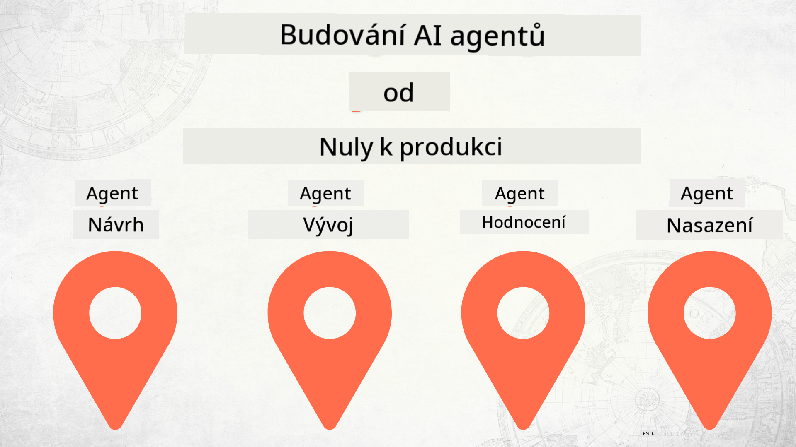

<!--
CO_OP_TRANSLATOR_METADATA:
{
  "original_hash": "f8ea8224e106540413202b4151bb2bcd",
  "translation_date": "2025-12-15T14:32:50+00:00",
  "source_file": "README.md",
  "language_code": "cs"
}
-->
# Vytváření AI agentů od nuly až do produkce

### 🌐 Podpora více jazyků

#### Podporováno přes GitHub Action (automatizované a vždy aktuální)

<!-- CO-OP TRANSLATOR LANGUAGES TABLE START -->
[Arabic](../ar/README.md) | [Bengali](../bn/README.md) | [Bulgarian](../bg/README.md) | [Burmese (Myanmar)](../my/README.md) | [Chinese (Simplified)](../zh/README.md) | [Chinese (Traditional, Hong Kong)](../hk/README.md) | [Chinese (Traditional, Macau)](../mo/README.md) | [Chinese (Traditional, Taiwan)](../tw/README.md) | [Croatian](../hr/README.md) | [Czech](./README.md) | [Danish](../da/README.md) | [Dutch](../nl/README.md) | [Estonian](../et/README.md) | [Finnish](../fi/README.md) | [French](../fr/README.md) | [German](../de/README.md) | [Greek](../el/README.md) | [Hebrew](../he/README.md) | [Hindi](../hi/README.md) | [Hungarian](../hu/README.md) | [Indonesian](../id/README.md) | [Italian](../it/README.md) | [Japanese](../ja/README.md) | [Kannada](../kn/README.md) | [Korean](../ko/README.md) | [Lithuanian](../lt/README.md) | [Malay](../ms/README.md) | [Malayalam](../ml/README.md) | [Marathi](../mr/README.md) | [Nepali](../ne/README.md) | [Nigerian Pidgin](../pcm/README.md) | [Norwegian](../no/README.md) | [Persian (Farsi)](../fa/README.md) | [Polish](../pl/README.md) | [Portuguese (Brazil)](../br/README.md) | [Portuguese (Portugal)](../pt/README.md) | [Punjabi (Gurmukhi)](../pa/README.md) | [Romanian](../ro/README.md) | [Russian](../ru/README.md) | [Serbian (Cyrillic)](../sr/README.md) | [Slovak](../sk/README.md) | [Slovenian](../sl/README.md) | [Spanish](../es/README.md) | [Swahili](../sw/README.md) | [Swedish](../sv/README.md) | [Tagalog (Filipino)](../tl/README.md) | [Tamil](../ta/README.md) | [Telugu](../te/README.md) | [Thai](../th/README.md) | [Turkish](../tr/README.md) | [Ukrainian](../uk/README.md) | [Urdu](../ur/README.md) | [Vietnamese](../vi/README.md)
<!-- CO-OP TRANSLATOR LANGUAGES TABLE END -->

## Kurz, který vás naučí základy životního cyklu vývoje AI agentů

## 🌱 Začínáme

Tento kurz obsahuje lekce pokrývající základy vytváření a nasazení AI agentů.

Každá lekce navazuje na předchozí, proto doporučujeme začít od začátku a postupovat až do konce.

Pokud chcete prozkoumat více témat o AI agentech, můžete se podívat na [Kurz AI agentů pro začátečníky](https://aka.ms/ai-agents-beginners).

### Poznejte ostatní studenty, získejte odpovědi na své otázky

Pokud narazíte na problém nebo máte otázky ohledně vytváření AI agentů, připojte se k našemu specializovanému Discord kanálu v [Microsoft Foundry Discord](https://discord.gg/Kuaw3ktsu6).

### Co potřebujete

Každá lekce má svůj vlastní ukázkový kód, který můžete spustit lokálně. Můžete si [forknout tento repozitář](https://github.com/microsoft/Building-AI-Agents-From-Zero-To-Production/fork) a vytvořit si tak vlastní kopii.

Tento kurz aktuálně využívá následující:

- [Microsoft Agent Framework (MAF)](https://aka.ms/ai-agents-beginners/agent-framework)
- [Microsoft Foundry](https://azure.microsoft.com/products/ai-foundry)
- [Azure OpenAI Service](https://azure.microsoft.com/products/ai-foundry/models/openai)
- [Azure CLI](https://learn.microsoft.com/cli/azure/authenticate-azure-cli?view=azure-cli-latest)

Před začátkem se ujistěte, že máte přístup k těmto službám.

Brzy přibudou další možnosti ohledně hostování modelů a služeb.

## 🗃️ Lekce

| **Lekce**         | **Popis**                                                                                  |
|--------------------|--------------------------------------------------------------------------------------------------|
| [Návrh agenta](./lesson-1-agent-design/README.md)       | Úvod do našeho případu použití "Onboarding vývojáře" a jak navrhnout efektivní agenty  |
| [Vývoj agenta](./lesson-2-agent-development/README.md)  | Pomocí Microsoft Agent Framework (MAF) vytvořte 3 agenty, kteří pomohou novým vývojářům s onboardováním.       |
| [Hodnocení agentů](./lesson-3-agent-evals/README.md)  | Pomocí Microsoft Foundry zjistěte, jak si naši AI agenti vedou a jak je zlepšit. |
| [Nasazení agenta](./lesson-4-agent-deployment/README.md)   | Pomocí Hosted Agents a OpenAI Chatkit zjistěte, jak nasadit AI agenta do produkce.       |

## Přispívání

Tento projekt vítá příspěvky a návrhy. Většina příspěvků vyžaduje, abyste souhlasili s
Licenční smlouvou přispěvatele (CLA), která potvrzuje, že máte právo a skutečně nám udělujete
práva k použití vašeho příspěvku. Podrobnosti najdete na <https://cla.opensource.microsoft.com>.

Když odešlete pull request, bot CLA automaticky zjistí, zda musíte poskytnout
CLA a příslušně označí PR (např. kontrola stavu, komentář). Stačí postupovat podle pokynů
poskytnutých botem. Toto budete muset udělat pouze jednou pro všechny repozitáře používající naši CLA.

Tento projekt přijal [Microsoft Open Source Code of Conduct](https://opensource.microsoft.com/codeofconduct/).
Pro více informací viz [Často kladené otázky k Code of Conduct](https://opensource.microsoft.com/codeofconduct/faq/) nebo
kontaktujte [opencode@microsoft.com](mailto:opencode@microsoft.com) s dalšími dotazy či připomínkami.

## Ochranné známky

Tento projekt může obsahovat ochranné známky nebo loga projektů, produktů či služeb. Autorizované použití ochranných známek nebo log Microsoftu podléhá a musí dodržovat
[Pravidla pro ochranné známky a značky Microsoftu](https://www.microsoft.com/legal/intellectualproperty/trademarks/usage/general).
Použití ochranných známek nebo log Microsoftu v upravených verzích tohoto projektu nesmí způsobovat záměnu ani naznačovat sponzorství Microsoftem.
Jakékoli použití ochranných známek nebo log třetích stran podléhá pravidlům těchto třetích stran.

## Získání pomoci

Pokud narazíte na problém nebo máte otázky ohledně vytváření AI aplikací, připojte se:

Pokud máte zpětnou vazbu k produktu nebo chyby při vývoji, navštivte:

---

<!-- CO-OP TRANSLATOR DISCLAIMER START -->
**Prohlášení o vyloučení odpovědnosti**:  
Tento dokument byl přeložen pomocí AI překladatelské služby [Co-op Translator](https://github.com/Azure/co-op-translator). Přestože usilujeme o přesnost, mějte prosím na paměti, že automatické překlady mohou obsahovat chyby nebo nepřesnosti. Původní dokument v jeho mateřském jazyce by měl být považován za autoritativní zdroj. Pro důležité informace se doporučuje profesionální lidský překlad. Nejsme odpovědní za jakékoliv nedorozumění nebo nesprávné výklady vyplývající z použití tohoto překladu.
<!-- CO-OP TRANSLATOR DISCLAIMER END -->