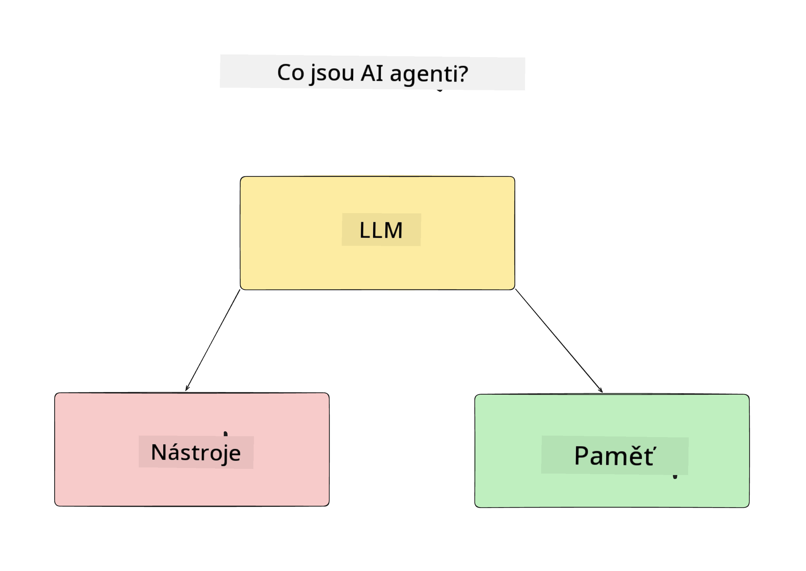
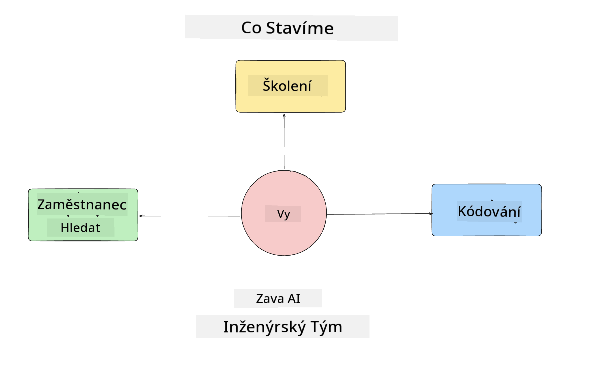
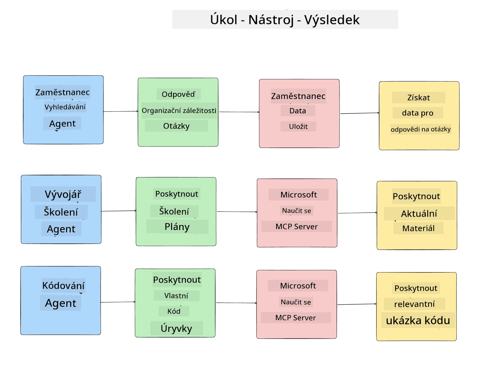
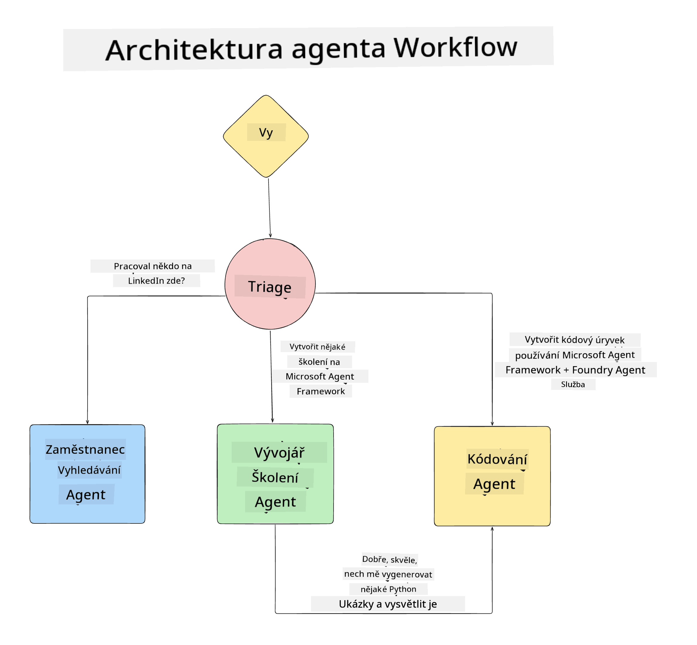

<!--
CO_OP_TRANSLATOR_METADATA:
{
  "original_hash": "99c07849641a850775c188c9333f31e5",
  "translation_date": "2025-12-12T18:38:01+00:00",
  "source_file": "lesson-1-agent-design/README.md",
  "language_code": "cs"
}
-->
# Lekce 1: Návrh AI agenta

Vítejte v první lekci kurzu „Budování AI agenta od nuly do produkce“!

V této lekci pokryjeme:

- Definování, co jsou AI agenti
  
- Diskuzi o AI agentní aplikaci, kterou budujeme  

- Identifikaci potřebných nástrojů a služeb pro každého agenta
  
- Architekturu naší agentní aplikace
  
Začněme definováním, co je agent a proč bychom je používali v aplikaci.

## Co jsou AI agenti?

Pokud je to vaše první setkání s tím, jak postavit AI agenta, můžete mít otázky, jak přesně definovat, co AI agent je.

Jednoduchý způsob, jak definovat, co AI agent je, je podle komponent, které ho tvoří:

**Velký jazykový model** – LLM bude pohánět jak schopnost zpracovávat přirozený jazyk od uživatele k interpretaci úkolu, který chce dokončit, tak i interpretovat popisy nástrojů dostupných k dokončení těchto úkolů.

**Nástroje** – To budou funkce, API, datové úložiště a další služby, které LLM může zvolit k použití pro dokončení úkolů požadovaných uživatelem.

**Paměť** – Takto ukládáme jak krátkodobé, tak dlouhodobé interakce mezi AI agentem a uživatelem. Ukládání a vyhledávání těchto informací je důležité pro zlepšování a ukládání uživatelských preferencí v průběhu času.

## Náš případ použití AI agenta

Pro tento kurz postavíme AI agentní aplikaci, která pomůže novým vývojářům začlenit se do našeho týmu pro vývoj AI agentů!

Než začneme s vývojem, prvním krokem k vytvoření úspěšné AI agentní aplikace je definovat jasné scénáře, jak očekáváme, že naši uživatelé budou s AI agenty pracovat.

Pro tuto aplikaci budeme pracovat s těmito scénáři:

**Scénář 1**: Nový zaměstnanec nastoupí do naší organizace a chce se dozvědět více o týmu, do kterého nastoupil, a jak se s nimi spojit.

**Scénář 2:** Nový zaměstnanec chce vědět, jaký by byl nejlepší první úkol, na kterém by mohl začít pracovat.

**Scénář 3:** Nový zaměstnanec chce shromáždit vzdělávací zdroje a ukázky kódu, které mu pomohou začít s dokončením tohoto úkolu.

## Identifikace nástrojů a služeb

Nyní, když máme tyto scénáře vytvořené, dalším krokem je namapovat je na nástroje a služby, které naši AI agenti budou potřebovat k dokončení těchto úkolů.

Tento proces spadá do kategorie inženýrství kontextu, protože se zaměříme na to, aby naši AI agenti měli správný kontext ve správný čas k dokončení úkolů.

Pojďme to udělat scénář po scénáři a provést dobrý agentní návrh tím, že vyjmenujeme úkoly, nástroje a požadované výsledky každého agenta.

### Scénář 1 – Agent pro vyhledávání zaměstnanců

**Úkol** – Odpovídat na otázky o zaměstnancích v organizaci, jako je datum nástupu, aktuální tým, lokalita a poslední pozice.

**Nástroje** – Databáze aktuálního seznamu zaměstnanců a organizační schéma

**Výsledky** – Schopnost získat informace z databáze k odpovědi na obecné organizační otázky a specifické otázky o zaměstnancích.

### Scénář 2 – Agent pro doporučení úkolů

**Úkol** – Na základě vývojářských zkušeností nového zaměstnance navrhnout 1–3 problémy, na kterých může nový zaměstnanec pracovat.

**Nástroje** – GitHub MCP server pro získání otevřených problémů a vytvoření vývojářského profilu

**Výsledky** – Schopnost přečíst posledních 5 commitů GitHub profilu a otevřené problémy na GitHub projektu a na základě shody udělat doporučení

### Scénář 3 – Agent asistent kódu

**Úkol** – Na základě otevřených problémů doporučených agentem „Doporučení úkolů“ vyhledat zdroje a poskytnout zdroje a generovat ukázky kódu, které pomohou zaměstnanci.

**Nástroje** – Microsoft Learn MCP pro vyhledání zdrojů a Code Interpreter pro generování vlastních ukázek kódu.

**Výsledky** – Pokud uživatel požádá o další pomoc, workflow by měl použít Learn MCP server k poskytnutí odkazů a ukázek zdrojů a poté předat agentovi Code Interpreter generování malých ukázek kódu s vysvětleními.

## Architektura naší agentní aplikace

Nyní, když jsme definovali každého z našich agentů, vytvořme architektonický diagram, který nám pomůže pochopit, jak budou jednotliví agenti spolupracovat a pracovat samostatně v závislosti na úkolu:

## Další kroky

Nyní, když jsme navrhli každého agenta a náš agentní systém, pojďme přejít k další lekci, kde vyvineme každého z těchto agentů!

---

<!-- CO-OP TRANSLATOR DISCLAIMER START -->
**Prohlášení o vyloučení odpovědnosti**:  
Tento dokument byl přeložen pomocí AI překladatelské služby [Co-op Translator](https://github.com/Azure/co-op-translator). Přestože usilujeme o přesnost, mějte prosím na paměti, že automatizované překlady mohou obsahovat chyby nebo nepřesnosti. Původní dokument v jeho mateřském jazyce by měl být považován za autoritativní zdroj. Pro důležité informace se doporučuje profesionální lidský překlad. Nejsme odpovědní za jakékoliv nedorozumění nebo nesprávné výklady vyplývající z použití tohoto překladu.
<!-- CO-OP TRANSLATOR DISCLAIMER END -->