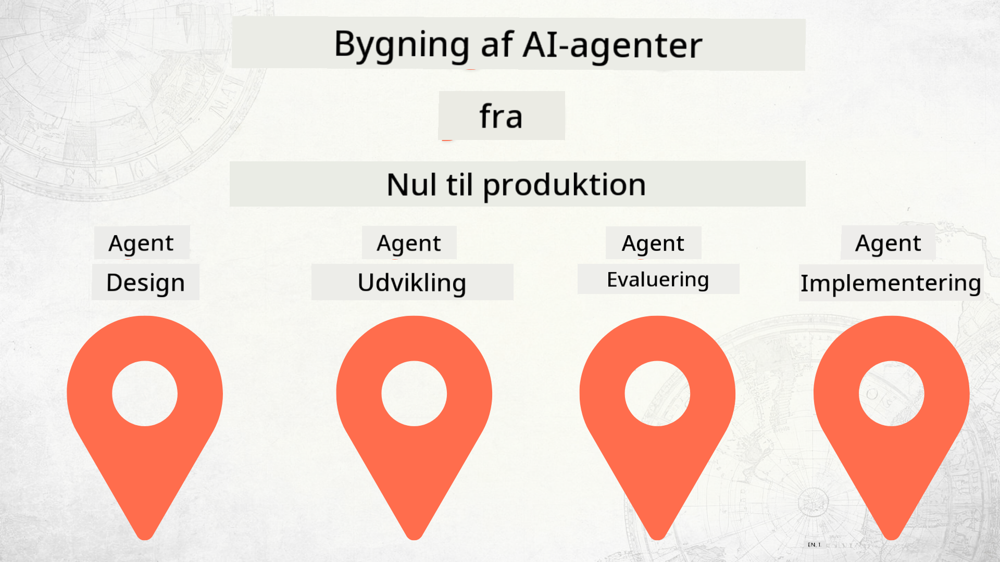

<!--
CO_OP_TRANSLATOR_METADATA:
{
  "original_hash": "03d63bb8bfb7f068db97b3703965a24f",
  "translation_date": "2025-12-17T13:55:51+00:00",
  "source_file": "README.md",
  "language_code": "da"
}
-->
# Bygning af AI-agenter fra nul til produktion

### 🌐 Multisproget support

#### Understøttet via GitHub Action (Automatiseret & Altid Opdateret)

<!-- CO-OP TRANSLATOR LANGUAGES TABLE START -->
[Arabic](../ar/README.md) | [Bengali](../bn/README.md) | [Bulgarian](../bg/README.md) | [Burmese (Myanmar)](../my/README.md) | [Chinese (Simplified)](../zh/README.md) | [Chinese (Traditional, Hong Kong)](../hk/README.md) | [Chinese (Traditional, Macau)](../mo/README.md) | [Chinese (Traditional, Taiwan)](../tw/README.md) | [Croatian](../hr/README.md) | [Czech](../cs/README.md) | [Danish](./README.md) | [Dutch](../nl/README.md) | [Estonian](../et/README.md) | [Finnish](../fi/README.md) | [French](../fr/README.md) | [German](../de/README.md) | [Greek](../el/README.md) | [Hebrew](../he/README.md) | [Hindi](../hi/README.md) | [Hungarian](../hu/README.md) | [Indonesian](../id/README.md) | [Italian](../it/README.md) | [Japanese](../ja/README.md) | [Kannada](../kn/README.md) | [Korean](../ko/README.md) | [Lithuanian](../lt/README.md) | [Malay](../ms/README.md) | [Malayalam](../ml/README.md) | [Marathi](../mr/README.md) | [Nepali](../ne/README.md) | [Nigerian Pidgin](../pcm/README.md) | [Norwegian](../no/README.md) | [Persian (Farsi)](../fa/README.md) | [Polish](../pl/README.md) | [Portuguese (Brazil)](../br/README.md) | [Portuguese (Portugal)](../pt/README.md) | [Punjabi (Gurmukhi)](../pa/README.md) | [Romanian](../ro/README.md) | [Russian](../ru/README.md) | [Serbian (Cyrillic)](../sr/README.md) | [Slovak](../sk/README.md) | [Slovenian](../sl/README.md) | [Spanish](../es/README.md) | [Swahili](../sw/README.md) | [Swedish](../sv/README.md) | [Tagalog (Filipino)](../tl/README.md) | [Tamil](../ta/README.md) | [Telugu](../te/README.md) | [Thai](../th/README.md) | [Turkish](../tr/README.md) | [Ukrainian](../uk/README.md) | [Urdu](../ur/README.md) | [Vietnamese](../vi/README.md)
<!-- CO-OP TRANSLATOR LANGUAGES TABLE END -->

## Et kursus, der lærer dig grundlæggende om AI Agent Udviklingslivscyklus

## 🌱 Kom godt i gang

Dette kursus indeholder lektioner, der dækker det grundlæggende i at bygge og implementere AI-agenter.

Hver lektion bygger videre på den foregående, så vi anbefaler at starte fra begyndelsen og arbejde dig igennem til slutningen.

Hvis du vil udforske mere om AI Agent-emner, kan du tjekke [AI Agents For Beginners-kurset](https://aka.ms/ai-agents-beginners).

### Mød andre elever, få svar på dine spørgsmål

Hvis du sidder fast eller har spørgsmål om at bygge AI-agenter, kan du deltage i vores dedikerede Discord-kanal i [Microsoft Foundry Discord](https://discord.gg/Kuaw3ktsu6).

### Hvad du behøver

Hver lektion har sit eget kodeeksempel, som du kan køre lokalt. Du kan [forke dette repo](https://github.com/microsoft/Building-AI-Agents-From-Zero-To-Production/fork) for at oprette din egen kopi.

Dette kursus bruger i øjeblikket følgende:

- [Microsoft Agent Framework (MAF)](https://aka.ms/ai-agents-beginners/agent-framework)
- [Microsoft Foundry](https://azure.microsoft.com/products/ai-foundry)
- [Azure OpenAI Service](https://azure.microsoft.com/products/ai-foundry/models/openai)
- [Azure CLI](https://learn.microsoft.com/cli/azure/authenticate-azure-cli?view=azure-cli-latest)

Sørg venligst for, at du har adgang til disse tjenester, før du går i gang.

Flere muligheder omkring modelhosting og tjenester kommer snart.

## 🗃️ Lektioner

| **Lektion**         | **Beskrivelse**                                                                                  |
|--------------------|--------------------------------------------------------------------------------------------------|
| [Agent Design](./lesson-1-agent-design/README.md)       | En introduktion til vores "Developer Onboarding" Agent Use Case og hvordan man designer effektive agenter  |
| [Agent Development](./lesson-2-agent-development/README.md)  | Brug Microsoft Agent Framework (MAF) til at skabe 3 agenter, der hjælper nye udviklere med onboarding.       |
| [Agent Evaluations](./lesson-3-agent-evals/README.md)  | Brug Microsoft Foundry til at finde ud af, hvor godt vores AI-agenter præsterer, og hvordan man forbedrer dem. |
| [Agent Deployment](./lesson-4-agent-deployment/README.md)   | Brug Hosted Agents og OpenAI Chatkit til at se, hvordan man implementerer en AI-agent i produktion.       |

## Bidrag

Dette projekt byder velkommen til bidrag og forslag. De fleste bidrag kræver, at du accepterer en
Contributor License Agreement (CLA), der erklærer, at du har ret til, og faktisk giver os
rettighederne til at bruge dit bidrag. For detaljer, besøg <https://cla.opensource.microsoft.com>.

Når du indsender en pull request, vil en CLA-bot automatisk afgøre, om du skal levere
en CLA og dekorere PR'en passende (f.eks. statuskontrol, kommentar). Følg blot instruktionerne
fra botten. Du skal kun gøre dette én gang på tværs af alle repos, der bruger vores CLA.

Dette projekt har vedtaget [Microsoft Open Source Code of Conduct](https://opensource.microsoft.com/codeofconduct/).
For mere information se [Code of Conduct FAQ](https://opensource.microsoft.com/codeofconduct/faq/) eller
kontakt [opencode@microsoft.com](mailto:opencode@microsoft.com) med eventuelle yderligere spørgsmål eller kommentarer.

## Varemærker

Dette projekt kan indeholde varemærker eller logoer for projekter, produkter eller tjenester. Autoriseret brug af Microsoft
varemærker eller logoer er underlagt og skal følge
[Microsofts varemærke- og brandretningslinjer](https://www.microsoft.com/legal/intellectualproperty/trademarks/usage/general).
Brug af Microsoft-varemærker eller logoer i modificerede versioner af dette projekt må ikke skabe forvirring eller antyde Microsoft-sponsorering.
Enhver brug af tredjeparts varemærker eller logoer er underlagt disse tredjeparts politikker.

## Få hjælp

Hvis du sidder fast eller har spørgsmål om at bygge AI-apps, så deltag i:

Hvis du har produktfeedback eller oplever fejl under udvikling, besøg:

---

<!-- CO-OP TRANSLATOR DISCLAIMER START -->
**Ansvarsfraskrivelse**:
Dette dokument er blevet oversat ved hjælp af AI-oversættelsestjenesten [Co-op Translator](https://github.com/Azure/co-op-translator). Selvom vi bestræber os på nøjagtighed, bedes du være opmærksom på, at automatiserede oversættelser kan indeholde fejl eller unøjagtigheder. Det oprindelige dokument på dets modersmål bør betragtes som den autoritative kilde. For kritisk information anbefales professionel menneskelig oversættelse. Vi påtager os intet ansvar for misforståelser eller fejltolkninger, der opstår som følge af brugen af denne oversættelse.
<!-- CO-OP TRANSLATOR DISCLAIMER END -->