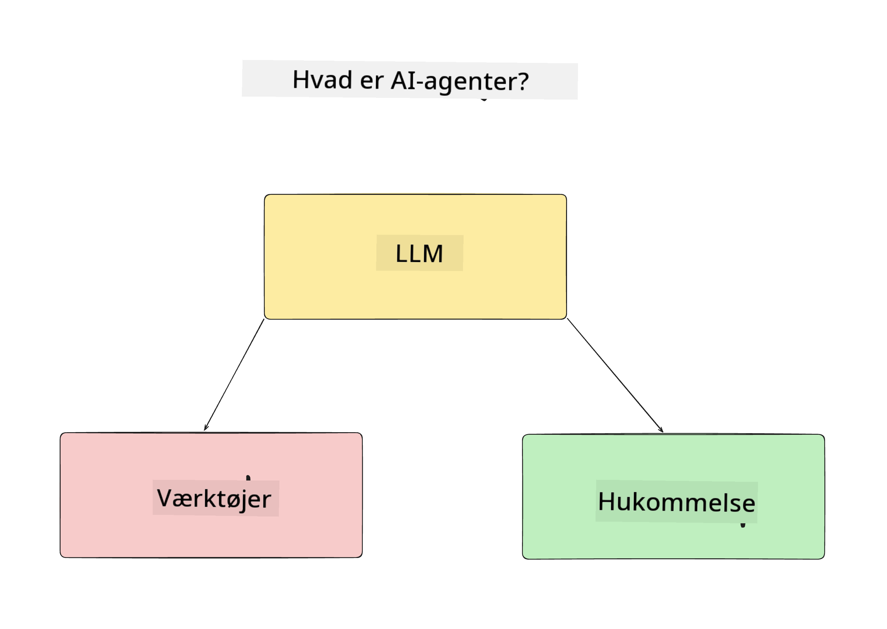
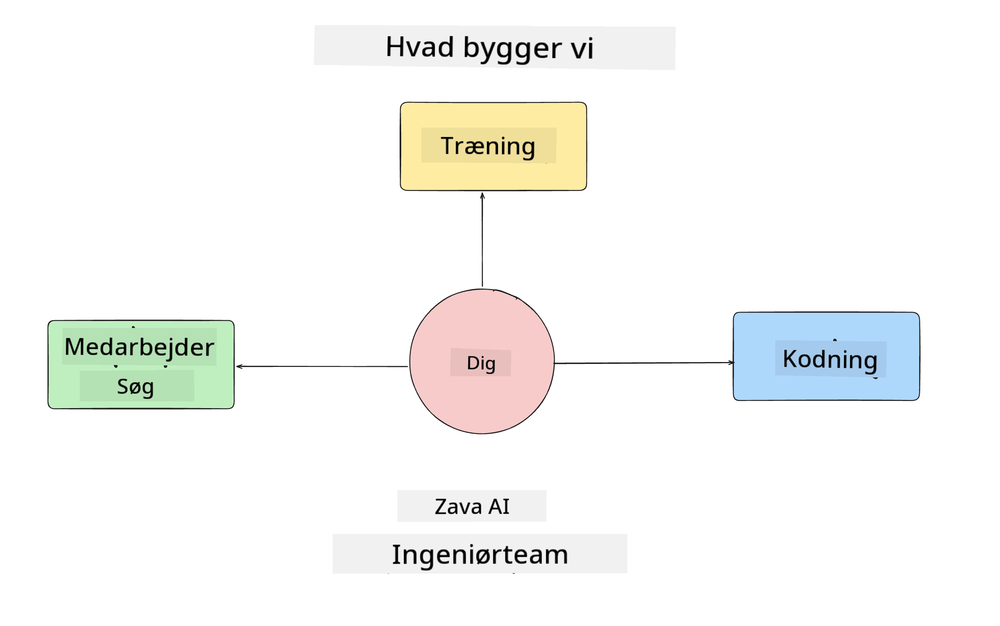
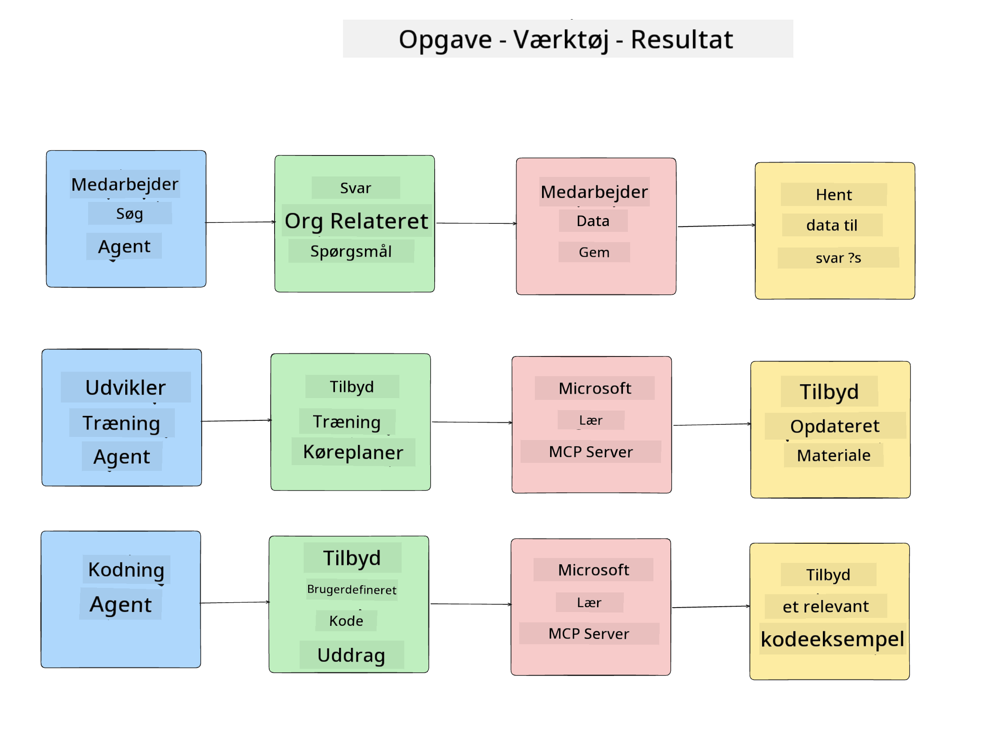
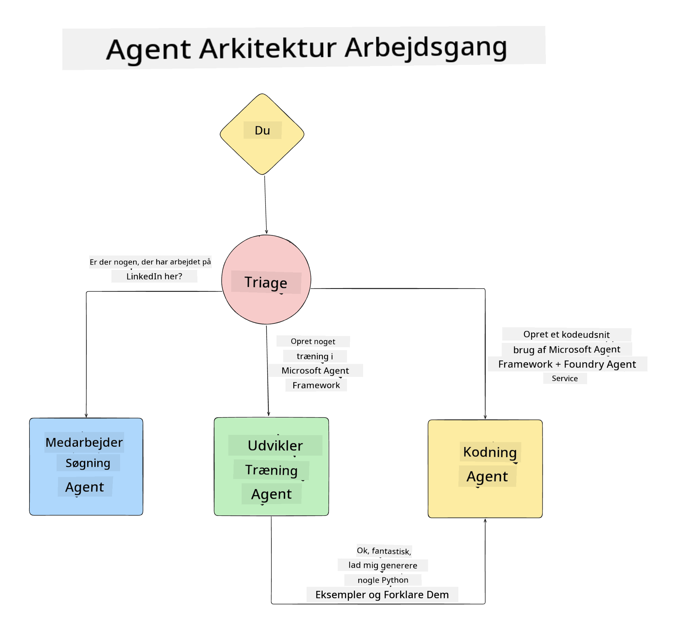

<!--
CO_OP_TRANSLATOR_METADATA:
{
  "original_hash": "99c07849641a850775c188c9333f31e5",
  "translation_date": "2025-12-12T18:31:16+00:00",
  "source_file": "lesson-1-agent-design/README.md",
  "language_code": "da"
}
-->
# Lektion 1: AI Agent Design

Velkommen til den første lektion i "Bygning af AI Agent fra nul til produktion kursus"!

I denne lektion vil vi dække:

- Definere hvad AI-agenter er
  
- Diskutere AI Agent-applikationen, vi bygger  

- Identificere de nødvendige værktøjer og tjenester for hver agent
  
- Arkitektere vores Agent-applikation
  
Lad os starte med at definere, hvad en agent er, og hvorfor vi vil bruge dem i en applikation.

## Hvad er AI-agenter?

Hvis det er første gang, du udforsker, hvordan man bygger en AI Agent, kan du have spørgsmål om, hvordan man præcist definerer, hvad en AI Agent er.

En simpel måde at definere, hvad en AI Agent er, er ved de komponenter, der udgør den:

**Stor sprogmodel** - LLM vil drive både evnen til at behandle naturligt sprog fra brugeren for at fortolke den opgave, de ønsker at udføre, samt fortolke beskrivelserne af de værktøjer, der er tilgængelige for at udføre disse opgaver.

**Værktøjer** - Disse vil være funktioner, API'er, datalagre og andre tjenester, som LLM kan vælge at bruge for at fuldføre de opgaver, brugeren anmoder om.

**Hukommelse** - Dette er, hvordan vi gemmer både kort- og langtidshukommelse af interaktioner mellem AI Agenten og brugeren. At gemme og hente denne information er vigtigt for at forbedre og gemme brugerpræferencer over tid.

## Vores AI Agent Use Case

Til dette kursus vil vi bygge en AI Agent-applikation, der hjælper nye udviklere med at komme ombord på vores AI Agent-udviklingsteam!

Før vi udfører noget udviklingsarbejde, er det første skridt til at skabe en succesfuld AI Agent-applikation at definere klare scenarier for, hvordan vi forventer, at vores brugere arbejder med vores AI-agenter.

For denne applikation vil vi arbejde med disse scenarier:

**Scenario 1**: En ny medarbejder tilslutter sig vores organisation og ønsker at vide mere om det team, de er kommet til, og hvordan de kan komme i kontakt med dem.

**Scenario 2:** En ny medarbejder vil vide, hvad der ville være den bedste første opgave for dem at begynde at arbejde på.

**Scenario 3:** En ny medarbejder ønsker at samle læringsressourcer og kodeeksempler for at hjælpe dem med at komme i gang med at fuldføre denne opgave.

## Identificering af værktøjer og tjenester

Nu hvor vi har oprettet disse scenarier, er det næste skridt at kortlægge dem til de værktøjer og tjenester, som vores AI-agenter vil have brug for for at fuldføre disse opgaver.

Denne proces falder ind under kategorien Context Engineering, da vi vil fokusere på at sikre, at vores AI-agenter har den rette kontekst på det rette tidspunkt for at fuldføre opgaverne.

Lad os gøre dette scenarie for scenarie og udføre god agentisk design ved at liste hver agents opgave, værktøjer og ønskede resultater.

### Scenario 1 - Medarbejdersøgningsagent

**Opgave** - Besvare spørgsmål om medarbejdere i organisationen såsom tiltrædelsesdato, nuværende team, placering og sidste stilling.

**Værktøjer** - Datalager med nuværende medarbejderliste og organisationsdiagram

**Resultater** - I stand til at hente information fra datalageret for at besvare generelle organisationsspørgsmål og specifikke spørgsmål om medarbejdere.

### Scenario 2 - Opgaveanbefalingsagent

**Opgave** - Baseret på den nye medarbejders udviklererfaring, komme med 1-3 problemer, som den nye medarbejder kan arbejde på.

**Værktøjer** - GitHub MCP-server for at få åbne issues og opbygge en udviklerprofil

**Resultater** - I stand til at læse de sidste 5 commits af en GitHub-profil og åbne issues på et GitHub-projekt og komme med anbefalinger baseret på et match

### Scenario 3 - Kodeassistentagent

**Opgave** - Baseret på de åbne issues, der blev anbefalet af "Opgaveanbefalingsagenten", undersøge og levere ressourcer og generere kodeeksempler for at hjælpe medarbejderen.

**Værktøjer** - Microsoft Learn MCP til at finde ressourcer og Code Interpreter til at generere tilpassede kodeeksempler.

**Resultater** - Hvis brugeren beder om yderligere hjælp, skal workflowet bruge Learn MCP-serveren til at levere links og uddrag til ressourcer og derefter overdrage til Code Interpreter-agenten for at generere små kodeeksempler med forklaringer.

## Arkitektur af vores Agent-applikation

Nu hvor vi har defineret hver af vores agenter, lad os skabe et arkitekturdiagram, der vil hjælpe os med at forstå, hvordan hver agent vil arbejde sammen og separat afhængigt af opgaven:

## Næste skridt

Nu hvor vi har designet hver agent og vores agentiske system, lad os gå videre til næste lektion, hvor vi vil udvikle hver af disse agenter!

---

<!-- CO-OP TRANSLATOR DISCLAIMER START -->
**Ansvarsfraskrivelse**:
Dette dokument er blevet oversat ved hjælp af AI-oversættelsestjenesten [Co-op Translator](https://github.com/Azure/co-op-translator). Selvom vi bestræber os på nøjagtighed, bedes du være opmærksom på, at automatiserede oversættelser kan indeholde fejl eller unøjagtigheder. Det oprindelige dokument på dets modersmål bør betragtes som den autoritative kilde. For kritisk information anbefales professionel menneskelig oversættelse. Vi påtager os intet ansvar for misforståelser eller fejltolkninger, der opstår som følge af brugen af denne oversættelse.
<!-- CO-OP TRANSLATOR DISCLAIMER END -->