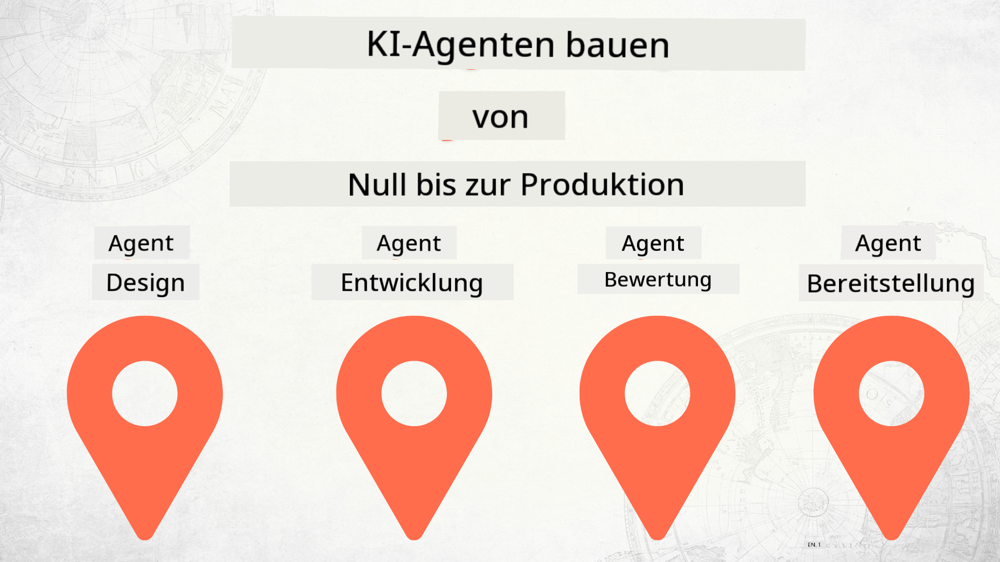

<!--
CO_OP_TRANSLATOR_METADATA:
{
  "original_hash": "2799ceaaefbd8571688459ac03eac5aa",
  "translation_date": "2025-12-12T16:51:14+00:00",
  "source_file": "README.md",
  "language_code": "de"
}
-->
# KI-Agenten von Grund auf bis zur Produktion entwickeln

## Ein Kurs, der Ihnen die Grundlagen des Entwicklungszyklus von KI-Agenten vermittelt

## 🌱 Erste Schritte

Dieser Kurs enthält Lektionen, die die Grundlagen des Aufbaus und der Bereitstellung von KI-Agenten abdecken.

Jede Lektion baut auf der vorherigen auf, daher empfehlen wir, von Anfang an zu beginnen und sich bis zum Ende durchzuarbeiten.

Wenn Sie mehr über KI-Agenten-Themen erfahren möchten, können Sie den [KI-Agenten für Anfänger Kurs](https://aka.ms/ai-agents-beginners) besuchen.

### Treffen Sie andere Lernende, erhalten Sie Antworten auf Ihre Fragen

Wenn Sie stecken bleiben oder Fragen zum Aufbau von KI-Agenten haben, treten Sie unserem dedizierten Discord-Kanal im [Microsoft Foundry Discord](https://discord.gg/Kuaw3ktsu6) bei.

### Was Sie benötigen

Jede Lektion hat ein eigenes Codebeispiel, das Sie lokal ausführen können. Sie können dieses Repository [forken](https://github.com/microsoft/Building-AI-Agents-From-Zero-To-Production/fork), um Ihre eigene Kopie zu erstellen.

Dieser Kurs verwendet derzeit Folgendes:

- [Microsoft Agent Framework (MAF)](https://aka.ms/ai-agents-beginners/agent-framework)
- [Microsoft Foundry](https://azure.microsoft.com/products/ai-foundry)
- [Azure OpenAI Service](https://azure.microsoft.com/products/ai-foundry/models/openai)
- [Azure CLI](https://learn.microsoft.com/cli/azure/authenticate-azure-cli?view=azure-cli-latest)

Bitte stellen Sie sicher, dass Sie vor Beginn Zugriff auf diese Dienste haben.

Weitere Optionen rund um Modell-Hosting und Dienste folgen in Kürze.

## 🗃️ Lektionen

| **Lektion**         | **Beschreibung**                                                                                  |
|--------------------|--------------------------------------------------------------------------------------------------|
| [Agent Design](./lesson-1-agent-design/README.md)       | Eine Einführung in unseren "Developer Onboarding" Agenten-Anwendungsfall und wie man effektive Agenten entwirft  |
| [Agent Development](./lesson-2-agent-development/README.md)  | Mit dem Microsoft Agent Framework (MAF) erstellen Sie 3 Agenten, die neuen Entwicklern beim Onboarding helfen.       |
| [Agent Evaluations](./lesson-3-agent-evals/README.md)  | Mit Microsoft Foundry erfahren Sie, wie gut unsere KI-Agenten funktionieren und wie man sie verbessert. |
| [Agent Deployment](./lesson-4-agent-deployment/README.md)   | Mit den gehosteten Agenten und OpenAI Chatkit sehen Sie, wie man einen KI-Agenten in der Produktion bereitstellt.       |

## Mitwirken

Dieses Projekt freut sich über Beiträge und Vorschläge. Die meisten Beiträge erfordern, dass Sie einer
Contributor License Agreement (CLA) zustimmen, die erklärt, dass Sie das Recht haben und tatsächlich die Rechte einräumen,
uns Ihre Beiträge zu nutzen. Für Details besuchen Sie <https://cla.opensource.microsoft.com>.

Wenn Sie eine Pull-Anfrage einreichen, bestimmt ein CLA-Bot automatisch, ob Sie eine CLA bereitstellen müssen
und kennzeichnet die PR entsprechend (z. B. Statusprüfung, Kommentar). Folgen Sie einfach den Anweisungen
des Bots. Dies müssen Sie nur einmal für alle Repositories tun, die unsere CLA verwenden.

Dieses Projekt hat den [Microsoft Open Source Code of Conduct](https://opensource.microsoft.com/codeofconduct/) übernommen.
Weitere Informationen finden Sie in den [Code of Conduct FAQ](https://opensource.microsoft.com/codeofconduct/faq/) oder
kontaktieren Sie [opencode@microsoft.com](mailto:opencode@microsoft.com) bei weiteren Fragen oder Anmerkungen.

## Marken

Dieses Projekt kann Marken oder Logos für Projekte, Produkte oder Dienstleistungen enthalten. Die autorisierte Nutzung von Microsoft-
Marken oder Logos unterliegt den [Microsoft Trademark & Brand Guidelines](https://www.microsoft.com/legal/intellectualproperty/trademarks/usage/general).
Die Verwendung von Microsoft-Marken oder Logos in modifizierten Versionen dieses Projekts darf keine Verwirrung stiften oder eine Microsoft-Unterstützung implizieren.
Jegliche Nutzung von Marken oder Logos Dritter unterliegt den Richtlinien dieser Dritten.

## Hilfe erhalten

Wenn Sie stecken bleiben oder Fragen zum Erstellen von KI-Anwendungen haben, treten Sie bei:

Wenn Sie Produktfeedback oder Fehler beim Erstellen haben, besuchen Sie:

---

<!-- CO-OP TRANSLATOR DISCLAIMER START -->
**Haftungsausschluss**:  
Dieses Dokument wurde mit dem KI-Übersetzungsdienst [Co-op Translator](https://github.com/Azure/co-op-translator) übersetzt. Obwohl wir uns um Genauigkeit bemühen, beachten Sie bitte, dass automatisierte Übersetzungen Fehler oder Ungenauigkeiten enthalten können. Das Originaldokument in seiner Ursprungssprache gilt als maßgebliche Quelle. Für wichtige Informationen wird eine professionelle menschliche Übersetzung empfohlen. Wir übernehmen keine Haftung für Missverständnisse oder Fehlinterpretationen, die aus der Nutzung dieser Übersetzung entstehen.
<!-- CO-OP TRANSLATOR DISCLAIMER END -->