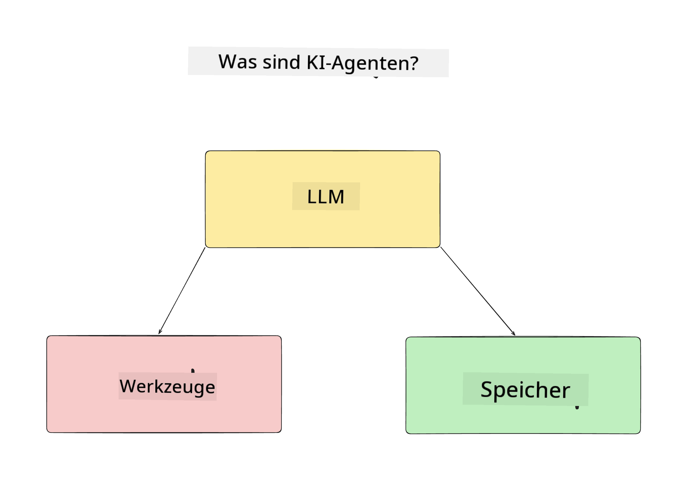
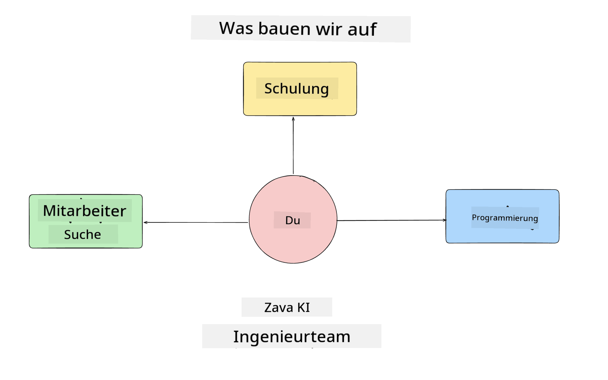
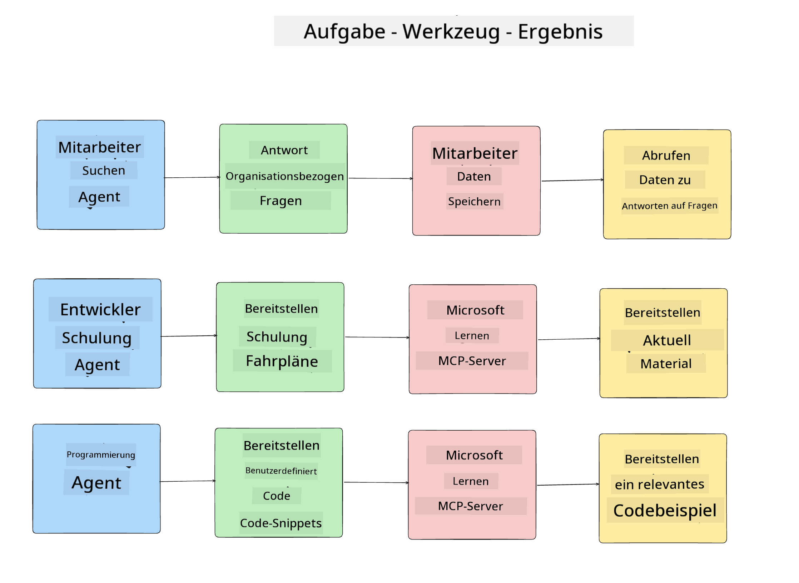
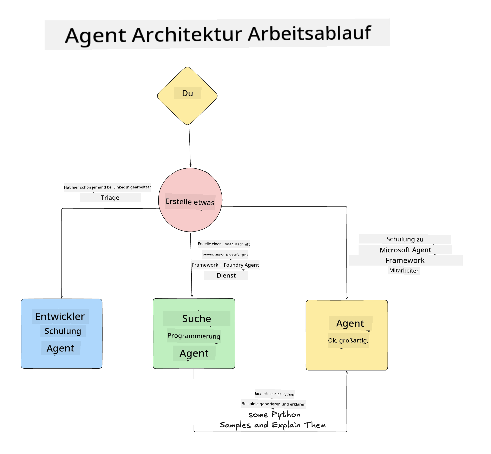

<!--
CO_OP_TRANSLATOR_METADATA:
{
  "original_hash": "99c07849641a850775c188c9333f31e5",
  "translation_date": "2025-12-12T18:15:15+00:00",
  "source_file": "lesson-1-agent-design/README.md",
  "language_code": "de"
}
-->
# Lektion 1: KI-Agenten-Design

Willkommen zur ersten Lektion des Kurses "KI-Agenten von Grund auf bis zur Produktion entwickeln"!

In dieser Lektion behandeln wir:

- Definition, was KI-Agenten sind
  
- Diskussion der KI-Agenten-Anwendung, die wir entwickeln  

- Identifikation der benötigten Werkzeuge und Dienste für jeden Agenten
  
- Architektur unserer Agenten-Anwendung
  
Beginnen wir damit, zu definieren, was Agenten sind und warum wir sie in einer Anwendung verwenden würden.

## Was sind KI-Agenten?

Wenn Sie zum ersten Mal erkunden, wie man einen KI-Agenten baut, könnten Sie Fragen dazu haben, wie man genau definiert, was ein KI-Agent ist.

Eine einfache Möglichkeit, zu definieren, was ein KI-Agent ist, ist anhand der Komponenten, die ihn ausmachen:

**Großes Sprachmodell** – Das LLM ermöglicht sowohl die Verarbeitung natürlicher Sprache vom Benutzer, um die Aufgabe zu interpretieren, die er erledigen möchte, als auch die Interpretation der Beschreibungen der verfügbaren Werkzeuge zur Erledigung dieser Aufgaben.

**Werkzeuge** – Dies sind Funktionen, APIs, Datenspeicher und andere Dienste, die das LLM auswählen kann, um die vom Benutzer angeforderten Aufgaben zu erfüllen.

**Speicher** – So speichern wir sowohl kurzfristige als auch langfristige Interaktionen zwischen dem KI-Agenten und dem Benutzer. Das Speichern und Abrufen dieser Informationen ist wichtig, um Verbesserungen vorzunehmen und Benutzerpräferenzen im Laufe der Zeit zu speichern.

## Unser KI-Agenten-Anwendungsfall

Für diesen Kurs werden wir eine KI-Agenten-Anwendung bauen, die neuen Entwicklern hilft, in unser KI-Agenten-Entwicklungsteam einzusteigen!

Bevor wir mit der Entwicklung beginnen, ist der erste Schritt zur Erstellung einer erfolgreichen KI-Agenten-Anwendung, klare Szenarien zu definieren, wie wir erwarten, dass unsere Benutzer mit unseren KI-Agenten arbeiten.

Für diese Anwendung arbeiten wir mit diesen Szenarien:

**Szenario 1**: Ein neuer Mitarbeiter tritt unserer Organisation bei und möchte mehr über das Team erfahren, dem er beigetreten ist, und wie er mit ihnen in Kontakt treten kann.

**Szenario 2:** Ein neuer Mitarbeiter möchte wissen, welche die beste erste Aufgabe für ihn ist, um mit der Arbeit zu beginnen.

**Szenario 3:** Ein neuer Mitarbeiter möchte Lernressourcen und Codebeispiele sammeln, um ihm beim Starten und Abschließen dieser Aufgabe zu helfen.

## Identifikation der Werkzeuge und Dienste

Jetzt, da wir diese Szenarien erstellt haben, ist der nächste Schritt, sie den Werkzeugen und Diensten zuzuordnen, die unsere KI-Agenten benötigen, um diese Aufgaben zu erfüllen.

Dieser Prozess fällt unter die Kategorie Kontext-Engineering, da wir uns darauf konzentrieren, sicherzustellen, dass unsere KI-Agenten zur richtigen Zeit den richtigen Kontext haben, um die Aufgaben zu erledigen.

Lassen Sie uns dies Szenario für Szenario tun und gutes agentisches Design durchführen, indem wir die Aufgaben, Werkzeuge und gewünschten Ergebnisse jedes Agenten auflisten.

### Szenario 1 – Mitarbeiter-Suchagent

**Aufgabe** – Beantwortung von Fragen zu Mitarbeitern in der Organisation wie Eintrittsdatum, aktuelles Team, Standort und letzte Position.

**Werkzeuge** – Datenspeicher der aktuellen Mitarbeiterliste und Organigramm

**Ergebnisse** – Fähigkeit, Informationen aus dem Datenspeicher abzurufen, um allgemeine organisatorische Fragen und spezifische Fragen zu Mitarbeitern zu beantworten.

### Szenario 2 – Aufgabenempfehlungsagent

**Aufgabe** – Basierend auf der Entwicklererfahrung des neuen Mitarbeiters 1-3 Issues vorschlagen, an denen der neue Mitarbeiter arbeiten kann.

**Werkzeuge** – GitHub MCP-Server, um offene Issues abzurufen und ein Entwicklerprofil zu erstellen

**Ergebnisse** – Fähigkeit, die letzten 5 Commits eines GitHub-Profils und offene Issues eines GitHub-Projekts zu lesen und basierend auf einer Übereinstimmung Empfehlungen abzugeben.

### Szenario 3 – Code-Assistent-Agent

**Aufgabe** – Basierend auf den vom "Aufgabenempfehlungs"-Agenten empfohlenen offenen Issues recherchieren, Ressourcen bereitstellen und Code-Snippets generieren, um dem Mitarbeiter zu helfen.

**Werkzeuge** – Microsoft Learn MCP, um Ressourcen zu finden, und Code Interpreter, um benutzerdefinierte Code-Snippets zu generieren.

**Ergebnisse** – Wenn der Benutzer um zusätzliche Hilfe bittet, sollte der Workflow den Learn MCP-Server verwenden, um Links und Snippets zu Ressourcen bereitzustellen, und dann an den Code Interpreter-Agenten übergeben, um kleine Code-Snippets mit Erklärungen zu generieren.

## Architektur unserer Agenten-Anwendung

Jetzt, da wir jeden unserer Agenten definiert haben, erstellen wir ein Architekturdiagramm, das uns hilft zu verstehen, wie jeder Agent je nach Aufgabe zusammen und getrennt arbeiten wird:

## Nächste Schritte

Nachdem wir jeden Agenten und unser agentisches System entworfen haben, gehen wir zur nächsten Lektion über, in der wir jeden dieser Agenten entwickeln!

---

<!-- CO-OP TRANSLATOR DISCLAIMER START -->
**Haftungsausschluss**:  
Dieses Dokument wurde mit dem KI-Übersetzungsdienst [Co-op Translator](https://github.com/Azure/co-op-translator) übersetzt. Obwohl wir uns um Genauigkeit bemühen, beachten Sie bitte, dass automatisierte Übersetzungen Fehler oder Ungenauigkeiten enthalten können. Das Originaldokument in seiner Ursprungssprache ist als maßgebliche Quelle zu betrachten. Für wichtige Informationen wird eine professionelle menschliche Übersetzung empfohlen. Wir übernehmen keine Haftung für Missverständnisse oder Fehlinterpretationen, die aus der Nutzung dieser Übersetzung entstehen.
<!-- CO-OP TRANSLATOR DISCLAIMER END -->