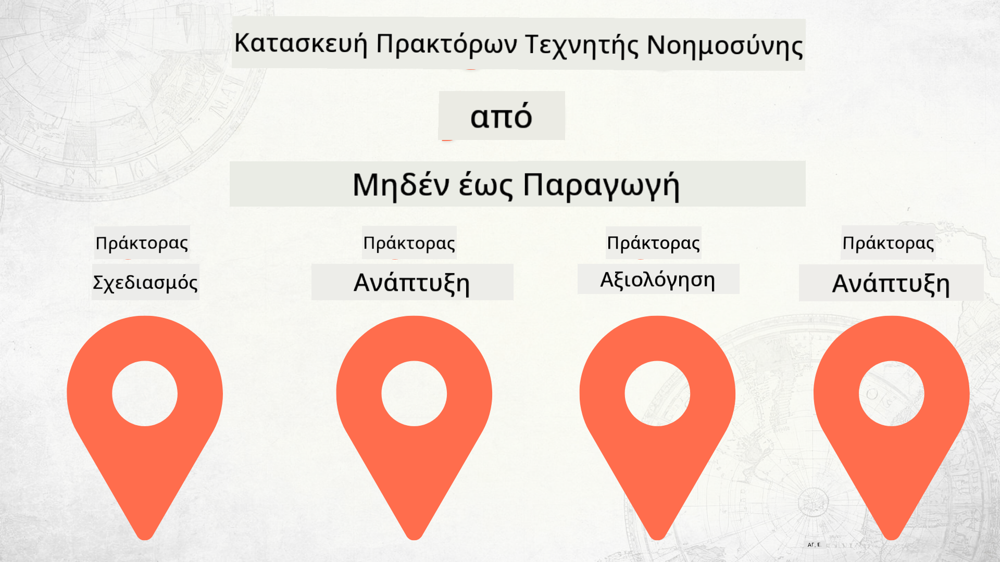

<!--
CO_OP_TRANSLATOR_METADATA:
{
  "original_hash": "df86a71d9a4a65d134d60f783a2aba86",
  "translation_date": "2025-12-18T14:29:12+00:00",
  "source_file": "README.md",
  "language_code": "el"
}
-->
# Δημιουργία Πρακτόρων Τεχνητής Νοημοσύνης από το Μηδέν έως την Παραγωγή

### 🌐 Υποστήριξη Πολλών Γλωσσών

#### Υποστηρίζεται μέσω GitHub Action (Αυτοματοποιημένο & Πάντα Ενημερωμένο)

<!-- CO-OP TRANSLATOR LANGUAGES TABLE START -->
[Αραβικά](../ar/README.md) | [Μπενγκάλι](../bn/README.md) | [Βουλγαρικά](../bg/README.md) | [Βιρμανικά (Μιανμάρ)](../my/README.md) | [Κινέζικα (Απλοποιημένα)](../zh/README.md) | [Κινέζικα (Παραδοσιακά, Χονγκ Κονγκ)](../hk/README.md) | [Κινέζικα (Παραδοσιακά, Μακάο)](../mo/README.md) | [Κινέζικα (Παραδοσιακά, Ταϊβάν)](../tw/README.md) | [Κροατικά](../hr/README.md) | [Τσέχικα](../cs/README.md) | [Δανέζικα](../da/README.md) | [Ολλανδικά](../nl/README.md) | [Εσθονικά](../et/README.md) | [Φινλανδικά](../fi/README.md) | [Γαλλικά](../fr/README.md) | [Γερμανικά](../de/README.md) | [Ελληνικά](./README.md) | [Εβραϊκά](../he/README.md) | [Χίντι](../hi/README.md) | [Ουγγρικά](../hu/README.md) | [Ινδονησιακά](../id/README.md) | [Ιταλικά](../it/README.md) | [Ιαπωνικά](../ja/README.md) | [Κανάντα](../kn/README.md) | [Κορεατικά](../ko/README.md) | [Λιθουανικά](../lt/README.md) | [Μαλαϊκά](../ms/README.md) | [Μαλαγιαλάμ](../ml/README.md) | [Μαράθι](../mr/README.md) | [Νεπάλι](../ne/README.md) | [Νιγηριανή Πίτζιν](../pcm/README.md) | [Νορβηγικά](../no/README.md) | [Περσικά (Φαρσί)](../fa/README.md) | [Πολωνικά](../pl/README.md) | [Πορτογαλικά (Βραζιλία)](../br/README.md) | [Πορτογαλικά (Πορτογαλία)](../pt/README.md) | [Πουντζάμπι (Γκουρμούκι)](../pa/README.md) | [Ρουμανικά](../ro/README.md) | [Ρωσικά](../ru/README.md) | [Σερβικά (Κυριλλικά)](../sr/README.md) | [Σλοβακικά](../sk/README.md) | [Σλοβενικά](../sl/README.md) | [Ισπανικά](../es/README.md) | [Σουαχίλι](../sw/README.md) | [Σουηδικά](../sv/README.md) | [Ταγκάλογκ (Φιλιππινέζικα)](../tl/README.md) | [Ταμίλ](../ta/README.md) | [Τελούγκου](../te/README.md) | [Ταϊλανδικά](../th/README.md) | [Τουρκικά](../tr/README.md) | [Ουκρανικά](../uk/README.md) | [Ουρντού](../ur/README.md) | [Βιετναμέζικα](../vi/README.md)
<!-- CO-OP TRANSLATOR LANGUAGES TABLE END -->

## Ένα μάθημα που διδάσκει τα βασικά του κύκλου ζωής ανάπτυξης Πρακτόρων Τεχνητής Νοημοσύνης

## 🌱 Ξεκινώντας

Αυτό το μάθημα περιλαμβάνει μαθήματα που καλύπτουν τα βασικά της δημιουργίας και ανάπτυξης Πρακτόρων Τεχνητής Νοημοσύνης.

Κάθε μάθημα βασίζεται στο προηγούμενο, οπότε προτείνουμε να ξεκινήσετε από την αρχή και να προχωρήσετε μέχρι το τέλος.

Αν θέλετε να εξερευνήσετε περισσότερα για θέματα Πρακτόρων Τεχνητής Νοημοσύνης, μπορείτε να δείτε το [Μάθημα Πρακτόρων Τεχνητής Νοημοσύνης για Αρχάριους](https://aka.ms/ai-agents-beginners).

### Γνωρίστε Άλλους Μαθητές, Λάβετε Απαντήσεις στις Ερωτήσεις σας

Αν κολλήσετε ή έχετε οποιεσδήποτε ερωτήσεις σχετικά με τη δημιουργία Πρακτόρων Τεχνητής Νοημοσύνης, συμμετάσχετε στο αφιερωμένο κανάλι Discord στο [Microsoft Foundry Discord](https://discord.gg/Kuaw3ktsu6).

### Τι Χρειάζεστε

Κάθε μάθημα έχει το δικό του δείγμα κώδικα που μπορείτε να εκτελέσετε τοπικά. Μπορείτε να [κάνετε fork αυτό το αποθετήριο](https://github.com/microsoft/Building-AI-Agents-From-Zero-To-Production/fork) για να δημιουργήσετε το δικό σας αντίγραφο.

Αυτό το μάθημα χρησιμοποιεί προς το παρόν τα εξής:

- [Microsoft Agent Framework (MAF)](https://aka.ms/ai-agents-beginners/agent-framework)
- [Microsoft Foundry](https://azure.microsoft.com/products/ai-foundry)
- [Azure OpenAI Service](https://azure.microsoft.com/products/ai-foundry/models/openai)
- [Azure CLI](https://learn.microsoft.com/cli/azure/authenticate-azure-cli?view=azure-cli-latest)

Παρακαλούμε βεβαιωθείτε ότι έχετε πρόσβαση σε αυτές τις υπηρεσίες πριν ξεκινήσετε.

Περισσότερες επιλογές σχετικά με τη φιλοξενία μοντέλων και υπηρεσίες έρχονται σύντομα.

## 🗃️ Μαθήματα

| **Μάθημα**         | **Περιγραφή**                                                                                  |
|--------------------|--------------------------------------------------------------------------------------------------|
| [Σχεδιασμός Πράκτορα](./lesson-1-agent-design/README.md)       | Μια εισαγωγή στη χρήση περίπτωσης "Εισαγωγή Προγραμματιστή" και πώς να σχεδιάσετε αποτελεσματικούς πράκτορες  |
| [Ανάπτυξη Πράκτορα](./lesson-2-agent-development/README.md)  | Χρησιμοποιώντας το Microsoft Agent Framework (MAF), δημιουργήστε 3 πράκτορες για να βοηθήσετε νέους προγραμματιστές.       |
| [Αξιολογήσεις Πράκτορα](./lesson-3-agent-evals/README.md)  | Χρησιμοποιώντας το Microsoft Foundry, μάθετε πόσο καλά αποδίδουν οι Πράκτορες Τεχνητής Νοημοσύνης και πώς να τους βελτιώσετε. |
| [Ανάπτυξη Πράκτορα](./lesson-4-agent-deployment/README.md)   | Χρησιμοποιώντας τους Φιλοξενούμενους Πράκτορες και το OpenAI Chatkit, δείτε πώς να αναπτύξετε έναν Πράκτορα Τεχνητής Νοημοσύνης σε παραγωγή.       |

## Συνεισφορά

Αυτό το έργο καλωσορίζει συνεισφορές και προτάσεις. Οι περισσότερες συνεισφορές απαιτούν να συμφωνήσετε με μια
Συμφωνία Άδειας Συνεισφοράς (CLA) που δηλώνει ότι έχετε το δικαίωμα και πράγματι παραχωρείτε σε εμάς
τα δικαιώματα να χρησιμοποιήσουμε τη συνεισφορά σας. Για λεπτομέρειες, επισκεφθείτε <https://cla.opensource.microsoft.com>.

Όταν υποβάλλετε ένα pull request, ένα bot CLA θα καθορίσει αυτόματα αν χρειάζεται να παρέχετε
μια CLA και θα διακοσμήσει το PR κατάλληλα (π.χ., έλεγχος κατάστασης, σχόλιο). Απλώς ακολουθήστε τις οδηγίες
που παρέχονται από το bot. Θα χρειαστεί να το κάνετε μόνο μία φορά σε όλα τα αποθετήρια που χρησιμοποιούν την CLA μας.

Αυτό το έργο έχει υιοθετήσει τον [Κώδικα Δεοντολογίας Ανοιχτού Κώδικα της Microsoft](https://opensource.microsoft.com/codeofconduct/).
Για περισσότερες πληροφορίες δείτε τις [Συχνές Ερωτήσεις για τον Κώδικα Δεοντολογίας](https://opensource.microsoft.com/codeofconduct/faq/) ή
επικοινωνήστε με [opencode@microsoft.com](mailto:opencode@microsoft.com) για επιπλέον ερωτήσεις ή σχόλια.

## Εμπορικά Σήματα

Αυτό το έργο μπορεί να περιέχει εμπορικά σήματα ή λογότυπα για έργα, προϊόντα ή υπηρεσίες. Η εξουσιοδοτημένη χρήση των εμπορικών σημάτων ή λογότυπων της Microsoft υπόκειται και πρέπει να ακολουθεί
τις [Οδηγίες Χρήσης Εμπορικών Σημάτων & Επωνυμίας της Microsoft](https://www.microsoft.com/legal/intellectualproperty/trademarks/usage/general).
Η χρήση των εμπορικών σημάτων ή λογότυπων της Microsoft σε τροποποιημένες εκδόσεις αυτού του έργου δεν πρέπει να προκαλεί σύγχυση ή να υπονοεί χορηγία από τη Microsoft.
Οποιαδήποτε χρήση εμπορικών σημάτων ή λογότυπων τρίτων υπόκειται στις πολιτικές αυτών των τρίτων.

## Λήψη Βοήθειας

Αν κολλήσετε ή έχετε οποιεσδήποτε ερωτήσεις σχετικά με τη δημιουργία εφαρμογών Τεχνητής Νοημοσύνης, συμμετάσχετε:

Αν έχετε σχόλια προϊόντος ή σφάλματα κατά την ανάπτυξη, επισκεφθείτε:

---

<!-- CO-OP TRANSLATOR DISCLAIMER START -->
**Αποποίηση ευθυνών**:  
Αυτό το έγγραφο έχει μεταφραστεί χρησιμοποιώντας την υπηρεσία αυτόματης μετάφρασης AI [Co-op Translator](https://github.com/Azure/co-op-translator). Παρόλο που επιδιώκουμε την ακρίβεια, παρακαλούμε να λάβετε υπόψη ότι οι αυτόματες μεταφράσεις ενδέχεται να περιέχουν λάθη ή ανακρίβειες. Το πρωτότυπο έγγραφο στη μητρική του γλώσσα πρέπει να θεωρείται η αυθεντική πηγή. Για κρίσιμες πληροφορίες, συνιστάται επαγγελματική ανθρώπινη μετάφραση. Δεν φέρουμε ευθύνη για τυχόν παρεξηγήσεις ή λανθασμένες ερμηνείες που προκύπτουν από τη χρήση αυτής της μετάφρασης.
<!-- CO-OP TRANSLATOR DISCLAIMER END -->