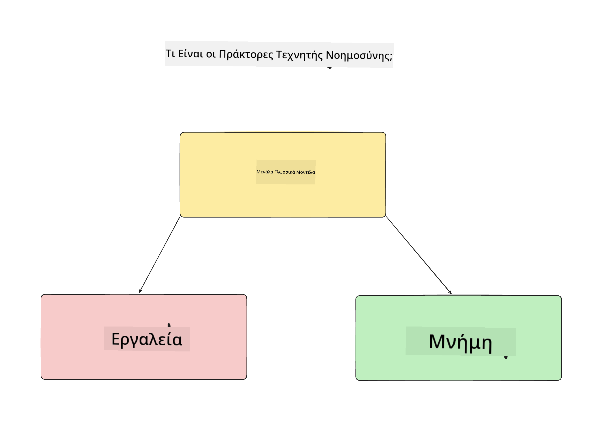
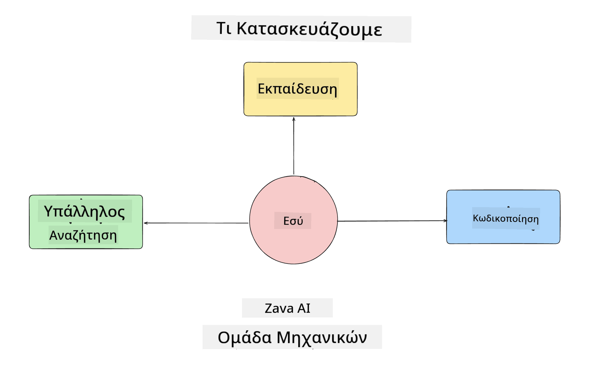
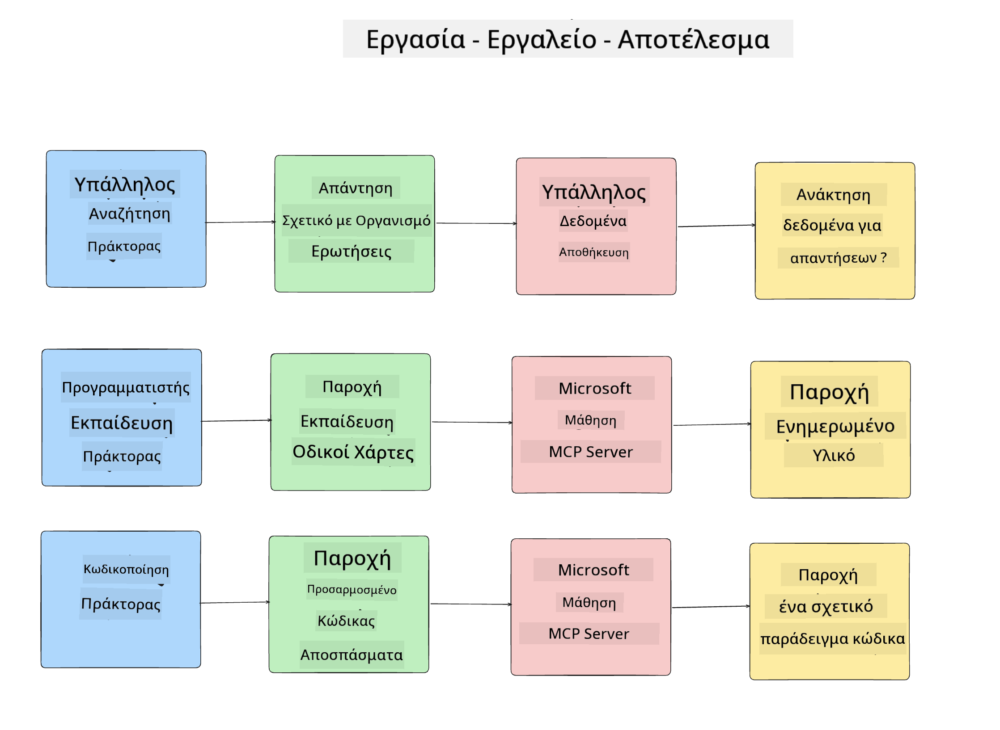
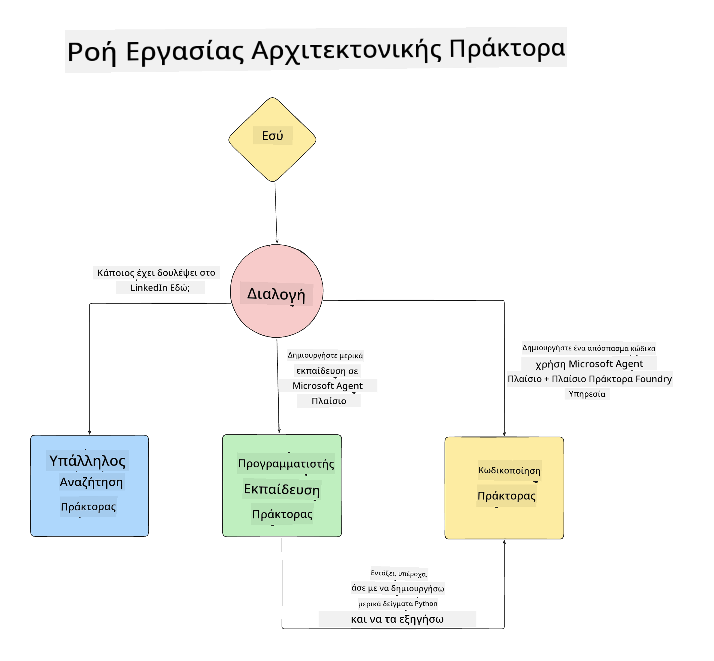

<!--
CO_OP_TRANSLATOR_METADATA:
{
  "original_hash": "99c07849641a850775c188c9333f31e5",
  "translation_date": "2025-12-12T18:28:54+00:00",
  "source_file": "lesson-1-agent-design/README.md",
  "language_code": "el"
}
-->
# Μάθημα 1: Σχεδιασμός Πράκτορα Τεχνητής Νοημοσύνης

Καλώς ήρθατε στο πρώτο μάθημα του "Μαθήματος Δημιουργίας Πράκτορα Τεχνητής Νοημοσύνης από το Μηδέν έως την Παραγωγή"!

Σε αυτό το μάθημα θα καλύψουμε:

- Ορισμός του τι είναι οι Πράκτορες Τεχνητής Νοημοσύνης
  
- Συζήτηση για την Εφαρμογή Πράκτορα Τεχνητής Νοημοσύνης που δημιουργούμε  

- Αναγνώριση των απαιτούμενων εργαλείων και υπηρεσιών για κάθε πράκτορα
  
- Αρχιτεκτονική της Εφαρμογής Πράκτορα μας
  
Ας ξεκινήσουμε ορίζοντας τι είναι ο πράκτορας και γιατί θα τον χρησιμοποιούσαμε μέσα σε μια εφαρμογή.

## Τι Είναι οι Πράκτορες Τεχνητής Νοημοσύνης;

Αν αυτή είναι η πρώτη φορά που εξερευνάτε πώς να δημιουργήσετε έναν Πράκτορα Τεχνητής Νοημοσύνης, ίσως έχετε ερωτήσεις για το πώς ακριβώς να ορίσετε τι είναι ένας Πράκτορας Τεχνητής Νοημοσύνης.

Ένας απλός τρόπος να ορίσουμε τι είναι ένας Πράκτορας Τεχνητής Νοημοσύνης είναι μέσω των συστατικών που τον αποτελούν:

**Μεγάλο Γλωσσικό Μοντέλο** - Το LLM θα τροφοδοτεί τόσο την ικανότητα επεξεργασίας φυσικής γλώσσας από τον χρήστη για να ερμηνεύσει την εργασία που θέλει να ολοκληρώσει, όσο και την ερμηνεία των περιγραφών των εργαλείων που είναι διαθέσιμα για την ολοκλήρωση αυτών των εργασιών.

**Εργαλεία** - Αυτά θα είναι συναρτήσεις, APIs, αποθηκευτικοί χώροι δεδομένων και άλλες υπηρεσίες που το LLM μπορεί να επιλέξει να χρησιμοποιήσει για να ολοκληρώσει τις εργασίες που ζητά ο χρήστης.

**Μνήμη** - Αυτός είναι ο τρόπος που αποθηκεύουμε τόσο τις βραχυπρόθεσμες όσο και τις μακροπρόθεσμες αλληλεπιδράσεις μεταξύ του Πράκτορα Τεχνητής Νοημοσύνης και του χρήστη. Η αποθήκευση και ανάκτηση αυτών των πληροφοριών είναι σημαντική για τη βελτίωση και την αποθήκευση των προτιμήσεων του χρήστη με την πάροδο του χρόνου.

## Η Περίπτωση Χρήσης του Πράκτορα Τεχνητής Νοημοσύνης μας

Για αυτό το μάθημα, θα δημιουργήσουμε μια εφαρμογή Πράκτορα Τεχνητής Νοημοσύνης που βοηθά νέους προγραμματιστές να ενταχθούν στην Ομάδα Ανάπτυξης Πρακτόρων Τεχνητής Νοημοσύνης μας!

Πριν κάνουμε οποιαδήποτε ανάπτυξη, το πρώτο βήμα για τη δημιουργία μιας επιτυχημένης εφαρμογής Πράκτορα Τεχνητής Νοημοσύνης είναι ο ορισμός σαφών σεναρίων για το πώς περιμένουμε οι χρήστες μας να συνεργαστούν με τους Πράκτορες Τεχνητής Νοημοσύνης μας.

Για αυτή την εφαρμογή, θα δουλέψουμε με αυτά τα σενάρια:

**Σενάριο 1**: Ένας νέος υπάλληλος εντάσσεται στον οργανισμό μας και θέλει να μάθει περισσότερα για την ομάδα που εντάχθηκε και πώς να επικοινωνήσει μαζί τους.

**Σενάριο 2:** Ένας νέος υπάλληλος θέλει να μάθει ποια θα ήταν η καλύτερη πρώτη εργασία για να ξεκινήσει να εργάζεται.

**Σενάριο 3:** Ένας νέος υπάλληλος θέλει να συγκεντρώσει εκπαιδευτικούς πόρους και δείγματα κώδικα για να τον βοηθήσουν να ξεκινήσει την ολοκλήρωση αυτής της εργασίας.

## Αναγνώριση των Εργαλείων και Υπηρεσιών

Τώρα που έχουμε δημιουργήσει αυτά τα σενάρια, το επόμενο βήμα είναι να τα αντιστοιχίσουμε στα εργαλεία και τις υπηρεσίες που οι Πράκτορες Τεχνητής Νοημοσύνης μας θα χρειαστούν για να ολοκληρώσουν αυτές τις εργασίες.

Αυτή η διαδικασία ανήκει στην κατηγορία της Μηχανικής Πλαισίου (Context Engineering) καθώς θα εστιάσουμε στο να διασφαλίσουμε ότι οι Πράκτορες Τεχνητής Νοημοσύνης μας έχουν το σωστό πλαίσιο τη σωστή στιγμή για να ολοκληρώσουν τις εργασίες.

Ας το κάνουμε σενάριο προς σενάριο και ας εκτελέσουμε καλό σχεδιασμό πρακτόρων καταγράφοντας την εργασία, τα εργαλεία και τα επιθυμητά αποτελέσματα κάθε πράκτορα.

### Σενάριο 1 - Πράκτορας Αναζήτησης Υπαλλήλων

**Εργασία** - Απαντά σε ερωτήσεις σχετικά με υπαλλήλους στον οργανισμό όπως ημερομηνία ένταξης, τρέχουσα ομάδα, τοποθεσία και τελευταία θέση.

**Εργαλεία** - Αποθήκη δεδομένων με λίστα τρεχόντων υπαλλήλων και οργανόγραμμα

**Αποτελέσματα** - Ικανότητα ανάκτησης πληροφοριών από την αποθήκη δεδομένων για να απαντήσει σε γενικές οργανωτικές ερωτήσεις και συγκεκριμένες ερωτήσεις για υπαλλήλους.

### Σενάριο 2 - Πράκτορας Πρότασης Εργασίας

**Εργασία** - Βάσει της εμπειρίας ανάπτυξης του νέου υπαλλήλου, να προτείνει 1-3 ζητήματα στα οποία μπορεί να εργαστεί ο νέος υπάλληλος.

**Εργαλεία** - GitHub MCP Server για λήψη ανοιχτών ζητημάτων και δημιουργία προφίλ προγραμματιστή

**Αποτελέσματα** - Ικανότητα ανάγνωσης των τελευταίων 5 commits ενός προφίλ GitHub και ανοιχτών ζητημάτων σε ένα έργο GitHub και παροχή προτάσεων βάσει αντιστοίχισης

### Σενάριο 3 - Πράκτορας Βοηθού Κώδικα

**Εργασία** - Βάσει των Ανοιχτών Ζητημάτων που προτάθηκαν από τον Πράκτορα "Πρότασης Εργασίας", να ερευνήσει και να παρέχει πόρους και να δημιουργεί αποσπάσματα κώδικα για να βοηθήσει τον υπάλληλο.

**Εργαλεία** - Microsoft Learn MCP για εύρεση πόρων και Code Interpreter για δημιουργία προσαρμοσμένων αποσπασμάτων κώδικα.

**Αποτελέσματα** - Αν ο χρήστης ζητήσει επιπλέον βοήθεια, η ροή εργασίας θα πρέπει να χρησιμοποιεί τον Learn MCP Server για να παρέχει συνδέσμους και αποσπάσματα σε πόρους και στη συνέχεια να παραδίδει στον πράκτορα Code Interpreter για να δημιουργήσει μικρά αποσπάσματα κώδικα με εξηγήσεις.

## Αρχιτεκτονική της Εφαρμογής Πράκτορα μας

Τώρα που έχουμε ορίσει κάθε έναν από τους Πράκτορές μας, ας δημιουργήσουμε ένα διάγραμμα αρχιτεκτονικής που θα μας βοηθήσει να κατανοήσουμε πώς κάθε πράκτορας θα συνεργάζεται και θα λειτουργεί ξεχωριστά ανάλογα με την εργασία:

## Επόμενα Βήματα

Τώρα που έχουμε σχεδιάσει κάθε πράκτορα και το πρακτορικό μας σύστημα, ας προχωρήσουμε στο επόμενο μάθημα όπου θα αναπτύξουμε καθέναν από αυτούς τους πράκτορες!

---

<!-- CO-OP TRANSLATOR DISCLAIMER START -->
**Αποποίηση ευθυνών**:  
Αυτό το έγγραφο έχει μεταφραστεί χρησιμοποιώντας την υπηρεσία αυτόματης μετάφρασης AI [Co-op Translator](https://github.com/Azure/co-op-translator). Παρόλο που επιδιώκουμε την ακρίβεια, παρακαλούμε να λάβετε υπόψη ότι οι αυτόματες μεταφράσεις ενδέχεται να περιέχουν λάθη ή ανακρίβειες. Το πρωτότυπο έγγραφο στη μητρική του γλώσσα πρέπει να θεωρείται η αυθεντική πηγή. Για κρίσιμες πληροφορίες, συνιστάται επαγγελματική ανθρώπινη μετάφραση. Δεν φέρουμε ευθύνη για τυχόν παρεξηγήσεις ή λανθασμένες ερμηνείες που προκύπτουν από τη χρήση αυτής της μετάφρασης.
<!-- CO-OP TRANSLATOR DISCLAIMER END -->