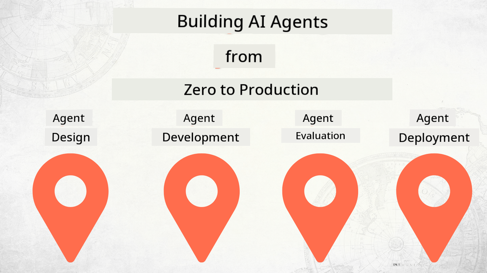

<!--
CO_OP_TRANSLATOR_METADATA:
{
  "original_hash": "df86a71d9a4a65d134d60f783a2aba86",
  "translation_date": "2025-12-18T14:12:07+00:00",
  "source_file": "README.md",
  "language_code": "en"
}
-->
# Building AI Agents from Zero to Production

### 🌐 Multi-Language Support

#### Supported via GitHub Action (Automated & Always Up-to-Date)

<!-- CO-OP TRANSLATOR LANGUAGES TABLE START -->
[Arabic](../ar/README.md) | [Bengali](../bn/README.md) | [Bulgarian](../bg/README.md) | [Burmese (Myanmar)](../my/README.md) | [Chinese (Simplified)](../zh/README.md) | [Chinese (Traditional, Hong Kong)](../hk/README.md) | [Chinese (Traditional, Macau)](../mo/README.md) | [Chinese (Traditional, Taiwan)](../tw/README.md) | [Croatian](../hr/README.md) | [Czech](../cs/README.md) | [Danish](../da/README.md) | [Dutch](../nl/README.md) | [Estonian](../et/README.md) | [Finnish](../fi/README.md) | [French](../fr/README.md) | [German](../de/README.md) | [Greek](../el/README.md) | [Hebrew](../he/README.md) | [Hindi](../hi/README.md) | [Hungarian](../hu/README.md) | [Indonesian](../id/README.md) | [Italian](../it/README.md) | [Japanese](../ja/README.md) | [Kannada](../kn/README.md) | [Korean](../ko/README.md) | [Lithuanian](../lt/README.md) | [Malay](../ms/README.md) | [Malayalam](../ml/README.md) | [Marathi](../mr/README.md) | [Nepali](../ne/README.md) | [Nigerian Pidgin](../pcm/README.md) | [Norwegian](../no/README.md) | [Persian (Farsi)](../fa/README.md) | [Polish](../pl/README.md) | [Portuguese (Brazil)](../br/README.md) | [Portuguese (Portugal)](../pt/README.md) | [Punjabi (Gurmukhi)](../pa/README.md) | [Romanian](../ro/README.md) | [Russian](../ru/README.md) | [Serbian (Cyrillic)](../sr/README.md) | [Slovak](../sk/README.md) | [Slovenian](../sl/README.md) | [Spanish](../es/README.md) | [Swahili](../sw/README.md) | [Swedish](../sv/README.md) | [Tagalog (Filipino)](../tl/README.md) | [Tamil](../ta/README.md) | [Telugu](../te/README.md) | [Thai](../th/README.md) | [Turkish](../tr/README.md) | [Ukrainian](../uk/README.md) | [Urdu](../ur/README.md) | [Vietnamese](../vi/README.md)
<!-- CO-OP TRANSLATOR LANGUAGES TABLE END -->

## A course teaching you the fundamentals of the AI Agent Development Lifecycle

## 🌱 Getting Started

This course has lessons covering the fundamentals of building and deploying AI Agents.

Each lesson builds on the previous one, so we recommend starting from the beginning and working your way through to the end.

If you want to explore more about AI Agent topics, you can check out the [AI Agents For Beginners Course](https://aka.ms/ai-agents-beginners).

### Meet Other Learners, Get Your Questions Answered

If you get stuck or have any questions about building AI Agents, join our dedicated Discord Channel in the [Microsoft Foundry Discord](https://discord.gg/Kuaw3ktsu6).

### What You Need

Each Lesson has its own code sample that you can run locally. You can [fork this repo](https://github.com/microsoft/Building-AI-Agents-From-Zero-To-Production/fork) to create your own copy.

This course currently uses the following:

- [Microsoft Agent Framework (MAF)](https://aka.ms/ai-agents-beginners/agent-framework)
- [Microsoft Foundry](https://azure.microsoft.com/products/ai-foundry)
- [Azure OpenAI Service](https://azure.microsoft.com/products/ai-foundry/models/openai)
- [Azure CLI](https://learn.microsoft.com/cli/azure/authenticate-azure-cli?view=azure-cli-latest)

Please ensure you have access to these services before getting started.

More options around model hosting and services coming soon. 

## 🗃️ Lessons

| **Lesson**         | **Description**                                                                                  |
|--------------------|--------------------------------------------------------------------------------------------------|
| [Agent Design](./lesson-1-agent-design/README.md)       | An introduction to our "Developer Onboarding" Agent Use Case and how to design effective agents  |
| [Agent Development](./lesson-2-agent-development/README.md)  | Using the Microsoft Agent Framework (MAF), create 3 agents to help new developers onboard.       |
| [Agent Evaluations](./lesson-3-agent-evals/README.md)  | Using Microsoft Foundry, find out how well our AI Agents are performing and how to improve them. |
| [Agent Deployment](./lesson-4-agent-deployment/README.md)   | Using the Hosted Agents and OpenAI Chatkit, see how to deploy an AI Agent into production.       |

## Contributing

This project welcomes contributions and suggestions.  Most contributions require you to agree to a
Contributor License Agreement (CLA) declaring that you have the right to, and actually do, grant us
the rights to use your contribution. For details, visit <https://cla.opensource.microsoft.com>.

When you submit a pull request, a CLA bot will automatically determine whether you need to provide
a CLA and decorate the PR appropriately (e.g., status check, comment). Simply follow the instructions
provided by the bot. You will only need to do this once across all repos using our CLA.

This project has adopted the [Microsoft Open Source Code of Conduct](https://opensource.microsoft.com/codeofconduct/).
For more information see the [Code of Conduct FAQ](https://opensource.microsoft.com/codeofconduct/faq/) or
contact [opencode@microsoft.com](mailto:opencode@microsoft.com) with any additional questions or comments.

## Trademarks

This project may contain trademarks or logos for projects, products, or services. Authorized use of Microsoft
trademarks or logos is subject to and must follow
[Microsoft's Trademark & Brand Guidelines](https://www.microsoft.com/legal/intellectualproperty/trademarks/usage/general).
Use of Microsoft trademarks or logos in modified versions of this project must not cause confusion or imply Microsoft sponsorship.
Any use of third-party trademarks or logos is subject to those third-parties' policies.

## Getting Help

If you get stuck or have any questions about building AI apps, join:

If you have product feedback or errors while building visit:

---

<!-- CO-OP TRANSLATOR DISCLAIMER START -->
**Disclaimer**:
This document has been translated using the AI translation service [Co-op Translator](https://github.com/Azure/co-op-translator). While we strive for accuracy, please be aware that automated translations may contain errors or inaccuracies. The original document in its native language should be considered the authoritative source. For critical information, professional human translation is recommended. We are not liable for any misunderstandings or misinterpretations arising from the use of this translation.
<!-- CO-OP TRANSLATOR DISCLAIMER END -->