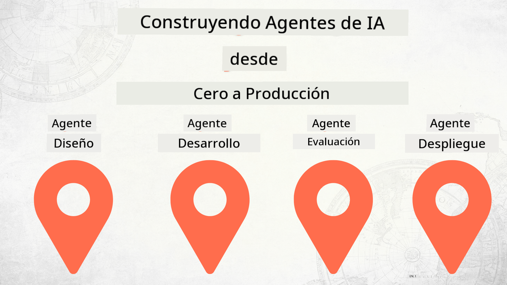

<!--
CO_OP_TRANSLATOR_METADATA:
{
  "original_hash": "03d63bb8bfb7f068db97b3703965a24f",
  "translation_date": "2025-12-17T13:36:02+00:00",
  "source_file": "README.md",
  "language_code": "es"
}
-->
# Construyendo Agentes de IA desde Cero hasta Producción

### 🌐 Soporte Multilingüe

#### Soportado mediante GitHub Action (Automatizado y Siempre Actualizado)

<!-- CO-OP TRANSLATOR LANGUAGES TABLE START -->
[Arabic](../ar/README.md) | [Bengali](../bn/README.md) | [Bulgarian](../bg/README.md) | [Burmese (Myanmar)](../my/README.md) | [Chinese (Simplified)](../zh/README.md) | [Chinese (Traditional, Hong Kong)](../hk/README.md) | [Chinese (Traditional, Macau)](../mo/README.md) | [Chinese (Traditional, Taiwan)](../tw/README.md) | [Croatian](../hr/README.md) | [Czech](../cs/README.md) | [Danish](../da/README.md) | [Dutch](../nl/README.md) | [Estonian](../et/README.md) | [Finnish](../fi/README.md) | [French](../fr/README.md) | [German](../de/README.md) | [Greek](../el/README.md) | [Hebrew](../he/README.md) | [Hindi](../hi/README.md) | [Hungarian](../hu/README.md) | [Indonesian](../id/README.md) | [Italian](../it/README.md) | [Japanese](../ja/README.md) | [Kannada](../kn/README.md) | [Korean](../ko/README.md) | [Lithuanian](../lt/README.md) | [Malay](../ms/README.md) | [Malayalam](../ml/README.md) | [Marathi](../mr/README.md) | [Nepali](../ne/README.md) | [Nigerian Pidgin](../pcm/README.md) | [Norwegian](../no/README.md) | [Persian (Farsi)](../fa/README.md) | [Polish](../pl/README.md) | [Portuguese (Brazil)](../br/README.md) | [Portuguese (Portugal)](../pt/README.md) | [Punjabi (Gurmukhi)](../pa/README.md) | [Romanian](../ro/README.md) | [Russian](../ru/README.md) | [Serbian (Cyrillic)](../sr/README.md) | [Slovak](../sk/README.md) | [Slovenian](../sl/README.md) | [Spanish](./README.md) | [Swahili](../sw/README.md) | [Swedish](../sv/README.md) | [Tagalog (Filipino)](../tl/README.md) | [Tamil](../ta/README.md) | [Telugu](../te/README.md) | [Thai](../th/README.md) | [Turkish](../tr/README.md) | [Ukrainian](../uk/README.md) | [Urdu](../ur/README.md) | [Vietnamese](../vi/README.md)
<!-- CO-OP TRANSLATOR LANGUAGES TABLE END -->

## Un curso que te enseña los fundamentos del Ciclo de Vida del Desarrollo de Agentes de IA

## 🌱 Comenzando

Este curso tiene lecciones que cubren los fundamentos para construir y desplegar Agentes de IA.

Cada lección se basa en la anterior, por lo que recomendamos comenzar desde el principio y avanzar hasta el final.

Si quieres explorar más sobre temas de Agentes de IA, puedes consultar el [Curso de Agentes de IA para Principiantes](https://aka.ms/ai-agents-beginners).

### Conoce a Otros Estudiantes, Resuelve tus Dudas

Si te quedas atascado o tienes alguna pregunta sobre cómo construir Agentes de IA, únete a nuestro canal dedicado de Discord en el [Microsoft Foundry Discord](https://discord.gg/Kuaw3ktsu6).

### Lo que Necesitas

Cada lección tiene su propio ejemplo de código que puedes ejecutar localmente. Puedes [hacer un fork de este repositorio](https://github.com/microsoft/Building-AI-Agents-From-Zero-To-Production/fork) para crear tu propia copia.

Este curso actualmente utiliza lo siguiente:

- [Microsoft Agent Framework (MAF)](https://aka.ms/ai-agents-beginners/agent-framework)
- [Microsoft Foundry](https://azure.microsoft.com/products/ai-foundry)
- [Azure OpenAI Service](https://azure.microsoft.com/products/ai-foundry/models/openai)
- [Azure CLI](https://learn.microsoft.com/cli/azure/authenticate-azure-cli?view=azure-cli-latest)

Por favor, asegúrate de tener acceso a estos servicios antes de comenzar.

Más opciones sobre alojamiento de modelos y servicios próximamente.

## 🗃️ Lecciones

| **Lección**         | **Descripción**                                                                                  |
|--------------------|--------------------------------------------------------------------------------------------------|
| [Diseño de Agentes](./lesson-1-agent-design/README.md)       | Una introducción a nuestro caso de uso "Incorporación de Desarrolladores" y cómo diseñar agentes efectivos  |
| [Desarrollo de Agentes](./lesson-2-agent-development/README.md)  | Usando Microsoft Agent Framework (MAF), crea 3 agentes para ayudar a nuevos desarrolladores a incorporarse.       |
| [Evaluaciones de Agentes](./lesson-3-agent-evals/README.md)  | Usando Microsoft Foundry, descubre qué tan bien están funcionando nuestros Agentes de IA y cómo mejorarlos. |
| [Despliegue de Agentes](./lesson-4-agent-deployment/README.md)   | Usando los Agentes Hospedados y OpenAI Chatkit, aprende cómo desplegar un Agente de IA en producción.       |

## Contribuciones

Este proyecto da la bienvenida a contribuciones y sugerencias. La mayoría de las contribuciones requieren que aceptes un
Acuerdo de Licencia de Contribuidor (CLA) declarando que tienes el derecho y realmente otorgas
los derechos para usar tu contribución. Para más detalles, visita <https://cla.opensource.microsoft.com>.

Cuando envíes una solicitud de extracción, un bot de CLA determinará automáticamente si necesitas proporcionar
un CLA y decorará la PR apropiadamente (por ejemplo, verificación de estado, comentario). Simplemente sigue las instrucciones
proporcionadas por el bot. Solo necesitarás hacer esto una vez en todos los repositorios que usan nuestro CLA.

Este proyecto ha adoptado el [Código de Conducta de Código Abierto de Microsoft](https://opensource.microsoft.com/codeofconduct/).
Para más información, consulta las [Preguntas Frecuentes del Código de Conducta](https://opensource.microsoft.com/codeofconduct/faq/) o
contacta a [opencode@microsoft.com](mailto:opencode@microsoft.com) con cualquier pregunta o comentario adicional.

## Marcas Registradas

Este proyecto puede contener marcas registradas o logotipos de proyectos, productos o servicios. El uso autorizado de las marcas
o logotipos de Microsoft está sujeto a y debe seguir
[las Directrices de Marca y Uso de Microsoft](https://www.microsoft.com/legal/intellectualproperty/trademarks/usage/general).
El uso de marcas o logotipos de Microsoft en versiones modificadas de este proyecto no debe causar confusión ni implicar patrocinio de Microsoft.
Cualquier uso de marcas o logotipos de terceros está sujeto a las políticas de esos terceros.

## Obtener Ayuda

Si te quedas atascado o tienes alguna pregunta sobre cómo construir aplicaciones de IA, únete a:

Si tienes comentarios sobre el producto o errores mientras construyes, visita:

---

<!-- CO-OP TRANSLATOR DISCLAIMER START -->
**Aviso Legal**:  
Este documento ha sido traducido utilizando el servicio de traducción automática [Co-op Translator](https://github.com/Azure/co-op-translator). Aunque nos esforzamos por la precisión, tenga en cuenta que las traducciones automáticas pueden contener errores o inexactitudes. El documento original en su idioma nativo debe considerarse la fuente autorizada. Para información crítica, se recomienda una traducción profesional realizada por humanos. No nos hacemos responsables de malentendidos o interpretaciones erróneas derivadas del uso de esta traducción.
<!-- CO-OP TRANSLATOR DISCLAIMER END -->