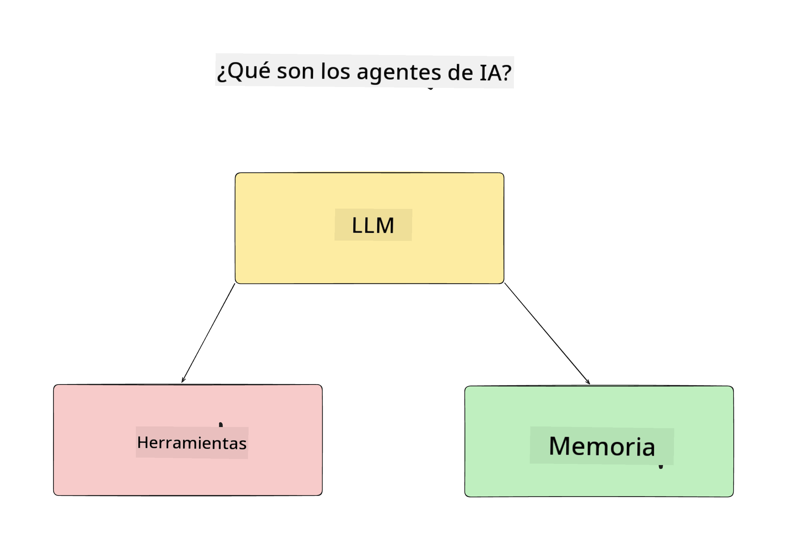
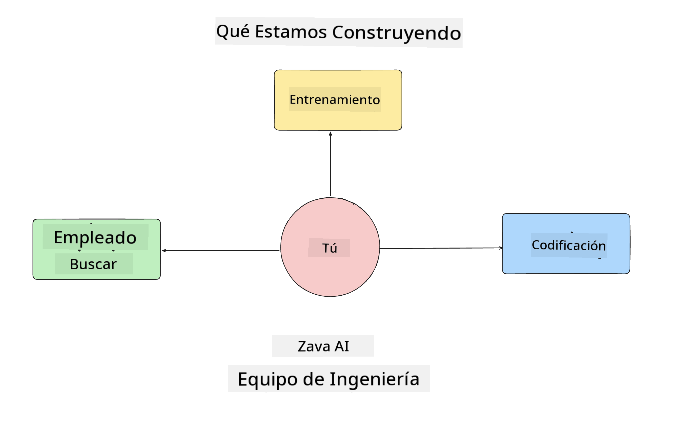
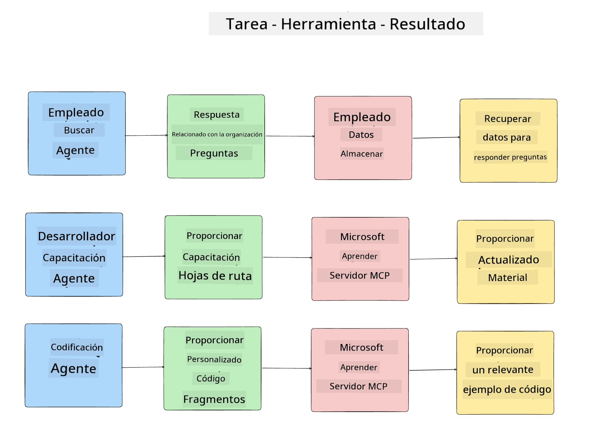
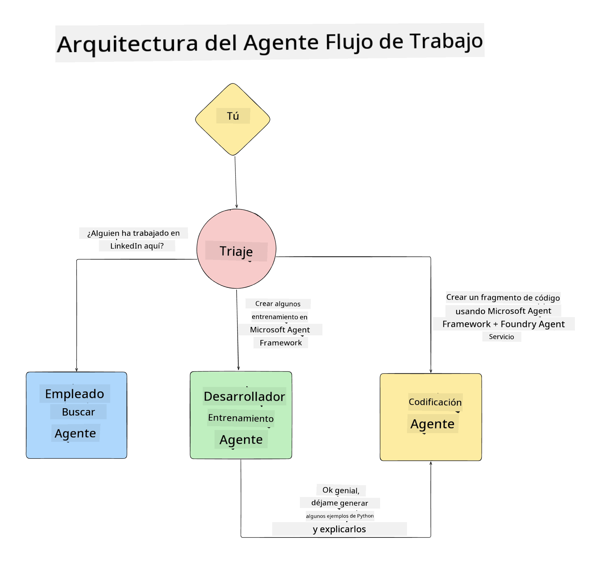

<!--
CO_OP_TRANSLATOR_METADATA:
{
  "original_hash": "99c07849641a850775c188c9333f31e5",
  "translation_date": "2025-12-12T18:14:37+00:00",
  "source_file": "lesson-1-agent-design/README.md",
  "language_code": "es"
}
-->
# Lección 1: Diseño de Agentes de IA

¡Bienvenido a la primera lección del curso "Construyendo un Agente de IA desde Cero hasta Producción"!

En esta lección cubriremos:

- Definir qué son los Agentes de IA
  
- Discutir la Aplicación de Agentes de IA que estamos construyendo  

- Identificar las herramientas y servicios requeridos para cada agente
  
- Arquitecturar nuestra Aplicación de Agentes
  
Comencemos definiendo qué es un agente y por qué los usaríamos dentro de una aplicación.

## ¿Qué Son los Agentes de IA?

Si es la primera vez que exploras cómo construir un Agente de IA, podrías tener preguntas sobre cómo definir exactamente qué es un Agente de IA.

Una forma sencilla de definir qué es un Agente de IA es por los componentes que lo conforman:

**Modelo de Lenguaje Grande** - El LLM impulsará tanto la capacidad de procesar lenguaje natural del usuario para interpretar la tarea que quiere completar como interpretar las descripciones de las herramientas disponibles para completar esas tareas.

**Herramientas** - Estas serán funciones, APIs, almacenes de datos y otros servicios que el LLM puede elegir usar para completar las tareas solicitadas por el usuario.

**Memoria** - Así es como almacenamos tanto las interacciones a corto como a largo plazo entre el Agente de IA y el usuario. Almacenar y recuperar esta información es importante para hacer mejoras y guardar las preferencias del usuario con el tiempo.

## Nuestro Caso de Uso de Agente de IA

Para este curso, vamos a construir una aplicación de Agente de IA que ayude a nuevos desarrolladores a integrarse a nuestro Equipo de Desarrollo de Agentes de IA.

Antes de hacer cualquier trabajo de desarrollo, el primer paso para crear una aplicación exitosa de Agente de IA es definir escenarios claros sobre cómo esperamos que nuestros usuarios trabajen con nuestros Agentes de IA.

Para esta aplicación, trabajaremos con estos escenarios:

**Escenario 1**: Un nuevo empleado se une a nuestra organización y quiere saber más sobre el equipo al que se unió y cómo conectarse con ellos.

**Escenario 2:** Un nuevo empleado quiere saber cuál sería la mejor primera tarea para comenzar a trabajar.

**Escenario 3:** Un nuevo empleado quiere reunir recursos de aprendizaje y ejemplos de código para ayudarle a comenzar a completar esta tarea.

## Identificando las Herramientas y Servicios

Ahora que tenemos estos escenarios creados, el siguiente paso es mapearlos a las herramientas y servicios que nuestros agentes de IA necesitarán para completar estas tareas.

Este proceso cae bajo la categoría de Ingeniería de Contexto ya que nos enfocaremos en asegurarnos de que nuestros Agentes de IA tengan el contexto correcto en el momento adecuado para completar las tareas.

Hagamos esto escenario por escenario y realicemos un buen diseño agentico listando la tarea, herramientas y resultados deseados de cada agente.

### Escenario 1 - Agente de Búsqueda de Empleados

**Tarea** - Responder preguntas sobre empleados en la organización como fecha de ingreso, equipo actual, ubicación y último puesto.

**Herramientas** - Almacén de datos de la lista actual de empleados y organigrama

**Resultados** - Capaz de recuperar información del almacén de datos para responder preguntas generales organizacionales y preguntas específicas sobre empleados.

### Escenario 2 - Agente de Recomendación de Tareas

**Tarea** - Basado en la experiencia del desarrollador nuevo empleado, proponer de 1 a 3 issues en los que el nuevo empleado pueda trabajar.

**Herramientas** - Servidor MCP de GitHub para obtener issues abiertos y construir un perfil de desarrollador

**Resultados** - Capaz de leer los últimos 5 commits de un perfil de GitHub y issues abiertos en un proyecto de GitHub y hacer recomendaciones basadas en una coincidencia

### Escenario 3 - Agente Asistente de Código

**Tarea** - Basado en los Issues Abiertos que fueron recomendados por el Agente de "Recomendación de Tareas", investigar y proporcionar recursos y generar fragmentos de código para ayudar al empleado.

**Herramientas** - Microsoft Learn MCP para encontrar recursos e Intérprete de Código para generar fragmentos de código personalizados.

**Resultados** - Si el usuario pide ayuda adicional, el flujo de trabajo debe usar el Servidor Learn MCP para proporcionar enlaces y fragmentos a recursos y luego pasar al agente Intérprete de Código para generar pequeños fragmentos de código con explicaciones.

## Arquitecturando nuestra Aplicación de Agentes

Ahora que hemos definido cada uno de nuestros Agentes, creemos un diagrama de arquitectura que nos ayudará a entender cómo cada agente trabajará juntos y por separado dependiendo de la tarea:

## Próximos Pasos

Ahora que hemos diseñado cada agente y nuestro sistema agentico, pasemos a la siguiente lección donde desarrollaremos cada uno de estos agentes!

---

<!-- CO-OP TRANSLATOR DISCLAIMER START -->
**Aviso Legal**:  
Este documento ha sido traducido utilizando el servicio de traducción automática [Co-op Translator](https://github.com/Azure/co-op-translator). Aunque nos esforzamos por la precisión, tenga en cuenta que las traducciones automáticas pueden contener errores o inexactitudes. El documento original en su idioma nativo debe considerarse la fuente autorizada. Para información crítica, se recomienda una traducción profesional realizada por humanos. No nos hacemos responsables de malentendidos o interpretaciones erróneas derivadas del uso de esta traducción.
<!-- CO-OP TRANSLATOR DISCLAIMER END -->