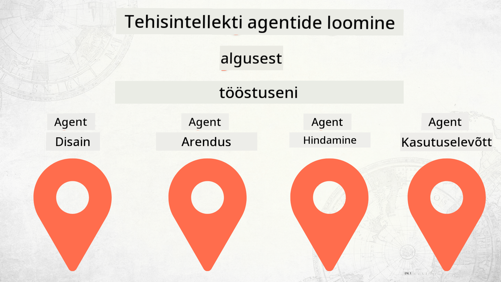

<!--
CO_OP_TRANSLATOR_METADATA:
{
  "original_hash": "73b37a335747d59d319b00aac130f073",
  "translation_date": "2025-12-25T00:13:15+00:00",
  "source_file": "README.md",
  "language_code": "et"
}
-->
# AI-agentide loomine algusest tootmisse

### 🌐 Mitmekeelne tugi

#### Toetatud GitHub Actioni kaudu (automatiseeritud ja alati ajakohane)

<!-- CO-OP TRANSLATOR LANGUAGES TABLE START -->
[Araabia](../ar/README.md) | [Bengali](../bn/README.md) | [Bulgaaria](../bg/README.md) | [Burma (Myanmar)](../my/README.md) | [Hiina (lihtsustatud)](../zh/README.md) | [Hiina (traditsiooniline, Hongkong)](../hk/README.md) | [Hiina (traditsiooniline, Macao)](../mo/README.md) | [Hiina (traditsiooniline, Taiwan)](../tw/README.md) | [Horvaadi](../hr/README.md) | [Tšehhi](../cs/README.md) | [Taani](../da/README.md) | [Hollandi](../nl/README.md) | [Eesti](./README.md) | [Soome](../fi/README.md) | [Prantsuse](../fr/README.md) | [Saksa](../de/README.md) | [Kreeka](../el/README.md) | [Heebrea](../he/README.md) | [Hindi](../hi/README.md) | [Ungari](../hu/README.md) | [Indoneesia](../id/README.md) | [Itaalia](../it/README.md) | [Jaapani](../ja/README.md) | [Kannada](../kn/README.md) | [Korea](../ko/README.md) | [Leedu](../lt/README.md) | [Malai](../ms/README.md) | [Malajalami](../ml/README.md) | [Marathi](../mr/README.md) | [Nepali](../ne/README.md) | [Nigeeria pidžin](../pcm/README.md) | [Norra](../no/README.md) | [Pärsia (farsi)](../fa/README.md) | [Poola](../pl/README.md) | [Portugali (Brasiilia)](../br/README.md) | [Portugali (Portugal)](../pt/README.md) | [Punjabi (Gurmukhi)](../pa/README.md) | [Rumeenia](../ro/README.md) | [Vene](../ru/README.md) | [Serbia (kirillitsa)](../sr/README.md) | [Slovakkia](../sk/README.md) | [Sloveeni](../sl/README.md) | [Hispaania](../es/README.md) | [Svahili](../sw/README.md) | [Rootsi](../sv/README.md) | [Tagalogi (filipino)](../tl/README.md) | [Tamili](../ta/README.md) | [Telugu](../te/README.md) | [Tai](../th/README.md) | [Türgi](../tr/README.md) | [Ukraina](../uk/README.md) | [Urdu](../ur/README.md) | [Vietnami](../vi/README.md)
<!-- CO-OP TRANSLATOR LANGUAGES TABLE END -->

## Kursus, mis õpetab AI-agentide arendustsükli põhialuseid

## 🌱 Alustamine

Selles kursuses on õppetunnid, mis käsitlevad AI-agentide loomise ja juurutamise põhialuseid.

Iga õppetund tugineb eelmisele, seega soovitame alustada algusest ja läbida kogu kursus lõpuni.

Kui soovite AI-agentide teemasid rohkem uurida, vaadake [AI-agentide algajate kursus](https://aka.ms/ai-agents-beginners).

### Tutvu teiste õppijatega, saa vastused oma küsimustele

Kui jääte hätta või teil on küsimusi AI-agentide loomise kohta, liituge meie pühendatud Discord-kanaliga [Microsoft Foundry Discord](https://discord.gg/Kuaw3ktsu6).

### Mida vajate

Igal õppetunnil on oma koodinäide, mida saate kohapeal käivitada. Saate [forkida selle hoidla](https://github.com/microsoft/Building-AI-Agents-From-Zero-To-Production/fork) oma koopia loomiseks.

Selles kursuses kasutatakse praegu järgmisi teenuseid:

- [Microsoft Agent Framework (MAF)](https://aka.ms/ai-agents-beginners/agent-framework)
- [Microsoft Foundry](https://azure.microsoft.com/products/ai-foundry)
- [Azure OpenAI Service](https://azure.microsoft.com/products/ai-foundry/models/openai)
- [Azure CLI](https://learn.microsoft.com/cli/azure/authenticate-azure-cli?view=azure-cli-latest)

Palun veenduge, et teil on enne alustamist neile teenustele juurdepääs.

Lisavõimalused mudelite hostimise ja teenuste osas tulevad varsti. 

## 🗃️ Õppetunnid

| **Õppetund**         | **Kirjeldus**                                                                                  |
|--------------------|--------------------------------------------------------------------------------------------------|
| [Agent Design](./lesson-1-agent-design/README.md)       | Sissejuhatus meie "Developer Onboarding" Agendi kasutusjuhusse ja kuidas kujundada tõhusaid agente  |
| [Agent Development](./lesson-2-agent-development/README.md)  | Microsoft Agent Frameworki (MAF) abil looge 3 agenti, et aidata uusi arendajaid pardale tulla.       |
| [Agent Evaluations](./lesson-3-agent-evals/README.md)  | Microsoft Foundryt kasutades uurige, kui hästi meie AI-agentid toimivad ja kuidas neid parandada. |
| [Agent Deployment](./lesson-4-agent-deployment/README.md)   | Kasutades Hosted Agentsi ja OpenAI Chatkit'i, vaadake, kuidas juurutada AI-agent tootmisse.       |

## 🎒 Teised kursused

Meie meeskond toodab ka teisi kursuseid! Vaadake:

<!-- CO-OP TRANSLATOR OTHER COURSES START -->
### LangChain

---

### Azure / Edge / MCP / Agentid

---
 
### Generatiivse AI sari

[-9333EA?style=for-the-badge&labelColor=E5E7EB&color=9333EA)](https://github.com/microsoft/Generative-AI-for-beginners-dotnet?WT.mc_id=academic-105485-koreyst)
[-C084FC?style=for-the-badge&labelColor=E5E7EB&color=C084FC)](https://github.com/microsoft/generative-ai-for-beginners-java?WT.mc_id=academic-105485-koreyst)
[-E879F9?style=for-the-badge&labelColor=E5E7EB&color=E879F9)](https://github.com/microsoft/generative-ai-with-javascript?WT.mc_id=academic-105485-koreyst)

---
 
### Tuumikõpe

---
 
### Copiloti sari

<!-- CO-OP TRANSLATOR OTHER COURSES END -->

## Panustamine

See projekt ootab panuseid ja ettepanekuid. Enamik panustest eeldab, et nõustute Contributor License Agreement (CLA) ehk panustaja litsentsilepinguga, milles kinnitate, et teil on õigus ja te tegelikult annate meile õigused teie panuse kasutamiseks. Lisateabe saamiseks külastage <https://cla.opensource.microsoft.com>.

Kui esitate pull request'i, määrab CLA-bot automaatselt, kas peate CLA esitama, ja märgistab PR-i vastavalt (nt oleku kontroll, kommentaar). Järgige lihtsalt boti antud juhiseid. Peate seda tegema ainult üks kord kõigi hoidlate puhul, mis kasutavad meie CLA-d.

See projekt on vastu võtnud [Microsoft Open Source Code of Conduct](https://opensource.microsoft.com/codeofconduct/). Lisateabe saamiseks vaadake [käitumiskoodeksi KKK-d](https://opensource.microsoft.com/codeofconduct/faq/) või võtke lisaküsimuste või kommentaaride korral ühendust aadressil [opencode@microsoft.com](mailto:opencode@microsoft.com).

## Kaubamärgid

See projekt võib sisaldada teiste projektide, toodete või teenuste kaubamärke või logosid. Microsofti kaubamärkide või logode autoriseeritud kasutamine allub ja peab järgima [Microsoft's Trademark & Brand Guidelines](https://www.microsoft.com/legal/intellectualproperty/trademarks/usage/general). Microsofti kaubamärkide või logode kasutamine selle projekti muudetud versioonides ei tohi tekitada segadust ega viidata Microsofti sponsorlusele. Kolmandate osapoolte kaubamärkide või logode kasutamine allub nende kolmandate osapoolte poliitikatele.

## Abi

Kui takerdute või teil on küsimusi AI-rakenduste ehitamise kohta, liituge:

Kui teil on toote kohta tagasisidet või ehitamise ajal ilmnevaid vigu, külastage:

---

<!-- CO-OP TRANSLATOR DISCLAIMER START -->
Lahtiütlus:
See dokument on tõlgitud tehisintellektil põhineva tõlketeenuse [Co-op Translator](https://github.com/Azure/co-op-translator) abil. Kuigi püüame tagada täpsust, võivad automatiseeritud tõlked sisaldada vigu või ebatäpsusi. Originaaldokumenti selle emakeeles tuleks pidada autoriteetseks allikaks. Olulise info puhul soovitatakse kasutada professionaalset inimtõlget. Me ei vastuta selle tõlke kasutamisest tulenevate arusaamatuste ega väärtõlgenduste eest.
<!-- CO-OP TRANSLATOR DISCLAIMER END -->