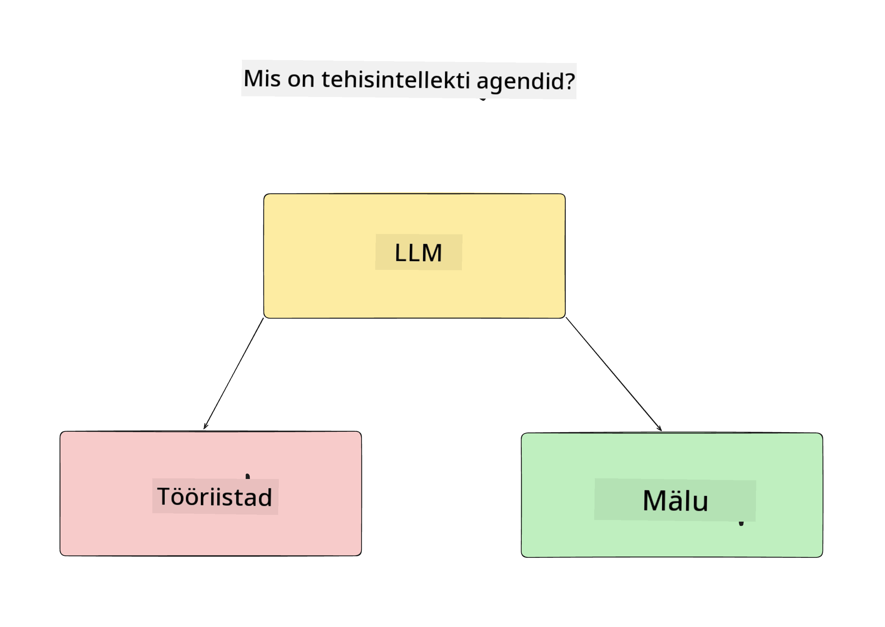
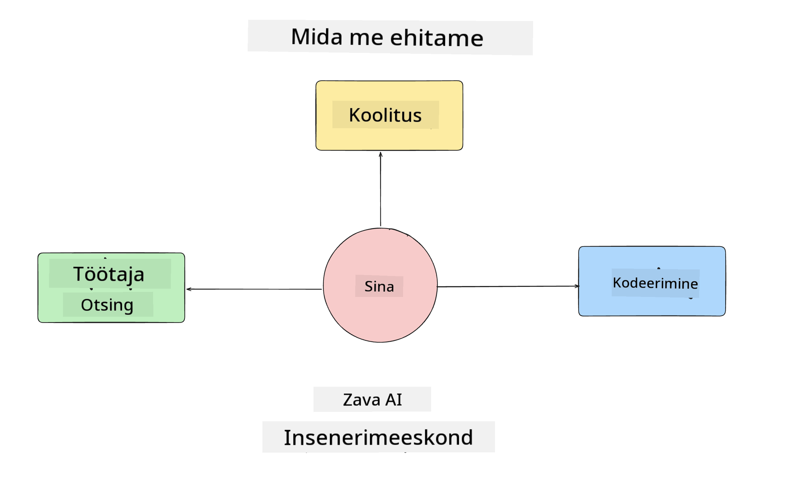
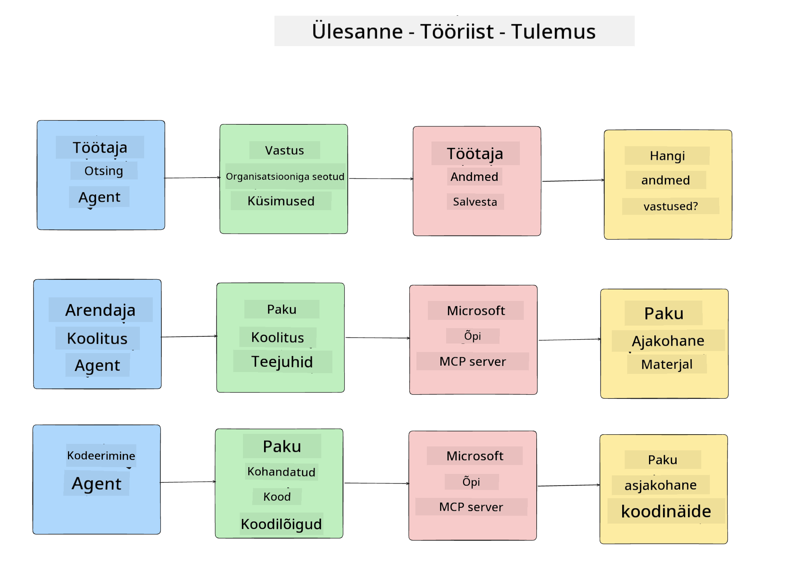
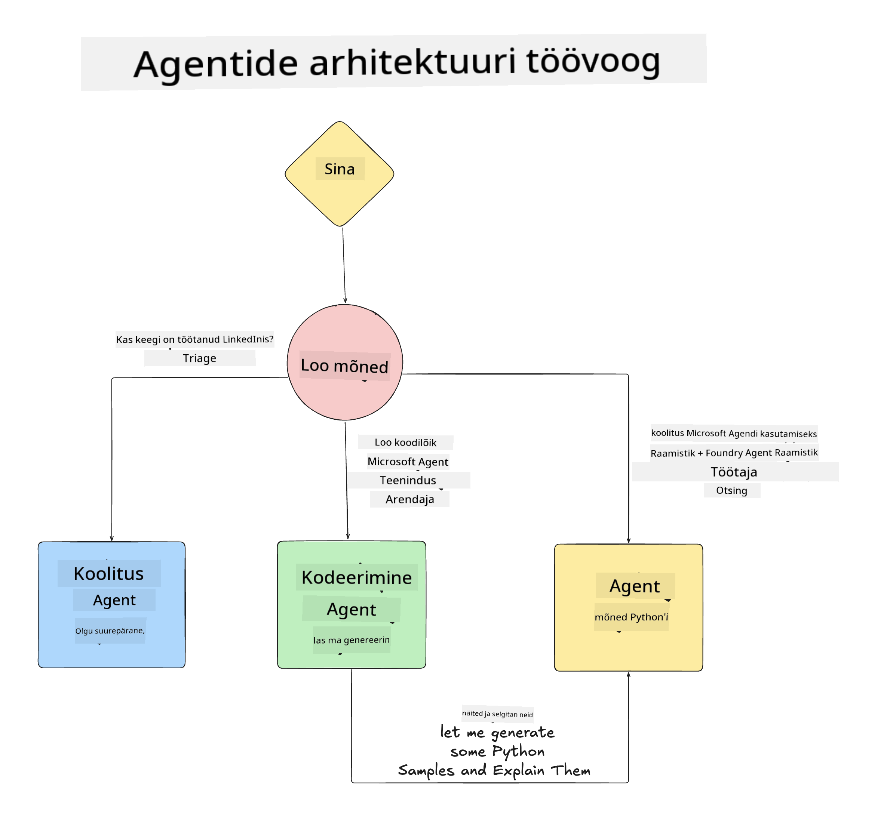

<!--
CO_OP_TRANSLATOR_METADATA:
{
  "original_hash": "99c07849641a850775c188c9333f31e5",
  "translation_date": "2025-12-12T18:45:35+00:00",
  "source_file": "lesson-1-agent-design/README.md",
  "language_code": "et"
}
-->
# Õppetund 1: AI Agendi Disain

Tere tulemast kursuse "AI Agendi loomine nullist tootmisse" esimesse õppetundi!

Selles õppetunnis käsitleme:

- AI Agentide määratlemist
  
- Arutleme AI Agendi rakenduse üle, mida me ehitame  

- Määratleme iga agendi jaoks vajalikud tööriistad ja teenused
  
- Kujundame oma Agendi Rakenduse arhitektuuri
  
Alustame agendi mõiste määratlemisest ja sellest, miks me neid rakenduses kasutame.

## Mis on AI Agendid?

Kui see on sinu esimene kord uurida, kuidas AI Agenti ehitada, võivad sul tekkida küsimused, kuidas täpselt määratleda, mis on AI Agent.

Lihtsustatult saab AI Agendi määratleda selle komponentide kaudu:

**Suur Keelemudel** - LLM annab võime töödelda kasutaja loomulikku keelt, et mõista ülesannet, mida nad soovivad täita, ning tõlgendada tööriistade kirjeldusi, mis on saadaval nende ülesannete täitmiseks.

**Tööriistad** - Need on funktsioonid, API-d, andmehoidlad ja muud teenused, mida LLM saab valida kasutamiseks kasutaja poolt nõutud ülesannete täitmiseks.

**Mälu** - See on viis, kuidas me salvestame nii lühiajalisi kui ka pikaajalisi interaktsioone AI Agendi ja kasutaja vahel. Selle info salvestamine ja tagasivõtmine on oluline täiustuste tegemiseks ja kasutaja eelistuste säilitamiseks aja jooksul.

## Meie AI Agendi Kasutusjuhtum

Selle kursuse raames ehitame AI Agendi rakenduse, mis aitab uutel arendajatel meie AI Agendi Arendusmeeskonnaga liituda!

Enne arendustöö alustamist on esimene samm edukas AI Agendi rakenduse loomisel selgete stsenaariumite määratlemine selle kohta, kuidas me ootame, et kasutajad meie AI Agentidega töötavad.

Selle rakenduse jaoks töötame järgmiste stsenaariumitega:

**Stsenaarium 1**: Uus töötaja liitub meie organisatsiooniga ja soovib rohkem teada saada meeskonnast, kuhu ta liitus, ning kuidas nendega ühendust võtta.

**Stsenaarium 2:** Uus töötaja soovib teada, milline oleks parim esimene ülesanne, millega alustada.

**Stsenaarium 3:** Uus töötaja soovib koguda õppematerjale ja koodinäiteid, mis aitaksid tal selle ülesande täitmist alustada.

## Tööriistade ja Teenuste Määratlemine

Nüüd, kui meil on need stsenaariumid loodud, on järgmine samm kaardistada need tööriistadele ja teenustele, mida meie AI agendid vajavad nende ülesannete täitmiseks.

See protsess kuulub konteksti insenerinduse valdkonda, kuna keskendume sellele, et meie AI Agentidel oleks õige kontekst õigeaegselt ülesannete täitmiseks.

Teeme seda stsenaariumite kaupa ja teostame head agendi disaini, loetledes iga agendi ülesande, tööriistad ja soovitud tulemused.

### Stsenaarium 1 - Töötajate Otsingu Agent

**Ülesanne** - Vastata küsimustele organisatsiooni töötajate kohta, nagu liitumiskuupäev, praegune meeskond, asukoht ja viimane ametikoht.

**Tööriistad** - Praeguse töötajate nimekirja ja organisatsiooniskeemi andmehoidla

**Tulemused** - Võime hankida teavet andmehoidlast, et vastata üldistele organisatsiooniküsimustele ja konkreetsetele töötajate küsimustele.

### Stsenaarium 2 - Ülesannete Soovitamise Agent

**Ülesanne** - Uue töötaja arendajakogemuse põhjal pakkuda välja 1-3 ülesannet, millega uus töötaja saab töötada.

**Tööriistad** - GitHub MCP server avatud probleemide saamiseks ja arendajaprofiili koostamiseks

**Tulemused** - Võime lugeda GitHub profiili viimaseid 5 commit'i ja avatud probleeme GitHub projektis ning teha soovitusi vastavalt sobivusele.

### Stsenaarium 3 - Koodi Abiline Agent

**Ülesanne** - Põhinedes "Ülesannete Soovitamise" Agendi poolt soovitatud avatud probleemidel, uurida ja pakkuda ressursse ning genereerida koodinäiteid, mis aitavad töötajal.

**Tööriistad** - Microsoft Learn MCP ressursside leidmiseks ja Koodi Tõlgendaja kohandatud koodinäidete genereerimiseks.

**Tulemused** - Kui kasutaja palub täiendavat abi, peaks töövoog kasutama Learn MCP serverit linkide ja näidiste pakkumiseks ning seejärel andma üle Koodi Tõlgendaja agendile, et genereerida väikseid koodinäiteid koos selgitustega.

## Meie Agendi Rakenduse Arhitektuur

Nüüd, kui oleme määratlenud iga meie Agendi, loome arhitektuuri diagrammi, mis aitab meil mõista, kuidas iga agent töötab koos ja eraldi sõltuvalt ülesandest:

## Järgmised Sammud

Nüüd, kui oleme disaininud iga agendi ja meie agendi süsteemi, liigume järgmisse õppetundi, kus arendame iga neist agentidest!

---

<!-- CO-OP TRANSLATOR DISCLAIMER START -->
**Vastutusest loobumine**:
See dokument on tõlgitud kasutades tehisintellektil põhinevat tõlketeenust [Co-op Translator](https://github.com/Azure/co-op-translator). Kuigi püüame tagada täpsust, palun arvestage, et automaatsed tõlked võivad sisaldada vigu või ebatäpsusi. Originaaldokument selle emakeeles tuleks pidada autoriteetseks allikaks. Olulise teabe puhul soovitatakse kasutada professionaalset inimtõlget. Me ei vastuta selle tõlke kasutamisest tulenevate arusaamatuste või valesti mõistmiste eest.
<!-- CO-OP TRANSLATOR DISCLAIMER END -->