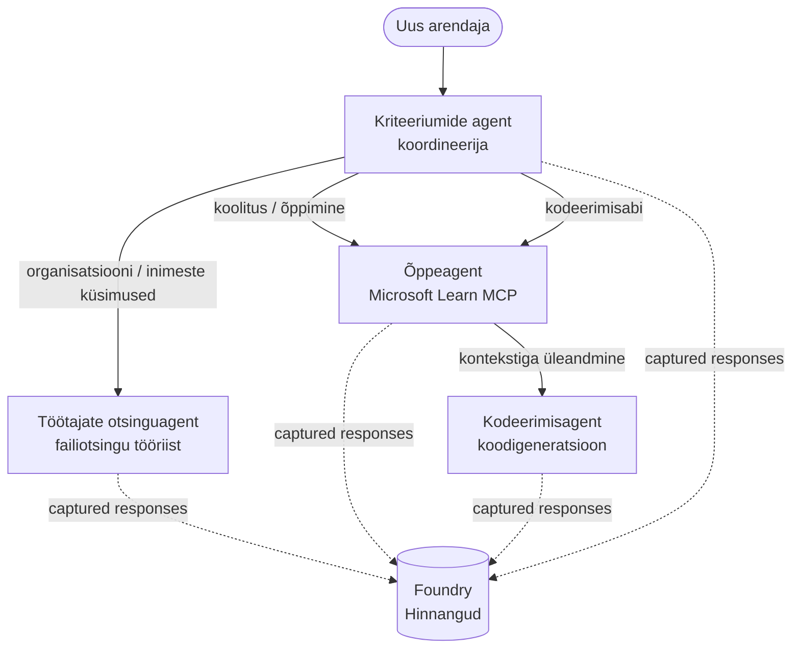

# Õpetus 3: Agentide hindamine Microsoft Foundry’ga

Tere tulemast **"AI agentide loomine nullist tootmisse"** kursuse kolmendale õppetunnile!

Õppetunnis [Lesson 2](../lesson-2-agent-development/README.md) ehitasite agente. Selles õppetunnis õpite,
kuidas vastata veelgi raskemale küsimusele: **kas nad on head?** Agendi väljaandmine, mis töötab,
on lihtne; teada, kas see suunab õigesti, jääb teie andmetele truuks ja kasutab oma
tööriistu õieti, eristab demo tootmissüsteemist.

Selles õppetunnis käsitleme:

- Miks on agentide hindamine oluline ja kuidas see erineb traditsioonilisest testimisest
- Erinevused **jälgitavuse**, **suitsutestide** ja **hindamiste** vahel
- Mitme-agendi töövoog, mida me mõõdame
- Sisseehitatud **Microsoft Foundry hindajad** (asjakohasus, põhjendatus, tööriistakutse täpsus, tööriista väljundi kasutamine)
- Samm-sammult juhend hindamisploki läbiviimiseks failis [`agent-evals.py`](../../../lesson-3-agent-evals/agent-evals.py)
- Kuidas seda käivitada ja tulemusi lugeda

---

## Miks agente hinnata?

Traditsiooniline üksustest kontrollib, kas `add(2, 2) == 4`. Agendid ei tööta nii — sama
üleskutse võib iga kord anda erineva sõnastuse, tööriistu võib kutsuda eri järjekorras ja
“õige” on tihti pigem skaala küsimus, mitte binaarvalik. Te ei saa täpsete stringide alusel


Selle asemel hinnatakse agente mööda **kvaliteedi mõõtmeid**, kasutades mudelipõhiseid *hindajaid* (nn

selliseid asju nagu:

- Kas vastus tegelikult käsitles küsimust? (**asjakohasus**)
- Kas vastus toetub süsteemist toodud andmetele või kas agent lihtsalt mõtles midagi välja? (**põhjendatus**)

- Kas agent kasutas tõesti seda, mida tööriist tagastas? (**tööriista väljundi kasutamine**)

### Kvaliteedi kolm täiendavat tasandit

Need ei ole üksteisega konkurentsis olevad meetodid — tootmises kasutatakse kõiki kolme:

| Tase | Küsimus, millele vastab | Hind | Millal käivitub | Kaetud õppetunnis |
|-------|-----------------------|------|-------------|--------------------|
| **Jälgitavus / jälgimine** | *Mida agent samm-sammult tegi?* | Tasuta (alati sees) | Jooksvalt tootmises | Selles õppetunnis |

| **Hindamised** | *Kui **head** on vastused?* | Aeglasem, mudelipõhine tasu | Nõudmisel / öösel / eel-väljalaskmisel | Selles õppetunnis |

Suitsutstestid vastavad küsimusele "kas see purunes?"; hindamised sellele, "kas see on hea?". Soovite mõlemat.

---

## Eeltingimused

1. Läbitud [Lesson 2](../lesson-2-agent-development/README.md) (agendid + vektoripood).
2. **Microsoft Foundry** projekt.

4. **Python 3.12+** ja kursuse sõltuvused paigaldatud:


5. Keskkonnamuutujad (loo selles kaustas `.env` fail või ekspordi neid):

   | Muutuja | Eesmärk |
   |---------|---------|
   | `FOUNDRY_PROJECT_ENDPOINT` | Sinu Foundry projekti lõpp-punkt (`https://<account>.services.ai.azure.com/api/projects/<project>`). Loeb agendid `FoundryChatClient` **ja** hindamisabiline. |
   | `FOUNDRY_MODEL` | Mudeli juurutus, millel **agendid** töötavad (nt `gpt-5.1`). |

   | `AZURE_AI_MODEL_DEPLOYMENT_NAME` | Mudeli juurutus, mida kasutavad **hindajad** (vaikimisi `FOUNDRY_MODEL`, siis `gpt-5.1`) |

> Agendid kasutavad `FoundryChatClient`i, mis loeb konfiguratsiooni `FOUNDRY_` eesliitega
> muutujatest (`FOUNDRY_PROJECT_ENDPOINT`, `FOUNDRY_MODEL`). Pilvehindamisabiline
> kasutab `azure-ai-projects` SDKd ja langeb tagasi `FOUNDRY_PROJECT_ENDPOINT` peale, kui
> `AZURE_AI_PROJECT_ENDPOINT` pole seadistatud — nii et kaks `FOUNDRY_` muutujat on piisavad
> terve õppetunni jooksutamiseks.
>
> Hindajad ise on mudelipõhised, nii et `AZURE_AI_MODEL_DEPLOYMENT_NAME`

> agendid kasutavad.

---

## Töövoog, mida hindame


mitmeagendi töövoogu: **triaaž** koordinaator annab üle kolmele spetsialistile.



Töövoog on ehitatud Microsoft Agent Framework’i **üleandmise** orkestreerimisega. Peamine mõte


Failis [`agent-evals.py`](../../../lesson-3-agent-evals/agent-evals.py) on kuueastmeline plokk. Siin on, mida iga samm teeb


Töövoog käivitatakse `run_stream(...)` abil ja sündmuste tagasi voogesitamisel kood salvestab
iga agendi toodetud `response_id` ja `conversation_id`. Salvestatud vastused on hindamise
alus — hindate *päris* tootmisse kujundatud vastuseid, mitte ümbertekitatud.

### Samm 2 — Kokkuvõtte tegemine salvestatust

Kiire kokkuvõte näitab, mitu vastust iga agent andis, et kinnitada töövoog
tegelikult kasutas neid agente, keda kavatsete hinnata.

### Samm 3 — Lõplike vastuste pärimine

Iga agendi puhul tuuakse viimane `response_id` projekti OpenAI-ühilduva kliendi kaudu
(`project_client.get_openai_client().responses.retrieve(...)`) nii, et saate lugeda
teksti, mida hinnatakse.

### Samm 4 — Hindamise loomine

Hindamine luuakse nelja **sisseehitatud Foundry hindajaga**:

| Hindaja | `evaluator_name` | Mida mõõdab |
|----------|-----------------|--------------|
| Asjakohasus | `builtin.relevance` | Kas vastus vastab kasutaja soovile? |

| Kinnitatus | `builtin.groundedness` | Kas vastus põhineb kättesaadaval/ tööriistaandmetel (mitte ei ole leiutatud)? |
| Tööriistakutse täpsus | `builtin.tool_call_accuracy` | Kas õigeid tööriistu kutsuti õigete argumentidega? |
| Tööriistatulemuste kasutamine | `builtin.tool_output_utilization` | Kas agent kasutas tööriista tulemusi oma vastuses? |

Iga hindaja initsialiseeritakse `AZURE_AI_MODEL_DEPLOYMENT_NAME` nimega juurutusega.

> **Miks just need neli?** Asjakohasus ja kinnitatus mõõdavad *vastuse kvaliteeti*; kaks tööriistahindajat mõõdavad *agentset käitumist* — osa, mida traditsioonilised NLP mõõdikud üldse ei hõlma. Tööriistu kasutavas mitme agendi süsteemis peituvad tegelikud regressioonid sageli tööriistamõõdikes.


### Samm 5 — Käivita hindamine

Salvestatud `response_id`-d antakse andmeallikana `evals.runs.create(...)`-le. Teenus esitab iga salvestatud vastuse kõigi hindajate läbi.


### Samm 6 — Jälgi ja loe tulemusi

Kood kontrollib jooksu, kuni see on `completed` või `failed`, seejärel prindib tulemitihedused ja
**`report_url`** — sügavlink Foundry portaalile, kus saad vaadata skoorid meetme kaupa,
läbipääsu/ebaõnnestumise arve ja üksikuid hinnatud vastuseid.

---

## Käivita see

```bash
cd lesson-3-agent-evals
python agent-evals.py
```

Vaikimisi hindab see esimese näidispäringu
(`"Ma olen siin uus! Kas keegi on siin Microsoftis töötanud?"`). Kaks muud mitme eesmärgiga näidispäringut on
kaasatud funktsiooni `run_evaluation_workflow()` — vaheta `query` muutuja, et proovida marsruutimise stsenaariume,
mis kaasavad mitut agenti ühes jooksus.

Oodatud konsooli voog:

```
Step 1: Running Developer Onboarding Workflow
Step 2: Response Data Summary
Step 3: Fetching Agent Responses
Step 4: Creating Evaluation
Step 5: Running Evaluation
Step 6: Monitoring Evaluation
  Status: running ...
  Evaluation completed successfully
  Report URL: https://...   <-- open this in the Foundry portal
```

---

## Jälgitavus ja jälgimine

Hindamised ütlevad sulle *kui head* vastused olid; **jälgitavus** ütleb sulle *mis juhtus* nende tootmisel — iga agendi hüpe, tööriistakutse, tokenite arv ja latentsus. Microsoft Foundry-s
saadavad agendi jooksud OpenTelemetry jälgi, mida saad portaalis vaadata, ning Agent Framework saab
need eksportida Azure Monitori / Application Insightsi ühe kutsuga:


Kasuta jälgimist halva hindmesskoori **silumiseks**: kui kinnitatus langeb, näitab jälgimine, kas failide otsimise tööriist ei tagastanud midagi või tagastas andmeid, mida agent siis ignoreeris (mis ongi täpselt see, mida tööriistatulemuste kasutamine hindab).


---

## Jooksudest heaks: kuidas seda praktikas kasutada

- **Eelversiooni tõkkevara.** Käivita hindamised kindla esinduslike päringute kogumi vastu enne uue prompti või mudeli edutamist. Võrdle tulemusi eelmise versiooniga — langust käsitle regressioonina.

- **Öine kvaliteedisignaal.** Planeeri hindamine, et püüda andmete või sõltuvuste muutuste sisse vajumist.

- **Kombineeri suitsutestidega.** [Õppetükk 4 suitsutest](../lesson-4-agentdeployment/README.md#smoke-testing-the-hosted-agent-ci-gate)
on sinu kiire perjuurutusluba; hindamised on aeglasem ja põhjalikum kvaliteeditõke. Käivita odav test iga ühendamisel ja kallim test ajaks või enne versiooni väljaandmist.


---

## Moderniseerimis märkus

See näide viiakse üle Microsoft Agent Framework Foundry praegusele API-le
(`agent_framework.foundry`). Kui uuendad koodi, vaata repositooriumi juur `MIGRATION-GUIDE.md`
faili kinnitatud enne/ja pärast impordi ja kliendi kaardistuste jaoks (näiteks `AzureAIClient` -> `FoundryChatClient` ning hostitud tööriista loomine
`client.get_file_search_tool(...)` / `client.get_mcp_tool(...)` abil). Hindamiskontseptsioonid ja
eespool kirjeldatud kuue sammuga töövoog jäävad samaks.


---

## Ressursid

- [Generatiivsete tehisintellekti mudelite ja rakenduste hindamine (Microsoft Learn)](https://learn.microsoft.com/en-us/azure/ai-foundry/concepts/evaluation-approach-gen-ai)
- [Sisseehitatud hindajad generatiivse AI jaoks](https://learn.microsoft.com/en-us/azure/ai-foundry/concepts/evaluation-evaluators/agent-evaluators)
- [Jälgitavus Microsoft Foundrys](https://learn.microsoft.com/en-us/azure/ai-foundry/concepts/observability)
- [Microsoft Agent Framework](https://github.com/microsoft/agent-framework)
- [Agendi üleandmise orkestreerimine](https://learn.microsoft.com/en-us/agent-framework/workflows/orchestrations/handoff)

---

<!-- CO-OP TRANSLATOR DISCLAIMER START -->
**Lahtiütlus**:
See dokument on tõlgitud kasutades AI tõlketeenust [Co-op Translator](https://github.com/Azure/co-op-translator). Kuigi me püüdleme täpsuse poole, palun pange tähele, et automatiseeritud tõlgetes võib esineda vigu või ebatäpsusi. Originaaldokument selle emakeeles tuleks pidada autoriteetseks allikaks. Olulise teabe puhul soovitatakse kasutada professionaalset inimtõlget. Me ei vastuta selle tõlkega seotud eksimustest või valesti mõistmistest.
<!-- CO-OP TRANSLATOR DISCLAIMER END -->