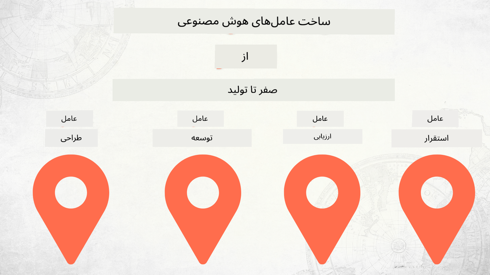

<!--
CO_OP_TRANSLATOR_METADATA:
{
  "original_hash": "73b37a335747d59d319b00aac130f073",
  "translation_date": "2025-12-24T22:46:23+00:00",
  "source_file": "README.md",
  "language_code": "fa"
}
-->
# ساخت عامل‌های هوش مصنوعی از صفر تا تولید

### 🌐 پشتیبانی چندزبانه

#### پشتیبانی شده از طریق GitHub Action (خودکار و همیشه به‌روز)

<!-- CO-OP TRANSLATOR LANGUAGES TABLE START -->
[عربی](../ar/README.md) | [بنگالی](../bn/README.md) | [بلغاری](../bg/README.md) | [بورمی (میانمار)](../my/README.md) | [چینی (ساده‌شده)](../zh/README.md) | [چینی (سنتی، هنگ‌کنگ)](../hk/README.md) | [چینی (سنتی، ماکائو)](../mo/README.md) | [چینی (سنتی، تایوان)](../tw/README.md) | [کرواتی](../hr/README.md) | [چکی](../cs/README.md) | [دانمارکی](../da/README.md) | [هلندی](../nl/README.md) | [استونیایی](../et/README.md) | [فنلاندی](../fi/README.md) | [فرانسوی](../fr/README.md) | [آلمانی](../de/README.md) | [یونانی](../el/README.md) | [عبری](../he/README.md) | [هندی](../hi/README.md) | [مجارستانی](../hu/README.md) | [اندونزیایی](../id/README.md) | [ایتالیایی](../it/README.md) | [ژاپنی](../ja/README.md) | [کانادا](../kn/README.md) | [کره‌ای](../ko/README.md) | [لیتوانیایی](../lt/README.md) | [مالایی](../ms/README.md) | [مالایالم](../ml/README.md) | [مراتی](../mr/README.md) | [نپالی](../ne/README.md) | [پیدژین نیجریه‌ای](../pcm/README.md) | [نروژی](../no/README.md) | [فارسی (Farsi)](./README.md) | [لهستانی](../pl/README.md) | [پرتغالی (برزیل)](../br/README.md) | [پرتغالی (پرتغال)](../pt/README.md) | [پنجابی (گورمکی)](../pa/README.md) | [رومانیایی](../ro/README.md) | [روسی](../ru/README.md) | [صربستانی (سیریلیک)](../sr/README.md) | [اسلواکیایی](../sk/README.md) | [اسلوونیایی](../sl/README.md) | [اسپانیایی](../es/README.md) | [سواحیلی](../sw/README.md) | [سوئدی](../sv/README.md) | [تاگالوگ (فیلیپینی)](../tl/README.md) | [تامیل](../ta/README.md) | [تلوگو](../te/README.md) | [تایلندی](../th/README.md) | [ترکی](../tr/README.md) | [اوکراینی](../uk/README.md) | [اردو](../ur/README.md) | [ویتنامی](../vi/README.md)
<!-- CO-OP TRANSLATOR LANGUAGES TABLE END -->

## یک دوره که اصول چرخه توسعه عامل‌های هوش مصنوعی را به شما آموزش می‌دهد

## 🌱 شروع به کار

این دوره شامل درس‌هایی است که اصول ساخت و استقرار عامل‌های هوش مصنوعی را پوشش می‌دهند.

هر درس بر درس قبلی بنا شده است، بنابراین پیشنهاد می‌کنیم از ابتدا شروع کنید و تا انتها پیش بروید.

اگر می‌خواهید درباره مباحث عامل‌های هوش مصنوعی بیشتر کاوش کنید، می‌توانید به [دوره عامل‌های هوش مصنوعی برای مبتدیان](https://aka.ms/ai-agents-beginners) مراجعه کنید.

### ملاقات با دیگر یادگیرنده‌ها، پاسخ سؤالات خود را بگیرید

اگر گیر کردید یا سؤالی درباره ساخت عامل‌های هوش مصنوعی دارید، به کانال اختصاصی ما در Discord در [Microsoft Foundry Discord](https://discord.gg/Kuaw3ktsu6) بپیوندید.

### چه چیزهایی نیاز دارید

هر درس یک نمونه کد مخصوص به خود دارد که می‌توانید به‌صورت محلی اجرا کنید. شما می‌توانید [این مخزن را فورک کنید](https://github.com/microsoft/Building-AI-Agents-From-Zero-To-Production/fork) تا نسخه‌ای از آن را برای خود ایجاد کنید.

این دوره در حال حاضر از موارد زیر استفاده می‌کند:

- [Microsoft Agent Framework (MAF)](https://aka.ms/ai-agents-beginners/agent-framework)
- [Microsoft Foundry](https://azure.microsoft.com/products/ai-foundry)
- [Azure OpenAI Service](https://azure.microsoft.com/products/ai-foundry/models/openai)
- [Azure CLI](https://learn.microsoft.com/cli/azure/authenticate-azure-cli?view=azure-cli-latest)

لطفاً قبل از شروع مطمئن شوید که به این سرویس‌ها دسترسی دارید.

گزینه‌های بیشتر برای میزبانی مدل و سرویس‌ها به‌زودی اضافه خواهند شد. 

## 🗃️ درس‌ها

| **درس**         | **توضیحات**                                                                                  |
|--------------------|--------------------------------------------------------------------------------------------------|
| [طراحی عامل](./lesson-1-agent-design/README.md)       | مقدمه‌ای بر مورد استفاده «Developer Onboarding» و چگونگی طراحی عامل‌های مؤثر  |
| [توسعه عامل](./lesson-2-agent-development/README.md)  | با استفاده از Microsoft Agent Framework (MAF)، سه عامل ایجاد کنید تا به توسعه‌دهندگان جدید در فرآیند ورود کمک کنند.       |
| [ارزیابی‌های عامل](./lesson-3-agent-evals/README.md)  | با استفاده از Microsoft Foundry، بررسی کنید که عامل‌های هوش مصنوعی ما چه عملکردی دارند و چگونه می‌توان آن‌ها را بهبود داد. |
| [استقرار عامل](./lesson-4-agent-deployment/README.md)   | با استفاده از Hosted Agents و OpenAI Chatkit، ببینید چگونه یک عامل هوش مصنوعی را در تولید مستقر کنید.       |

## 🎒 دوره‌های دیگر

تیم ما دوره‌های دیگری هم تولید می‌کند! ببینید:

<!-- CO-OP TRANSLATOR OTHER COURSES START -->
### LangChain

---

### Azure / Edge / MCP / Agents

---
 
### سری هوش مولد

[-9333EA?style=for-the-badge&labelColor=E5E7EB&color=9333EA)](https://github.com/microsoft/Generative-AI-for-beginners-dotnet?WT.mc_id=academic-105485-koreyst)
[-C084FC?style=for-the-badge&labelColor=E5E7EB&color=C084FC)](https://github.com/microsoft/generative-ai-for-beginners-java?WT.mc_id=academic-105485-koreyst)
[-E879F9?style=for-the-badge&labelColor=E5E7EB&color=E879F9)](https://github.com/microsoft/generative-ai-with-javascript?WT.mc_id=academic-105485-koreyst)

---
 
### یادگیری پایه‌ای

---
 
### مجموعه Copilot

<!-- CO-OP TRANSLATOR OTHER COURSES END -->

## مشارکت

این پروژه از مشارکت‌ها و پیشنهادها استقبال می‌کند. اکثر مشارکت‌ها مستلزم آن است که شما با یک توافق‌نامه مجوز مشارکت‌کننده (CLA) موافقت کنید که اعلام می‌کند شما حق دارید و در واقع این حق را به ما اعطا می‌کنید که از مشارکت شما استفاده کنیم. برای جزئیات، به <https://cla.opensource.microsoft.com> مراجعه کنید.

وقتی یک pull request ارسال می‌کنید، یک ربات CLA به‌طور خودکار تعیین می‌کند که آیا نیاز به ارائه CLA دارید و PR را به‌طور مناسب علامت‌گذاری می‌کند (مثلاً بررسی وضعیت، نظر). کافی است دستورالعمل‌های ارائه‌شده توسط ربات را دنبال کنید. شما تنها یک‌بار در میان تمام مخازنی که از CLA ما استفاده می‌کنند نیاز به انجام این کار خواهید داشت.

این پروژه، [راهنمای رفتار متن‌باز مایکروسافت](https://opensource.microsoft.com/codeofconduct/) را پذیرفته است.
برای اطلاعات بیشتر به [سؤالات متداول راهنمای رفتار](https://opensource.microsoft.com/codeofconduct/faq/) مراجعه کنید یا برای پرسش‌ها یا نظرات بیشتر با [opencode@microsoft.com](mailto:opencode@microsoft.com) تماس بگیرید.

## علائم تجاری

این پروژه ممکن است شامل علائم تجاری یا لوگوهایی برای پروژه‌ها، محصولات یا خدمات باشد. استفاده مجاز از علائم تجاری یا لوگوهای مایکروسافت مشروط به و باید مطابق با
[دستورالعمل‌های علامت تجاری و برند مایکروسافت](https://www.microsoft.com/legal/intellectualproperty/trademarks/usage/general) باشد.
استفاده از علائم تجاری یا لوگوهای مایکروسافت در نسخه‌های تغییر یافته این پروژه نباید موجب سردرگمی شود یا دلالت بر حمایت مالی مایکروسافت داشته باشد.
هرگونه استفاده از علائم تجاری یا لوگوهای طرف‌های ثالث تابع سیاست‌های آن طرف‌های ثالث است.

## دریافت کمک

اگر گیر کردید یا سؤالی درباره ساخت اپلیکیشن‌های هوش مصنوعی دارید، بپیوندید به:

اگر هنگام ساخت بازخورد محصول یا خطا دارید، به این آدرس مراجعه کنید:

---

<!-- CO-OP TRANSLATOR DISCLAIMER START -->
سلب مسئولیت:
این سند با استفاده از سرویس ترجمهٔ هوش مصنوعی Co‑op Translator (https://github.com/Azure/co-op-translator) ترجمه شده است. اگرچه ما در پی دقت هستیم، لطفاً توجه داشته باشید که ترجمه‌های خودکار ممکن است حاوی خطاها یا نادرستی‌هایی باشند. نسخهٔ اصلی سند به زبان مادری آن باید به‌عنوان مرجع معتبر در نظر گرفته شود. برای اطلاعات حساس یا مهم، استفاده از ترجمهٔ حرفه‌ای انسانی توصیه می‌شود. ما در قبال هر گونه سوءتفاهم یا برداشت نادرستی که از استفاده از این ترجمه ناشی شود، مسئولیتی نداریم.
<!-- CO-OP TRANSLATOR DISCLAIMER END -->