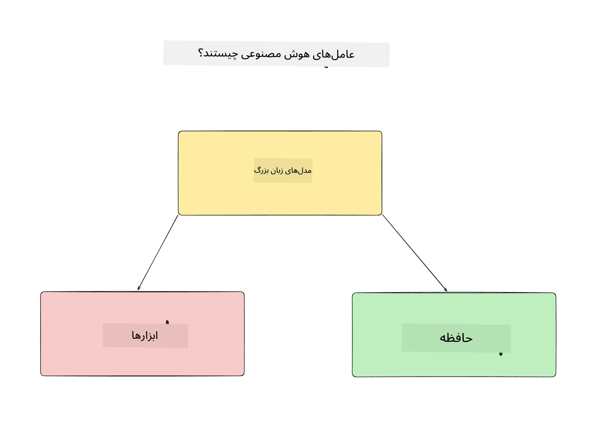
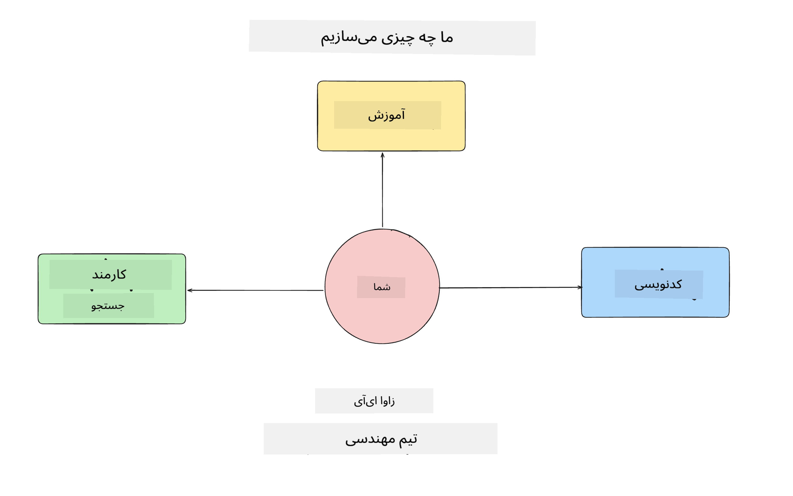
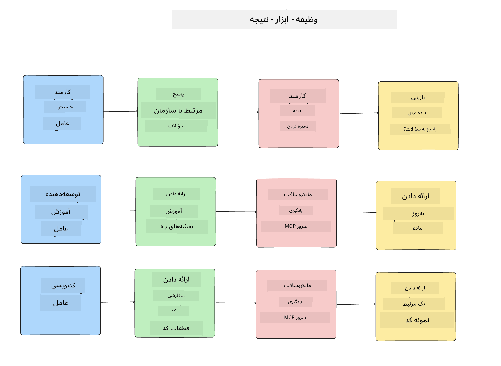
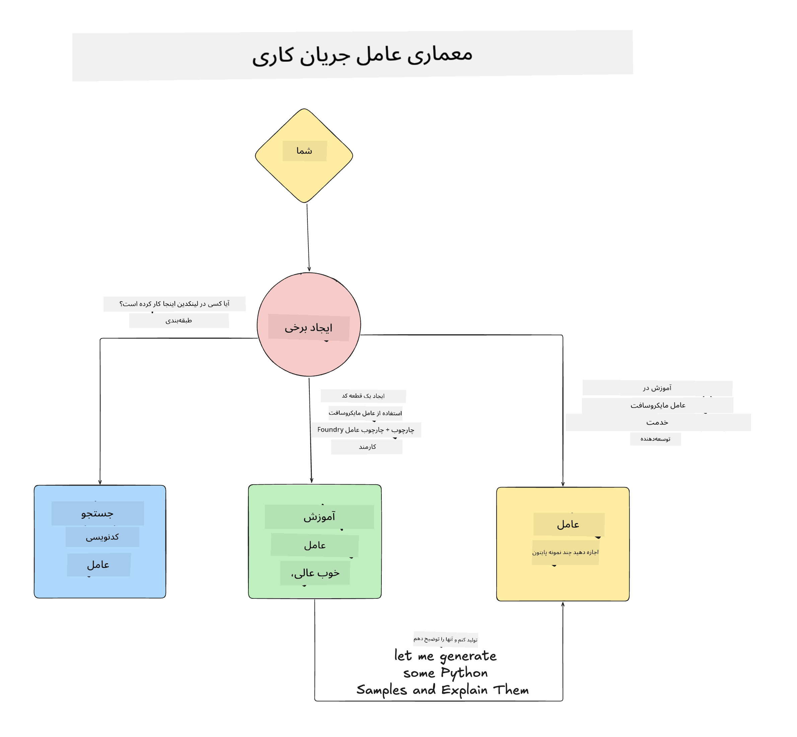

<!--
CO_OP_TRANSLATOR_METADATA:
{
  "original_hash": "99c07849641a850775c188c9333f31e5",
  "translation_date": "2025-12-12T18:16:51+00:00",
  "source_file": "lesson-1-agent-design/README.md",
  "language_code": "fa"
}
-->
# درس ۱: طراحی عامل هوش مصنوعی

به اولین درس دوره «ساخت عامل هوش مصنوعی از صفر تا تولید» خوش آمدید!

در این درس موارد زیر را پوشش خواهیم داد:

- تعریف اینکه عامل‌های هوش مصنوعی چیستند
  
- بحث در مورد برنامه عامل هوش مصنوعی که می‌سازیم  

- شناسایی ابزارها و خدمات مورد نیاز برای هر عامل
  
- معماری برنامه عامل خود را طراحی کنیم
  
بیایید با تعریف اینکه عامل چیست و چرا می‌خواهیم از آن‌ها در یک برنامه استفاده کنیم شروع کنیم.

## عامل‌های هوش مصنوعی چیستند؟

اگر این اولین بار است که در حال بررسی نحوه ساخت یک عامل هوش مصنوعی هستید، ممکن است سوالاتی درباره تعریف دقیق عامل هوش مصنوعی داشته باشید.

یک راه ساده برای تعریف عامل هوش مصنوعی، اجزایی است که آن را می‌سازند:

**مدل زبان بزرگ** - LLM توانایی پردازش زبان طبیعی از کاربر را برای تفسیر کاری که می‌خواهد انجام دهد و همچنین تفسیر توضیحات ابزارهای موجود برای انجام آن کارها فراهم می‌کند.

**ابزارها** - این‌ها توابع، APIها، مخازن داده و سایر خدماتی هستند که LLM می‌تواند برای انجام کارهای درخواستی کاربر از آن‌ها استفاده کند.

**حافظه** - این نحوه ذخیره تعاملات کوتاه‌مدت و بلندمدت بین عامل هوش مصنوعی و کاربر است. ذخیره و بازیابی این اطلاعات برای بهبود و حفظ ترجیحات کاربر در طول زمان اهمیت دارد.

## مورد استفاده عامل هوش مصنوعی ما

برای این دوره، ما یک برنامه عامل هوش مصنوعی می‌سازیم که به توسعه‌دهندگان جدید کمک می‌کند تا به تیم توسعه عامل هوش مصنوعی ما ملحق شوند!

قبل از انجام هرگونه توسعه، اولین گام برای ایجاد یک برنامه عامل هوش مصنوعی موفق، تعریف سناریوهای واضح درباره نحوه انتظار ما از کاربران برای کار با عامل‌های هوش مصنوعی است.

برای این برنامه، با این سناریوها کار خواهیم کرد:

**سناریو ۱**: یک کارمند جدید به سازمان ما می‌پیوندد و می‌خواهد درباره تیمی که به آن ملحق شده و نحوه ارتباط با آن‌ها بیشتر بداند.

**سناریو ۲:** یک کارمند جدید می‌خواهد بداند بهترین کار اول برای شروع چیست.

**سناریو ۳:** یک کارمند جدید می‌خواهد منابع آموزشی و نمونه کدهایی برای کمک به شروع انجام این کار جمع‌آوری کند.

## شناسایی ابزارها و خدمات

حالا که این سناریوها را ایجاد کرده‌ایم، گام بعدی نگاشت آن‌ها به ابزارها و خدماتی است که عامل‌های هوش مصنوعی ما برای انجام این کارها نیاز دارند.

این فرایند تحت دسته مهندسی زمینه قرار می‌گیرد زیرا ما تمرکز خواهیم کرد که عامل‌های هوش مصنوعی ما در زمان مناسب زمینه درست را برای انجام کارها داشته باشند.

بیایید این کار را سناریو به سناریو انجام دهیم و طراحی عامل خوبی با فهرست کردن وظیفه، ابزارها و نتایج مطلوب هر عامل انجام دهیم.

### سناریو ۱ - عامل جستجوی کارمند

**وظیفه** - پاسخ به سوالات درباره کارمندان سازمان مانند تاریخ پیوستن، تیم فعلی، مکان و آخرین موقعیت.

**ابزارها** - مخزن داده فهرست کارمندان فعلی و نمودار سازمانی

**نتایج** - توانایی بازیابی اطلاعات از مخزن داده برای پاسخ به سوالات کلی سازمانی و سوالات خاص درباره کارمندان.

### سناریو ۲ - عامل توصیه کار

**وظیفه** - بر اساس تجربه توسعه‌دهنده کارمند جدید، ارائه ۱ تا ۳ مسئله که کارمند جدید می‌تواند روی آن‌ها کار کند.

**ابزارها** - سرور MCP گیت‌هاب برای دریافت مسائل باز و ساخت پروفایل توسعه‌دهنده

**نتایج** - توانایی خواندن ۵ کامیت آخر یک پروفایل گیت‌هاب و مسائل باز در یک پروژه گیت‌هاب و ارائه توصیه بر اساس تطابق

### سناریو ۳ - عامل دستیار کد

**وظیفه** - بر اساس مسائل باز که توسط عامل «توصیه کار» پیشنهاد شده‌اند، تحقیق و ارائه منابع و تولید قطعات کد برای کمک به کارمند.

**ابزارها** - Microsoft Learn MCP برای یافتن منابع و Code Interpreter برای تولید قطعات کد سفارشی.

**نتایج** - اگر کاربر درخواست کمک اضافی کند، جریان کاری باید از سرور Learn MCP برای ارائه لینک‌ها و قطعات به منابع استفاده کند و سپس به عامل Code Interpreter برای تولید قطعات کد کوچک با توضیحات واگذار کند.

## معماری برنامه عامل ما

حالا که هر یک از عامل‌های خود را تعریف کرده‌ایم، بیایید یک نمودار معماری ایجاد کنیم که به ما کمک کند بفهمیم هر عامل چگونه با هم و جداگانه بسته به وظیفه کار خواهد کرد:

## گام‌های بعدی

حالا که هر عامل و سیستم عاملی خود را طراحی کرده‌ایم، بیایید به درس بعدی برویم که در آن هر یک از این عامل‌ها را توسعه خواهیم داد!

---

<!-- CO-OP TRANSLATOR DISCLAIMER START -->
**سلب مسئولیت**:  
این سند با استفاده از سرویس ترجمه هوش مصنوعی [Co-op Translator](https://github.com/Azure/co-op-translator) ترجمه شده است. در حالی که ما در تلاش برای دقت هستیم، لطفاً توجه داشته باشید که ترجمه‌های خودکار ممکن است حاوی خطاها یا نادرستی‌هایی باشند. سند اصلی به زبان بومی خود باید به عنوان منبع معتبر در نظر گرفته شود. برای اطلاعات حیاتی، ترجمه حرفه‌ای انسانی توصیه می‌شود. ما مسئول هیچ گونه سوءتفاهم یا تفسیر نادرستی که از استفاده این ترجمه ناشی شود، نیستیم.
<!-- CO-OP TRANSLATOR DISCLAIMER END -->