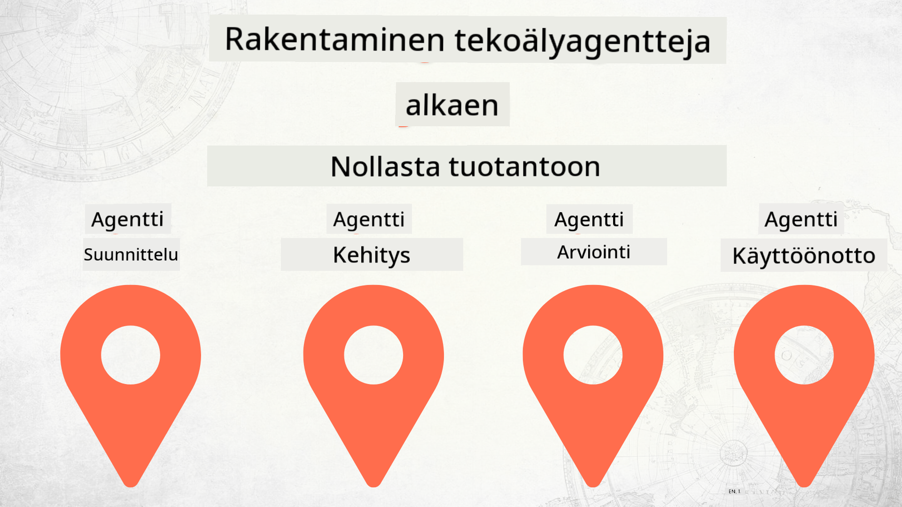

<!--
CO_OP_TRANSLATOR_METADATA:
{
  "original_hash": "73b37a335747d59d319b00aac130f073",
  "translation_date": "2025-12-24T23:33:00+00:00",
  "source_file": "README.md",
  "language_code": "fi"
}
-->
# AI-agenttien rakentaminen nollasta tuotantoon

### 🌐 Monikielinen tuki

#### Tuettu GitHub Actionin kautta (automaattinen ja aina ajan tasalla)

<!-- CO-OP TRANSLATOR LANGUAGES TABLE START -->
[Arabic](../ar/README.md) | [Bengali](../bn/README.md) | [Bulgarian](../bg/README.md) | [Burmese (Myanmar)](../my/README.md) | [Chinese (Simplified)](../zh/README.md) | [Chinese (Traditional, Hong Kong)](../hk/README.md) | [Chinese (Traditional, Macau)](../mo/README.md) | [Chinese (Traditional, Taiwan)](../tw/README.md) | [Croatian](../hr/README.md) | [Czech](../cs/README.md) | [Danish](../da/README.md) | [Dutch](../nl/README.md) | [Estonian](../et/README.md) | [Finnish](./README.md) | [French](../fr/README.md) | [German](../de/README.md) | [Greek](../el/README.md) | [Hebrew](../he/README.md) | [Hindi](../hi/README.md) | [Hungarian](../hu/README.md) | [Indonesian](../id/README.md) | [Italian](../it/README.md) | [Japanese](../ja/README.md) | [Kannada](../kn/README.md) | [Korean](../ko/README.md) | [Lithuanian](../lt/README.md) | [Malay](../ms/README.md) | [Malayalam](../ml/README.md) | [Marathi](../mr/README.md) | [Nepali](../ne/README.md) | [Nigerian Pidgin](../pcm/README.md) | [Norwegian](../no/README.md) | [Persian (Farsi)](../fa/README.md) | [Polish](../pl/README.md) | [Portuguese (Brazil)](../br/README.md) | [Portuguese (Portugal)](../pt/README.md) | [Punjabi (Gurmukhi)](../pa/README.md) | [Romanian](../ro/README.md) | [Russian](../ru/README.md) | [Serbian (Cyrillic)](../sr/README.md) | [Slovak](../sk/README.md) | [Slovenian](../sl/README.md) | [Spanish](../es/README.md) | [Swahili](../sw/README.md) | [Swedish](../sv/README.md) | [Tagalog (Filipino)](../tl/README.md) | [Tamil](../ta/README.md) | [Telugu](../te/README.md) | [Thai](../th/README.md) | [Turkish](../tr/README.md) | [Ukrainian](../uk/README.md) | [Urdu](../ur/README.md) | [Vietnamese](../vi/README.md)
<!-- CO-OP TRANSLATOR LANGUAGES TABLE END -->

## Kurssi, joka opettaa sinulle AI-agenttien kehityssyklin perusteet

## 🌱 Aloittaminen

Tällä kurssilla on oppitunteja, jotka käsittelevät AI-agenttien rakentamisen ja käyttöönoton perusteita.

Jokainen oppitunti rakentuu edellisen päälle, joten suosittelemme aloittamaan alusta ja etenemään loppuun asti.

Jos haluat tutkia AI-agentteihin liittyviä aiheita enemmän, voit tutustua [AI-agentit aloittelijoille -kurssiin](https://aka.ms/ai-agents-beginners).

### Tapaa muita oppijoita, saa vastauksia kysymyksiisi

Jos jumitut tai sinulla on kysyttävää AI-agenttien rakentamisesta, liity omistettuun Discord-kanavaamme [Microsoft Foundry Discordissa](https://discord.gg/Kuaw3ktsu6).

### Tarvitset nämä

Jokaisella oppitunnilla on oma koodiesimerkkinsä, jonka voit suorittaa paikallisesti. Voit [forkata tämän repositorion](https://github.com/microsoft/Building-AI-Agents-From-Zero-To-Production/fork) luodaksesi oman kopiosi.

Tämä kurssi käyttää tällä hetkellä seuraavia:

- [Microsoft Agent Framework (MAF)](https://aka.ms/ai-agents-beginners/agent-framework)
- [Microsoft Foundry](https://azure.microsoft.com/products/ai-foundry)
- [Azure OpenAI Service](https://azure.microsoft.com/products/ai-foundry/models/openai)
- [Azure CLI](https://learn.microsoft.com/cli/azure/authenticate-azure-cli?view=azure-cli-latest)

Varmista, että sinulla on pääsy näihin palveluihin ennen aloittamista.

Lisäoptioita mallien isännöintiin ja palveluihin tulossa pian. 

## 🗃️ Oppitunnit

| **Oppitunti**         | **Kuvaus**                                                                                  |
|--------------------|--------------------------------------------------------------------------------------------------|
| [Agentin suunnittelu](./lesson-1-agent-design/README.md)       | Johdanto "Developer Onboarding" -agenttikäyttötapaukseemme ja kuinka suunnitella tehokkaita agenteja  |
| [Agentin kehittäminen](./lesson-2-agent-development/README.md)  | Käyttämällä Microsoft Agent Frameworkia (MAF), luo 3 agenttia auttamaan uusia kehittäjiä perehdytyksessä.       |
| [Agenttien arviointi](./lesson-3-agent-evals/README.md)  | Microsoft Foundryn avulla selvitä, miten hyvin AI-agenttimme toimivat ja miten niitä voi parantaa. |
| [Agenttien käyttöönotto](./lesson-4-agent-deployment/README.md)   | Hosted Agentsin ja OpenAI Chatkitin avulla näet, miten AI-agentti otetaan tuotantoon.       |

## 🎒 Muut kurssit

Tiimimme tuottaa myös muita kursseja! Tutustu:

<!-- CO-OP TRANSLATOR OTHER COURSES START -->
### LangChain

---

### Azure / Edge / MCP / Agentit

---
 
### Generatiivinen AI -sarja

[-9333EA?style=for-the-badge&labelColor=E5E7EB&color=9333EA)](https://github.com/microsoft/Generative-AI-for-beginners-dotnet?WT.mc_id=academic-105485-koreyst)
[-C084FC?style=for-the-badge&labelColor=E5E7EB&color=C084FC)](https://github.com/microsoft/generative-ai-for-beginners-java?WT.mc_id=academic-105485-koreyst)
[-E879F9?style=for-the-badge&labelColor=E5E7EB&color=E879F9)](https://github.com/microsoft/generative-ai-with-javascript?WT.mc_id=academic-105485-koreyst)

---
 
### Perusopetus

---
 
### Copilot-sarja

<!-- CO-OP TRANSLATOR OTHER COURSES END -->

## Osallistuminen

Tämä projekti ottaa mielellään vastaan panoksia ja ehdotuksia. Useimmat panokset edellyttävät, että hyväksyt Contributor License Agreement (CLA) -sopimuksen, jossa vahvistat, että sinulla on oikeus ja että myönnät meille oikeuden käyttää panostasi. Lisätietoja on osoitteessa <https://cla.opensource.microsoft.com>.

Kun lähetät pull requestin, CLA-botti määrittää automaattisesti, tarvitsetko toimittamaan CLA:n, ja merkitsee PR:n asianmukaisesti (esim. tilantarkistus, kommentti). Noudata vain botin antamia ohjeita. Sinun tarvitsee tehdä tämä vain kerran kaikissa repoorissa, jotka käyttävät CLA:tamme.

Tämä projekti on ottanut käyttöön [Microsoftin avoimen lähdekoodin käytännesäännöt](https://opensource.microsoft.com/codeofconduct/). Lisätietoja on [Käytännesääntöjen UKK](https://opensource.microsoft.com/codeofconduct/faq/) -sivulla tai ota yhteyttä [opencode@microsoft.com](mailto:opencode@microsoft.com) lisäkysymyksissä tai kommentteja varten.

## Tavaramerkit

Tässä projektissa voi olla tavaramerkkejä tai logoja projekteille, tuotteille tai palveluille. Microsoftin tavaramerkkien tai logojen luvallinen käyttö on sidottu ja sen on noudatettava [Microsoftin tavaramerkki- ja brändiohjeita](https://www.microsoft.com/legal/intellectualproperty/trademarks/usage/general). Microsoftin tavaramerkkien tai logojen käyttö tähän projektiin perustuvissa muokatuissa versioissa ei saa aiheuttaa sekaannusta tai antaa vaikutelmaa Microsoftin sponsoroinnista. Kolmansien osapuolten tavaramerkkien tai logojen käyttöä koskevat kyseisten osapuolten omat käytännöt.

## Apua

Jos jumitut tai sinulla on kysyttävää tekoälysovellusten rakentamisesta, liity:

Jos sinulla on tuotepalautetta tai kohtaat virheitä rakentamisen aikana, vieraile:

---

<!-- CO-OP TRANSLATOR DISCLAIMER START -->
Vastuuvapauslauseke:
Tämä asiakirja on käännetty käyttämällä tekoälypohjaista käännöspalvelua Co-op Translator (https://github.com/Azure/co-op-translator). Vaikka pyrimme tarkkuuteen, huomioithan, että automaattisissa käännöksissä saattaa esiintyä virheitä tai epätarkkuuksia. Alkuperäistä asiakirjaa sen alkuperäisellä kielellä tulee pitää määräävänä lähteenä. Tärkeiden tietojen osalta suosittelemme ammattimaisen kääntäjän tekemää käännöstä. Emme ole vastuussa tämän käännöksen käytöstä johtuvista väärinymmärryksistä tai virhetulkinnoista.
<!-- CO-OP TRANSLATOR DISCLAIMER END -->