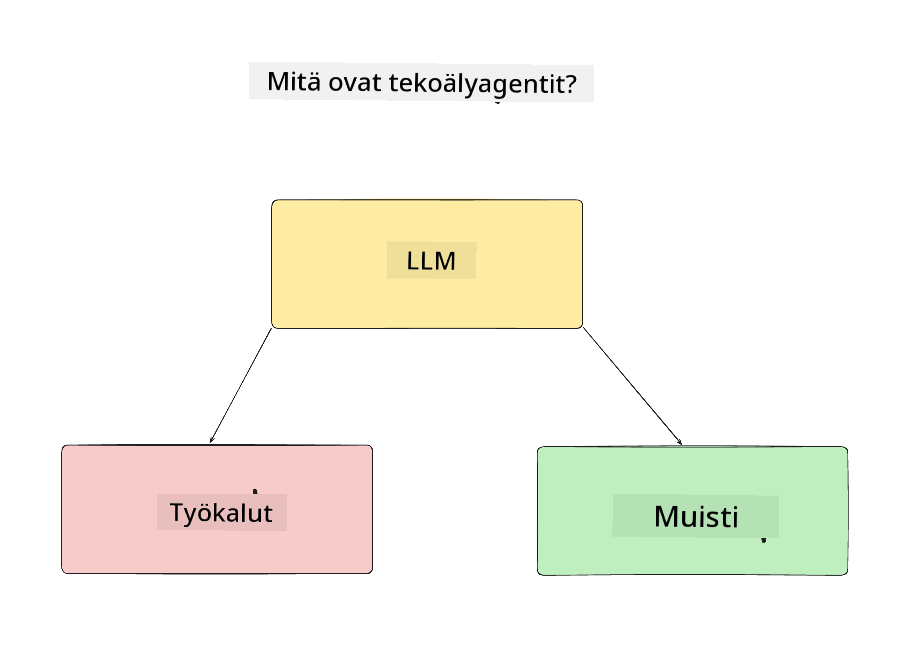
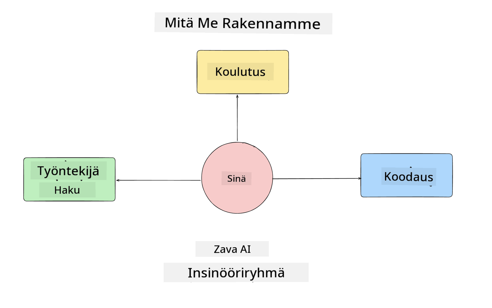
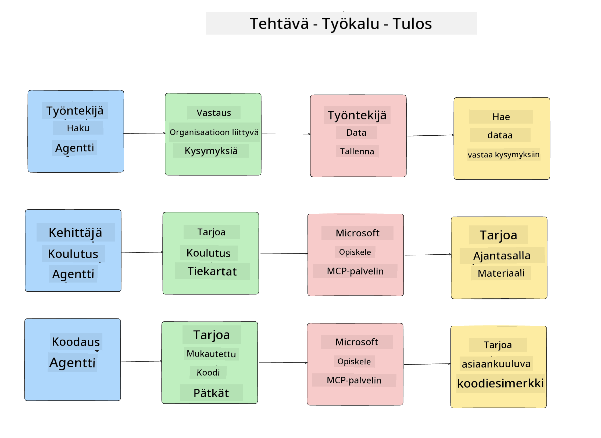
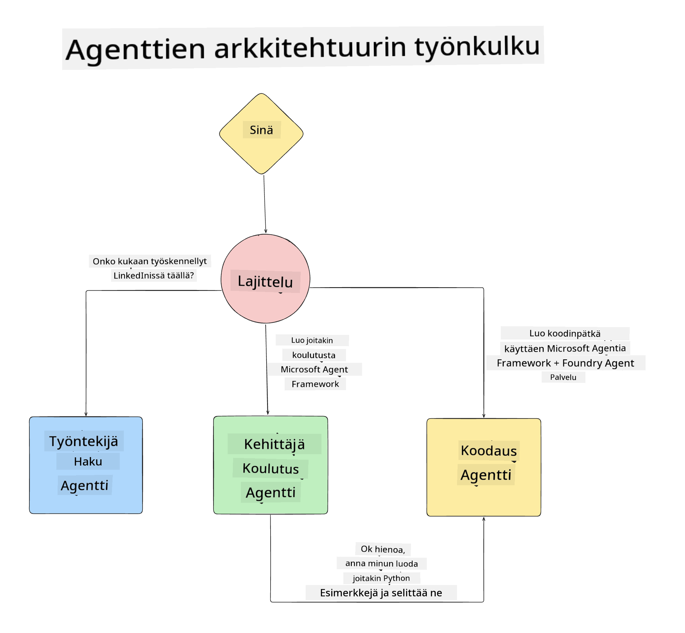

<!--
CO_OP_TRANSLATOR_METADATA:
{
  "original_hash": "99c07849641a850775c188c9333f31e5",
  "translation_date": "2025-12-12T18:32:17+00:00",
  "source_file": "lesson-1-agent-design/README.md",
  "language_code": "fi"
}
-->
# Oppitunti 1: AI-agentin suunnittelu

Tervetuloa "Rakennetaan AI-agentti nollasta tuotantoon" -kurssin ensimmäiseen oppituntiin!

Tässä oppitunnissa käsittelemme:

- Mitä AI-agentit ovat
  
- Keskustelemme rakentamastamme AI-agenttisovelluksesta  

- Tunnistamme kunkin agentin tarvitsemat työkalut ja palvelut
  
- Suunnittelemme agenttisovelluksemme
  
Aloitetaan määrittelemällä, mitä agentti on ja miksi käyttäisimme niitä sovelluksessa.

## Mitä AI-agentit ovat?

Jos tämä on ensimmäinen kerta, kun tutkit, miten AI-agentti rakennetaan, sinulla saattaa olla kysymyksiä siitä, miten AI-agentti tarkalleen määritellään.

Yksinkertainen tapa määritellä AI-agentti on sen osien kautta:

**Suuri kielimalli** – LLM mahdollistaa sekä käyttäjän luonnollisen kielen käsittelyn tehtävän tulkitsemiseksi että käytettävissä olevien työkalujen kuvauksien tulkitsemisen näiden tehtävien suorittamiseksi.

**Työkalut** – Nämä ovat funktioita, API-rajapintoja, tietovarastoja ja muita palveluita, joita LLM voi valita käyttävänsä käyttäjän pyytämien tehtävien suorittamiseen.

**Muisti** – Näin tallennamme sekä lyhyen että pitkän aikavälin vuorovaikutukset AI-agentin ja käyttäjän välillä. Tämän tiedon tallentaminen ja hakeminen on tärkeää parannusten tekemiseksi ja käyttäjäasetusten säilyttämiseksi ajan myötä.

## AI-agenttimme käyttötapaus

Tätä kurssia varten rakennamme AI-agenttisovelluksen, joka auttaa uusia kehittäjiä liittymään AI-agenttikehitystiimiimme!

Ennen kehitystyön aloittamista ensimmäinen askel onnistuneen AI-agenttisovelluksen luomisessa on määritellä selkeät skenaariot siitä, miten odotamme käyttäjiemme työskentelevän AI-agenttiemme kanssa.

Tässä sovelluksessa työskentelemme näiden skenaarioiden parissa:

**Skenaario 1**: Uusi työntekijä liittyy organisaatioomme ja haluaa tietää lisää tiimistä, johon hän liittyi, ja miten ottaa heihin yhteyttä.

**Skenaario 2:** Uusi työntekijä haluaa tietää, mikä olisi paras ensimmäinen tehtävä, johon aloittaa työskentely.

**Skenaario 3:** Uusi työntekijä haluaa kerätä oppimateriaaleja ja koodiesimerkkejä auttaakseen tehtävän suorittamisen aloittamisessa.

## Työkalujen ja palveluiden tunnistaminen

Nyt kun meillä on nämä skenaariot luotu, seuraava askel on kartoittaa ne työkaluihin ja palveluihin, joita AI-agenttimme tarvitsevat näiden tehtävien suorittamiseen.

Tämä prosessi kuuluu kontekstisuunnittelun kategoriaan, sillä keskitymme varmistamaan, että AI-agenttimme saavat oikean kontekstin oikeaan aikaan tehtävien suorittamiseksi.

Tehdään tämä skenaario kerrallaan ja toteutetaan hyvä agenttisuunnittelu listaamalla kunkin agentin tehtävät, työkalut ja toivotut tulokset.

### Skenaario 1 – Työntekijähakija-agentti

**Tehtävä** – Vastaa kysymyksiin organisaation työntekijöistä, kuten liittymispäivästä, nykyisestä tiimistä, sijainnista ja viimeisestä tehtävästä.

**Työkalut** – Nykyisten työntekijöiden tietovarasto ja organisaatiokaavio

**Tulokset** – Pystyy hakemaan tietoa tietovarastosta vastatakseen yleisiin organisaatiokysymyksiin ja työntekijöitä koskeviin tarkkoihin kysymyksiin.

### Skenaario 2 – Tehtäväsuositus-agentti

**Tehtävä** – Uuden työntekijän kehittäjäkokemuksen perusteella ehdottaa 1–3 tehtävää, joihin uusi työntekijä voi ryhtyä.

**Työkalut** – GitHub MCP -palvelin avoimien tehtävien hakemiseen ja kehittäjäprofiilin rakentamiseen

**Tulokset** – Pystyy lukemaan GitHub-profiilin viimeiset 5 committia ja avoimet tehtävät GitHub-projektissa sekä tekemään suosituksia osumien perusteella

### Skenaario 3 – Koodiavustaja-agentti

**Tehtävä** – "Tehtäväsuositus" -agentin ehdottamien avoimien tehtävien perusteella tutkii ja tarjoaa resursseja sekä generoi koodinpätkiä auttaakseen työntekijää.

**Työkalut** – Microsoft Learn MCP resurssien löytämiseen ja Code Interpreter mukautettujen koodinpätkien luomiseen.

**Tulokset** – Jos käyttäjä pyytää lisäapua, työnkulku käyttää Learn MCP -palvelinta tarjotakseen linkkejä ja pätkiä resursseihin ja siirtää sitten tehtävän Code Interpreter -agentille pienten koodinpätkien luomiseksi selityksineen.

## Agenttisovelluksemme arkkitehtuuri

Nyt kun olemme määritelleet jokaisen agenttimme, luodaan arkkitehtuurikaavio, joka auttaa meitä ymmärtämään, miten kukin agentti toimii yhdessä ja erikseen tehtävästä riippuen:

## Seuraavat askeleet

Nyt kun olemme suunnitelleet jokaisen agentin ja agenttijärjestelmämme, siirrytään seuraavaan oppituntiin, jossa kehitämme jokaisen näistä agenteista!

---

<!-- CO-OP TRANSLATOR DISCLAIMER START -->
**Vastuuvapauslauseke**:
Tämä asiakirja on käännetty käyttämällä tekoälypohjaista käännöspalvelua [Co-op Translator](https://github.com/Azure/co-op-translator). Vaikka pyrimme tarkkuuteen, otathan huomioon, että automaattiset käännökset saattavat sisältää virheitä tai epätarkkuuksia. Alkuperäistä asiakirjaa sen alkuperäiskielellä tulee pitää virallisena lähteenä. Tärkeiden tietojen osalta suositellaan ammattimaista ihmiskäännöstä. Emme ole vastuussa tämän käännöksen käytöstä aiheutuvista väärinymmärryksistä tai tulkinnoista.
<!-- CO-OP TRANSLATOR DISCLAIMER END -->