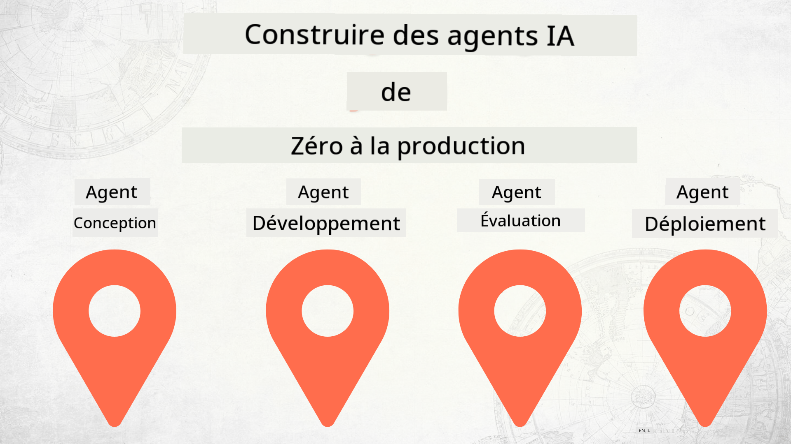

<!--
CO_OP_TRANSLATOR_METADATA:
{
  "original_hash": "03d63bb8bfb7f068db97b3703965a24f",
  "translation_date": "2025-12-17T13:35:05+00:00",
  "source_file": "README.md",
  "language_code": "fr"
}
-->
# Construire des agents IA de zéro à la production

### 🌐 Support multilingue

#### Pris en charge via GitHub Action (Automatisé & Toujours à jour)

<!-- CO-OP TRANSLATOR LANGUAGES TABLE START -->
[Arabic](../ar/README.md) | [Bengali](../bn/README.md) | [Bulgarian](../bg/README.md) | [Burmese (Myanmar)](../my/README.md) | [Chinese (Simplified)](../zh/README.md) | [Chinese (Traditional, Hong Kong)](../hk/README.md) | [Chinese (Traditional, Macau)](../mo/README.md) | [Chinese (Traditional, Taiwan)](../tw/README.md) | [Croatian](../hr/README.md) | [Czech](../cs/README.md) | [Danish](../da/README.md) | [Dutch](../nl/README.md) | [Estonian](../et/README.md) | [Finnish](../fi/README.md) | [French](./README.md) | [German](../de/README.md) | [Greek](../el/README.md) | [Hebrew](../he/README.md) | [Hindi](../hi/README.md) | [Hungarian](../hu/README.md) | [Indonesian](../id/README.md) | [Italian](../it/README.md) | [Japanese](../ja/README.md) | [Kannada](../kn/README.md) | [Korean](../ko/README.md) | [Lithuanian](../lt/README.md) | [Malay](../ms/README.md) | [Malayalam](../ml/README.md) | [Marathi](../mr/README.md) | [Nepali](../ne/README.md) | [Nigerian Pidgin](../pcm/README.md) | [Norwegian](../no/README.md) | [Persian (Farsi)](../fa/README.md) | [Polish](../pl/README.md) | [Portuguese (Brazil)](../br/README.md) | [Portuguese (Portugal)](../pt/README.md) | [Punjabi (Gurmukhi)](../pa/README.md) | [Romanian](../ro/README.md) | [Russian](../ru/README.md) | [Serbian (Cyrillic)](../sr/README.md) | [Slovak](../sk/README.md) | [Slovenian](../sl/README.md) | [Spanish](../es/README.md) | [Swahili](../sw/README.md) | [Swedish](../sv/README.md) | [Tagalog (Filipino)](../tl/README.md) | [Tamil](../ta/README.md) | [Telugu](../te/README.md) | [Thai](../th/README.md) | [Turkish](../tr/README.md) | [Ukrainian](../uk/README.md) | [Urdu](../ur/README.md) | [Vietnamese](../vi/README.md)
<!-- CO-OP TRANSLATOR LANGUAGES TABLE END -->

## Un cours vous enseignant les fondamentaux du cycle de vie du développement d'agents IA

## 🌱 Pour commencer

Ce cours comprend des leçons couvrant les fondamentaux de la création et du déploiement d'agents IA.

Chaque leçon s'appuie sur la précédente, nous recommandons donc de commencer par le début et de progresser jusqu'à la fin.

Si vous souhaitez explorer davantage les sujets liés aux agents IA, vous pouvez consulter le [Cours Agents IA pour Débutants](https://aka.ms/ai-agents-beginners).

### Rencontrez d'autres apprenants, obtenez des réponses à vos questions

Si vous êtes bloqué ou avez des questions sur la création d'agents IA, rejoignez notre canal Discord dédié dans le [Microsoft Foundry Discord](https://discord.gg/Kuaw3ktsu6).

### Ce dont vous avez besoin

Chaque leçon dispose de son propre exemple de code que vous pouvez exécuter localement. Vous pouvez [forker ce dépôt](https://github.com/microsoft/Building-AI-Agents-From-Zero-To-Production/fork) pour créer votre propre copie.

Ce cours utilise actuellement les éléments suivants :

- [Microsoft Agent Framework (MAF)](https://aka.ms/ai-agents-beginners/agent-framework)
- [Microsoft Foundry](https://azure.microsoft.com/products/ai-foundry)
- [Azure OpenAI Service](https://azure.microsoft.com/products/ai-foundry/models/openai)
- [Azure CLI](https://learn.microsoft.com/cli/azure/authenticate-azure-cli?view=azure-cli-latest)

Veuillez vous assurer d'avoir accès à ces services avant de commencer.

Plus d'options autour de l'hébergement de modèles et des services à venir bientôt.

## 🗃️ Leçons

| **Leçon**         | **Description**                                                                                  |
|--------------------|--------------------------------------------------------------------------------------------------|
| [Conception d'agent](./lesson-1-agent-design/README.md)       | Une introduction à notre cas d'utilisation "Intégration des développeurs" et comment concevoir des agents efficaces  |
| [Développement d'agent](./lesson-2-agent-development/README.md)  | En utilisant le Microsoft Agent Framework (MAF), créez 3 agents pour aider les nouveaux développeurs à s'intégrer.       |
| [Évaluations d'agent](./lesson-3-agent-evals/README.md)  | Avec Microsoft Foundry, découvrez les performances de nos agents IA et comment les améliorer. |
| [Déploiement d'agent](./lesson-4-agent-deployment/README.md)   | En utilisant les agents hébergés et OpenAI Chatkit, voyez comment déployer un agent IA en production.       |

## Contribution

Ce projet accueille les contributions et suggestions. La plupart des contributions nécessitent que vous acceptiez un
Accord de Licence de Contributeur (CLA) déclarant que vous avez le droit, et que vous accordez effectivement,
les droits d'utiliser votre contribution. Pour plus de détails, visitez <https://cla.opensource.microsoft.com>.

Lorsque vous soumettez une pull request, un bot CLA déterminera automatiquement si vous devez fournir
un CLA et décorera la PR en conséquence (par exemple, vérification de statut, commentaire). Suivez simplement les instructions
fournies par le bot. Vous n'aurez besoin de le faire qu'une seule fois pour tous les dépôts utilisant notre CLA.

Ce projet a adopté le [Code de conduite Open Source Microsoft](https://opensource.microsoft.com/codeofconduct/).
Pour plus d'informations, consultez la [FAQ du Code de conduite](https://opensource.microsoft.com/codeofconduct/faq/) ou
contactez [opencode@microsoft.com](mailto:opencode@microsoft.com) pour toute question ou commentaire supplémentaire.

## Marques déposées

Ce projet peut contenir des marques ou logos de projets, produits ou services. L'utilisation autorisée des marques ou logos Microsoft
est soumise et doit suivre
[les directives sur les marques et la marque de Microsoft](https://www.microsoft.com/legal/intellectualproperty/trademarks/usage/general).
L'utilisation des marques ou logos Microsoft dans des versions modifiées de ce projet ne doit pas créer de confusion ni impliquer un parrainage Microsoft.
Toute utilisation de marques ou logos tiers est soumise aux politiques de ces tiers.

## Obtenir de l'aide

Si vous êtes bloqué ou avez des questions sur la création d'applications IA, rejoignez :

Si vous avez des retours sur le produit ou des erreurs lors de la création, visitez :

---

<!-- CO-OP TRANSLATOR DISCLAIMER START -->
**Avertissement** :  
Ce document a été traduit à l’aide du service de traduction automatique [Co-op Translator](https://github.com/Azure/co-op-translator). Bien que nous nous efforcions d’assurer l’exactitude, veuillez noter que les traductions automatiques peuvent contenir des erreurs ou des inexactitudes. Le document original dans sa langue d’origine doit être considéré comme la source faisant foi. Pour les informations critiques, une traduction professionnelle réalisée par un humain est recommandée. Nous déclinons toute responsabilité en cas de malentendus ou de mauvaises interprétations résultant de l’utilisation de cette traduction.
<!-- CO-OP TRANSLATOR DISCLAIMER END -->