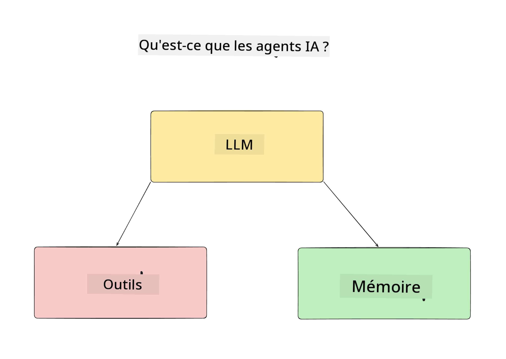
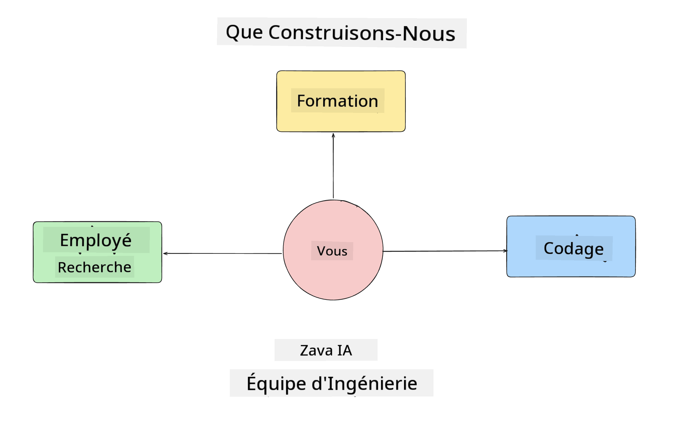
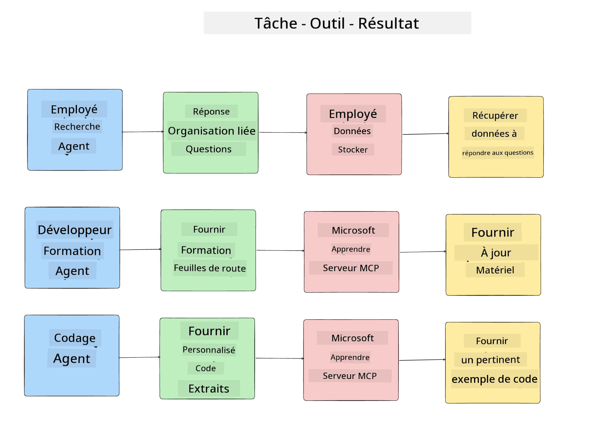
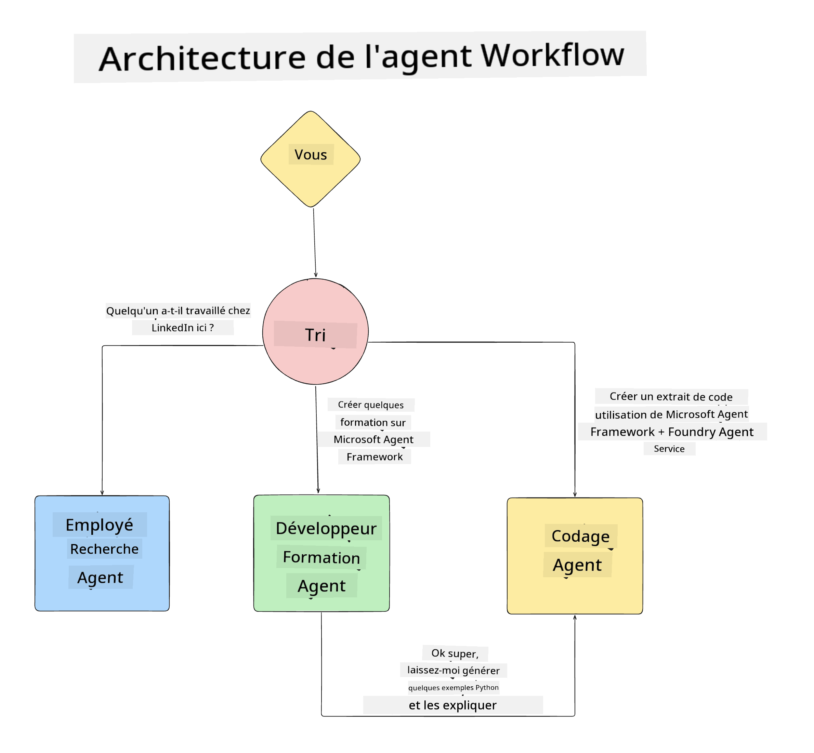

<!--
CO_OP_TRANSLATOR_METADATA:
{
  "original_hash": "99c07849641a850775c188c9333f31e5",
  "translation_date": "2025-12-12T18:14:07+00:00",
  "source_file": "lesson-1-agent-design/README.md",
  "language_code": "fr"
}
-->
# Leçon 1 : Conception d'Agent IA

Bienvenue dans la première leçon du cours "Construire un Agent IA de zéro à la production" !

Dans cette leçon, nous allons couvrir :

- Définir ce que sont les Agents IA
  
- Discuter de l'application Agent IA que nous construisons  

- Identifier les outils et services requis pour chaque agent
  
- Architecturer notre application Agent
  
Commençons par définir ce qu'est un agent et pourquoi nous les utiliserions dans une application.

## Qu'est-ce qu'un Agent IA ?

Si c'est la première fois que vous explorez comment construire un Agent IA, vous pourriez avoir des questions sur la manière de définir exactement ce qu'est un Agent IA.

Une façon simple de définir ce qu'est un Agent IA est par les composants qui le composent :

**Grand Modèle de Langage** - Le LLM alimentera à la fois la capacité à traiter le langage naturel de l'utilisateur pour interpréter la tâche qu'il souhaite accomplir ainsi qu'à interpréter les descriptions des outils disponibles pour accomplir ces tâches.

**Outils** - Ce seront des fonctions, des API, des bases de données et d'autres services que le LLM peut choisir d'utiliser pour accomplir les tâches demandées par l'utilisateur.

**Mémoire** - C'est ainsi que nous stockons à la fois les interactions à court terme et à long terme entre l'Agent IA et l'utilisateur. Stocker et récupérer ces informations est important pour améliorer et sauvegarder les préférences utilisateur au fil du temps.

## Notre Cas d'Usage Agent IA

Pour ce cours, nous allons construire une application Agent IA qui aide les nouveaux développeurs à intégrer notre équipe de développement d'Agents IA !

Avant de faire tout travail de développement, la première étape pour créer une application Agent IA réussie est de définir des scénarios clairs sur la manière dont nous attendons que nos utilisateurs interagissent avec nos Agents IA.

Pour cette application, nous allons travailler avec ces scénarios :

**Scénario 1** : Un nouvel employé rejoint notre organisation et souhaite en savoir plus sur l'équipe qu'il a intégrée et comment se connecter avec elle.

**Scénario 2 :** Un nouvel employé veut savoir quelle serait la meilleure première tâche sur laquelle commencer à travailler.

**Scénario 3 :** Un nouvel employé veut rassembler des ressources d'apprentissage et des exemples de code pour l'aider à commencer à accomplir cette tâche.

## Identification des Outils et Services

Maintenant que nous avons créé ces scénarios, l'étape suivante est de les mapper aux outils et services dont nos agents IA auront besoin pour accomplir ces tâches.

Ce processus relève de l'ingénierie du contexte car nous allons nous concentrer sur le fait de s'assurer que nos Agents IA disposent du bon contexte au bon moment pour accomplir les tâches.

Faisons cela scénario par scénario et réalisons une bonne conception agentique en listant la tâche, les outils et les résultats souhaités de chaque agent.

### Scénario 1 - Agent de Recherche d'Employés

**Tâche** - Répondre aux questions sur les employés de l'organisation telles que la date d'entrée, l'équipe actuelle, le lieu et le dernier poste.

**Outils** - Base de données de la liste actuelle des employés et organigramme

**Résultats** - Capable de récupérer des informations depuis la base de données pour répondre aux questions générales sur l'organisation et aux questions spécifiques sur les employés.

### Scénario 2 - Agent de Recommandation de Tâches

**Tâche** - En fonction de l'expérience développeur du nouvel employé, proposer 1 à 3 problèmes sur lesquels le nouvel employé peut travailler.

**Outils** - Serveur MCP GitHub pour obtenir les issues ouvertes et construire un profil développeur

**Résultats** - Capable de lire les 5 derniers commits d'un profil GitHub et les issues ouvertes sur un projet GitHub et faire des recommandations basées sur une correspondance

### Scénario 3 - Agent Assistant Code

**Tâche** - En fonction des Issues Ouvertes recommandées par l'Agent "Recommandation de Tâches", rechercher et fournir des ressources et générer des extraits de code pour aider l'employé.

**Outils** - Microsoft Learn MCP pour trouver des ressources et Code Interpreter pour générer des extraits de code personnalisés.

**Résultats** - Si l'utilisateur demande une aide supplémentaire, le workflow doit utiliser le serveur Learn MCP pour fournir des liens et extraits vers des ressources puis passer la main à l'agent Code Interpreter pour générer de petits extraits de code avec des explications.

## Architecture de notre Application Agent

Maintenant que nous avons défini chacun de nos Agents, créons un diagramme d'architecture qui nous aidera à comprendre comment chaque agent va travailler ensemble et séparément selon la tâche :

## Prochaines Étapes

Maintenant que nous avons conçu chaque agent et notre système agentique, passons à la leçon suivante où nous allons développer chacun de ces agents !

---

<!-- CO-OP TRANSLATOR DISCLAIMER START -->
**Avertissement** :  
Ce document a été traduit à l’aide du service de traduction automatique [Co-op Translator](https://github.com/Azure/co-op-translator). Bien que nous nous efforcions d’assurer l’exactitude, veuillez noter que les traductions automatiques peuvent contenir des erreurs ou des inexactitudes. Le document original dans sa langue d’origine doit être considéré comme la source faisant foi. Pour les informations critiques, une traduction professionnelle réalisée par un humain est recommandée. Nous déclinons toute responsabilité en cas de malentendus ou de mauvaises interprétations résultant de l’utilisation de cette traduction.
<!-- CO-OP TRANSLATOR DISCLAIMER END -->