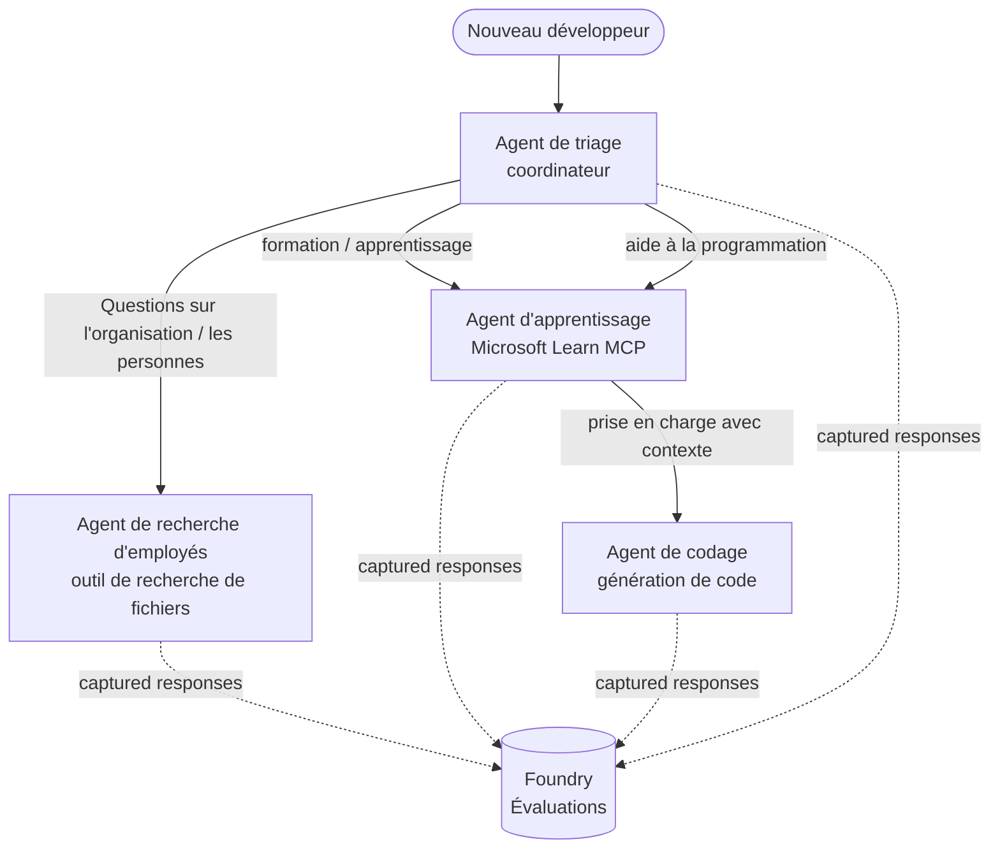

# Leçon 3 : Évaluations d’agents avec Microsoft Foundry

Bienvenue à la troisième leçon du cours **« Construire des agents IA de zéro à la production »** !

Dans la [Leçon 2](../lesson-2-agent-development/README.md), vous avez construit des agents. Dans cette leçon, vous
apprendrez à répondre à une question beaucoup plus difficile : **sont-ils bons ?** Livrer un agent qui
fonctionne est facile ; savoir s’il oriente correctement, reste ancré dans vos données et utilise bien ses
outils est ce qui distingue une démo d’un système en production.

Dans cette leçon, nous couvrirons :

- Pourquoi l’évaluation des agents est importante et en quoi elle diffère des tests traditionnels
- La différence entre **observabilité**, **tests sommaires** et **évaluations**
- Le flux de travail multi-agent que nous allons mesurer
- Les **évaluateurs** intégrés de Microsoft Foundry (pertinence, ancrage, précision des appels d’outil, utilisation des résultats d’outil)
- Un guide étape par étape de la chaîne d’évaluation dans [`agent-evals.py`](../../../lesson-3-agent-evals/agent-evals.py)
- Comment l’exécuter et lire les résultats

---

## Pourquoi évaluer les agents ?

Un test unitaire traditionnel affirme que `add(2, 2) == 4`. Les agents ne fonctionnent pas de cette façon — la même
requête peut produire des formulations différentes à chaque exécution, les outils peuvent être appelés dans différents ordres, et
le « correct » est souvent une question de degré plutôt que booléenne. Vous ne pouvez pas vérifier des chaînes exactes.

Au lieu de cela, vous évaluez les agents selon des **dimensions de qualité** en utilisant des *évaluateurs* basés sur le modèle (aussi
appelés « LLM-comme-juge ») plus des vérifications déterministes sur l’usage des outils. Cela vous indique des choses comme :

- La réponse a-t-elle réellement répondu à la question ? (**pertinence**)
- La réponse est-elle étayée par les données récupérées, ou l’agent a-t-il halluciné ? (**ancrage**)
- L’agent a-t-il appelé le bon outil avec les bons arguments ? (**précision des appels d’outil**)
- L’agent a-t-il réellement utilisé ce que l’outil a retourné ? (**utilisation des résultats d’outil**)

### Trois couches de qualité complémentaires

Ce ne sont pas des techniques concurrentes — un agent en production utilise les trois :

| Couche | Question qu’elle répond | Coût | Quand ça s’exécute | Couvert dans |
|-------|-----------------------|-------|--------------------|-------------|
| **Observabilité / traçage** | *Que fait l’agent, étape par étape ?* | Gratuit (toujours activé) | En continu en prod | Cette leçon |
| **Tests sommaires** | *L’agent est-il joignable et suit-il sa requête de base ?* | Peu coûteux, quelques secondes | À chaque déploiement | [Leçon 4](../lesson-4-agentdeployment/README.md#smoke-testing-the-hosted-agent-ci-gate) |
| **Évaluations** | *Quelle est la **qualité** des réponses ?* | Plus lent, facturé à l’usage du modèle | À la demande / la nuit / avant une publication | Cette leçon |

Les tests sommaires répondent à « est-ce que ça a planté ? » ; les évaluations à « est-ce que c’est bon ? ». Vous voulez les deux.

---

## Prérequis

1. Avoir terminé la [Leçon 2](../lesson-2-agent-development/README.md) (agents + magasin vectoriel).
2. Un projet **Microsoft Foundry**.
3. **Azure CLI** authentifié : `az login`.
4. **Python 3.12+** et les dépendances du cours installées :

   ```bash
   pip install -r ../requirements.txt
   ```


5. Variables d'environnement (créez un fichier `.env` dans ce dossier ou exportez-les) :

   | Variable | Objectif |
   |----------|---------|
   | `FOUNDRY_PROJECT_ENDPOINT` | Votre point de terminaison de projet Foundry (`https://<account>.services.ai.azure.com/api/projects/<project>`). Lu par le `FoundryChatClient` des agents **et** l'assistant d'évaluation. |
   | `FOUNDRY_MODEL` | Déploiement de modèle sur lequel les **agents** s'exécutent (par exemple `gpt-5.1`). |
   | `VECTOR_STORE_ID` | Le magasin vectoriel du répertoire des employés créé dans la Leçon 2 |
   | `AZURE_AI_MODEL_DEPLOYMENT_NAME` | Déploiement de modèle utilisé **par les évaluateurs** (par défaut `FOUNDRY_MODEL`, puis `gpt-5.1`) |

> Les agents utilisent `FoundryChatClient`, qui lit la configuration à partir des variables préfixées `FOUNDRY_`
> (`FOUNDRY_PROJECT_ENDPOINT`, `FOUNDRY_MODEL`). L'assistant d'évaluation dans le cloud
> utilise le SDK `azure-ai-projects` et revient à `FOUNDRY_PROJECT_ENDPOINT` si
> `AZURE_AI_PROJECT_ENDPOINT` n'est pas défini — donc les deux variables `FOUNDRY_` suffisent pour
> exécuter toute la leçon.
>
> Les évaluateurs sont eux-mêmes propulsés par un modèle, donc `AZURE_AI_MODEL_DEPLOYMENT_NAME`
> contrôle quel déploiement effectue l'évaluation — il n'a pas besoin d'être le même modèle que celui
> utilisé par vos agents.

---

## Le flux de travail que nous évaluons

Pour évaluer quelque chose, vous devez d'abord l'exécuter. Cette leçon réutilise le flux de travail multi-agent **Developer Onboarding** : un coordinateur de **triage** passe la main à trois spécialistes.




Le flux de travail est construit avec l'orchestration de **transfert** du Microsoft Agent Framework. L'idée clé pour l'évaluation est que **chaque tour d'agent est conservé côté serveur** et identifié par un
`response_id`. Ces ID sont ce que nous remettons au service d'évaluation.


---

## Le pipeline d'évaluation, étape par étape

[`agent-evals.py`](../../../lesson-3-agent-evals/agent-evals.py) implémente un pipeline en six étapes. Voici ce que fait chaque étape
et pourquoi.

### Étape 1 — Exécuter le flux de travail et suivre les ID de réponse

Le flux de travail est exécuté avec `run_stream(...)`, et au fur et à mesure que les événements reviennent en flux, le code enregistre le
`response_id` et le `conversation_id` produits par chaque agent. Les réponses conservées sont le matériel brut
pour l'évaluation — vous notez des réponses *réelles* en production, pas des réponses régénérées.


### Étape 2 — Résumer ce qui a été capturé

Un résumé rapide affiche combien de réponses chaque agent a produit, pour que vous puissiez confirmer que le flux de travail a effectivement mis en action les agents que vous souhaitez noter.


### Étape 3 — Récupérer les réponses finales

Pour chaque agent, le dernier `response_id` est récupéré via le client compatible OpenAI du projet (`project_client.get_openai_client().responses.retrieve(...)`) afin que vous puissiez prévisualiser le
texte qui sera jugé.


### Étape 4 — Créer l'évaluation

Une évaluation est créée avec quatre **évaluateurs Foundry intégrés** :

| Évaluateur | `evaluator_name` | Ce qu'il mesure |
|-----------|------------------|------------------|

| Pertinence | `builtin.relevance` | La réponse correspond-elle à la demande de l'utilisateur ? |

| Fondement | `builtin.groundedness` | La réponse est-elle soutenue par les données récupérées/outils (et non hallucinée) ? |
| Précision de l'appel d'outil | `builtin.tool_call_accuracy` | Les bons outils ont-ils été appelés avec les bons arguments ? |
| Utilisation de la sortie de l'outil | `builtin.tool_output_utilization` | L'agent a-t-il réellement utilisé les résultats de l'outil dans sa réponse ? |

Chaque évaluateur est initialisé avec le déploiement nommé par `AZURE_AI_MODEL_DEPLOYMENT_NAME`.

> **Pourquoi ces quatre ?** La pertinence et le fondement mesurent la *qualité de la réponse* ; les deux
> évaluateurs d'outils mesurent le *comportement agentique* — la partie que les métriques NLP
> traditionnelles manquent entièrement. Pour un système multi-agent utilisant des outils,


Les `response_id` capturés sont transmis à `evals.runs.create(...)` comme source de données. Le


Le code interroge l’exécution jusqu’à ce qu’elle soit `completed` ou `failed`, puis affiche le nombre de résultats et une
**`report_url`** — un lien profond vers le portail Foundry où vous pouvez inspecter les scores par métrique,


```bash
cd lesson-3-agent-evals
python agent-evals.py
```

Par défaut, il évalue la première requête exemple
(`"Je suis nouveau ici ! Quelqu’un a-t-il déjà travaillé chez Microsoft ici ?"`) Deux autres requêtes exemple multi-intention
sont incluses dans `run_evaluation_workflow()` — échangez la variable `query` pour essayer des scénarios de routage


```
Step 1: Running Developer Onboarding Workflow
Step 2: Response Data Summary
Step 3: Fetching Agent Responses
Step 4: Creating Evaluation
Step 5: Running Evaluation
Step 6: Monitoring Evaluation
  Status: running ...
  Evaluation completed successfully
  Report URL: https://...   <-- open this in the Foundry portal
```


Les évaluations vous disent *à quel point* les réponses étaient bonnes ; **l’observabilité** vous dit *ce qui s’est passé*
pour les produire — chaque saut d’agent, appel d’outil, compte de tokens et latence. Dans Microsoft Foundry,
les exécutions d’agents émettent des traces OpenTelemetry que vous pouvez consulter dans le portail, et le Framework Agent peut


```python
from agent_framework.foundry import FoundryChatClient

client = FoundryChatClient()
client.configure_azure_monitor()   # exporter les traces + métriques vers Application Insights
```

Utilisez le traçage pour **déboguer** un mauvais score d’évaluation : quand la fondation baisse, la trace vous montre
si l’outil de recherche de fichier n’a rien retourné, ou bien s’il a retourné des données que l’agent a ensuite ignorées (ce que


- **Portail pré-version.** Exécutez des évaluations contre un ensemble fixe de requêtes représentatives avant
  de promouvoir un nouveau prompt ou modèle. Comparez les scores avec la version précédente — considérez une baisse comme une
  régression.
- **Signal de qualité nocturne.** Planifiez l’évaluation pour détecter la dérive des données ou des dépendances.
- **Associez avec des tests de fumée.** Le [test de fumée de la Leçon 4](../lesson-4-agentdeployment/README.md#smoke-testing-the-hosted-agent-ci-gate)
  est votre portail rapide par déploiement ; les évaluations sont le portail de qualité plus lent et plus approfondi. Lancez le test
  léger à chaque fusion et le test coûteux selon un calendrier ou avant la publication.

---

## Note de modernisation

Cet exemple est en cours de migration vers l’API actuelle du Microsoft Agent Framework Foundry
(`agent_framework.foundry`). Si vous mettez à jour le code, consultez la racine du dépôt

[`MIGRATION-GUIDE.md`](../MIGRATION-GUIDE.md) pour l'importation vérifiée avant/après et les correspondances client
(par exemple `AzureAIClient` -> `FoundryChatClient`, et la construction de l'outil hébergé via
`client.get_file_search_tool(...)` / `client.get_mcp_tool(...)`). Les concepts d'évaluation et
la pipeline en six étapes ci-dessus restent inchangés par cette migration.

---

## Ressources

- [Évaluer les modèles et applications d'IA générative (Microsoft Learn)](https://learn.microsoft.com/en-us/azure/ai-foundry/concepts/evaluation-approach-gen-ai)
- [Évaluateurs intégrés pour l'IA générative](https://learn.microsoft.com/en-us/azure/ai-foundry/concepts/evaluation-evaluators/agent-evaluators)
- [Observabilité dans Microsoft Foundry](https://learn.microsoft.com/en-us/azure/ai-foundry/concepts/observability)
- [Microsoft Agent Framework](https://github.com/microsoft/agent-framework)
- [Orchestration du passage de relais entre agents](https://learn.microsoft.com/en-us/agent-framework/workflows/orchestrations/handoff)

---

<!-- CO-OP TRANSLATOR DISCLAIMER START -->
**Avertissement** :
Ce document a été traduit à l'aide du service de traduction automatique [Co-op Translator](https://github.com/Azure/co-op-translator). Bien que nous nous efforçions d'assurer l'exactitude, veuillez noter que les traductions automatisées peuvent contenir des erreurs ou des inexactitudes. Le document original dans sa langue native doit être considéré comme la source faisant autorité. Pour les informations critiques, il est recommandé de recourir à une traduction professionnelle réalisée par un humain. Nous ne saurions être tenus responsables des malentendus ou erreurs d'interprétation découlant de l'utilisation de cette traduction.
<!-- CO-OP TRANSLATOR DISCLAIMER END -->