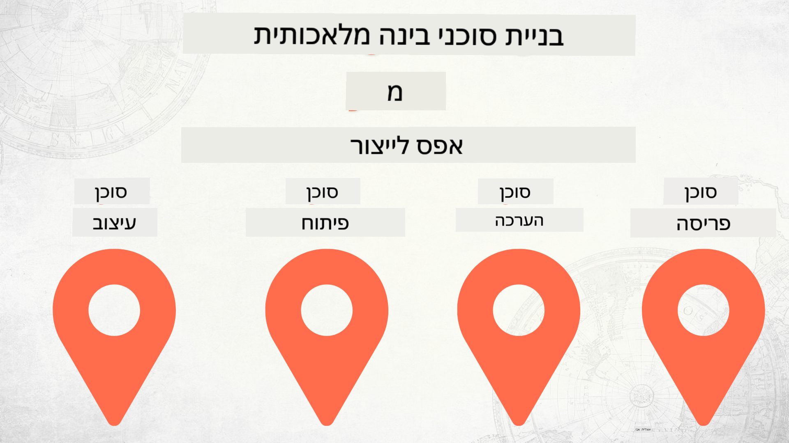

<!--
CO_OP_TRANSLATOR_METADATA:
{
  "original_hash": "84eb09fa4e48cff3f63a5dc64f8efab7",
  "translation_date": "2025-12-17T11:49:08+00:00",
  "source_file": "README.md",
  "language_code": "he"
}
-->
# בניית סוכני בינה מלאכותית מאפס ועד הפקה

### 🌐 תמיכה בריבוי שפות

#### נתמך באמצעות GitHub Action (אוטומטי ותמיד מעודכן)

<!-- CO-OP TRANSLATOR LANGUAGES TABLE START -->
[Arabic](../ar/README.md) | [Bengali](../bn/README.md) | [Bulgarian](../bg/README.md) | [Burmese (Myanmar)](../my/README.md) | [Chinese (Simplified)](../zh/README.md) | [Chinese (Traditional, Hong Kong)](../hk/README.md) | [Chinese (Traditional, Macau)](../mo/README.md) | [Chinese (Traditional, Taiwan)](../tw/README.md) | [Croatian](../hr/README.md) | [Czech](../cs/README.md) | [Danish](../da/README.md) | [Dutch](../nl/README.md) | [Estonian](../et/README.md) | [Finnish](../fi/README.md) | [French](../fr/README.md) | [German](../de/README.md) | [Greek](../el/README.md) | [Hebrew](./README.md) | [Hindi](../hi/README.md) | [Hungarian](../hu/README.md) | [Indonesian](../id/README.md) | [Italian](../it/README.md) | [Japanese](../ja/README.md) | [Kannada](../kn/README.md) | [Korean](../ko/README.md) | [Lithuanian](../lt/README.md) | [Malay](../ms/README.md) | [Malayalam](../ml/README.md) | [Marathi](../mr/README.md) | [Nepali](../ne/README.md) | [Nigerian Pidgin](../pcm/README.md) | [Norwegian](../no/README.md) | [Persian (Farsi)](../fa/README.md) | [Polish](../pl/README.md) | [Portuguese (Brazil)](../br/README.md) | [Portuguese (Portugal)](../pt/README.md) | [Punjabi (Gurmukhi)](../pa/README.md) | [Romanian](../ro/README.md) | [Russian](../ru/README.md) | [Serbian (Cyrillic)](../sr/README.md) | [Slovak](../sk/README.md) | [Slovenian](../sl/README.md) | [Spanish](../es/README.md) | [Swahili](../sw/README.md) | [Swedish](../sv/README.md) | [Tagalog (Filipino)](../tl/README.md) | [Tamil](../ta/README.md) | [Telugu](../te/README.md) | [Thai](../th/README.md) | [Turkish](../tr/README.md) | [Ukrainian](../uk/README.md) | [Urdu](../ur/README.md) | [Vietnamese](../vi/README.md)
<!-- CO-OP TRANSLATOR LANGUAGES TABLE END -->

## קורס המלמד את יסודות מחזור חיי פיתוח סוכני בינה מלאכותית

## 🌱 התחלה

קורס זה כולל שיעורים המכסים את יסודות בניית והפצת סוכני בינה מלאכותית.

כל שיעור בונה על השיעור הקודם, לכן מומלץ להתחיל מההתחלה ולהתקדם עד הסוף.

אם ברצונך לחקור עוד נושאים הקשורים לסוכני בינה מלאכותית, תוכל לבדוק את [קורס סוכני בינה מלאכותית למתחילים](https://aka.ms/ai-agents-beginners).

### פגוש לומדים אחרים, קבל מענה לשאלותיך

אם נתקעת או יש לך שאלות לגבי בניית סוכני בינה מלאכותית, הצטרף לערוץ ה-Discord הייעודי שלנו ב-[Microsoft Foundry Discord](https://discord.gg/Kuaw3ktsu6).

### מה אתה צריך

לכל שיעור יש דוגמת קוד משלו שניתן להריץ מקומית. תוכל [לשכפל את המאגר הזה](https://github.com/microsoft/Building-AI-Agents-From-Zero-To-Production/fork) כדי ליצור עותק משלך.

קורס זה משתמש כרגע ב:

- [מסגרת סוכנים של מיקרוסופט (MAF)](https://aka.ms/ai-agents-beginners/agent-framework)
- [Microsoft Foundry](https://azure.microsoft.com/products/ai-foundry)
- [שירות Azure OpenAI](https://azure.microsoft.com/products/ai-foundry/models/openai)
- [Azure CLI](https://learn.microsoft.com/cli/azure/authenticate-azure-cli?view=azure-cli-latest)

אנא ודא שיש לך גישה לשירותים אלה לפני ההתחלה.

אפשרויות נוספות לאירוח מודלים ושירותים יגיעו בקרוב.

## 🗃️ שיעורים

| **שיעור**         | **תיאור**                                                                                  |
|--------------------|--------------------------------------------------------------------------------------------------|
| [עיצוב סוכן](./lesson-1-agent-design/README.md)       | מבוא למקרה השימוש "הכנסת מפתחים" של הסוכן שלנו ואיך לעצב סוכנים יעילים  |
| [פיתוח סוכן](./lesson-2-agent-development/README.md)  | שימוש במסגרת סוכנים של מיקרוסופט (MAF), יצירת 3 סוכנים שיעזרו למפתחים חדשים להיכנס למערכת.       |
| [הערכות סוכן](./lesson-3-agent-evals/README.md)  | שימוש ב-Microsoft Foundry, לגלות עד כמה הסוכנים שלנו מתפקדים ואיך לשפר אותם. |
| [הפצת סוכן](./lesson-4-agent-deployment/README.md)   | שימוש בסוכנים מאוחסנים ו-OpenAI Chatkit, לראות איך לפרוס סוכן בינה מלאכותית לייצור.       |

## תרומה

פרויקט זה מקבל בברכה תרומות והצעות. רוב התרומות דורשות שתסכים להסכם רישיון תורם (CLA) המצהיר שיש לך את הזכות, ושאתה אכן מעניק לנו את הזכויות להשתמש בתרומתך. לפרטים, בקר בכתובת <https://cla.opensource.microsoft.com>.

כאשר אתה מגיש בקשת משיכה, בוט CLA יקבע אוטומטית אם עליך לספק CLA ויעטר את בקשת המשיכה בהתאם (למשל, בדיקת סטטוס, תגובה). פשוט עקוב אחר ההוראות שמספק הבוט. תצטרך לעשות זאת רק פעם אחת בכל המאגרי הקוד שמשתמשים ב-CLA שלנו.

פרויקט זה אימץ את [קוד ההתנהגות של מיקרוסופט בקוד פתוח](https://opensource.microsoft.com/codeofconduct/).
למידע נוסף ראה את [שאלות נפוצות על קוד ההתנהגות](https://opensource.microsoft.com/codeofconduct/faq/) או צור קשר ב-[opencode@microsoft.com](mailto:opencode@microsoft.com) עם שאלות או הערות נוספות.

## סימני מסחר

פרויקט זה עשוי להכיל סימני מסחר או לוגואים של פרויקטים, מוצרים או שירותים. שימוש מורשה בסימני המסחר או בלוגואים של מיקרוסופט כפוף וצריך לעקוב אחר [הנחיות סימני המסחר והמותג של מיקרוסופט](https://www.microsoft.com/legal/intellectualproperty/trademarks/usage/general).
שימוש בסימני המסחר או בלוגואים של מיקרוסופט בגרסאות מותאמות של פרויקט זה אסור שיגרום לבלבול או יביע חסות של מיקרוסופט.
כל שימוש בסימני מסחר או לוגואים של צד שלישי כפוף למדיניות של אותם צדדים שלישיים.

## קבלת עזרה

אם נתקעת או יש לך שאלות לגבי בניית אפליקציות בינה מלאכותית, הצטרף:

אם יש לך משוב על המוצר או שגיאות בזמן הבנייה, בקר ב:

---

<!-- CO-OP TRANSLATOR DISCLAIMER START -->
**כתב ויתור**:  
מסמך זה תורגם באמצעות שירות תרגום מבוסס בינה מלאכותית [Co-op Translator](https://github.com/Azure/co-op-translator). למרות שאנו שואפים לדיוק, יש לקחת בחשבון כי תרגומים אוטומטיים עלולים להכיל שגיאות או אי-דיוקים. המסמך המקורי בשפת המקור שלו נחשב למקור הסמכותי. למידע קריטי מומלץ להשתמש בתרגום מקצועי על ידי אדם. אנו לא נושאים באחריות לכל אי-הבנה או פרשנות שגויה הנובעת משימוש בתרגום זה.
<!-- CO-OP TRANSLATOR DISCLAIMER END -->