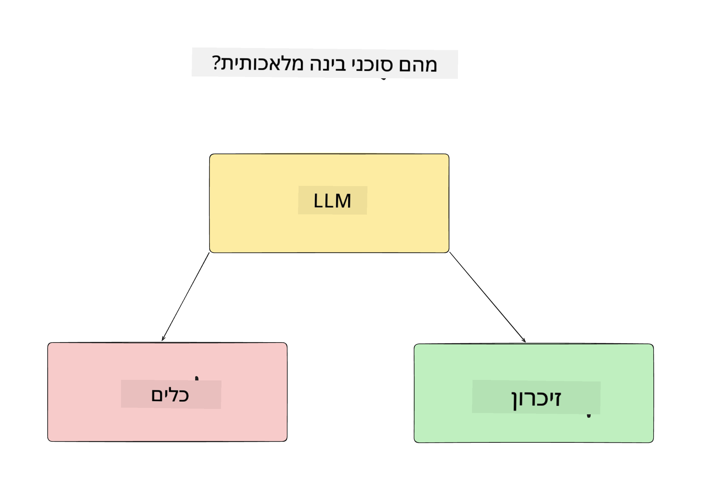
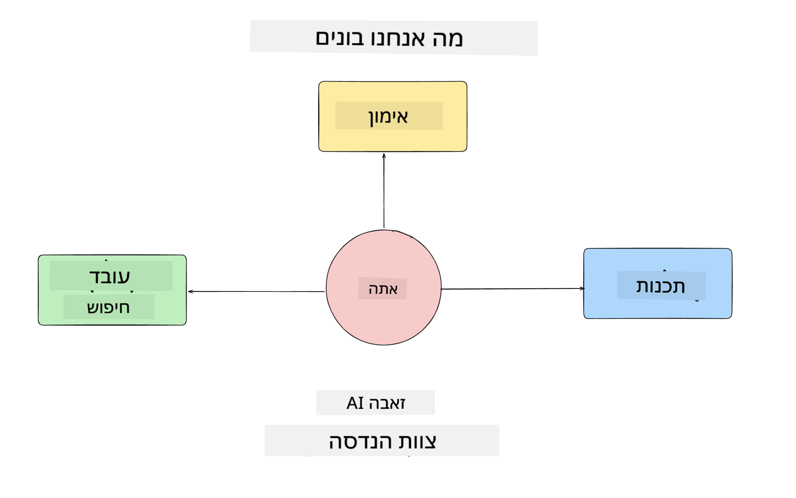
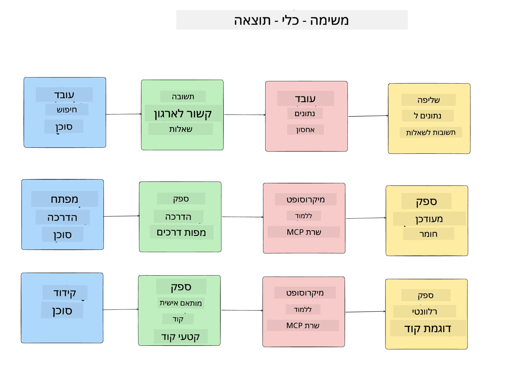
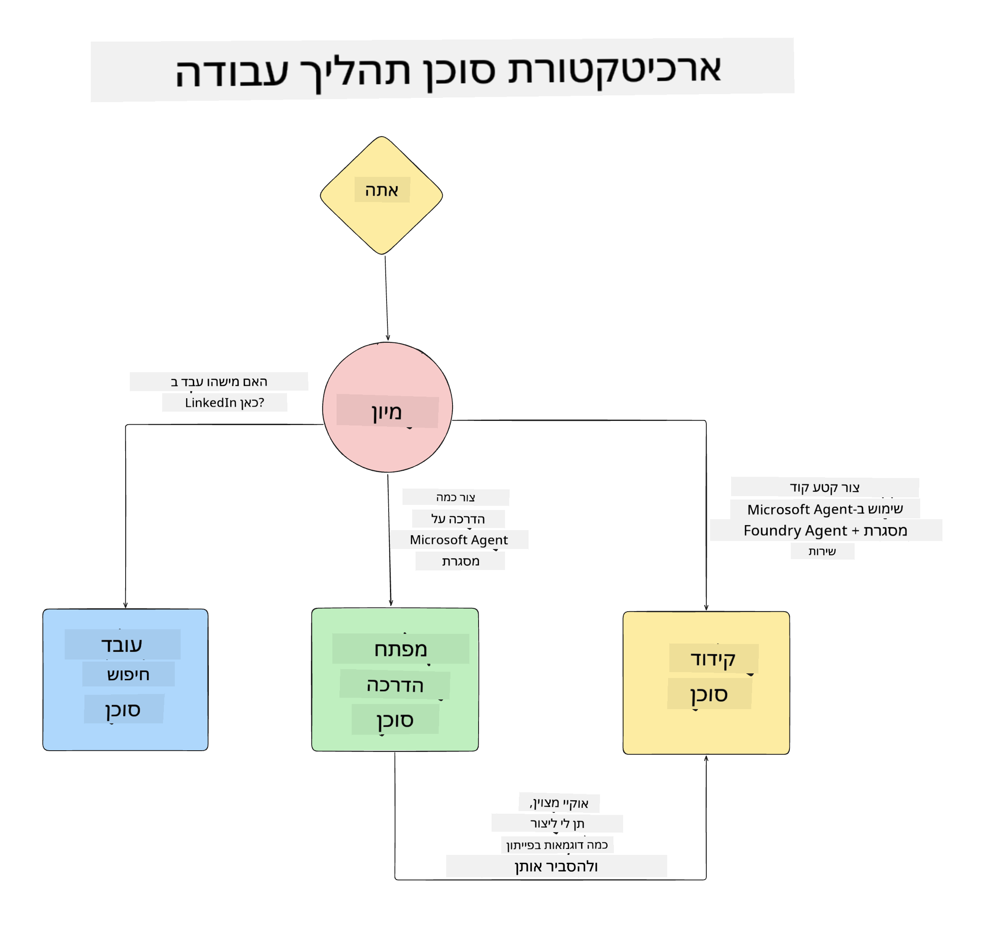

<!--
CO_OP_TRANSLATOR_METADATA:
{
  "original_hash": "99c07849641a850775c188c9333f31e5",
  "translation_date": "2025-12-12T18:33:27+00:00",
  "source_file": "lesson-1-agent-design/README.md",
  "language_code": "he"
}
-->
# שיעור 1: עיצוב סוכן בינה מלאכותית

ברוכים הבאים לשיעור הראשון בקורס "בניית סוכן בינה מלאכותית מאפס ועד הפקה"!

בשיעור זה נכסה:

- הגדרת מה הם סוכני בינה מלאכותית
  
- דיון באפליקציית סוכן הבינה המלאכותית שאנו בונים  

- זיהוי הכלים והשירותים הנדרשים לכל סוכן
  
- תכנון האפליקציה שלנו לסוכן
  
נתחיל בהגדרת מהו סוכן ולמה נשתמש בהם בתוך אפליקציה.

## מה הם סוכני בינה מלאכותית?

אם זו הפעם הראשונה שלך לחקור כיצד לבנות סוכן בינה מלאכותית, ייתכן שיש לך שאלות כיצד להגדיר בדיוק מהו סוכן בינה מלאכותית.

דרך פשוטה להגדיר מהו סוכן בינה מלאכותית היא לפי הרכיבים שמרכיבים אותו:

**מודל שפה גדול** - ה-LLM יאפשר גם את היכולת לעבד שפה טבעית מהמשתמש כדי לפרש את המשימה שהם רוצים להשלים וגם לפרש את התיאורים של הכלים הזמינים להשלמת המשימות.

**כלים** - אלה יהיו פונקציות, APIs, מאגרי נתונים ושירותים אחרים שה-LLM יכול לבחור להשתמש בהם כדי להשלים את המשימות שהמשתמש ביקש.

**זיכרון** - כך אנו מאחסנים אינטראקציות קצרות וארוכות טווח בין סוכן הבינה המלאכותית למשתמש. אחסון ושליפת מידע זה חשובים לשיפור ולשמירת העדפות המשתמש לאורך זמן.

## מקרה השימוש של סוכן הבינה שלנו

לקורס זה, אנו הולכים לבנות אפליקציית סוכן בינה מלאכותית שעוזרת למפתחים חדשים להצטרף לצוות הפיתוח של סוכני הבינה שלנו!

לפני שנבצע כל עבודה פיתוחית, הצעד הראשון ליצירת אפליקציית סוכן בינה מלאכותית מוצלחת הוא להגדיר תרחישים ברורים כיצד אנו מצפים שהמשתמשים שלנו יעבדו עם סוכני הבינה שלנו.

לאפליקציה זו, נעבוד עם התרחישים הבאים:

**תרחיש 1**: עובד חדש מצטרף לארגון שלנו ורוצה לדעת יותר על הצוות אליו הצטרף ואיך להתחבר איתם.

**תרחיש 2:** עובד חדש רוצה לדעת מה תהיה המשימה הראשונה הטובה ביותר עבורו להתחיל לעבוד עליה.

**תרחיש 3:** עובד חדש רוצה לאסוף משאבי למידה ודוגמאות קוד שיעזרו לו להתחיל להשלים את המשימה הזו.

## זיהוי הכלים והשירותים

כעת כשיש לנו את התרחישים האלה, השלב הבא הוא למפות אותם לכלים ולשירותים שסוכני הבינה שלנו יצטרכו כדי להשלים את המשימות.

תהליך זה נופל תחת קטגוריית הנדסת הקשר (Context Engineering) כאשר נתמקד לוודא שסוכני הבינה שלנו יש את ההקשר הנכון בזמן הנכון כדי להשלים את המשימות.

בואו נעשה זאת תרחיש אחר תרחיש ונבצע עיצוב סוכני טוב על ידי רישום המשימה, הכלים והתוצאות הרצויות של כל סוכן.

### תרחיש 1 - סוכן חיפוש עובדים

**משימה** - לענות על שאלות לגבי עובדים בארגון כגון תאריך הצטרפות, צוות נוכחי, מיקום ותפקיד אחרון.

**כלים** - מאגר נתונים של רשימת עובדים נוכחית וארגון הצוותים

**תוצאות** - יכולת לשלוף מידע ממאגר הנתונים כדי לענות על שאלות כלליות ארגוניות ושאלות ספציפיות על עובדים.

### תרחיש 2 - סוכן המלצות משימות

**משימה** - בהתבסס על ניסיון הפיתוח של העובד החדש, להציע 1-3 נושאים שהעובד החדש יכול לעבוד עליהם.

**כלים** - שרת MCP של GitHub לקבלת נושאים פתוחים ולבניית פרופיל מפתח

**תוצאות** - יכולת לקרוא את 5 הקומיטים האחרונים של פרופיל GitHub ונושאים פתוחים בפרויקט GitHub ולהציע המלצות בהתבסס על התאמה

### תרחיש 3 - סוכן עוזר קוד

**משימה** - בהתבסס על הנושאים הפתוחים שהומלצו על ידי סוכן "המלצות משימות", לחקור ולספק משאבים וליצור קטעי קוד שיעזרו לעובד.

**כלים** - Microsoft Learn MCP למציאת משאבים ו-Code Interpreter ליצירת קטעי קוד מותאמים.

**תוצאות** - אם המשתמש מבקש עזרה נוספת, תהליך העבודה ישתמש בשרת Learn MCP כדי לספק קישורים וקטעי קוד למשאבים ואז יעביר לסוכן Code Interpreter ליצירת קטעי קוד קטנים עם הסברים.

## תכנון האפליקציה שלנו לסוכן

כעת שהגדרנו כל אחד מהסוכנים שלנו, בואו ניצור דיאגרמת ארכיטקטורה שתעזור לנו להבין כיצד כל סוכן יעבוד יחד ובנפרד בהתאם למשימה:

## הצעדים הבאים

כעת שעיצבנו כל סוכן ואת המערכת הסוכנית שלנו, בואו נעבור לשיעור הבא שבו נפתח כל אחד מהסוכנים האלה!

---

<!-- CO-OP TRANSLATOR DISCLAIMER START -->
**כתב ויתור**:  
מסמך זה תורגם באמצעות שירות תרגום מבוסס בינה מלאכותית [Co-op Translator](https://github.com/Azure/co-op-translator). למרות שאנו שואפים לדיוק, יש לקחת בחשבון כי תרגומים אוטומטיים עלולים להכיל שגיאות או אי-דיוקים. המסמך המקורי בשפת המקור שלו נחשב למקור הסמכותי. למידע קריטי מומלץ להשתמש בתרגום מקצועי על ידי אדם. אנו לא נושאים באחריות לכל אי-הבנה או פרשנות שגויה הנובעת משימוש בתרגום זה.
<!-- CO-OP TRANSLATOR DISCLAIMER END -->