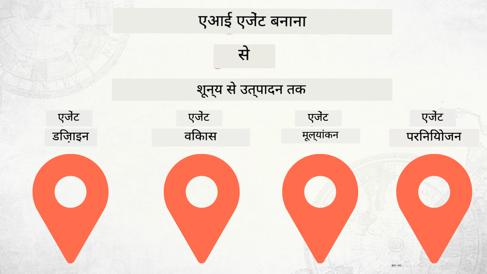

<!--
CO_OP_TRANSLATOR_METADATA:
{
  "original_hash": "03d63bb8bfb7f068db97b3703965a24f",
  "translation_date": "2025-12-17T13:44:42+00:00",
  "source_file": "README.md",
  "language_code": "hi"
}
-->
# शून्य से उत्पादन तक AI एजेंट बनाना

### 🌐 बहुभाषी समर्थन

#### GitHub Action के माध्यम से समर्थित (स्वचालित और हमेशा अद्यतित)

<!-- CO-OP TRANSLATOR LANGUAGES TABLE START -->
[Arabic](../ar/README.md) | [Bengali](../bn/README.md) | [Bulgarian](../bg/README.md) | [Burmese (Myanmar)](../my/README.md) | [Chinese (Simplified)](../zh/README.md) | [Chinese (Traditional, Hong Kong)](../hk/README.md) | [Chinese (Traditional, Macau)](../mo/README.md) | [Chinese (Traditional, Taiwan)](../tw/README.md) | [Croatian](../hr/README.md) | [Czech](../cs/README.md) | [Danish](../da/README.md) | [Dutch](../nl/README.md) | [Estonian](../et/README.md) | [Finnish](../fi/README.md) | [French](../fr/README.md) | [German](../de/README.md) | [Greek](../el/README.md) | [Hebrew](../he/README.md) | [Hindi](./README.md) | [Hungarian](../hu/README.md) | [Indonesian](../id/README.md) | [Italian](../it/README.md) | [Japanese](../ja/README.md) | [Kannada](../kn/README.md) | [Korean](../ko/README.md) | [Lithuanian](../lt/README.md) | [Malay](../ms/README.md) | [Malayalam](../ml/README.md) | [Marathi](../mr/README.md) | [Nepali](../ne/README.md) | [Nigerian Pidgin](../pcm/README.md) | [Norwegian](../no/README.md) | [Persian (Farsi)](../fa/README.md) | [Polish](../pl/README.md) | [Portuguese (Brazil)](../br/README.md) | [Portuguese (Portugal)](../pt/README.md) | [Punjabi (Gurmukhi)](../pa/README.md) | [Romanian](../ro/README.md) | [Russian](../ru/README.md) | [Serbian (Cyrillic)](../sr/README.md) | [Slovak](../sk/README.md) | [Slovenian](../sl/README.md) | [Spanish](../es/README.md) | [Swahili](../sw/README.md) | [Swedish](../sv/README.md) | [Tagalog (Filipino)](../tl/README.md) | [Tamil](../ta/README.md) | [Telugu](../te/README.md) | [Thai](../th/README.md) | [Turkish](../tr/README.md) | [Ukrainian](../uk/README.md) | [Urdu](../ur/README.md) | [Vietnamese](../vi/README.md)
<!-- CO-OP TRANSLATOR LANGUAGES TABLE END -->

## AI एजेंट विकास जीवनचक्र के मूल सिद्धांत सिखाने वाला एक कोर्स

## 🌱 शुरुआत करना

यह कोर्स AI एजेंट बनाने और तैनात करने के मूल सिद्धांतों को कवर करता है।

प्रत्येक पाठ पिछले पाठ पर आधारित है, इसलिए हम सुझाव देते हैं कि आप शुरुआत से शुरू करें और अंत तक काम करें।

यदि आप AI एजेंट विषयों के बारे में और जानना चाहते हैं, तो आप [AI एजेंट्स फॉर बिगिनर्स कोर्स](https://aka.ms/ai-agents-beginners) देख सकते हैं।

### अन्य शिक्षार्थियों से मिलें, अपने प्रश्नों के उत्तर पाएं

यदि आप फंस जाते हैं या AI एजेंट बनाने के बारे में कोई प्रश्न है, तो हमारे समर्पित Discord चैनल में शामिल हों [Microsoft Foundry Discord](https://discord.gg/Kuaw3ktsu6)।

### आपको क्या चाहिए

प्रत्येक पाठ के पास अपना कोड नमूना होता है जिसे आप स्थानीय रूप से चला सकते हैं। आप [इस रिपो को फोर्क](https://github.com/microsoft/Building-AI-Agents-From-Zero-To-Production/fork) करके अपनी कॉपी बना सकते हैं।

यह कोर्स वर्तमान में निम्नलिखित का उपयोग करता है:

- [Microsoft Agent Framework (MAF)](https://aka.ms/ai-agents-beginners/agent-framework)
- [Microsoft Foundry](https://azure.microsoft.com/products/ai-foundry)
- [Azure OpenAI Service](https://azure.microsoft.com/products/ai-foundry/models/openai)
- [Azure CLI](https://learn.microsoft.com/cli/azure/authenticate-azure-cli?view=azure-cli-latest)

कृपया शुरू करने से पहले सुनिश्चित करें कि आपके पास इन सेवाओं तक पहुंच है।

मॉडल होस्टिंग और सेवाओं के आसपास और विकल्प जल्द ही आ रहे हैं।

## 🗃️ पाठ

| **पाठ**         | **विवरण**                                                                                  |
|--------------------|--------------------------------------------------------------------------------------------------|
| [एजेंट डिज़ाइन](./lesson-1-agent-design/README.md)       | हमारे "डेवलपर ऑनबोर्डिंग" एजेंट उपयोग केस का परिचय और प्रभावी एजेंट कैसे डिज़ाइन करें          |
| [एजेंट विकास](./lesson-2-agent-development/README.md)  | Microsoft Agent Framework (MAF) का उपयोग करके, नए डेवलपर्स की मदद के लिए 3 एजेंट बनाएं।       |
| [एजेंट मूल्यांकन](./lesson-3-agent-evals/README.md)  | Microsoft Foundry का उपयोग करके, जानें कि हमारे AI एजेंट कितने प्रभावी हैं और उन्हें कैसे सुधारें। |
| [एजेंट तैनाती](./lesson-4-agent-deployment/README.md)   | Hosted Agents और OpenAI Chatkit का उपयोग करके, AI एजेंट को उत्पादन में कैसे तैनात करें।       |

## योगदान

यह परियोजना योगदान और सुझावों का स्वागत करती है। अधिकांश योगदानों के लिए आपको एक
Contributor License Agreement (CLA) पर सहमति देनी होगी जिसमें आप घोषणा करते हैं कि आपके पास
अपने योगदान का उपयोग करने के अधिकार हैं। विवरण के लिए देखें <https://cla.opensource.microsoft.com>।

जब आप पुल अनुरोध सबमिट करते हैं, तो एक CLA बॉट स्वचालित रूप से निर्धारित करेगा कि क्या आपको
CLA प्रदान करने की आवश्यकता है और PR को उपयुक्त रूप से सजाएगा (जैसे, स्थिति जांच, टिप्पणी)। बस बॉट द्वारा दिए गए निर्देशों का पालन करें। आपको यह केवल एक बार करना होगा।

इस परियोजना ने [Microsoft Open Source Code of Conduct](https://opensource.microsoft.com/codeofconduct/) को अपनाया है।
अधिक जानकारी के लिए देखें [Code of Conduct FAQ](https://opensource.microsoft.com/codeofconduct/faq/) या
[opencode@microsoft.com](mailto:opencode@microsoft.com) पर संपर्क करें।

## ट्रेडमार्क

इस परियोजना में परियोजनाओं, उत्पादों, या सेवाओं के ट्रेडमार्क या लोगो हो सकते हैं। Microsoft
ट्रेडमार्क या लोगो का अधिकृत उपयोग [Microsoft के ट्रेडमार्क और ब्रांड दिशानिर्देशों](https://www.microsoft.com/legal/intellectualproperty/trademarks/usage/general) के अधीन है।
Microsoft ट्रेडमार्क या लोगो का इस परियोजना के संशोधित संस्करणों में उपयोग भ्रमित करने वाला नहीं होना चाहिए या Microsoft प्रायोजन का संकेत नहीं देना चाहिए।
किसी भी तृतीय-पक्ष ट्रेडमार्क या लोगो का उपयोग उन तृतीय-पक्ष की नीतियों के अधीन है।

## सहायता प्राप्त करना

यदि आप फंस जाते हैं या AI ऐप बनाने के बारे में कोई प्रश्न है, तो शामिल हों:

यदि आपके पास उत्पाद प्रतिक्रिया या निर्माण के दौरान त्रुटियां हैं, तो जाएं:

---

<!-- CO-OP TRANSLATOR DISCLAIMER START -->
**अस्वीकरण**:  
इस दस्तावेज़ का अनुवाद AI अनुवाद सेवा [Co-op Translator](https://github.com/Azure/co-op-translator) का उपयोग करके किया गया है। जबकि हम सटीकता के लिए प्रयासरत हैं, कृपया ध्यान दें कि स्वचालित अनुवादों में त्रुटियाँ या अशुद्धियाँ हो सकती हैं। मूल दस्तावेज़ अपनी मूल भाषा में ही अधिकारिक स्रोत माना जाना चाहिए। महत्वपूर्ण जानकारी के लिए, पेशेवर मानव अनुवाद की सलाह दी जाती है। इस अनुवाद के उपयोग से उत्पन्न किसी भी गलतफहमी या गलत व्याख्या के लिए हम जिम्मेदार नहीं हैं।
<!-- CO-OP TRANSLATOR DISCLAIMER END -->