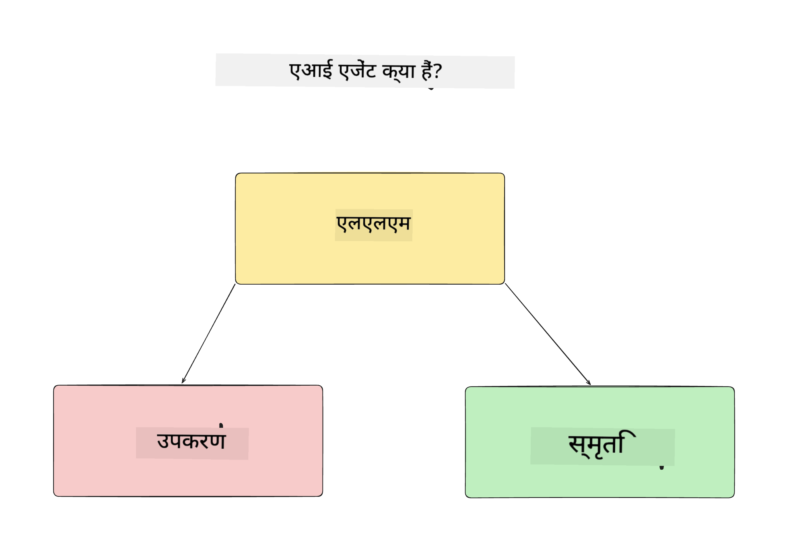
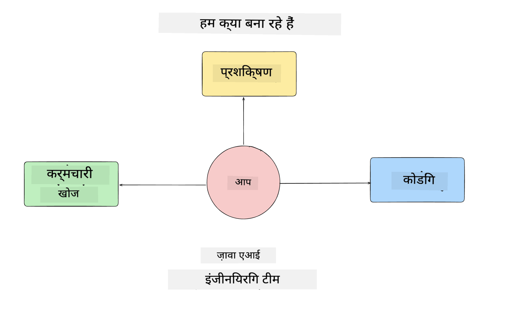
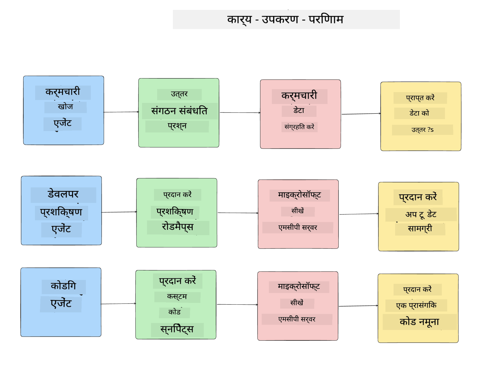
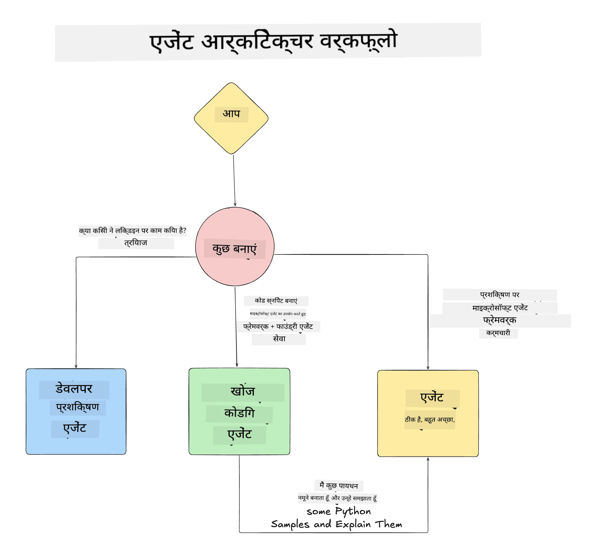

<!--
CO_OP_TRANSLATOR_METADATA:
{
  "original_hash": "99c07849641a850775c188c9333f31e5",
  "translation_date": "2025-12-12T18:21:42+00:00",
  "source_file": "lesson-1-agent-design/README.md",
  "language_code": "hi"
}
-->
# पाठ 1: एआई एजेंट डिज़ाइन

"शून्य से उत्पादन तक एआई एजेंट बनाने का कोर्स" के पहले पाठ में आपका स्वागत है!

इस पाठ में हम निम्नलिखित विषयों को कवर करेंगे:

- एआई एजेंट क्या होते हैं, इसे परिभाषित करना
  
- हम जो एआई एजेंट एप्लिकेशन बना रहे हैं, उस पर चर्चा करना  

- प्रत्येक एजेंट के लिए आवश्यक उपकरण और सेवाओं की पहचान करना
  
- हमारे एजेंट एप्लिकेशन का आर्किटेक्चर बनाना
  
आइए पहले यह परिभाषित करें कि एजेंट क्या होते हैं और हम उन्हें किसी एप्लिकेशन के अंदर क्यों उपयोग करेंगे।

## एआई एजेंट क्या हैं?

यदि यह आपका पहला अनुभव है कि आप कैसे एक एआई एजेंट बनाते हैं, तो आपके मन में यह सवाल हो सकता है कि एआई एजेंट को ठीक से कैसे परिभाषित किया जाए।

एक सरल तरीके से, एआई एजेंट को उसके घटकों के आधार पर परिभाषित किया जा सकता है:

**लार्ज लैंग्वेज मॉडल** - LLM उपयोगकर्ता की प्राकृतिक भाषा को संसाधित करने की क्षमता प्रदान करेगा ताकि वे जो कार्य पूरा करना चाहते हैं उसे समझ सके, साथ ही उन टूल्स के विवरणों को भी समझ सके जो उन कार्यों को पूरा करने के लिए उपलब्ध हैं।

**टूल्स** - ये फंक्शंस, APIs, डेटा स्टोर्स और अन्य सेवाएं होंगी जिन्हें LLM उपयोगकर्ता द्वारा अनुरोधित कार्यों को पूरा करने के लिए चुन सकता है।

**मेमोरी** - यह वह तरीका है जिससे हम एआई एजेंट और उपयोगकर्ता के बीच की अल्पकालिक और दीर्घकालिक बातचीत को संग्रहीत करते हैं। इस जानकारी को संग्रहित और पुनः प्राप्त करना सुधार करने और समय के साथ उपयोगकर्ता की प्राथमिकताओं को सहेजने के लिए महत्वपूर्ण है।

## हमारा एआई एजेंट उपयोग मामला

इस कोर्स के लिए, हम एक एआई एजेंट एप्लिकेशन बनाएंगे जो नए डेवलपर्स को हमारे एआई एजेंट विकास टीम में शामिल होने में मदद करता है!

कोई भी विकास कार्य करने से पहले, एक सफल एआई एजेंट एप्लिकेशन बनाने का पहला कदम यह है कि हम स्पष्ट परिदृश्यों को परिभाषित करें कि हम अपने उपयोगकर्ताओं से हमारे एआई एजेंट्स के साथ कैसे काम करने की उम्मीद करते हैं।

इस एप्लिकेशन के लिए, हम इन परिदृश्यों पर काम करेंगे:

**परिदृश्य 1**: एक नया कर्मचारी हमारे संगठन में शामिल होता है और वह टीम के बारे में अधिक जानना चाहता है जिसमें वह शामिल हुआ है और उनसे कैसे जुड़ना है।

**परिदृश्य 2:** एक नया कर्मचारी जानना चाहता है कि उसके लिए सबसे अच्छा पहला कार्य क्या होगा जिस पर वह काम शुरू कर सकता है।

**परिदृश्य 3:** एक नया कर्मचारी सीखने के संसाधन और कोड नमूने इकट्ठा करना चाहता है ताकि वह इस कार्य को पूरा करने में मदद पा सके।

## उपकरण और सेवाओं की पहचान

अब जब हमारे पास ये परिदृश्य तैयार हैं, अगला कदम उन्हें उन उपकरणों और सेवाओं से जोड़ना है जिनकी हमारी एआई एजेंट्स को इन कार्यों को पूरा करने के लिए आवश्यकता होगी।

यह प्रक्रिया संदर्भ इंजीनियरिंग की श्रेणी में आती है क्योंकि हम यह सुनिश्चित करने पर ध्यान केंद्रित करेंगे कि हमारे एआई एजेंट्स के पास सही समय पर सही संदर्भ हो ताकि वे कार्यों को पूरा कर सकें।

आइए इसे परिदृश्य दर परिदृश्य करें और प्रत्येक एजेंट के कार्य, उपकरण और वांछित परिणामों की सूची बनाकर अच्छा एजेंटिक डिज़ाइन करें।

### परिदृश्य 1 - कर्मचारी खोज एजेंट

**कार्य** - संगठन में कर्मचारियों के बारे में प्रश्नों का उत्तर देना जैसे शामिल होने की तारीख, वर्तमान टीम, स्थान और अंतिम पद।

**उपकरण** - वर्तमान कर्मचारी सूची और संगठन चार्ट का डेटा स्टोर

**परिणाम** - सामान्य संगठनात्मक प्रश्नों और कर्मचारियों के बारे में विशिष्ट प्रश्नों का उत्तर देने के लिए डेटा स्टोर से जानकारी पुनः प्राप्त करने में सक्षम।

### परिदृश्य 2 - कार्य सिफारिश एजेंट

**कार्य** - नए कर्मचारी के डेवलपर अनुभव के आधार पर, 1-3 मुद्दे सुझाना जिन पर नया कर्मचारी काम कर सकता है।

**उपकरण** - GitHub MCP सर्वर से खुले मुद्दे प्राप्त करना और डेवलपर प्रोफ़ाइल बनाना

**परिणाम** - GitHub प्रोफ़ाइल के अंतिम 5 कमिट पढ़ने और GitHub प्रोजेक्ट पर खुले मुद्दों को पढ़ने में सक्षम होना और मेल के आधार पर सिफारिशें करना

### परिदृश्य 3 - कोड सहायक एजेंट

**कार्य** - "कार्य सिफारिश" एजेंट द्वारा सुझाए गए खुले मुद्दों के आधार पर, संसाधनों का शोध करना और कर्मचारी की मदद के लिए कोड स्निपेट्स उत्पन्न करना।

**उपकरण** - Microsoft Learn MCP संसाधन खोजने के लिए और कोड इंटरप्रेटर कस्टम कोड स्निपेट्स उत्पन्न करने के लिए।

**परिणाम** - यदि उपयोगकर्ता अतिरिक्त सहायता मांगता है, तो वर्कफ़्लो Learn MCP सर्वर का उपयोग संसाधनों के लिंक और स्निपेट्स प्रदान करने के लिए करेगा और फिर कोड इंटरप्रेटर एजेंट को छोटे कोड स्निपेट्स व्याख्याओं के साथ उत्पन्न करने के लिए सौंप देगा।

## हमारे एजेंट एप्लिकेशन का आर्किटेक्चर

अब जब हमने प्रत्येक एजेंट को परिभाषित कर लिया है, आइए एक आर्किटेक्चर डायग्राम बनाएं जो हमें समझने में मदद करेगा कि प्रत्येक एजेंट कार्य के आधार पर एक साथ और अलग-अलग कैसे काम करेगा:

## अगले कदम

अब जब हमने प्रत्येक एजेंट और हमारे एजेंटिक सिस्टम को डिज़ाइन कर लिया है, तो आइए अगले पाठ पर चलते हैं जहाँ हम इन प्रत्येक एजेंट्स का विकास करेंगे!

---

<!-- CO-OP TRANSLATOR DISCLAIMER START -->
**अस्वीकरण**:  
यह दस्तावेज़ AI अनुवाद सेवा [Co-op Translator](https://github.com/Azure/co-op-translator) का उपयोग करके अनुवादित किया गया है। जबकि हम सटीकता के लिए प्रयासरत हैं, कृपया ध्यान दें कि स्वचालित अनुवादों में त्रुटियाँ या अशुद्धियाँ हो सकती हैं। मूल दस्तावेज़ अपनी मूल भाषा में ही अधिकारिक स्रोत माना जाना चाहिए। महत्वपूर्ण जानकारी के लिए, पेशेवर मानव अनुवाद की सलाह दी जाती है। इस अनुवाद के उपयोग से उत्पन्न किसी भी गलतफहमी या गलत व्याख्या के लिए हम जिम्मेदार नहीं हैं।
<!-- CO-OP TRANSLATOR DISCLAIMER END -->