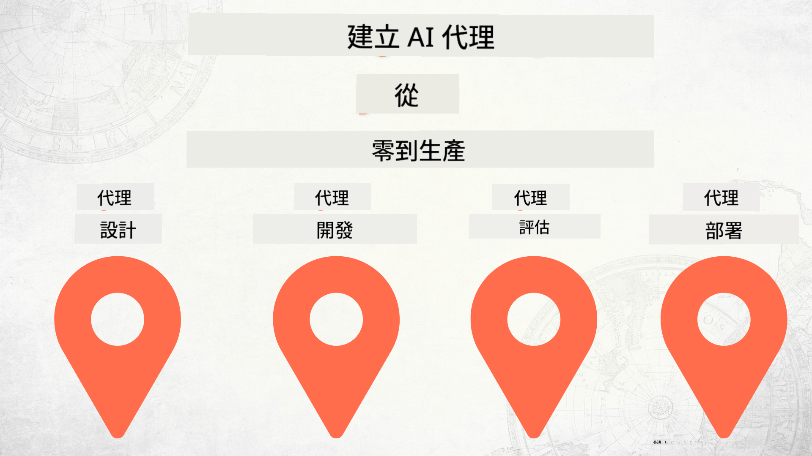

<!--
CO_OP_TRANSLATOR_METADATA:
{
  "original_hash": "03d63bb8bfb7f068db97b3703965a24f",
  "translation_date": "2025-12-17T13:42:22+00:00",
  "source_file": "README.md",
  "language_code": "hk"
}
-->
# 從零開始構建 AI 代理到生產

### 🌐 多語言支援

#### 透過 GitHub Action 支援（自動且始終保持最新）

<!-- CO-OP TRANSLATOR LANGUAGES TABLE START -->
[阿拉伯語](../ar/README.md) | [孟加拉語](../bn/README.md) | [保加利亞語](../bg/README.md) | [緬甸語 (緬甸)](../my/README.md) | [中文 (簡體)](../zh/README.md) | [中文 (繁體，香港)](./README.md) | [中文 (繁體，澳門)](../mo/README.md) | [中文 (繁體，台灣)](../tw/README.md) | [克羅地亞語](../hr/README.md) | [捷克語](../cs/README.md) | [丹麥語](../da/README.md) | [荷蘭語](../nl/README.md) | [愛沙尼亞語](../et/README.md) | [芬蘭語](../fi/README.md) | [法語](../fr/README.md) | [德語](../de/README.md) | [希臘語](../el/README.md) | [希伯來語](../he/README.md) | [印地語](../hi/README.md) | [匈牙利語](../hu/README.md) | [印尼語](../id/README.md) | [義大利語](../it/README.md) | [日語](../ja/README.md) | [坎納達語](../kn/README.md) | [韓語](../ko/README.md) | [立陶宛語](../lt/README.md) | [馬來語](../ms/README.md) | [馬拉雅拉姆語](../ml/README.md) | [馬拉地語](../mr/README.md) | [尼泊爾語](../ne/README.md) | [奈及利亞皮欽語](../pcm/README.md) | [挪威語](../no/README.md) | [波斯語 (法爾西語)](../fa/README.md) | [波蘭語](../pl/README.md) | [葡萄牙語 (巴西)](../br/README.md) | [葡萄牙語 (葡萄牙)](../pt/README.md) | [旁遮普語 (古魯穆奇)](../pa/README.md) | [羅馬尼亞語](../ro/README.md) | [俄語](../ru/README.md) | [塞爾維亞語 (西里爾字母)](../sr/README.md) | [斯洛伐克語](../sk/README.md) | [斯洛文尼亞語](../sl/README.md) | [西班牙語](../es/README.md) | [斯瓦希里語](../sw/README.md) | [瑞典語](../sv/README.md) | [他加祿語 (菲律賓語)](../tl/README.md) | [泰米爾語](../ta/README.md) | [泰盧固語](../te/README.md) | [泰語](../th/README.md) | [土耳其語](../tr/README.md) | [烏克蘭語](../uk/README.md) | [烏爾都語](../ur/README.md) | [越南語](../vi/README.md)
<!-- CO-OP TRANSLATOR LANGUAGES TABLE END -->

## 一門教授 AI 代理開發生命週期基礎的課程

## 🌱 開始使用

本課程涵蓋構建和部署 AI 代理的基礎知識。

每個課程都建立在前一課的基礎上，因此建議從頭開始，逐步完成。

如果你想進一步探索 AI 代理主題，可以查看 [AI 代理初學者課程](https://aka.ms/ai-agents-beginners)。

### 認識其他學習者，獲得問題解答

如果你遇到困難或對構建 AI 代理有任何疑問，歡迎加入我們在 [Microsoft Foundry Discord](https://discord.gg/Kuaw3ktsu6) 的專屬 Discord 頻道。

### 你需要準備的東西

每個課程都有自己的程式碼範例，你可以在本地運行。你可以 [fork 此倉庫](https://github.com/microsoft/Building-AI-Agents-From-Zero-To-Production/fork) 來建立自己的副本。

本課程目前使用以下資源：

- [Microsoft Agent Framework (MAF)](https://aka.ms/ai-agents-beginners/agent-framework)
- [Microsoft Foundry](https://azure.microsoft.com/products/ai-foundry)
- [Azure OpenAI 服務](https://azure.microsoft.com/products/ai-foundry/models/openai)
- [Azure CLI](https://learn.microsoft.com/cli/azure/authenticate-azure-cli?view=azure-cli-latest)

請確保你在開始前已能使用這些服務。

更多關於模型託管和服務的選項即將推出。

## 🗃️ 課程列表

| **課程**         | **說明**                                                                                  |
|------------------|-------------------------------------------------------------------------------------------|
| [代理設計](./lesson-1-agent-design/README.md)       | 介紹我們的「開發者入門」代理使用案例及如何設計有效的代理                                  |
| [代理開發](./lesson-2-agent-development/README.md)  | 使用 Microsoft Agent Framework (MAF)，建立三個代理協助新開發者入門                        |
| [代理評估](./lesson-3-agent-evals/README.md)        | 使用 Microsoft Foundry，了解我們的 AI 代理表現如何及如何改進                              |
| [代理部署](./lesson-4-agent-deployment/README.md)   | 使用託管代理和 OpenAI Chatkit，了解如何將 AI 代理部署到生產環境                            |

## 貢獻

本專案歡迎貢獻和建議。大多數貢獻需要你同意一份
貢獻者授權協議 (CLA)，聲明你有權利且確實授權我們使用你的貢獻。詳情請參閱 <https://cla.opensource.microsoft.com>。

當你提交拉取請求時，CLA 機器人會自動判斷你是否需要提供 CLA，並適當標註 PR（例如狀態檢查、評論）。只需按照機器人提供的指示操作即可。你只需在所有使用我們 CLA 的倉庫中執行一次。

本專案已採用 [Microsoft 開源行為準則](https://opensource.microsoft.com/codeofconduct/)。
更多資訊請參閱 [行為準則常見問題](https://opensource.microsoft.com/codeofconduct/faq/) 或
聯絡 [opencode@microsoft.com](mailto:opencode@microsoft.com) 提出任何額外問題或意見。

## 商標

本專案可能包含專案、產品或服務的商標或標誌。授權使用 Microsoft
商標或標誌須遵守並遵循
[Microsoft 商標與品牌指南](https://www.microsoft.com/legal/intellectualproperty/trademarks/usage/general)。
在本專案的修改版本中使用 Microsoft 商標或標誌不得造成混淆或暗示 Microsoft 贊助。
任何第三方商標或標誌的使用均須遵守該第三方的政策。

## 尋求協助

如果你遇到困難或對構建 AI 應用有任何疑問，歡迎加入：

如果你有產品反饋或在構建過程中遇到錯誤，請訪問：

---

<!-- CO-OP TRANSLATOR DISCLAIMER START -->
**免責聲明**：  
本文件由 AI 翻譯服務 [Co-op Translator](https://github.com/Azure/co-op-translator) 進行翻譯。雖然我們致力於確保準確性，但請注意自動翻譯可能包含錯誤或不準確之處。原始文件的母語版本應被視為權威來源。對於重要資訊，建議採用專業人工翻譯。我們不對因使用本翻譯而引起的任何誤解或誤釋承擔責任。
<!-- CO-OP TRANSLATOR DISCLAIMER END -->