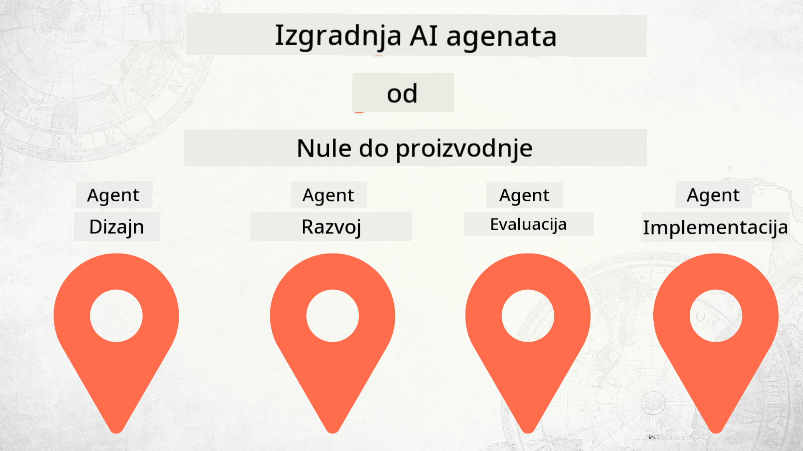

<!--
CO_OP_TRANSLATOR_METADATA:
{
  "original_hash": "df86a71d9a4a65d134d60f783a2aba86",
  "translation_date": "2025-12-18T14:43:10+00:00",
  "source_file": "README.md",
  "language_code": "hr"
}
-->
# Izgradnja AI agenata od nule do produkcije

### 🌐 Podrška za više jezika

#### Podržano putem GitHub akcije (Automatski i uvijek ažurirano)

<!-- CO-OP TRANSLATOR LANGUAGES TABLE START -->
[Arabic](../ar/README.md) | [Bengali](../bn/README.md) | [Bulgarian](../bg/README.md) | [Burmese (Myanmar)](../my/README.md) | [Chinese (Simplified)](../zh/README.md) | [Chinese (Traditional, Hong Kong)](../hk/README.md) | [Chinese (Traditional, Macau)](../mo/README.md) | [Chinese (Traditional, Taiwan)](../tw/README.md) | [Croatian](./README.md) | [Czech](../cs/README.md) | [Danish](../da/README.md) | [Dutch](../nl/README.md) | [Estonian](../et/README.md) | [Finnish](../fi/README.md) | [French](../fr/README.md) | [German](../de/README.md) | [Greek](../el/README.md) | [Hebrew](../he/README.md) | [Hindi](../hi/README.md) | [Hungarian](../hu/README.md) | [Indonesian](../id/README.md) | [Italian](../it/README.md) | [Japanese](../ja/README.md) | [Kannada](../kn/README.md) | [Korean](../ko/README.md) | [Lithuanian](../lt/README.md) | [Malay](../ms/README.md) | [Malayalam](../ml/README.md) | [Marathi](../mr/README.md) | [Nepali](../ne/README.md) | [Nigerian Pidgin](../pcm/README.md) | [Norwegian](../no/README.md) | [Persian (Farsi)](../fa/README.md) | [Polish](../pl/README.md) | [Portuguese (Brazil)](../br/README.md) | [Portuguese (Portugal)](../pt/README.md) | [Punjabi (Gurmukhi)](../pa/README.md) | [Romanian](../ro/README.md) | [Russian](../ru/README.md) | [Serbian (Cyrillic)](../sr/README.md) | [Slovak](../sk/README.md) | [Slovenian](../sl/README.md) | [Spanish](../es/README.md) | [Swahili](../sw/README.md) | [Swedish](../sv/README.md) | [Tagalog (Filipino)](../tl/README.md) | [Tamil](../ta/README.md) | [Telugu](../te/README.md) | [Thai](../th/README.md) | [Turkish](../tr/README.md) | [Ukrainian](../uk/README.md) | [Urdu](../ur/README.md) | [Vietnamese](../vi/README.md)
<!-- CO-OP TRANSLATOR LANGUAGES TABLE END -->

## Tečaj koji vas uči osnovama životnog ciklusa razvoja AI agenata

## 🌱 Početak

Ovaj tečaj sadrži lekcije koje pokrivaju osnove izgradnje i implementacije AI agenata.

Svaka lekcija nadograđuje prethodnu, stoga preporučujemo da započnete od početka i radite redom do kraja.

Ako želite istražiti više o temama AI agenata, možete pogledati [Tečaj AI agenata za početnike](https://aka.ms/ai-agents-beginners).

### Upoznajte druge polaznike, dobijte odgovore na svoja pitanja

Ako zapnete ili imate pitanja o izgradnji AI agenata, pridružite se našem namjenskom Discord kanalu u [Microsoft Foundry Discord](https://discord.gg/Kuaw3ktsu6).

### Što vam treba

Svaka lekcija ima svoj vlastiti primjer koda koji možete pokrenuti lokalno. Možete [forkati ovaj repozitorij](https://github.com/microsoft/Building-AI-Agents-From-Zero-To-Production/fork) kako biste napravili vlastitu kopiju.

Ovaj tečaj trenutno koristi sljedeće:

- [Microsoft Agent Framework (MAF)](https://aka.ms/ai-agents-beginners/agent-framework)
- [Microsoft Foundry](https://azure.microsoft.com/products/ai-foundry)
- [Azure OpenAI Service](https://azure.microsoft.com/products/ai-foundry/models/openai)
- [Azure CLI](https://learn.microsoft.com/cli/azure/authenticate-azure-cli?view=azure-cli-latest)

Molimo osigurajte da imate pristup ovim uslugama prije početka.

Više opcija za hosting modela i usluge uskoro dolazi.

## 🗃️ Lekcije

| **Lekcija**         | **Opis**                                                                                  |
|--------------------|--------------------------------------------------------------------------------------------------|
| [Dizajn agenta](./lesson-1-agent-design/README.md)       | Uvod u naš "Developer Onboarding" slučaj upotrebe agenta i kako dizajnirati učinkovite agente  |
| [Razvoj agenta](./lesson-2-agent-development/README.md)  | Korištenjem Microsoft Agent Frameworka (MAF), kreirajte 3 agenta koji pomažu novim developerima u onboardingu.       |
| [Evaluacije agenta](./lesson-3-agent-evals/README.md)  | Korištenjem Microsoft Foundry, saznajte koliko dobro naši AI agenti rade i kako ih poboljšati. |
| [Implementacija agenta](./lesson-4-agent-deployment/README.md)   | Korištenjem Hosted Agents i OpenAI Chatkit, pogledajte kako implementirati AI agenta u produkciju.       |

## Doprinos

Ovaj projekt pozdravlja doprinose i prijedloge. Većina doprinosa zahtijeva da se složite s
Ugovorom o licenci za doprinositelje (CLA) kojim izjavljujete da imate pravo i doista dajete
prava na korištenje vašeg doprinosa. Za detalje posjetite <https://cla.opensource.microsoft.com>.

Kada pošaljete pull request, CLA bot će automatski odrediti trebate li dostaviti
CLA i označiti PR prikladno (npr. status provjere, komentar). Jednostavno slijedite upute
koje daje bot. Ovo ćete morati napraviti samo jednom za sve repozitorije koji koriste naš CLA.

Ovaj projekt je usvojio [Microsoft Open Source Code of Conduct](https://opensource.microsoft.com/codeofconduct/).
Za više informacija pogledajte [Često postavljana pitanja o Kodeksu ponašanja](https://opensource.microsoft.com/codeofconduct/faq/) ili
kontaktirajte [opencode@microsoft.com](mailto:opencode@microsoft.com) za dodatna pitanja ili komentare.

## Zaštitni znakovi

Ovaj projekt može sadržavati zaštitne znakove ili logotipe za projekte, proizvode ili usluge. Ovlaštena upotreba Microsoftovih
zaštitnih znakova ili logotipa podliježe i mora slijediti
[Microsoftove smjernice za zaštitne znakove i brend](https://www.microsoft.com/legal/intellectualproperty/trademarks/usage/general).
Upotreba Microsoftovih zaštitnih znakova ili logotipa u izmijenjenim verzijama ovog projekta ne smije izazvati zabunu niti implicirati sponzorstvo Microsofta.
Svaka upotreba zaštitnih znakova ili logotipa trećih strana podliježe pravilima tih trećih strana.

## Dobivanje pomoći

Ako zapnete ili imate pitanja o izgradnji AI aplikacija, pridružite se:

Ako imate povratne informacije o proizvodu ili greške tijekom izgradnje, posjetite:

---

<!-- CO-OP TRANSLATOR DISCLAIMER START -->
**Odricanje od odgovornosti**:
Ovaj dokument preveden je pomoću AI usluge za prevođenje [Co-op Translator](https://github.com/Azure/co-op-translator). Iako nastojimo postići točnost, imajte na umu da automatski prijevodi mogu sadržavati pogreške ili netočnosti. Izvorni dokument na izvornom jeziku treba smatrati autoritativnim izvorom. Za kritične informacije preporučuje se profesionalni ljudski prijevod. Ne snosimo odgovornost za bilo kakva nesporazuma ili pogrešna tumačenja koja proizlaze iz korištenja ovog prijevoda.
<!-- CO-OP TRANSLATOR DISCLAIMER END -->