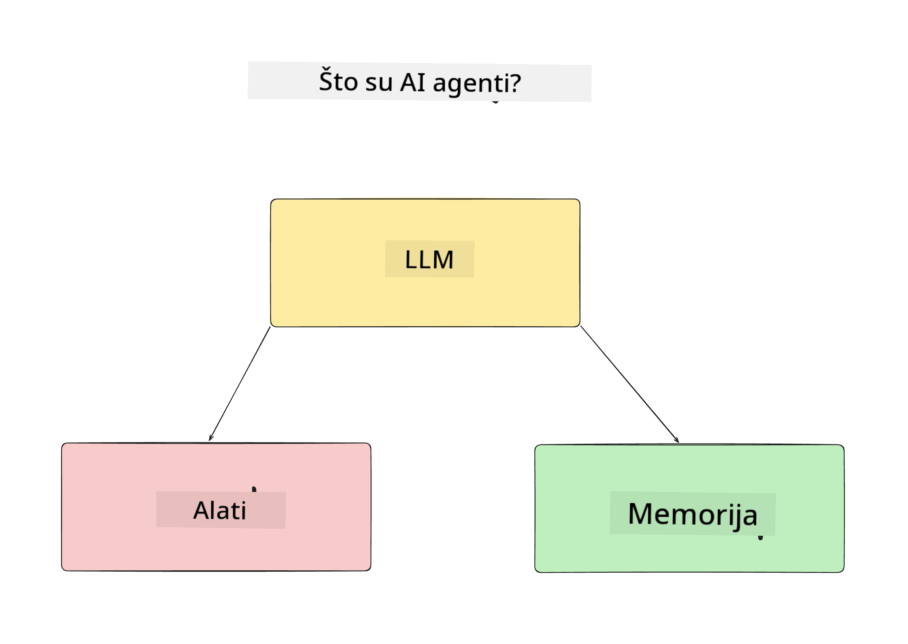
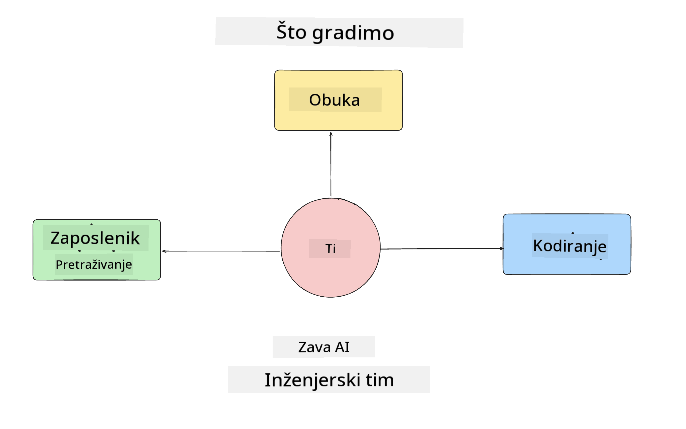
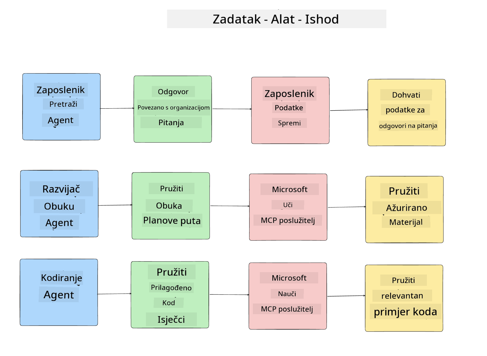
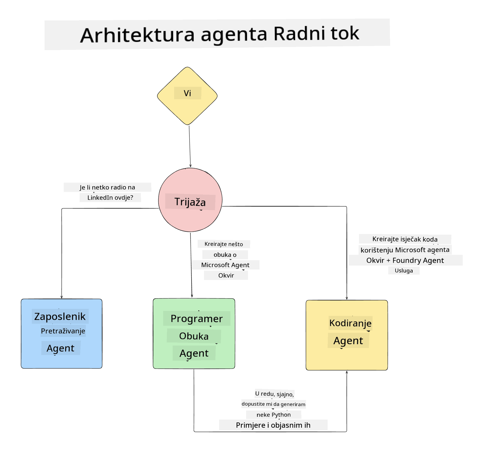

<!--
CO_OP_TRANSLATOR_METADATA:
{
  "original_hash": "99c07849641a850775c188c9333f31e5",
  "translation_date": "2025-12-12T18:41:05+00:00",
  "source_file": "lesson-1-agent-design/README.md",
  "language_code": "hr"
}
-->
# Lekcija 1: Dizajn AI Agenta

Dobrodošli u prvu lekciju tečaja "Izgradnja AI Agenta od Nule do Produkcije"!

U ovoj lekciji ćemo pokriti:

- Definiranje što su AI Agenti
  
- Rasprava o AI Agent aplikaciji koju gradimo  

- Identifikacija potrebnih alata i usluga za svakog agenta
  
- Arhitektura naše Agent aplikacije
  
Započnimo definiranjem što je agent i zašto bismo ih koristili unutar aplikacije.

## Što su AI Agenti?

Ako je ovo vaš prvi put da istražujete kako izgraditi AI Agenta, možda imate pitanja kako točno definirati što je AI Agent.

Jednostavan način da definiramo što je AI Agent je kroz komponente koje ga čine:

**Veliki jezični model** - LLM će pokretati sposobnost obrade prirodnog jezika od korisnika kako bi interpretirao zadatak koji žele izvršiti, kao i interpretirao opise alata dostupnih za izvršenje tih zadataka.

**Alati** - To će biti funkcije, API-ji, spremišta podataka i druge usluge koje LLM može odabrati koristiti za izvršenje zadataka koje korisnik traži.

**Memorija** - Ovo je način na koji pohranjujemo kratkoročne i dugoročne interakcije između AI Agenta i korisnika. Pohrana i dohvat ovih informacija važni su za poboljšanja i spremanje korisničkih preferencija tijekom vremena.

## Naš AI Agent slučaj upotrebe

Za ovaj tečaj, izgradit ćemo AI Agent aplikaciju koja pomaže novim developerima da se uključe u naš AI Agent razvojni tim!

Prije nego što započnemo bilo kakav razvojni rad, prvi korak u stvaranju uspješne AI Agent aplikacije je definirati jasne scenarije o tome kako očekujemo da naši korisnici rade s našim AI Agentima.

Za ovu aplikaciju radit ćemo s ovim scenarijima:

**Scenarij 1**: Novi zaposlenik se pridružuje našoj organizaciji i želi saznati više o timu kojem se pridružio i kako se povezati s njima.

**Scenarij 2:** Novi zaposlenik želi znati koji bi bio najbolji prvi zadatak na kojem bi mogao početi raditi.

**Scenarij 3:** Novi zaposlenik želi prikupiti resurse za učenje i primjere koda koji će mu pomoći da započne s izvršavanjem tog zadatka.

## Identifikacija alata i usluga

Sada kada imamo kreirane ove scenarije, sljedeći korak je mapirati ih na alate i usluge koje naši AI agenti trebaju za izvršenje tih zadataka.

Ovaj proces spada u kategoriju Inženjeringa konteksta jer ćemo se fokusirati na to da naši AI Agenti imaju pravi kontekst u pravo vrijeme za izvršenje zadataka.

Učinit ćemo to scenarij po scenarij i provesti dobar agentni dizajn tako da navedemo zadatke, alate i željene ishode za svakog agenta.

### Scenarij 1 - Agent za pretraživanje zaposlenika

**Zadatak** - Odgovarati na pitanja o zaposlenicima u organizaciji kao što su datum pridruživanja, trenutni tim, lokacija i posljednja pozicija.

**Alati** - Spremište podataka o trenutnoj listi zaposlenika i organizacijski dijagram

**Ishodi** - Mogućnost dohvaćanja informacija iz spremišta podataka za odgovore na opća organizacijska pitanja i specifična pitanja o zaposlenicima.

### Scenarij 2 - Agent za preporuku zadataka

**Zadatak** - Na temelju iskustva novog zaposlenika kao developera, predložiti 1-3 problema na kojima novi zaposlenik može raditi.

**Alati** - GitHub MCP Server za dohvat otvorenih problema i izgradnju developerskog profila

**Ishodi** - Mogućnost čitanja posljednjih 5 commitova GitHub profila i otvorenih problema na GitHub projektu te davanje preporuka na temelju podudaranja

### Scenarij 3 - Agent pomoćnik za kod

**Zadatak** - Na temelju otvorenih problema koje je preporučio "Agent za preporuku zadataka", istražiti i pružiti resurse te generirati isječke koda koji pomažu zaposleniku.

**Alati** - Microsoft Learn MCP za pronalazak resursa i Code Interpreter za generiranje prilagođenih isječaka koda.

**Ishodi** - Ako korisnik zatraži dodatnu pomoć, tijek rada treba koristiti Learn MCP Server za pružanje poveznica i isječaka resursa, a zatim predati Code Interpreter agentu za generiranje malih isječaka koda s objašnjenjima.

## Arhitektura naše Agent aplikacije

Sada kada smo definirali svakog od naših agenata, napravimo dijagram arhitekture koji će nam pomoći razumjeti kako će svaki agent raditi zajedno i zasebno ovisno o zadatku:

## Sljedeći koraci

Sada kada smo dizajnirali svakog agenta i naš agentski sustav, prijeđimo na sljedeću lekciju gdje ćemo razviti svakog od ovih agenata!

---

<!-- CO-OP TRANSLATOR DISCLAIMER START -->
**Odricanje od odgovornosti**:
Ovaj dokument je preveden korištenjem AI usluge za prevođenje [Co-op Translator](https://github.com/Azure/co-op-translator). Iako nastojimo postići točnost, imajte na umu da automatski prijevodi mogu sadržavati pogreške ili netočnosti. Izvorni dokument na izvornom jeziku treba smatrati autoritativnim izvorom. Za kritične informacije preporučuje se profesionalni ljudski prijevod. Ne snosimo odgovornost za bilo kakva nesporazuma ili pogrešna tumačenja koja proizlaze iz korištenja ovog prijevoda.
<!-- CO-OP TRANSLATOR DISCLAIMER END -->