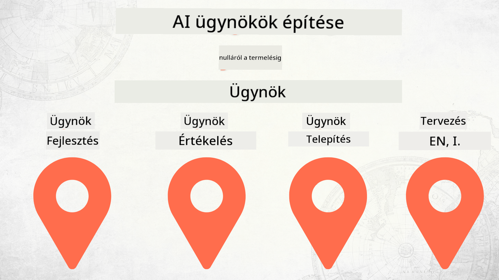

<!--
CO_OP_TRANSLATOR_METADATA:
{
  "original_hash": "2799ceaaefbd8571688459ac03eac5aa",
  "translation_date": "2025-12-12T17:07:44+00:00",
  "source_file": "README.md",
  "language_code": "hu"
}
-->
# AI ügynökök építése nulláról a termelésig

## Egy tanfolyam, amely az AI ügynök fejlesztési életciklusának alapjait tanítja

## 🌱 Kezdés

Ez a tanfolyam az AI ügynökök építésének és telepítésének alapjait tárgyalja.

Minden lecke az előzőre épül, ezért javasoljuk, hogy kezd az elejétől, és haladj végig a tanfolyamon.

Ha többet szeretnél megtudni az AI ügynök témákról, nézd meg az [AI Agents For Beginners Course](https://aka.ms/ai-agents-beginners) tanfolyamot.

### Ismerkedj más tanulókkal, kapj válaszokat kérdéseidre

Ha elakadsz vagy kérdésed van az AI ügynökök építésével kapcsolatban, csatlakozz a dedikált Discord csatornánkhoz a [Microsoft Foundry Discord](https://discord.gg/Kuaw3ktsu6) szerveren.

### Amire szükséged van

Minden leckéhez tartozik egy saját kódminta, amelyet helyben futtathatsz. [Forkold ezt a repót](https://github.com/microsoft/Building-AI-Agents-From-Zero-To-Production/fork), hogy létrehozd a saját példányodat.

Ez a tanfolyam jelenleg a következőket használja:

- [Microsoft Agent Framework (MAF)](https://aka.ms/ai-agents-beginners/agent-framework)
- [Microsoft Foundry](https://azure.microsoft.com/products/ai-foundry)
- [Azure OpenAI Service](https://azure.microsoft.com/products/ai-foundry/models/openai)
- [Azure CLI](https://learn.microsoft.com/cli/azure/authenticate-azure-cli?view=azure-cli-latest)

Kérjük, győződj meg róla, hogy hozzáférsz ezekhez a szolgáltatásokhoz, mielőtt elkezdenéd.

Hamarosan további lehetőségek érkeznek a modell hosztolás és szolgáltatások terén.

## 🗃️ Leckék

| **Lecke**         | **Leírás**                                                                                  |
|--------------------|--------------------------------------------------------------------------------------------------|
| [Agent Design](./lesson-1-agent-design/README.md)       | Bevezetés a "Fejlesztői Bevezető" ügynök használati esetünkbe és az eredményes ügynökök tervezésébe  |
| [Agent Development](./lesson-2-agent-development/README.md)  | A Microsoft Agent Framework (MAF) használatával hozz létre 3 ügynököt, hogy segítsenek az új fejlesztők bevezetésében.       |
| [Agent Evaluations](./lesson-3-agent-evals/README.md)  | A Microsoft Foundry segítségével derítsd ki, milyen jól teljesítenek AI ügynökeink, és hogyan javíthatók. |
| [Agent Deployment](./lesson-4-agent-deployment/README.md)   | A Hosted Agents és OpenAI Chatkit használatával nézd meg, hogyan lehet egy AI ügynököt élesben telepíteni.       |

## Közreműködés

Ez a projekt szívesen fogad hozzájárulásokat és javaslatokat. A legtöbb hozzájáruláshoz el kell fogadnod egy
Contributor License Agreement (CLA) megállapodást, amelyben kijelented, hogy jogod van a hozzájárulásod használatára, és ténylegesen megadod nekünk ezt a jogot. Részletekért látogass el a <https://cla.opensource.microsoft.com> oldalra.

Amikor pull request-et küldesz be, egy CLA bot automatikusan megállapítja, hogy szükséges-e CLA-t benyújtanod, és ennek megfelelően jelöli a PR-t (pl. státusz ellenőrzés, komment). Egyszerűen kövesd a bot utasításait. Ezt csak egyszer kell megtenned az összes CLA-t használó repóban.

Ez a projekt elfogadta a [Microsoft Open Source Code of Conduct](https://opensource.microsoft.com/codeofconduct/) irányelveit.
További információkért lásd a [Code of Conduct FAQ](https://opensource.microsoft.com/codeofconduct/faq/) oldalt, vagy írj az [opencode@microsoft.com](mailto:opencode@microsoft.com) címre további kérdésekkel vagy észrevételekkel.

## Védjegyek

Ez a projekt tartalmazhat védjegyeket vagy logókat projektekhez, termékekhez vagy szolgáltatásokhoz. A Microsoft védjegyek vagy logók jogosult használata a
[Microsoft védjegy- és márka irányelveinek](https://www.microsoft.com/legal/intellectualproperty/trademarks/usage/general) betartásával történhet.
A Microsoft védjegyek vagy logók módosított verziókban történő használata nem okozhat félreértést, és nem sugallhat Microsoft támogatást.
Harmadik fél védjegyeinek vagy logóinak használata a harmadik felek szabályzatai szerint történik.

## Segítségkérés

Ha elakadsz vagy kérdésed van AI alkalmazások építésével kapcsolatban, csatlakozz:

Ha termék visszajelzésed vagy hibák vannak az építés során, látogass el:

---

<!-- CO-OP TRANSLATOR DISCLAIMER START -->
**Jogi nyilatkozat**:
Ezt a dokumentumot az AI fordító szolgáltatás, a [Co-op Translator](https://github.com/Azure/co-op-translator) segítségével fordítottuk le. Bár a pontosságra törekszünk, kérjük, vegye figyelembe, hogy az automatikus fordítások hibákat vagy pontatlanságokat tartalmazhatnak. Az eredeti dokumentum az anyanyelvén tekintendő hiteles forrásnak. Fontos információk esetén professzionális emberi fordítást javaslunk. Nem vállalunk felelősséget a fordítás használatából eredő félreértésekért vagy félreértelmezésekért.
<!-- CO-OP TRANSLATOR DISCLAIMER END -->