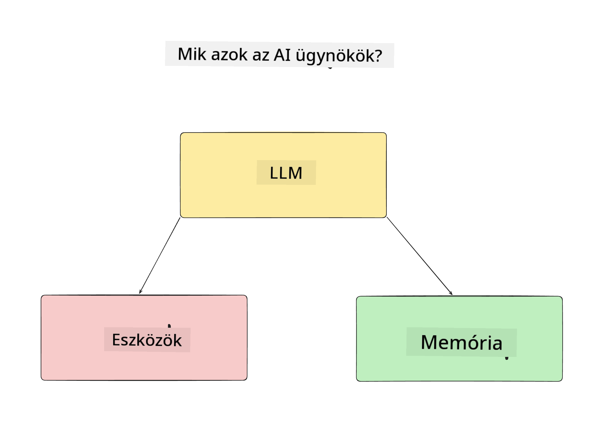
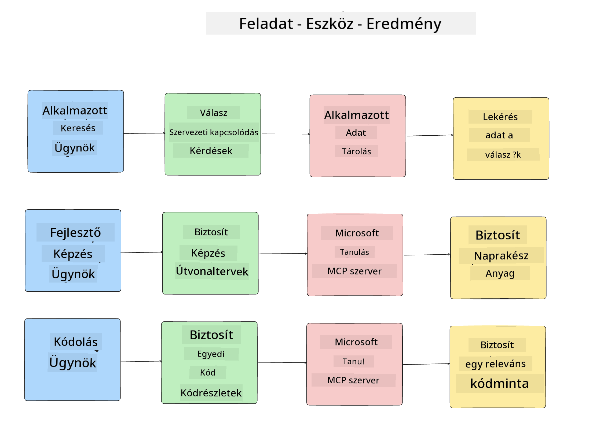
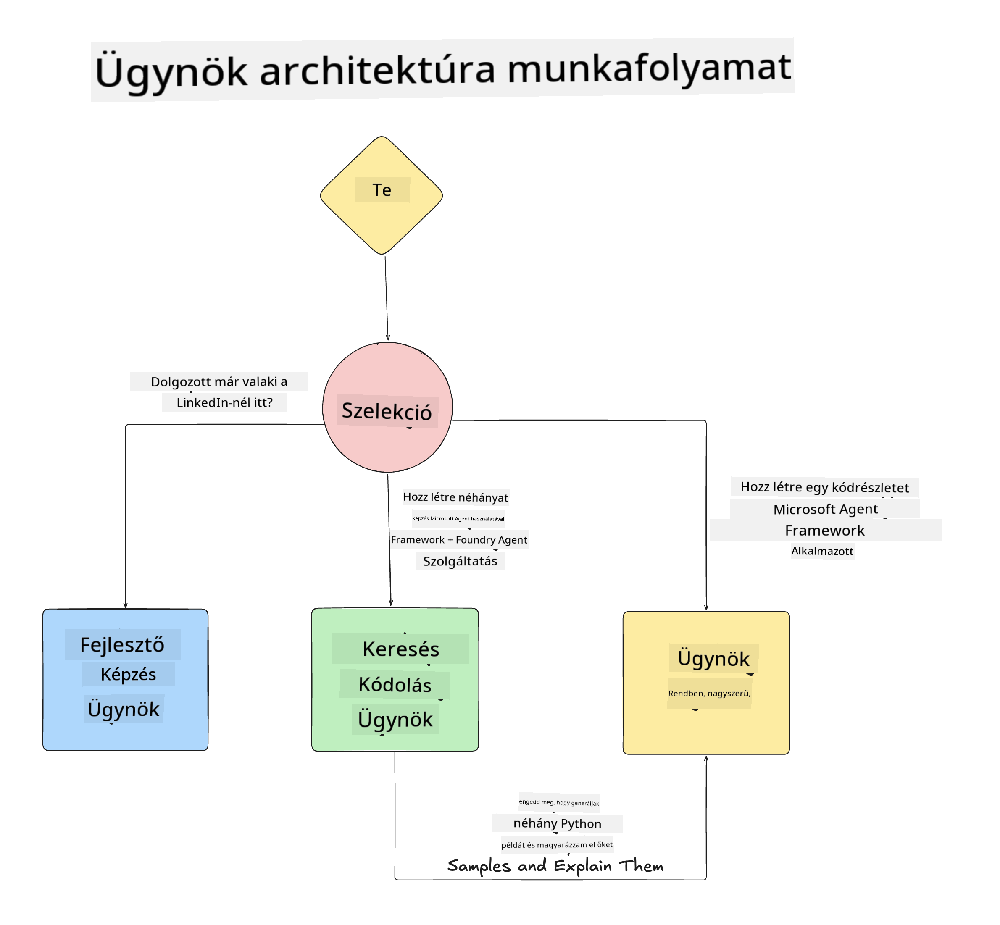

<!--
CO_OP_TRANSLATOR_METADATA:
{
  "original_hash": "99c07849641a850775c188c9333f31e5",
  "translation_date": "2025-12-12T18:37:12+00:00",
  "source_file": "lesson-1-agent-design/README.md",
  "language_code": "hu"
}
-->
# 1. lecke: AI ügynök tervezés

Üdvözlünk a "Zero-tól a termelésig AI ügynök építése" tanfolyam első leckéjében!

Ebben a leckében a következőkről lesz szó:

- Az AI ügynökök meghatározása

- Az AI ügynök alkalmazásunk bemutatása

- A szükséges eszközök és szolgáltatások azonosítása minden ügynöknél

- Az ügynök alkalmazásunk architektúrájának megtervezése

Kezdjük azzal, hogy meghatározzuk, mik az ügynökök, és miért használjuk őket egy alkalmazáson belül.

## Mik azok az AI ügynökök?

Ha most először fedezed fel, hogyan építs AI ügynököt, lehet, hogy kérdéseid vannak arra vonatkozóan, pontosan hogyan definiáljuk az AI ügynököt.

Egy egyszerű módja annak, hogy meghatározzuk, mi az AI ügynök, az alkotóelemei alapján:

**Nagy Nyelvi Modell** – Az LLM biztosítja mind a természetes nyelv feldolgozásának képességét a felhasználótól, hogy értelmezze a végrehajtandó feladatot, mind pedig az elérhető eszközök leírásainak értelmezését a feladatok elvégzéséhez.

**Eszközök** – Ezek funkciók, API-k, adattárolók és egyéb szolgáltatások, amelyeket az LLM választhat a felhasználó által kért feladatok elvégzéséhez.

**Memória** – Ez az, ahogyan tároljuk az AI ügynök és a felhasználó közötti rövid és hosszú távú interakciókat. Ennek az információnak a tárolása és előhívása fontos a fejlesztésekhez és a felhasználói preferenciák időbeli megőrzéséhez.

## Az AI ügynökünk használati esete

Ehhez a tanfolyamhoz egy AI ügynök alkalmazást fogunk építeni, amely segíti az új fejlesztőket az AI ügynök fejlesztő csapatunkhoz való csatlakozásban!

Mielőtt bármilyen fejlesztési munkába kezdenénk, az első lépés egy sikeres AI ügynök alkalmazás létrehozásához az, hogy világos forgatókönyveket határozzunk meg arra, hogyan várjuk el, hogy a felhasználóink dolgozzanak az AI ügynökeinkkel.

Ehhez az alkalmazáshoz a következő forgatókönyvekkel dolgozunk:

**1. forgatókönyv**: Egy új alkalmazott csatlakozik a szervezetünkhöz, és többet szeretne megtudni a csapatról, amelyhez csatlakozott, és arról, hogyan léphet kapcsolatba velük.

**2. forgatókönyv:** Egy új alkalmazott szeretné megtudni, mi lenne a legjobb első feladat, amin elkezdhet dolgozni.

**3. forgatókönyv:** Egy új alkalmazott tanulási forrásokat és kódmintákat szeretne gyűjteni, hogy segítsék őt a feladat elvégzésének megkezdésében.

## Az eszközök és szolgáltatások azonosítása

Most, hogy megvannak ezek a forgatókönyvek, a következő lépés az, hogy hozzárendeljük őket azokhoz az eszközökhöz és szolgáltatásokhoz, amelyekre az AI ügynökeinknek szükségük lesz a feladatok elvégzéséhez.

Ez a folyamat a Kontextus Mérnökség kategóriájába tartozik, mivel arra fogunk koncentrálni, hogy az AI ügynökeinknek a megfelelő kontextus álljon rendelkezésre a megfelelő időben a feladatok elvégzéséhez.

Tegyük ezt forgatókönyvenként, és végezzünk jó ügynök tervezést azzal, hogy felsoroljuk minden ügynök feladatát, eszközeit és kívánt eredményeit.

### 1. forgatókönyv – Alkalmazott kereső ügynök

**Feladat** – Válaszoljon kérdésekre a szervezet alkalmazottairól, például belépési dátum, jelenlegi csapat, helyszín és utolsó pozíció.

**Eszközök** – Aktuális alkalmazotti lista és szervezeti ábra adattárolója

**Eredmények** – Képes információt lekérni az adattárolóból általános szervezeti kérdésekre és konkrét alkalmazotti kérdésekre válaszolva.

### 2. forgatókönyv – Feladat ajánló ügynök

**Feladat** – Az új alkalmazott fejlesztői tapasztalata alapján 1-3 olyan problémát javasolni, amin az új alkalmazott dolgozhat.

**Eszközök** – GitHub MCP szerver az nyitott problémák lekéréséhez és fejlesztői profil építéséhez

**Eredmények** – Képes elolvasni egy GitHub profil utolsó 5 commitját és egy GitHub projekt nyitott problémáit, majd ajánlásokat tenni a megfelelés alapján.

### 3. forgatókönyv – Kód asszisztens ügynök

**Feladat** – Az "Feladat ajánló" ügynök által javasolt nyitott problémák alapján kutatást végezni, forrásokat biztosítani és kódmintákat generálni az alkalmazott segítésére.

**Eszközök** – Microsoft Learn MCP a források megtalálásához és Kódértelmező egyedi kódminták generálásához.

**Eredmények** – Ha a felhasználó további segítséget kér, a munkafolyamat a Learn MCP szervert használja linkek és forrásokhoz tartozó kódminták biztosítására, majd átadja a Kódértelmező ügynöknek a kis kódminták magyarázatokkal történő generálásához.

## Az ügynök alkalmazásunk architektúrája

Most, hogy meghatároztuk mindegyik ügynökünket, készítsünk egy architektúra diagramot, amely segít megérteni, hogyan működik együtt és külön-külön minden ügynök a feladattól függően:

## Következő lépések

Most, hogy megterveztük mindegyik ügynököt és az ügynökrendszerünket, lépjünk tovább a következő leckére, ahol fejlesztjük ezeket az ügynököket!

---

<!-- CO-OP TRANSLATOR DISCLAIMER START -->
**Jogi nyilatkozat**:
Ezt a dokumentumot az AI fordító szolgáltatás, a [Co-op Translator](https://github.com/Azure/co-op-translator) segítségével fordítottuk le. Bár a pontosságra törekszünk, kérjük, vegye figyelembe, hogy az automatikus fordítások hibákat vagy pontatlanságokat tartalmazhatnak. Az eredeti dokumentum az anyanyelvén tekintendő hiteles forrásnak. Fontos információk esetén szakmai, emberi fordítást javaslunk. Nem vállalunk felelősséget a fordítás használatából eredő félreértésekért vagy félreértelmezésekért.
<!-- CO-OP TRANSLATOR DISCLAIMER END -->