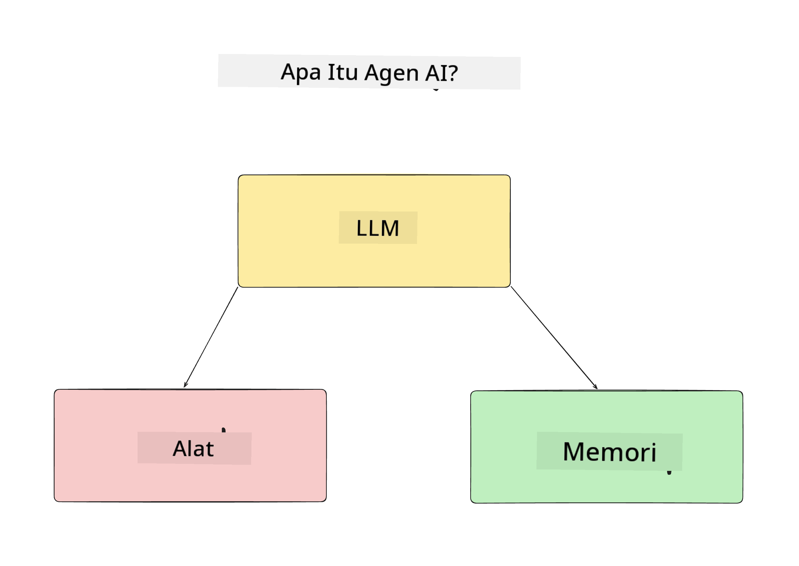
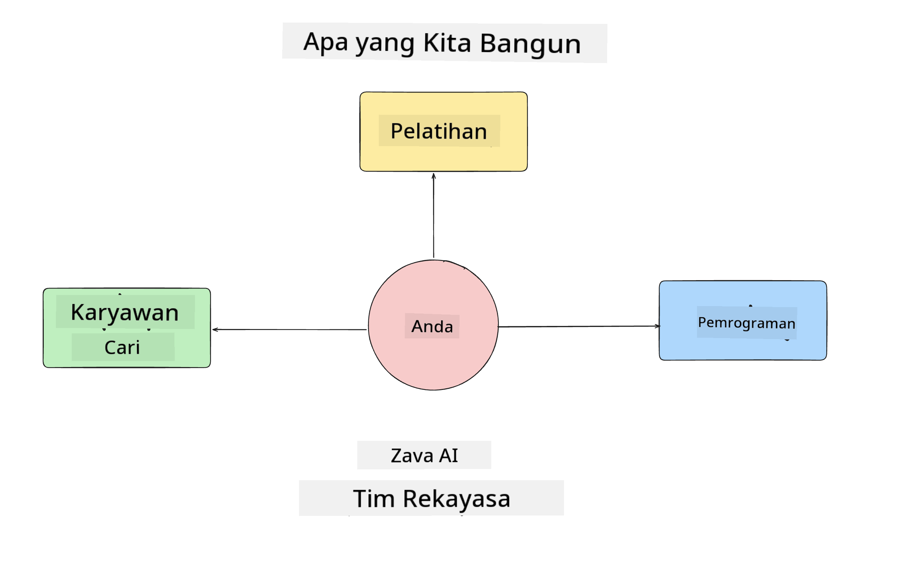
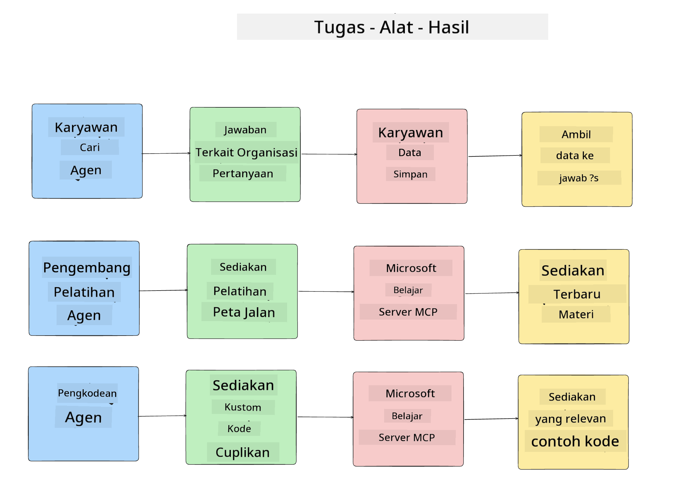
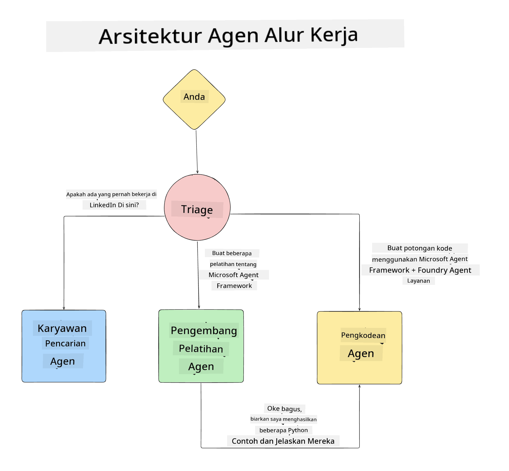

<!--
CO_OP_TRANSLATOR_METADATA:
{
  "original_hash": "99c07849641a850775c188c9333f31e5",
  "translation_date": "2025-12-12T18:34:45+00:00",
  "source_file": "lesson-1-agent-design/README.md",
  "language_code": "id"
}
-->
# Pelajaran 1: Desain Agen AI

Selamat datang di pelajaran pertama dari "Kursus Membangun Agen AI dari Nol hingga Produksi"!

Dalam pelajaran ini kita akan membahas:

- Mendefinisikan apa itu Agen AI
  
- Membahas Aplikasi Agen AI yang sedang kita bangun  

- Mengidentifikasi alat dan layanan yang dibutuhkan untuk setiap agen
  
- Merancang Arsitektur Aplikasi Agen kita
  
Mari kita mulai dengan mendefinisikan apa itu agen dan mengapa kita menggunakannya di dalam sebuah aplikasi.

## Apa Itu Agen AI?

Jika ini adalah pertama kalinya Anda mengeksplorasi cara membangun Agen AI, Anda mungkin memiliki pertanyaan tentang bagaimana tepatnya mendefinisikan apa itu Agen AI.

Cara sederhana untuk mendefinisikan apa itu Agen AI adalah dengan komponen yang menyusunnya:

**Large Language Model** - LLM akan menggerakkan kemampuan untuk memproses bahasa alami dari pengguna untuk menginterpretasikan tugas yang ingin mereka selesaikan serta menginterpretasikan deskripsi alat yang tersedia untuk menyelesaikan tugas tersebut.

**Alat** - Ini akan berupa fungsi, API, penyimpanan data, dan layanan lain yang dapat dipilih oleh LLM untuk digunakan dalam menyelesaikan tugas yang diminta oleh pengguna.

**Memori** - Ini adalah cara kita menyimpan interaksi jangka pendek dan jangka panjang antara Agen AI dan pengguna. Menyimpan dan mengambil informasi ini penting untuk melakukan perbaikan dan menyimpan preferensi pengguna dari waktu ke waktu.

## Kasus Penggunaan Agen AI Kami

Untuk kursus ini, kita akan membangun aplikasi Agen AI yang membantu pengembang baru bergabung dengan Tim Pengembangan Agen AI kami!

Sebelum kita melakukan pengembangan, langkah pertama untuk membuat aplikasi Agen AI yang sukses adalah mendefinisikan skenario yang jelas tentang bagaimana kita mengharapkan pengguna bekerja dengan Agen AI kita.

Untuk aplikasi ini, kita akan bekerja dengan skenario berikut:

**Skenario 1**: Seorang karyawan baru bergabung dengan organisasi kita dan ingin mengetahui lebih banyak tentang tim yang mereka ikuti dan bagaimana cara terhubung dengan mereka.

**Skenario 2:** Seorang karyawan baru ingin mengetahui tugas pertama terbaik yang bisa mereka mulai kerjakan.

**Skenario 3:** Seorang karyawan baru ingin mengumpulkan sumber belajar dan contoh kode untuk membantu mereka memulai menyelesaikan tugas ini.

## Mengidentifikasi Alat dan Layanan

Sekarang kita sudah membuat skenario ini, langkah berikutnya adalah memetakan skenario tersebut ke alat dan layanan yang dibutuhkan oleh agen AI kita untuk menyelesaikan tugas-tugas ini.

Proses ini termasuk dalam kategori Rekayasa Konteks karena kita akan fokus memastikan bahwa Agen AI kita memiliki konteks yang tepat pada waktu yang tepat untuk menyelesaikan tugas.

Mari kita lakukan ini skenario demi skenario dan lakukan desain agen yang baik dengan mencantumkan tugas, alat, dan hasil yang diinginkan untuk setiap agen.

### Skenario 1 - Agen Pencari Karyawan

**Tugas** - Menjawab pertanyaan tentang karyawan di organisasi seperti tanggal bergabung, tim saat ini, lokasi, dan posisi terakhir.

**Alat** - Penyimpanan data daftar karyawan saat ini dan bagan organisasi

**Hasil** - Mampu mengambil informasi dari penyimpanan data untuk menjawab pertanyaan umum organisasi dan pertanyaan spesifik tentang karyawan.

### Skenario 2 - Agen Rekomendasi Tugas

**Tugas** - Berdasarkan pengalaman pengembang karyawan baru, memberikan 1-3 isu yang bisa dikerjakan oleh karyawan baru tersebut.

**Alat** - Server MCP GitHub untuk mendapatkan isu terbuka dan membangun profil pengembang

**Hasil** - Mampu membaca 5 commit terakhir dari Profil GitHub dan isu terbuka pada proyek GitHub serta memberikan rekomendasi berdasarkan kecocokan

### Skenario 3 - Agen Asisten Kode

**Tugas** - Berdasarkan Isu Terbuka yang direkomendasikan oleh Agen "Rekomendasi Tugas", melakukan riset dan menyediakan sumber daya serta menghasilkan potongan kode untuk membantu karyawan.

**Alat** - Microsoft Learn MCP untuk mencari sumber daya dan Code Interpreter untuk menghasilkan potongan kode khusus.

**Hasil** - Jika pengguna meminta bantuan tambahan, alur kerja harus menggunakan Server Learn MCP untuk menyediakan tautan dan potongan kode ke sumber daya dan kemudian menyerahkan ke agen Code Interpreter untuk menghasilkan potongan kode kecil dengan penjelasan.

## Merancang Arsitektur Aplikasi Agen Kita

Sekarang kita telah mendefinisikan setiap Agen kita, mari buat diagram arsitektur yang akan membantu kita memahami bagaimana setiap agen akan bekerja bersama dan secara terpisah tergantung pada tugasnya:

## Langkah Selanjutnya

Sekarang kita telah merancang setiap agen dan sistem agen kita, mari lanjut ke pelajaran berikutnya di mana kita akan mengembangkan masing-masing agen ini!

---

<!-- CO-OP TRANSLATOR DISCLAIMER START -->
**Penafian**:  
Dokumen ini telah diterjemahkan menggunakan layanan terjemahan AI [Co-op Translator](https://github.com/Azure/co-op-translator). Meskipun kami berupaya untuk mencapai akurasi, harap diingat bahwa terjemahan otomatis mungkin mengandung kesalahan atau ketidakakuratan. Dokumen asli dalam bahasa aslinya harus dianggap sebagai sumber yang sahih. Untuk informasi penting, disarankan menggunakan terjemahan profesional oleh manusia. Kami tidak bertanggung jawab atas kesalahpahaman atau salah tafsir yang timbul dari penggunaan terjemahan ini.
<!-- CO-OP TRANSLATOR DISCLAIMER END -->