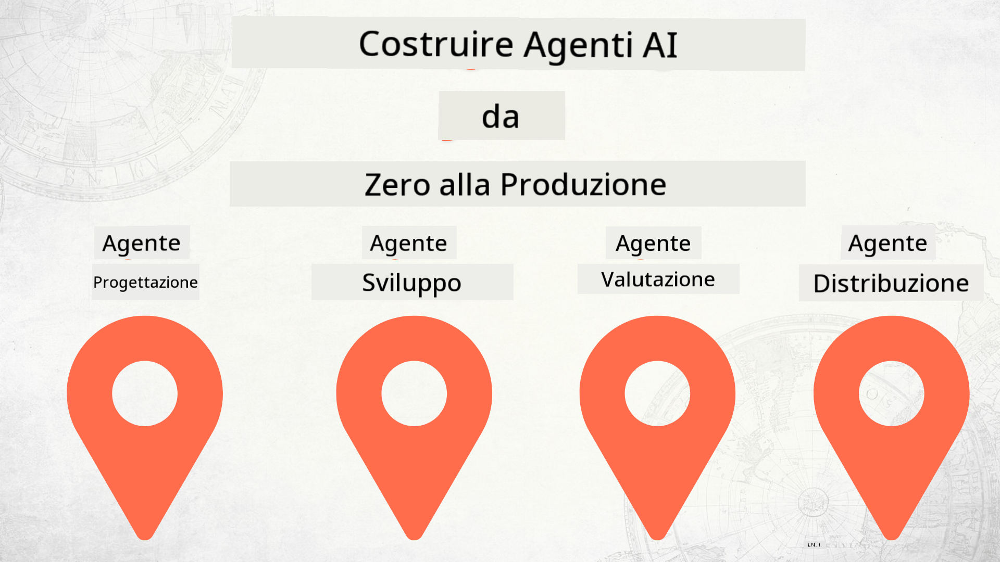

<!--
CO_OP_TRANSLATOR_METADATA:
{
  "original_hash": "03d63bb8bfb7f068db97b3703965a24f",
  "translation_date": "2025-12-17T13:49:48+00:00",
  "source_file": "README.md",
  "language_code": "it"
}
-->
# Costruire Agenti AI da Zero alla Produzione

### 🌐 Supporto Multilingue

#### Supportato tramite GitHub Action (Automatizzato e Sempre Aggiornato)

<!-- CO-OP TRANSLATOR LANGUAGES TABLE START -->
[Arabic](../ar/README.md) | [Bengali](../bn/README.md) | [Bulgarian](../bg/README.md) | [Burmese (Myanmar)](../my/README.md) | [Chinese (Simplified)](../zh/README.md) | [Chinese (Traditional, Hong Kong)](../hk/README.md) | [Chinese (Traditional, Macau)](../mo/README.md) | [Chinese (Traditional, Taiwan)](../tw/README.md) | [Croatian](../hr/README.md) | [Czech](../cs/README.md) | [Danish](../da/README.md) | [Dutch](../nl/README.md) | [Estonian](../et/README.md) | [Finnish](../fi/README.md) | [French](../fr/README.md) | [German](../de/README.md) | [Greek](../el/README.md) | [Hebrew](../he/README.md) | [Hindi](../hi/README.md) | [Hungarian](../hu/README.md) | [Indonesian](../id/README.md) | [Italian](./README.md) | [Japanese](../ja/README.md) | [Kannada](../kn/README.md) | [Korean](../ko/README.md) | [Lithuanian](../lt/README.md) | [Malay](../ms/README.md) | [Malayalam](../ml/README.md) | [Marathi](../mr/README.md) | [Nepali](../ne/README.md) | [Nigerian Pidgin](../pcm/README.md) | [Norwegian](../no/README.md) | [Persian (Farsi)](../fa/README.md) | [Polish](../pl/README.md) | [Portuguese (Brazil)](../br/README.md) | [Portuguese (Portugal)](../pt/README.md) | [Punjabi (Gurmukhi)](../pa/README.md) | [Romanian](../ro/README.md) | [Russian](../ru/README.md) | [Serbian (Cyrillic)](../sr/README.md) | [Slovak](../sk/README.md) | [Slovenian](../sl/README.md) | [Spanish](../es/README.md) | [Swahili](../sw/README.md) | [Swedish](../sv/README.md) | [Tagalog (Filipino)](../tl/README.md) | [Tamil](../ta/README.md) | [Telugu](../te/README.md) | [Thai](../th/README.md) | [Turkish](../tr/README.md) | [Ukrainian](../uk/README.md) | [Urdu](../ur/README.md) | [Vietnamese](../vi/README.md)
<!-- CO-OP TRANSLATOR LANGUAGES TABLE END -->

## Un corso che ti insegna le basi del Ciclo di Vita dello Sviluppo degli Agenti AI

## 🌱 Iniziare

Questo corso contiene lezioni che coprono le basi della costruzione e del deployment di Agenti AI.

Ogni lezione si basa sulla precedente, quindi consigliamo di iniziare dall'inizio e procedere fino alla fine.

Se vuoi esplorare di più sugli argomenti degli Agenti AI, puoi dare un'occhiata al [Corso per Principianti sugli Agenti AI](https://aka.ms/ai-agents-beginners).

### Incontra Altri Studenti, Fatti Rispondere alle Tue Domande

Se rimani bloccato o hai domande sulla costruzione di Agenti AI, unisciti al nostro canale Discord dedicato nel [Microsoft Foundry Discord](https://discord.gg/Kuaw3ktsu6).

### Cosa Ti Serve

Ogni lezione ha il proprio esempio di codice che puoi eseguire localmente. Puoi [fare il fork di questo repo](https://github.com/microsoft/Building-AI-Agents-From-Zero-To-Production/fork) per creare la tua copia.

Questo corso attualmente utilizza i seguenti strumenti:

- [Microsoft Agent Framework (MAF)](https://aka.ms/ai-agents-beginners/agent-framework)
- [Microsoft Foundry](https://azure.microsoft.com/products/ai-foundry)
- [Azure OpenAI Service](https://azure.microsoft.com/products/ai-foundry/models/openai)
- [Azure CLI](https://learn.microsoft.com/cli/azure/authenticate-azure-cli?view=azure-cli-latest)

Assicurati di avere accesso a questi servizi prima di iniziare.

Altre opzioni per l'hosting dei modelli e servizi in arrivo a breve.

## 🗃️ Lezioni

| **Lezione**         | **Descrizione**                                                                                  |
|--------------------|--------------------------------------------------------------------------------------------------|
| [Progettazione Agente](./lesson-1-agent-design/README.md)       | Un'introduzione al nostro caso d'uso "Onboarding Sviluppatore" e come progettare agenti efficaci  |
| [Sviluppo Agente](./lesson-2-agent-development/README.md)  | Usando il Microsoft Agent Framework (MAF), crea 3 agenti per aiutare i nuovi sviluppatori nell'onboarding.       |
| [Valutazioni Agente](./lesson-3-agent-evals/README.md)  | Usando Microsoft Foundry, scopri come stanno performando i nostri Agenti AI e come migliorarli. |
| [Deployment Agente](./lesson-4-agent-deployment/README.md)   | Usando gli Agenti Ospitati e OpenAI Chatkit, scopri come distribuire un Agente AI in produzione.       |

## Contribuire

Questo progetto accoglie contributi e suggerimenti. La maggior parte dei contributi richiede di accettare un
Accordo di Licenza per i Contributori (CLA) che dichiara che hai il diritto, e effettivamente concedi,
i diritti di utilizzare il tuo contributo. Per dettagli, visita <https://cla.opensource.microsoft.com>.

Quando invii una pull request, un bot CLA determinerà automaticamente se devi fornire
un CLA e decorerà la PR di conseguenza (ad esempio, controllo di stato, commento). Segui semplicemente le istruzioni
fornite dal bot. Dovrai farlo solo una volta per tutti i repo che usano il nostro CLA.

Questo progetto ha adottato il [Codice di Condotta Open Source Microsoft](https://opensource.microsoft.com/codeofconduct/).
Per maggiori informazioni vedi le [FAQ sul Codice di Condotta](https://opensource.microsoft.com/codeofconduct/faq/) o
contatta [opencode@microsoft.com](mailto:opencode@microsoft.com) per domande o commenti aggiuntivi.

## Marchi

Questo progetto può contenere marchi o loghi di progetti, prodotti o servizi. L'uso autorizzato dei marchi o loghi Microsoft
è soggetto e deve seguire le
[Linee Guida sui Marchi e Brand Microsoft](https://www.microsoft.com/legal/intellectualproperty/trademarks/usage/general).
L'uso di marchi o loghi Microsoft in versioni modificate di questo progetto non deve causare confusione o implicare sponsorizzazione Microsoft.
Qualsiasi uso di marchi o loghi di terze parti è soggetto alle politiche di tali terze parti.

## Ottenere Aiuto

Se rimani bloccato o hai domande sulla costruzione di app AI, unisciti a:

Se hai feedback sul prodotto o errori durante la costruzione visita:

---

<!-- CO-OP TRANSLATOR DISCLAIMER START -->
**Disclaimer**:  
Questo documento è stato tradotto utilizzando il servizio di traduzione automatica [Co-op Translator](https://github.com/Azure/co-op-translator). Pur impegnandoci per garantire l’accuratezza, si prega di notare che le traduzioni automatiche possono contenere errori o imprecisioni. Il documento originale nella sua lingua nativa deve essere considerato la fonte autorevole. Per informazioni critiche, si raccomanda una traduzione professionale effettuata da un traduttore umano. Non ci assumiamo alcuna responsabilità per eventuali malintesi o interpretazioni errate derivanti dall’uso di questa traduzione.
<!-- CO-OP TRANSLATOR DISCLAIMER END -->