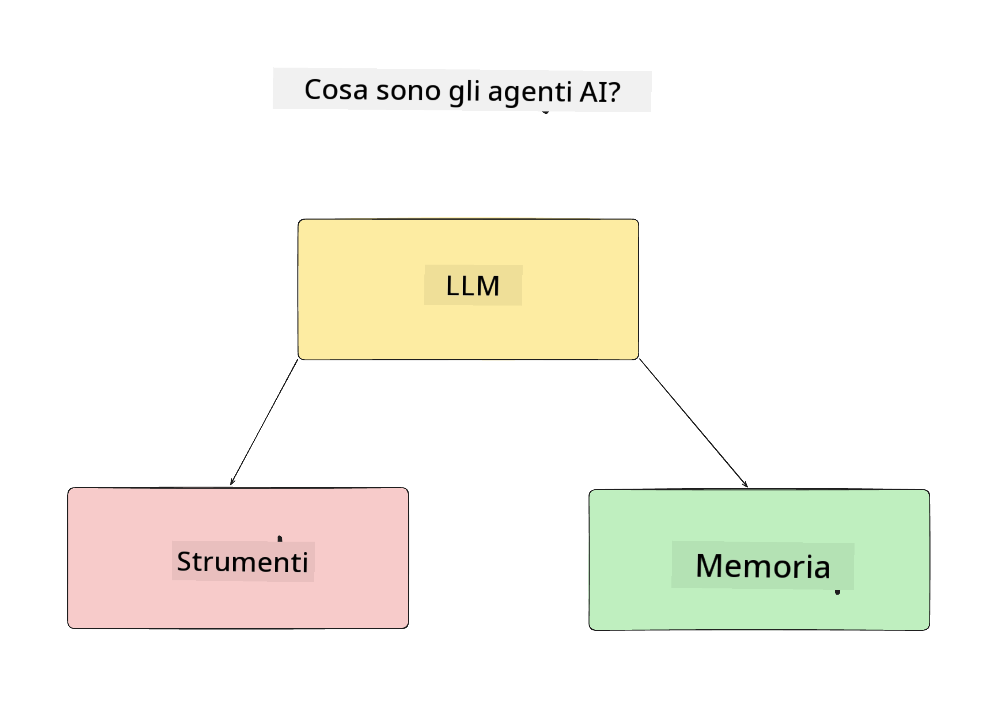
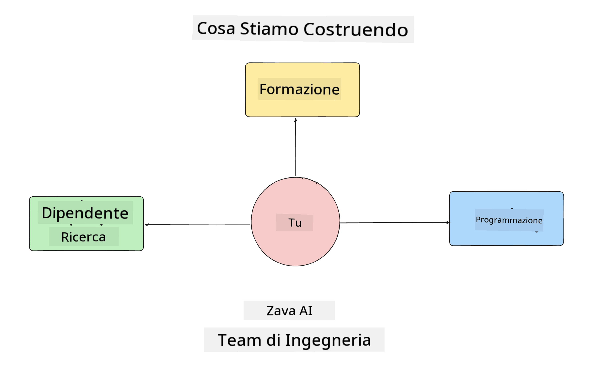
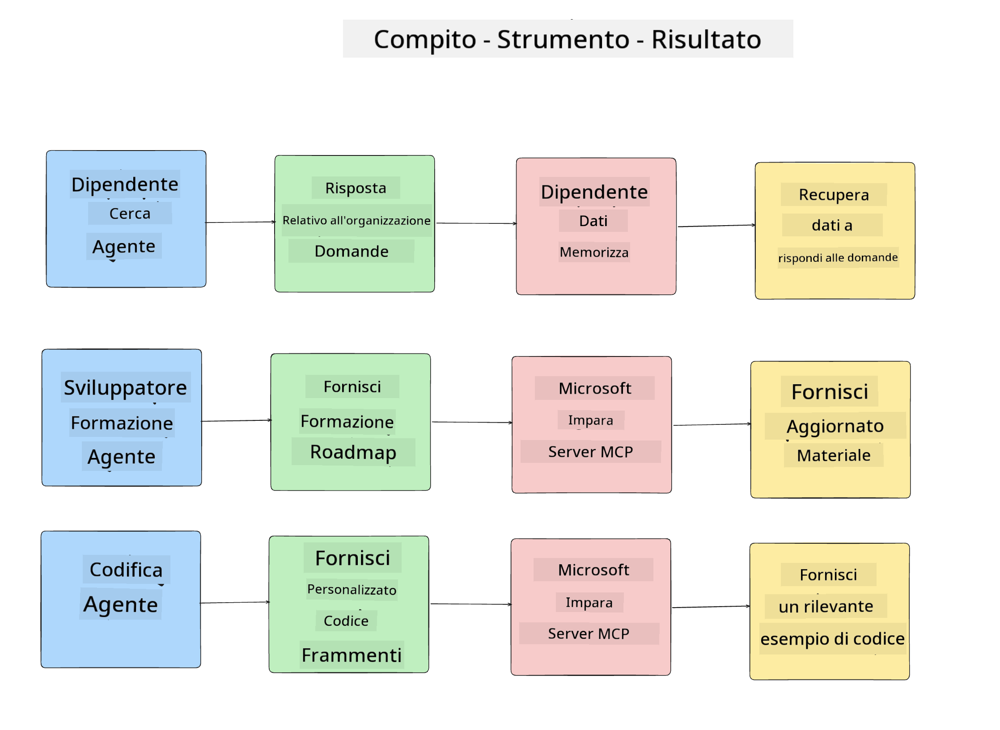
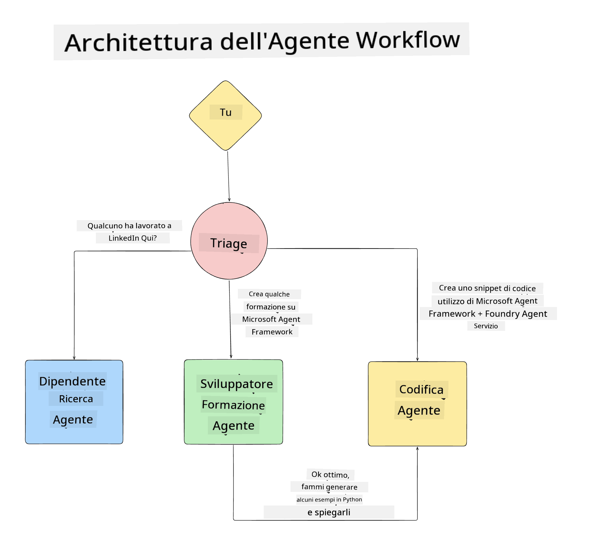

<!--
CO_OP_TRANSLATOR_METADATA:
{
  "original_hash": "99c07849641a850775c188c9333f31e5",
  "translation_date": "2025-12-12T18:26:45+00:00",
  "source_file": "lesson-1-agent-design/README.md",
  "language_code": "it"
}
-->
# Lezione 1: Progettazione di un Agente AI

Benvenuti alla prima lezione del corso "Costruire un Agente AI da Zero alla Produzione"!

In questa lezione tratteremo:

- Definire cosa sono gli Agenti AI
  
- Discutere l'Applicazione Agente AI che stiamo costruendo  

- Identificare gli strumenti e i servizi necessari per ogni agente
  
- Architettare la nostra Applicazione Agente
  
Iniziamo definendo cosa sono gli agenti e perché li useremmo all'interno di un'applicazione.

## Cosa Sono gli Agenti AI?

Se è la prima volta che esplori come costruire un Agente AI, potresti avere domande su come definire esattamente cosa sia un Agente AI.

Un modo semplice per definire cosa sia un Agente AI è attraverso i componenti che lo costituiscono:

**Large Language Model** - L'LLM alimenterà sia la capacità di elaborare il linguaggio naturale dall'utente per interpretare il compito che vuole completare sia interpretare le descrizioni degli strumenti disponibili per completare tali compiti.

**Strumenti** - Questi saranno funzioni, API, archivi di dati e altri servizi che l'LLM può scegliere di utilizzare per completare i compiti richiesti dall'utente.

**Memoria** - Questo è il modo in cui memorizziamo sia le interazioni a breve termine che a lungo termine tra l'Agente AI e l'utente. Memorizzare e recuperare queste informazioni è importante per apportare miglioramenti e salvare le preferenze dell'utente nel tempo.

## Il Nostro Caso d'Uso per l'Agente AI

Per questo corso, costruiremo un'applicazione Agente AI che aiuta i nuovi sviluppatori a inserirsi nel nostro Team di Sviluppo Agenti AI!

Prima di fare qualsiasi lavoro di sviluppo, il primo passo per creare un'applicazione Agente AI di successo è definire scenari chiari su come ci aspettiamo che i nostri utenti lavorino con i nostri Agenti AI.

Per questa applicazione, lavoreremo con questi scenari:

**Scenario 1**: Un nuovo dipendente entra nella nostra organizzazione e vuole sapere di più sul team in cui è entrato e come connettersi con loro.

**Scenario 2:** Un nuovo dipendente vuole sapere quale sarebbe il miglior primo compito su cui iniziare a lavorare.

**Scenario 3:** Un nuovo dipendente vuole raccogliere risorse di apprendimento ed esempi di codice per aiutarlo a iniziare a completare questo compito.

## Identificare gli Strumenti e i Servizi

Ora che abbiamo creato questi scenari, il passo successivo è mappare gli strumenti e i servizi di cui i nostri agenti AI avranno bisogno per completare questi compiti.

Questo processo rientra nella categoria dell'Ingegneria del Contesto poiché ci concentreremo sull'assicurarci che i nostri Agenti AI abbiano il contesto giusto al momento giusto per completare i compiti.

Facciamo questo scenario per scenario e realizziamo un buon design agentico elencando il compito, gli strumenti e i risultati desiderati di ogni agente.

### Scenario 1 - Agente di Ricerca Dipendenti

**Compito** - Rispondere a domande sui dipendenti dell'organizzazione come data di ingresso, team attuale, posizione e ultima posizione.

**Strumenti** - Archivio dati della lista attuale dei dipendenti e organigramma

**Risultati** - Capacità di recuperare informazioni dall'archivio dati per rispondere a domande generali sull'organizzazione e domande specifiche sui dipendenti.

### Scenario 2 - Agente di Raccomandazione Compiti

**Compito** - Basandosi sull'esperienza da sviluppatore del nuovo dipendente, proporre 1-3 problemi su cui il nuovo dipendente può lavorare.

**Strumenti** - Server MCP di GitHub per ottenere problemi aperti e costruire un profilo sviluppatore

**Risultati** - Capacità di leggere gli ultimi 5 commit di un profilo GitHub e i problemi aperti su un progetto GitHub e fare raccomandazioni basate su una corrispondenza

### Scenario 3 - Agente Assistente Codice

**Compito** - Basandosi sui Problemi Aperti raccomandati dall'Agente "Raccomandazione Compiti", ricercare e fornire risorse e generare snippet di codice per aiutare il dipendente.

**Strumenti** - Microsoft Learn MCP per trovare risorse e Code Interpreter per generare snippet di codice personalizzati.

**Risultati** - Se l'utente chiede aiuto aggiuntivo, il flusso di lavoro dovrebbe usare il Server Learn MCP per fornire link e snippet a risorse e poi passare all'agente Code Interpreter per generare piccoli snippet di codice con spiegazioni.

## Architettare la nostra Applicazione Agente

Ora che abbiamo definito ciascuno dei nostri Agenti, creiamo un diagramma architetturale che ci aiuterà a capire come ogni agente lavorerà insieme e separatamente a seconda del compito:

## Passi Successivi

Ora che abbiamo progettato ogni agente e il nostro sistema agentico, passiamo alla lezione successiva dove svilupperemo ciascuno di questi agenti!

---

<!-- CO-OP TRANSLATOR DISCLAIMER START -->
**Disclaimer**:  
Questo documento è stato tradotto utilizzando il servizio di traduzione automatica [Co-op Translator](https://github.com/Azure/co-op-translator). Pur impegnandoci per garantire l’accuratezza, si prega di notare che le traduzioni automatiche possono contenere errori o imprecisioni. Il documento originale nella sua lingua nativa deve essere considerato la fonte autorevole. Per informazioni critiche, si raccomanda una traduzione professionale effettuata da un traduttore umano. Non ci assumiamo alcuna responsabilità per eventuali malintesi o interpretazioni errate derivanti dall’uso di questa traduzione.
<!-- CO-OP TRANSLATOR DISCLAIMER END -->