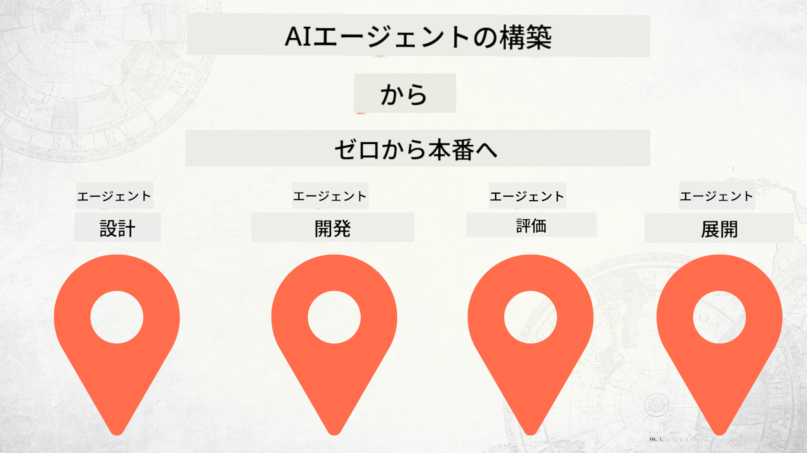

<!--
CO_OP_TRANSLATOR_METADATA:
{
  "original_hash": "2799ceaaefbd8571688459ac03eac5aa",
  "translation_date": "2025-12-12T16:54:56+00:00",
  "source_file": "README.md",
  "language_code": "ja"
}
-->
# ゼロからプロダクションまでのAIエージェント構築

## AIエージェント開発ライフサイクルの基礎を教えるコース

## 🌱 はじめに

このコースでは、AIエージェントの構築とデプロイの基礎を学べます。

各レッスンは前のレッスンに基づいているため、最初から順に進めていくことをお勧めします。

AIエージェントのトピックをさらに探求したい場合は、[AI Agents For Beginners Course](https://aka.ms/ai-agents-beginners)をご覧ください。

### 他の学習者と交流し、質問に答えてもらう

AIエージェントの構築で行き詰まったり質問がある場合は、[Microsoft Foundry Discord](https://discord.gg/Kuaw3ktsu6)の専用Discordチャンネルに参加してください。

### 必要なもの

各レッスンにはローカルで実行できるコードサンプルがあります。このリポジトリを[フォーク](https://github.com/microsoft/Building-AI-Agents-From-Zero-To-Production/fork)して自分のコピーを作成できます。

このコースでは現在、以下を使用しています：

- [Microsoft Agent Framework (MAF)](https://aka.ms/ai-agents-beginners/agent-framework)
- [Microsoft Foundry](https://azure.microsoft.com/products/ai-foundry)
- [Azure OpenAI Service](https://azure.microsoft.com/products/ai-foundry/models/openai)
- [Azure CLI](https://learn.microsoft.com/cli/azure/authenticate-azure-cli?view=azure-cli-latest)

開始する前に、これらのサービスにアクセスできることを確認してください。

モデルホスティングやサービスに関する他のオプションも近日公開予定です。

## 🗃️ レッスン

| **レッスン**         | **説明**                                                                                  |
|--------------------|--------------------------------------------------------------------------------------------------|
| [Agent Design](./lesson-1-agent-design/README.md)       | 「開発者オンボーディング」エージェントユースケースの紹介と効果的なエージェント設計方法  |
| [Agent Development](./lesson-2-agent-development/README.md)  | Microsoft Agent Framework (MAF) を使って、新しい開発者のオンボーディングを支援する3つのエージェントを作成します。       |
| [Agent Evaluations](./lesson-3-agent-evals/README.md)  | Microsoft Foundryを使って、AIエージェントのパフォーマンスを評価し、改善方法を学びます。 |
| [Agent Deployment](./lesson-4-agent-deployment/README.md)   | ホストされたエージェントとOpenAI Chatkitを使い、AIエージェントを本番環境にデプロイする方法を学びます。       |

## 貢献について

このプロジェクトは貢献や提案を歓迎します。ほとんどの貢献には、貢献物の使用権を実際に付与する権利があることを宣言する
Contributor License Agreement (CLA)への同意が必要です。詳細は <https://cla.opensource.microsoft.com> をご覧ください。

プルリクエストを送信すると、CLAボットが自動的にCLAの提出が必要かどうかを判断し、PRに適切な装飾（ステータスチェックやコメントなど）を行います。ボットの指示に従ってください。CLAは当社のCLAを使用するすべてのリポジトリで一度だけ行えば十分です。

このプロジェクトは[Microsoft Open Source Code of Conduct](https://opensource.microsoft.com/codeofconduct/)を採用しています。
詳細は[Code of Conduct FAQ](https://opensource.microsoft.com/codeofconduct/faq/)をご覧いただくか、
ご質問やコメントは[opencode@microsoft.com](mailto:opencode@microsoft.com)までお問い合わせください。

## 商標について

このプロジェクトにはプロジェクト、製品、サービスの商標やロゴが含まれている場合があります。Microsoftの商標やロゴの使用は
[Microsoftの商標およびブランドガイドライン](https://www.microsoft.com/legal/intellectualproperty/trademarks/usage/general)に従う必要があります。
本プロジェクトの修正版でMicrosoftの商標やロゴを使用する場合、混乱を招いたりMicrosoftの後援を示唆してはなりません。
第三者の商標やロゴの使用は、それら第三者のポリシーに従います。

## ヘルプを得るには

AIアプリの構築で行き詰まったり質問がある場合は、以下に参加してください：

製品のフィードバックや構築中のエラーについては、以下をご利用ください：

---

<!-- CO-OP TRANSLATOR DISCLAIMER START -->
**免責事項**：  
本書類はAI翻訳サービス「Co-op Translator」（https://github.com/Azure/co-op-translator）を使用して翻訳されました。正確性の向上に努めておりますが、自動翻訳には誤りや不正確な部分が含まれる可能性があります。原文の言語によるオリジナル文書が正式な情報源とみなされるべきです。重要な情報については、専門の人間による翻訳を推奨します。本翻訳の利用により生じたいかなる誤解や誤訳についても、当方は責任を負いかねます。
<!-- CO-OP TRANSLATOR DISCLAIMER END -->