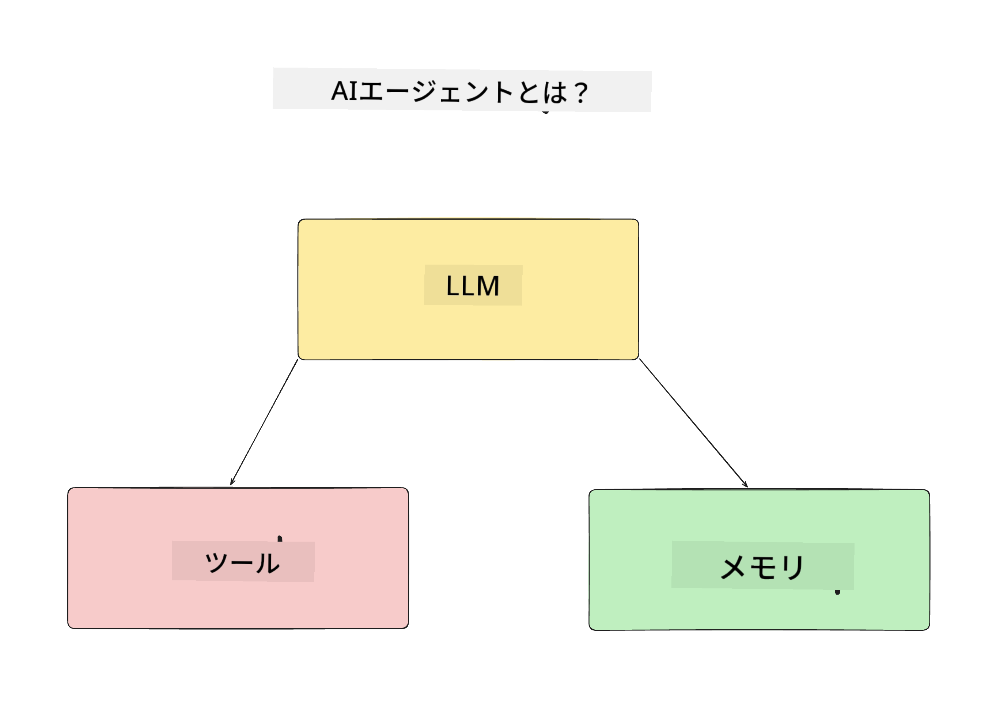
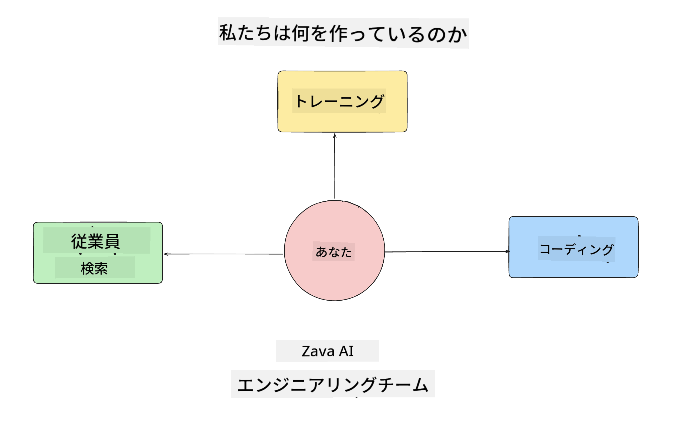
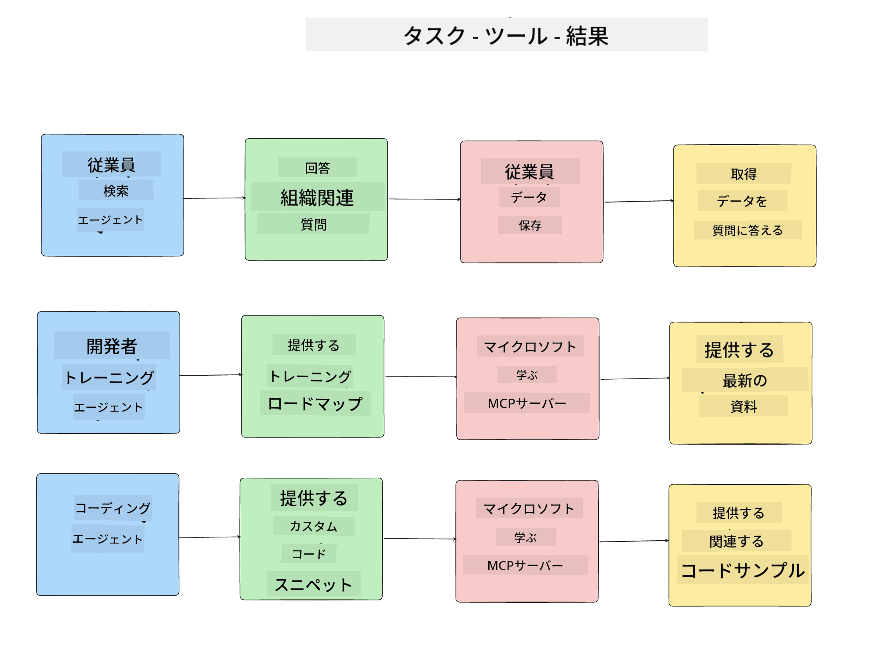
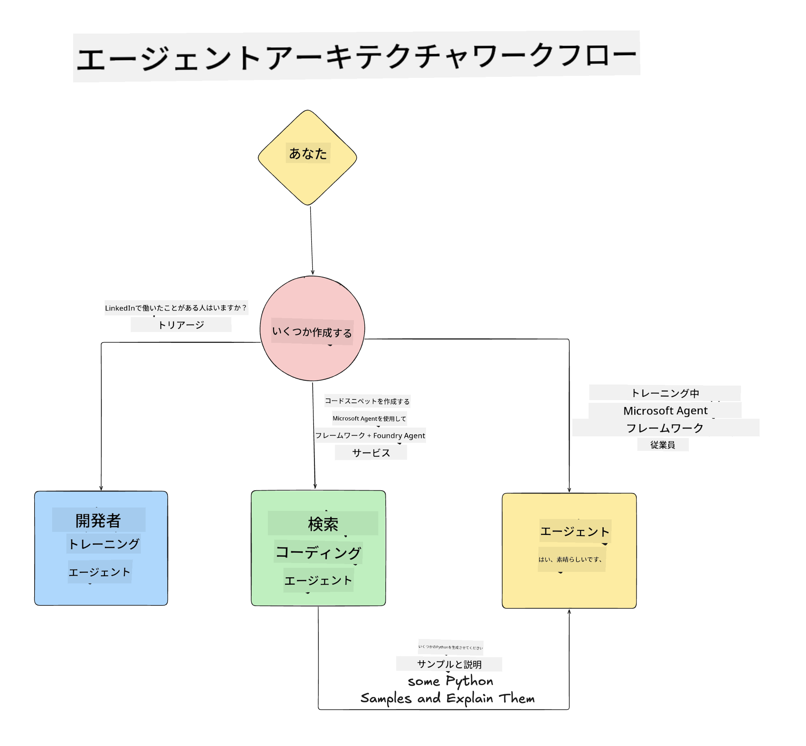

<!--
CO_OP_TRANSLATOR_METADATA:
{
  "original_hash": "99c07849641a850775c188c9333f31e5",
  "translation_date": "2025-12-12T18:20:24+00:00",
  "source_file": "lesson-1-agent-design/README.md",
  "language_code": "ja"
}
-->
# レッスン 1: AIエージェント設計

「ゼロからプロダクションまでのAIエージェント構築コース」の最初のレッスンへようこそ！

このレッスンでは以下をカバーします：

- AIエージェントとは何かの定義
  
- 私たちが構築するAIエージェントアプリケーションの説明  

- 各エージェントに必要なツールとサービスの特定
  
- エージェントアプリケーションのアーキテクチャ設計
  
まずはエージェントとは何か、そしてなぜアプリケーション内でそれらを使うのかを定義することから始めましょう。

## AIエージェントとは？

もしAIエージェントの構築を初めて探求するなら、AIエージェントを正確に定義する方法について疑問があるかもしれません。

AIエージェントを構成する要素によって簡単に定義すると：

**大規模言語モデル（LLM）** - LLMは、ユーザーからの自然言語を処理して彼らが完了したいタスクを解釈する能力と、タスクを完了するために利用可能なツールの説明を解釈する能力の両方を支えます。

**ツール** - これらは関数、API、データストア、その他のサービスであり、LLMがユーザーから要求されたタスクを完了するために選択して使用できます。

**メモリ** - これはAIエージェントとユーザー間の短期および長期のやり取りを保存する方法です。この情報の保存と取得は、改善を行いユーザーの好みを時間とともに保存するために重要です。

## 私たちのAIエージェントのユースケース

このコースでは、新しい開発者が私たちのAIエージェント開発チームにオンボードするのを支援するAIエージェントアプリケーションを構築します！

開発作業を始める前に、成功するAIエージェントアプリケーションを作成するための最初のステップは、ユーザーがAIエージェントとどのように連携することを期待しているかの明確なシナリオを定義することです。

このアプリケーションでは、以下のシナリオで作業します：

**シナリオ 1**：新しい従業員が組織に参加し、参加したチームについてもっと知りたい、そしてどのように連絡を取るかを知りたい。

**シナリオ 2**：新しい従業員が最初に取り組むべき最適なタスクを知りたい。

**シナリオ 3**：新しい従業員がこのタスクを完了するために役立つ学習リソースやコードサンプルを集めたい。

## ツールとサービスの特定

これらのシナリオが作成されたので、次のステップはそれらをAIエージェントがタスクを完了するために必要なツールとサービスにマッピングすることです。

このプロセスはコンテキストエンジニアリングのカテゴリーに属し、AIエージェントがタスクを完了するために適切なタイミングで適切なコンテキストを持つことに焦点を当てます。

シナリオごとに進めて、各エージェントのタスク、ツール、望ましい成果をリストアップして良いエージェント設計を行いましょう。

### シナリオ 1 - 従業員検索エージェント

**タスク** - 組織内の従業員に関する質問に答える（入社日、現在のチーム、勤務地、最終ポジションなど）。

**ツール** - 現在の従業員リストと組織図のデータストア

**成果** - データストアから情報を取得し、一般的な組織に関する質問や特定の従業員に関する質問に答えられる。

### シナリオ 2 - タスク推薦エージェント

**タスク** - 新しい従業員の開発者経験に基づいて、新しい従業員が取り組める1～3件の課題を提案する。

**ツール** - GitHub MCPサーバーを使ってオープンイシューを取得し、開発者プロフィールを構築する。

**成果** - GitHubプロフィールの直近5件のコミットとGitHubプロジェクトのオープンイシューを読み取り、マッチに基づいて推薦を行う。

### シナリオ 3 - コードアシスタントエージェント

**タスク** - 「タスク推薦」エージェントが推奨したオープンイシューに基づき、リソースを調査し、従業員を支援するコードスニペットを生成する。

**ツール** - Microsoft Learn MCPでリソースを探し、Code Interpreterでカスタムコードスニペットを生成する。

**成果** - ユーザーが追加の支援を求めた場合、ワークフローはLearn MCPサーバーを使ってリソースへのリンクとスニペットを提供し、その後Code Interpreterエージェントに引き継いで小さなコードスニペットと説明を生成する。

## エージェントアプリケーションのアーキテクチャ設計

各エージェントを定義したので、次に各エージェントがタスクに応じてどのように連携し、または独立して動作するかを理解するためのアーキテクチャ図を作成しましょう：

## 次のステップ

各エージェントとエージェントシステムの設計ができたので、次のレッスンに進み、これらのエージェントを開発していきましょう！

---

<!-- CO-OP TRANSLATOR DISCLAIMER START -->
**免責事項**：  
本書類はAI翻訳サービス「Co-op Translator」（https://github.com/Azure/co-op-translator）を使用して翻訳されました。正確性の向上に努めておりますが、自動翻訳には誤りや不正確な部分が含まれる可能性があります。原文の言語によるオリジナル文書が正式な情報源とみなされるべきです。重要な情報については、専門の人間による翻訳を推奨します。本翻訳の利用により生じた誤解や誤訳について、当方は一切の責任を負いかねます。
<!-- CO-OP TRANSLATOR DISCLAIMER END -->