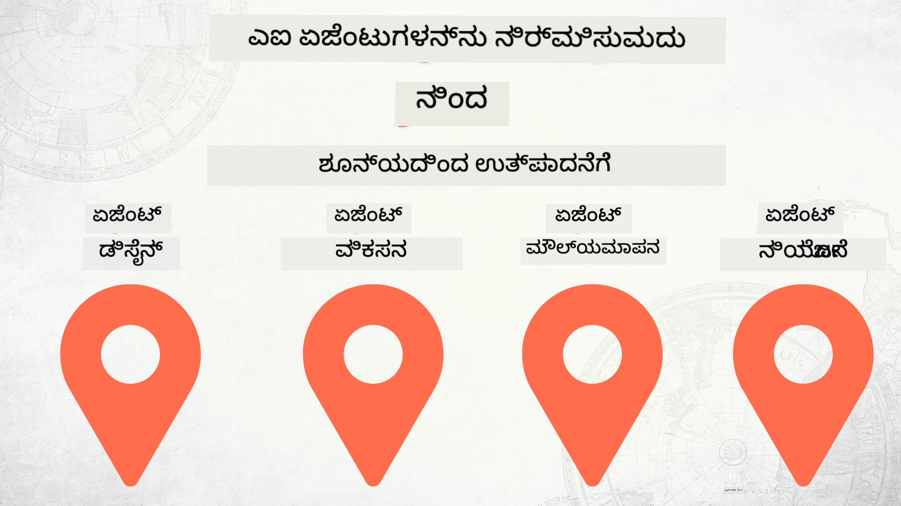

<!--
CO_OP_TRANSLATOR_METADATA:
{
  "original_hash": "73b37a335747d59d319b00aac130f073",
  "translation_date": "2025-12-25T00:22:33+00:00",
  "source_file": "README.md",
  "language_code": "kn"
}
-->
# ಶೂನ್ಯದಿಂದ ಉತ್ಪಾದನೆಗೆ AI ಏಜೆಂಟ್ಸ್ নির্মಿಸುವುದು

### 🌐 ಬಹುಭಾಷಾ ಬೆಂಬಲ

#### GitHub Action ಮೂಲಕ ಬೆಂಬಲ (ಸ್ವಯಂಚಾಲಿತ ಮತ್ತು ಸದಾ ನವೀಕರಿಸಿರುವ)

<!-- CO-OP TRANSLATOR LANGUAGES TABLE START -->
[ಅರೆಬಿಕ್](../ar/README.md) | [ಬೆಂಗಾಲಿ](../bn/README.md) | [ಬಲ್ಗೇರಿಯನ್](../bg/README.md) | [ಬರ್ಮೀಸ್ (ಮ್ಯಾಂಮಾರ್)](../my/README.md) | [ಚೀನಿ (ಸರಳೀಕೃತ)](../zh/README.md) | [ಚೀನಿ (ಸಾಂಪ್ರದಾಯಿಕ, ಹಾಂಗ್‌ ಕಾಂಗ್)](../hk/README.md) | [ಚೀನಿ (ಸಾಂಪ್ರದಾಯಿಕ, ಮಕಾವು)](../mo/README.md) | [ಚೀನಿ (ಸಾಂಪ್ರದಾಯಿಕ, ತೈವಾನ್)](../tw/README.md) | [ಕ್ರೊಯೇಷಿಯನ್](../hr/README.md) | [ಚೆಕ್](../cs/README.md) | [ಡೆನಿಶ್](../da/README.md) | [ಡಚ್](../nl/README.md) | [ಎಸ್ಟೋನಿಯನ್](../et/README.md) | [ಫಿನ್ನಿಶ್](../fi/README.md) | [ಫ್ರೆಂಚ್](../fr/README.md) | [ಜರ್ಮನ್](../de/README.md) | [ಗ್ರೀಕ್](../el/README.md) | [ಹೆಬ್ರ್ಯೂ](../he/README.md) | [ಹಿಂದಿ](../hi/README.md) | [ಹಂಗೇರಿಯನ್](../hu/README.md) | [ಇಂಡೋನೇಶಿಯನ್](../id/README.md) | [ಇಟಾಲಿಯನ್](../it/README.md) | [ಜಪಾನೀಸ್](../ja/README.md) | [ಕನ್ನಡ](./README.md) | [ಕೊರಿಯನ್](../ko/README.md) | [ಲಿಥುವೇनಿಯನ್](../lt/README.md) | [ಮಲಯ್](../ms/README.md) | [ಮಲಯಾಳಂ](../ml/README.md) | [ಮರಾಠೀ](../mr/README.md) | [ನೇಪಾಳಿ](../ne/README.md) | [ನೈಜೀರಿಯನ್ ಪಿಡ್ಗಿನ್](../pcm/README.md) | [ನಾರ್ವೇಜಿಯನ್](../no/README.md) | [ಪರ್ಶಿಯನ್ (ಫಾರ್ಸಿ)](../fa/README.md) | [ಪೋಲಿಷ್](../pl/README.md) | [ಪೋರ್ಚುಗೀಸ್ (ಬ್ರೆಜಿಲ್)](../br/README.md) | [ಪೋರ್ಚುಗೀಸ್ (ಪೋರ್ಟುಗಲ್)](../pt/README.md) | [ਪੰਜਾਬੀ (ಗುರ್ಮುಖಿ)](../pa/README.md) | [ರೊಮೇನಿಯನ್](../ro/README.md) | [ರಷ್ಯನ್](../ru/README.md) | [ಸರ್ಬಿಯನ್ (ಸಿರಿಲಿಕ್)](../sr/README.md) | [ಸ್ಲೊವಾಕ್](../sk/README.md) | [ಸ್ಲೊವೆನಿಯನ್](../sl/README.md) | [ಸ್ಪ್ಯಾನಿಷ್](../es/README.md) | [ಸ್ವಾಹಿಲಿ](../sw/README.md) | [ಸ್ವೀಡಿಷ್](../sv/README.md) | [ಟಾಗಲೊಗ್ (ಫಿಲಿಪಿನೋ)](../tl/README.md) | [ತಮಿಳು](../ta/README.md) | [ತೆಲುಗು](../te/README.md) | [ಥಾಯ್](../th/README.md) | [ಟರ್ಕಿಶ್](../tr/README.md) | [ಉಕ್ರೇನಿಯನ್](../uk/README.md) | [ಉର್ದು](../ur/README.md) | [ವಿಯೆಟ್ನಾಮೀಸ್](../vi/README.md)
<!-- CO-OP TRANSLATOR LANGUAGES TABLE END -->

## AI ಏಜೆಂಟ್ ಅಭಿವೃದ್ಧಿ ಜೀವನಚಕ್ರದ ಮೂಲಭೂತ ತತ್ವಗಳನ್ನು ಕಲಿಸುವ ಕೋರ್ಸ್

## 🌱 ಪ್ರಾರಂಭಿಸುವುದು

ಈ ಕೋರ್ಸ್‌에는 AI ಏಜೆಂಟ್ಸ್ ನಿರ್ಮಿಸುವ ಮತ್ತು ನಿಯೋಜಿಸುವ ಮೂಲಭೂತ ವಿಷಯಗಳನ್ನು ಒಳಗೊಂಡ ಪಾಠಗಳಿವೆ.

ಪ್ರತಿಯೊಂದು ಪಾಠವೂ ಮೊದಲು ಇದ್ದದನ್ನು ಆಧರಿಸುತ್ತದೆ, ಆದ್ದರಿಂದ ನಾವು ಆರಂಭದಿಂದಲೇ ಪ್ರಾರಂಭಿಸಿ ಅಂತಿಮವರೆಗೆ ಕ್ರಮವಾಗಿ ಕಲಿಯುವುದನ್ನು ಶಿಫಾರಸು ಮಾಡುತ್ತೇವೆ.

ನೀವು AI ಏಜೆಂಟ್ ವಿಷಯಗಳನ್ನು ಇನ್ನಷ್ಟು ಅನ್ವೇಷಿಸಲು ಇಚ್ಛಿಸಿದರೆ, ನೀವು [AI Agents For Beginenrs Course](https://aka.ms/ai-agents-beginners) ಅನ್ನು ನೋಡಬಹುದು.

### ಇತರ ಕಲಿಯುವವರನ್ನು ಭೇಟಿ ಮಾಡಿ, ನಿಮ್ಮ ಪ್ರಶ್ನೆಗಳಿಗೆ ಉತ್ತರಗಳನ್ನು ಪಡೆಯಿರಿ

ನೀವು ಅಡ್ಡಬಡ್ಡಿಯಾಗಿದ್ದರೆ ಅಥವಾ AI ಏಜೆಂಟ್‌ಗಳನ್ನು ನಿರ್ಮಿಸುವ ಕುರಿತು ಯಾವುದೇ ಪ್ರಶ್ನೆಗಳು ಇದ್ದರೆ, ನಮ್ಮ ಸಮರ್ಪಿತ Discord ಚಾನೆಲ್‌ಗೆ [Microsoft Foundry Discord](https://discord.gg/Kuaw3ktsu6) ಸೇರಿ.

### ನಿಮಗೆ ಬೇಕಾಗುವವು

ಪ್ರತಿ ಪಾಠಕ್ಕೆ ಅದರದೇνας ಕೋಡ್ ಉದಾಹರಣೆಗಳಿವೆ, ಅವನ್ನು ನೀವು ಸ್ಥಳೀಯವಾಗಿ ರನ್ ಮಾಡಬಹುದು. ನಿಮ್ಮ ಸ್ವಂತ ಪ್ರತಿಯನ್ನು ರಚಿಸಲು ನೀವು [fork this repo](https://github.com/microsoft/Building-AI-Agents-From-Zero-To-Production/fork) ಮಾಡಬಹುದು.

ಈ ಕೋರ್ಸ್ ಪ್ರಸ್ತುತ ಕೆಳಕಂಡವುಗಳನ್ನು ಬಳಸುತ್ತದೆ:

- [Microsoft Agent Framework (MAF)](https://aka.ms/ai-agents-beginners/agent-framework)
- [Microsoft Foundry](https://azure.microsoft.com/products/ai-foundry)
- [Azure OpenAI Service](https://azure.microsoft.com/products/ai-foundry/models/openai)
- [Azure CLI](https://learn.microsoft.com/cli/azure/authenticate-azure-cli?view=azure-cli-latest)

ದಯವಿಟ್ಟು ಆರಂಭಿಸುವ ಮೊದಲು ಈ ಸೇವೆಗಳಿಗೆ ನಿಮ್ಮನ್ನು ಪ್ರವೇಶವಿರುವುದು ಖಚಿತಪಡಿಸಿಕೊಳ್ಳಿ.

ಮಾದೆಲ್ ಹೋಸ್ಟಿಂಗ್ ಮತ್ತು ಸೇವೆಗಳ ಬಗ್ಗೆ ಇನ್ನಷ್ಟು ಆಯ್ಕೆಗಳು ಶೀಘ್ರದಲ್ಲೇ ಬರುತ್ತವೆ. 

## 🗃️ ಪಾಠಗಳು

| **ಪಾಠ**         | **ವಿವರಣೆ**                                                                                  |
|--------------------|--------------------------------------------------------------------------------------------------|
| [ಏಜೆಂಟ್ ವಿನ್ಯಾಸ](./lesson-1-agent-design/README.md)       | ನಮ್ಮ "Developer Onboarding" ಏಜೆಂಟ್ ಬಳಕೆ ಪ್ರಕರಣದ ಪರಿಚಯ ಮತ್ತು ಪರಿಣಾಮಕಾರಿಯಾದ ಏಜೆಂಟ್‌ಗಳನ್ನು ವಿನ್ಯಾಸಗೊಳಿಸುವ ವಿಧಾನ  |
| [ಏಜೆಂಟ್ ಅಭಿವೃದ್ಧಿ](./lesson-2-agent-development/README.md)  | Microsoft Agent Framework (MAF) ಬಳಸಿ, ಹೊಸ ಅಭಿವೃದ್ಧಿಗಾರರನ್ನು onboarding ಮಾಡಲು 3 ಏಜೆಂಟ್‌ಗಳನ್ನು ರಚಿಸಿ.       |
| [ಏಜೆಂಟ್ ಮೌಲ್ಯಮಾಪನ](./lesson-3-agent-evals/README.md)  | Microsoft Foundry ಅನ್ನು ಬಳಸಿ, ನಮ್ಮ AI ಏಜೆಂಟ್‌ಗಳು ಎಷ್ಟು ಉತ್ತಮವಾಗಿ ಕಾರ್ಯನಿರ್ವಹಿಸುತ್ತಿವೆ ಮತ್ತು ಅವುಗಳನ್ನು ಹೇಗೆ ಸುಧರಿಸಬಹುದು ಎಂಬುದನ್ನು ಕಂಡುಹಿಡಿಯಿರಿ. |
| [ಏಜೆಂಟ್ ನಿಯೋಜನೆ](./lesson-4-agent-deployment/README.md)   | Hosted Agents ಮತ್ತು OpenAI Chatkit ಬಳಸಿ, AI ಏಜೆಂಟ್ ಅನ್ನು ಉತ್ಪಾದನೆಗೆ ಹೇಗೆ ನಿಯೋಜಿಸಬಹುದು ಎಂಬುದನ್ನು ನೋಡಿ.       |

## 🎒 ಇತರೆ ಕೋರ್ಸ್‌ಗಳು

ನಮ್ಮ ತಂಡ ಇತರೆ ಕೋರ್ಸ್‌ಗಳನ್ನು ಕೂಡ ರಚಿಸುತ್ತದೆ! ಇವನ್ನು ಪರಿಶೀಲಿಸಿ:

<!-- CO-OP TRANSLATOR OTHER COURSES START -->
### LangChain

---

### Azure / Edge / MCP / ಏಜೆಂಟ್ಸ್

---
 
### ಜನರೇಟಿವ್ AI ಸರಣಿ

[-9333EA?style=for-the-badge&labelColor=E5E7EB&color=9333EA)](https://github.com/microsoft/Generative-AI-for-beginners-dotnet?WT.mc_id=academic-105485-koreyst)
[-C084FC?style=for-the-badge&labelColor=E5E7EB&color=C084FC)](https://github.com/microsoft/generative-ai-for-beginners-java?WT.mc_id=academic-105485-koreyst)
[-E879F9?style=for-the-badge&labelColor=E5E7EB&color=E879F9)](https://github.com/microsoft/generative-ai-with-javascript?WT.mc_id=academic-105485-koreyst)

---
 
### ಮೂಲಭೂತ ಅಧ್ಯಯನ

---
 
### Copilot ಸರಣಿ

<!-- CO-OP TRANSLATOR OTHER COURSES END -->

## ಕೊಡುಗೆ

ಈ ಯೋಜನೆ ಕೊಡುಗೆಗಳು ಮತ್ತು ಸಲಹೆಗಳನ್ನು ಸ್ವಾಗತಿಸುತ್ತದೆ. ಬಹುತೇಕ ಕೊಡುಗೆಗಳಿಗೆ ನೀವು Contributor License Agreement (CLA) ಒಪ್ಪಿಕೊಳ್ಳಬೇಕಾಗುತ್ತದೆ, ಇದು ನೀವು ನಿಮ್ಮ ಕೊಡುಗಿಯನ್ನು ಬಳಸಲು ನಮ್ಮಗೆ ಹಕ್ಕುಗಳನ್ನು ನೀಡಲು ಹಕ್ಕು ಹೊಂದಿದ್ದೀರಿ ಮತ್ತು ವಾಸ್ತವದಲ್ಲಿ ಹಕ್ಕುಗಳನ್ನು ನೀಡುತ್ತಿದ್ದೀರಿ ಎಂದು ಘೋಷಿಸುತ್ತದೆ. ವಿವರಗಳಿಗಾಗಿ, <https://cla.opensource.microsoft.com> ಅನ್ನು ಭೇಟಿ ಮಾಡಿ.

ನೀವು pull request ಸಲ್ಲಿಸಿದಾಗ, CLA ಬಾಟ್ ಸ್ವಯಂಚಾಲಿತವಾಗಿ ನೀವು CLA ಒದಗಿಸಬೇಕಿದೆಯೇ ಎಂಬುದನ್ನು ನಿರ್ಧರಿಸಿಸಿ PR ಅನ್ನು ತಕ್ಕಂತೆ ಅಲಂಕರಿಸುತ್ತದೆ (ಉದಾ., status check, comment). ಬಾಟ್ ನೀಡುವ ಸೂಚನೆಗಳನ್ನು ಅನುಸರಿಸಿ. ನಮ್ಮ CLA ಅನ್ನು ಬಳಸುತ್ತಿರುವ ಎಲ್ಲಾ ರೆಪೊಗಳಲ್ಲಿ ಇದನ್ನು ನಿಮಗೆ ಒಂದೇ ಬಾರಿ ಮಾತ್ರ ಮಾಡಬೇಕಾಗುತ್ತದೆ.

ಈ ಯೋಜನೆ [Microsoft Open Source Code of Conduct](https://opensource.microsoft.com/codeofconduct/) ಅನ್ನು ಅಂಗೀಕರಿಸಿದೆ. ಹೆಚ್ಚಿನ ಮಾಹಿತಿಗೆ [ವರ್ತನೆ ಸಂಹಿತೆ FAQ](https://opensource.microsoft.com/codeofconduct/faq/) ಮುಖಪುಟವನ್ನು ನೋಡಿ ಅಥವಾ ಯಾವುದೇ ಹೆಚ್ಚುವರಿ ಪ್ರಶ್ನೆಗಳು ಅಥವಾ ಟಿಪ್ಪಣಿಗಳಿಗಾಗಿ [opencode@microsoft.com](mailto:opencode@microsoft.com) ಅನ್ನು ಸಂಪರ್ಕಿಸಿ.

## ಟ್ರೇಡ್‌ಮಾರ್ಕ್‌ಗಳು

ಈ ಯೋಜನೆ ಪ್ರಾಜೆಕ್ಟ್‌ಗಳು, ಉತ್ಪನ್ನಗಳು, ಅಥವಾ ಸೇವೆಗಳ ಟ್ರೇಡ್‌ಮಾರ್ಕ್‌ಗಳು ಅಥವಾ ಲೋಗೋಗಳನ್ನು ಒಳಗೊಂಡಿರಬಹುದು. Microsoft ಟ್ರೇಡ್‌ಮಾರ್ಕ್‌ಗಳು ಅಥವಾ ಲೋಗೋಗಳ ಅಧಿಕೃತ ಬಳಕೆವು [Microsoft ಟ್ರೇಡ್‌ಮಾರ್ಕ್ ಮತ್ತು ಬ್ರ್ಯಾಂಡ್ ಮಾರ್ಗಸೂಚಿಗಳು](https://www.microsoft.com/legal/intellectualproperty/trademarks/usage/general)ಕ್ಕೆ ಅಧೀನವಾಗಿದ್ದು ಅವನ್ನು ಅನುಸರಿಸಬೇಕು. ಈ ಯೋಜನೆಯ ತಿದ್ದುಪಡಿಸಿದ ಆವೃತ್ತಿಗಳಲ್ಲಿ Microsoft ಟ್ರೇಡ್‌ಮಾರ್ಕ್‌ಗಳು ಅಥವಾ ಲೋಗೋಗಳ ಬಳಕೆ ಗೊಂದಲ ಉಂಟುಮಾಡಬಾರದು ಅಥವಾ Microsoft ಪ್ರಾಯೋಜನೆಯನ್ನು ಸೂಚಿಸುವಂತೆ ಇರಬಾರದು. ಮೂರನೇ ಪಕ್ಷದ ಟ್ರೇಡ್‌ಮಾರ್ಕ್‌ಗಳು ಅಥವಾ ಲೋಗೋಗಳ ಯಾವುದೇ ಬಳಕೆ ಆ ತೃತೀಯ ಪಕ್ಷಗಳ ನೀತಿಗಳಿಗೆ ಅಧೀನವಾಗಿರುತ್ತದೆ.

## ಸಹಾಯ ಪಡೆಯುವುದು

AI ಆಪ್‌ಗಳನ್ನು ನಿರ್ಮಿಸುವ ಬಗ್ಗೆ ನೀವು ಅಡೆತಡೆಗೆ ಒಳಗಾದರೆ ಅಥವಾ ಯಾವುದೇ ಪ್ರಶ್ನೆಗಳಿದ್ದರೆ, ಸೇರಿ:

ನೀವು ಉತ್ಪನ್ನದ ಪ್ರತಿಕ್ರಿಯೆ ಅಥವಾ ನಿರ್ಮಾಣ ಸಂದರ್ಭದಲ್ಲಿ ದೋಷಗಳನ್ನು ಕಂಡುಹಿಡಿದರೆ, ಭೇಟಿ ನೀಡಿ:

---

<!-- CO-OP TRANSLATOR DISCLAIMER START -->
ಜವಾಬ್ದಾರಿ ನಿರಾಕರಣೆ:
ಈ ದಾಖಲೆ AI ಅನುವಾದ ಸೇವೆ Co-op Translator (https://github.com/Azure/co-op-translator) ಬಳಸಿ ಅನುವಾದಿಸಲಾಗಿದೆ. ನಾವು ನಿಖರತೆಯನ್ನು ಭದ್ರಪಡಿಸಲು ಯತ್ನಿಸುತ್ತಿದ್ದರೂ, ದಯವಿಟ್ಟು ಗಮನಿಸಿ ಸ್ವಯಂಚಾಲಿತ ಅನುವಾದಗಳಲ್ಲಿ ತಪ್ಪುಗಳು ಅಥವಾ ಅಸಂಗತತೆಗಳು ಇರಬಹುದಾಗಿದೆ. ಮೂಲ ಭಾಷೆಯಲ್ಲಿರುವ ಮೂಲ ದಾಖಲೆ ಅಧಿಕೃತ ಮತ್ತು ಪ್ರಾಮಾಣಿಕ ಮೂಲವೆಂದು ಪರಿಗಣಿಸಬೇಕು. ಪ್ರಮುಖ ಮಾಹಿತಿಗಾಗಿ ವೃತ್ತಿಪರ ಮಾನವ ಅನುವಾದವನ್ನು ಶಿಫಾರಸು ಮಾಡಲಾಗುತ್ತದೆ. ಈ ಅನುವಾದವನ್ನು ಬಳಸಿದರೆ ಉಂಟಾಗುವ ಯಾವುದೇ ಅರ್ಥಭ್ರಮೆ ಅಥವಾ ತಪ್ಪು ವಿಭಾಷಣೆಯಕ್ಕಾಗಿ ನಾವು ಜವಾಬ್ದಾರಿಯಾಗುವುದಿಲ್ಲ.
<!-- CO-OP TRANSLATOR DISCLAIMER END -->