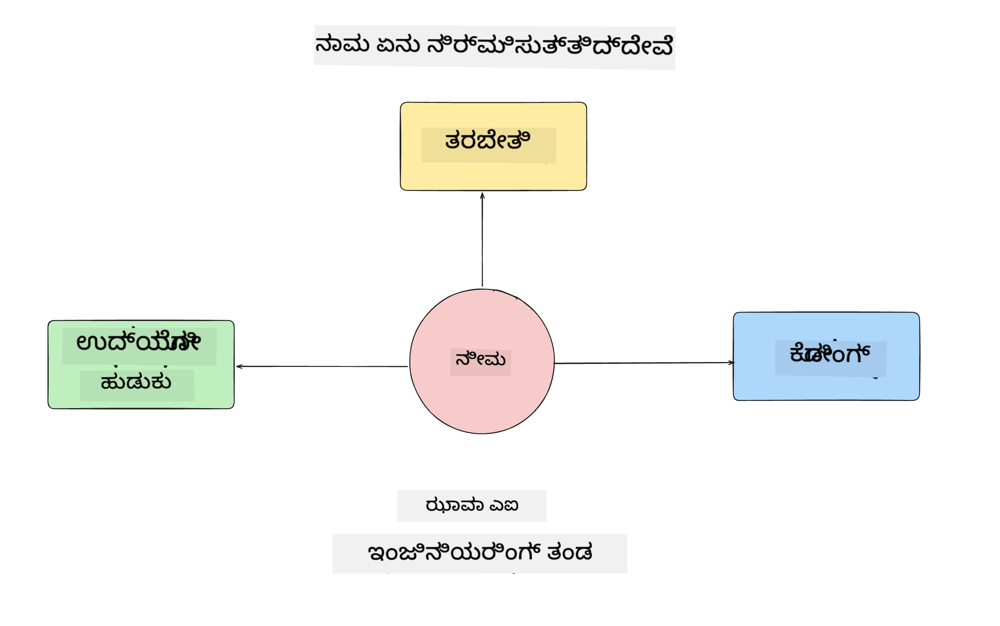
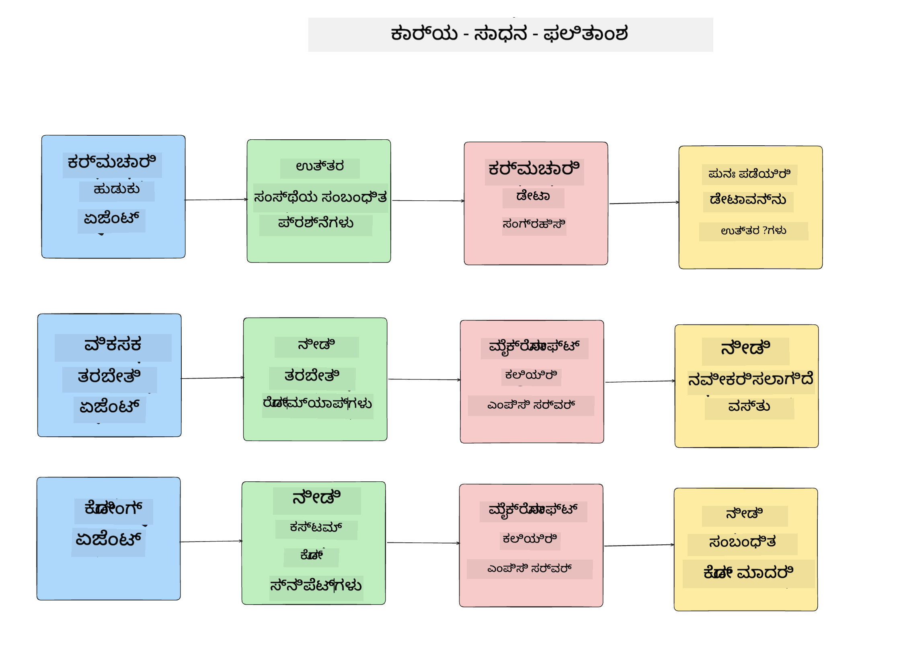
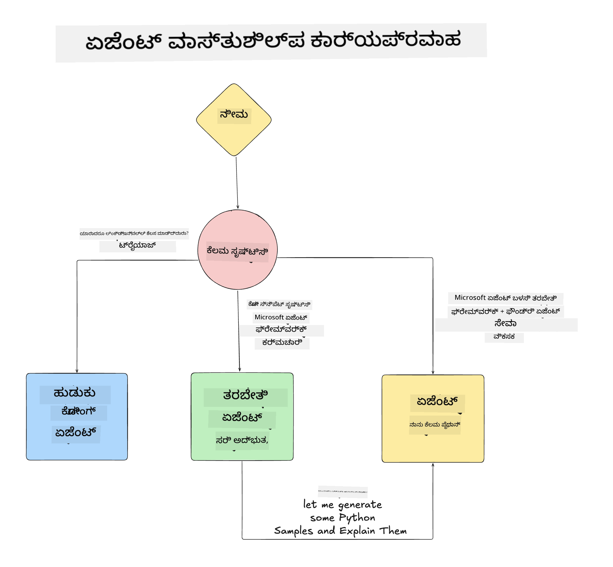

<!--
CO_OP_TRANSLATOR_METADATA:
{
  "original_hash": "99c07849641a850775c188c9333f31e5",
  "translation_date": "2025-12-12T18:48:00+00:00",
  "source_file": "lesson-1-agent-design/README.md",
  "language_code": "kn"
}
-->
# ಪಾಠ 1: AI ಏಜೆಂಟ್ ವಿನ್ಯಾಸ

"ಶೂನ್ಯದಿಂದ ಉತ್ಪಾದನೆಗೆ AI ಏಜೆಂಟ್ ನಿರ್ಮಾಣ ಕೋರ್ಸ್"ನ ಮೊದಲ ಪಾಠಕ್ಕೆ ಸ್ವಾಗತ!

ಈ ಪಾಠದಲ್ಲಿ ನಾವು ಈ ವಿಷಯಗಳನ್ನು ಆವರಿಸುವೆವು:

- AI ಏಜೆಂಟ್‌ಗಳು ಏನು ಎಂದು ವ್ಯಾಖ್ಯಾನಿಸುವುದು
  
- ನಾವು ನಿರ್ಮಿಸುತ್ತಿರುವ AI ಏಜೆಂಟ್ ಅಪ್ಲಿಕೇಶನ್ ಬಗ್ಗೆ ಚರ್ಚಿಸುವುದು  

- ಪ್ರತಿ ಏಜೆಂಟ್‌ಗೆ ಅಗತ್ಯವಿರುವ ಸಾಧನಗಳು ಮತ್ತು ಸೇವೆಗಳನ್ನು ಗುರುತಿಸುವುದು
  
- ನಮ್ಮ ಏಜೆಂಟ್ ಅಪ್ಲಿಕೇಶನ್‌ನ ವಾಸ್ತುಶಿಲ್ಪವನ್ನು ರೂಪಿಸುವುದು
  
ನಾವು ಏಜೆಂಟ್‌ಗಳು ಏನು ಮತ್ತು ಅವುಗಳನ್ನು ಅಪ್ಲಿಕೇಶನ್ ಒಳಗೆ ಯಾಕೆ ಬಳಸಬೇಕು ಎಂಬುದನ್ನು ವ್ಯಾಖ್ಯಾನಿಸುವುದರಿಂದ ಪ್ರಾರಂಭಿಸೋಣ.

## AI ಏಜೆಂಟ್‌ಗಳು ಏನು?

ನೀವು ಮೊದಲ ಬಾರಿಗೆ AI ಏಜೆಂಟ್ ಅನ್ನು ಹೇಗೆ ನಿರ್ಮಿಸುವುದನ್ನು ಅನ್ವೇಷಿಸುತ್ತಿದ್ದರೆ, AI ಏಜೆಂಟ್ ಎಂದರೇನು ಎಂಬುದನ್ನು ನಿಖರವಾಗಿ ವ್ಯಾಖ್ಯಾನಿಸುವ ಬಗ್ಗೆ ಪ್ರಶ್ನೆಗಳು ಇರಬಹುದು.

AI ಏಜೆಂಟ್ ಎಂದರೇನು ಎಂಬುದನ್ನು ಸರಳವಾಗಿ ವ್ಯಾಖ್ಯಾನಿಸುವುದು ಅದರ ಘಟಕಗಳ ಮೂಲಕ:

**ದೊಡ್ಡ ಭಾಷಾ ಮಾದರಿ** - LLM ಬಳಕೆದಾರರಿಂದ ಸ್ವಾಭಾವಿಕ ಭಾಷೆಯನ್ನು ಪ್ರಕ್ರಿಯೆಗೊಳಿಸುವ ಸಾಮರ್ಥ್ಯವನ್ನು ಮತ್ತು ಅವುಗಳನ್ನು ಪೂರ್ಣಗೊಳಿಸಲು ಲಭ್ಯವಿರುವ ಸಾಧನಗಳ ವಿವರಣೆಗಳನ್ನು ಅರ್ಥಮಾಡಿಕೊಳ್ಳುವ ಸಾಮರ್ಥ್ಯವನ್ನು ಒದಗಿಸುತ್ತದೆ.

**ಸಾಧನಗಳು** - ಇವು ಕಾರ್ಯಗಳನ್ನು ಪೂರ್ಣಗೊಳಿಸಲು LLM ಬಳಸಬಹುದಾದ ಕಾರ್ಯಗಳು, APIಗಳು, ಡೇಟಾ ಸಂಗ್ರಹಣೆಗಳು ಮತ್ತು ಇತರ ಸೇವೆಗಳಾಗಿವೆ.

**ಸ್ಮೃತಿ** - ಇದು AI ಏಜೆಂಟ್ ಮತ್ತು ಬಳಕೆದಾರರ ನಡುವೆ ಕಿರು ಮತ್ತು ದೀರ್ಘಕಾಲಿಕ ಸಂವಹನಗಳನ್ನು ಸಂಗ್ರಹಿಸುವ ವಿಧಾನ. ಈ ಮಾಹಿತಿಯನ್ನು ಸಂಗ್ರಹಿಸುವುದು ಮತ್ತು ಹಿಂತಿರುಗಿಸುವುದು ಸುಧಾರಣೆಗಳನ್ನು ಮಾಡಲು ಮತ್ತು ಬಳಕೆದಾರರ ಪ್ರಾಧಾನ್ಯತೆಗಳನ್ನು ಉಳಿಸಲು ಮುಖ್ಯವಾಗಿದೆ.

## ನಮ್ಮ AI ಏಜೆಂಟ್ ಬಳಕೆ ಪ್ರಕರಣ

ಈ ಕೋರ್ಸ್‌ಗಾಗಿ, ನಾವು ಹೊಸ ಡೆವಲಪರ್‌ಗಳು ನಮ್ಮ AI ಏಜೆಂಟ್ ಅಭಿವೃದ್ಧಿ ತಂಡಕ್ಕೆ ಸೇರಲು ಸಹಾಯ ಮಾಡುವ AI ಏಜೆಂಟ್ ಅಪ್ಲಿಕೇಶನ್ ಅನ್ನು ನಿರ್ಮಿಸಲಿದ್ದೇವೆ!

ಯಾವುದೇ ಅಭಿವೃದ್ಧಿ ಕೆಲಸವನ್ನು ಮಾಡುವ ಮೊದಲು, ಯಶಸ್ವಿ AI ಏಜೆಂಟ್ ಅಪ್ಲಿಕೇಶನ್ ರಚನೆಗೆ ಮೊದಲ ಹಂತವೆಂದರೆ, ನಮ್ಮ ಬಳಕೆದಾರರು AI ಏಜೆಂಟ್‌ಗಳೊಂದಿಗೆ ಹೇಗೆ ಕೆಲಸ ಮಾಡಲಿದ್ದಾರೆ ಎಂಬ ಸ್ಪಷ್ಟ ದೃಶ್ಯಗಳನ್ನು ವ್ಯಾಖ್ಯಾನಿಸುವುದು.

ಈ ಅಪ್ಲಿಕೇಶನ್‌ಗೆ, ನಾವು ಈ ದೃಶ್ಯಗಳೊಂದಿಗೆ ಕೆಲಸ ಮಾಡುತ್ತೇವೆ:

**ದೃಶ್ಯ 1**: ಹೊಸ ಉದ್ಯೋಗಿ ನಮ್ಮ ಸಂಸ್ಥೆಗೆ ಸೇರಿ, ಅವರು ಸೇರಿರುವ ತಂಡ ಮತ್ತು ಅದಕ್ಕೆ ಹೇಗೆ ಸಂಪರ್ಕಿಸಬೇಕೆಂಬುದನ್ನು ತಿಳಿದುಕೊಳ್ಳಲು ಬಯಸುತ್ತಾರೆ.

**ದೃಶ್ಯ 2:** ಹೊಸ ಉದ್ಯೋಗಿ ಅವರಿಗೆ ಆರಂಭಿಸಲು ಉತ್ತಮ ಮೊದಲ ಕಾರ್ಯ ಏನು ಎಂದು ತಿಳಿದುಕೊಳ್ಳಲು ಬಯಸುತ್ತಾರೆ.

**ದೃಶ್ಯ 3:** ಹೊಸ ಉದ್ಯೋಗಿ ಈ ಕಾರ್ಯವನ್ನು ಪೂರ್ಣಗೊಳಿಸಲು ಸಹಾಯ ಮಾಡುವ ಕಲಿಕೆ ಸಂಪನ್ಮೂಲಗಳು ಮತ್ತು ಕೋಡ್ ಮಾದರಿಗಳನ್ನು ಸಂಗ್ರಹಿಸಲು ಬಯಸುತ್ತಾರೆ.

## ಸಾಧನಗಳು ಮತ್ತು ಸೇವೆಗಳನ್ನು ಗುರುತಿಸುವುದು

ಈ ದೃಶ್ಯಗಳನ್ನು ರಚಿಸಿದ ನಂತರ, ಮುಂದಿನ ಹಂತವೆಂದರೆ ಈ ಕಾರ್ಯಗಳನ್ನು ಪೂರ್ಣಗೊಳಿಸಲು ನಮ್ಮ AI ಏಜೆಂಟ್‌ಗಳಿಗೆ ಬೇಕಾಗುವ ಸಾಧನಗಳು ಮತ್ತು ಸೇವೆಗಳನ್ನು ನಕ್ಷೆಗೊಳಿಸುವುದು.

ಈ ಪ್ರಕ್ರಿಯೆ "ಸಂದರ್ಭ ಇಂಜಿನಿಯರಿಂಗ್" ಎಂಬ ವರ್ಗಕ್ಕೆ ಸೇರಿದ್ದು, ನಾವು AI ಏಜೆಂಟ್‌ಗಳಿಗೆ ಸರಿಯಾದ ಸಮಯದಲ್ಲಿ ಸರಿಯಾದ ಸಂದರ್ಭವನ್ನು ಒದಗಿಸುವುದರ ಮೇಲೆ ಗಮನಹರಿಸುವೆವು.

ಪ್ರತಿ ದೃಶ್ಯವನ್ನು ಕ್ರಮವಾಗಿ ಮಾಡಿ, ಪ್ರತಿ ಏಜೆಂಟ್‌ನ ಕಾರ್ಯ, ಸಾಧನಗಳು ಮತ್ತು ಬಯಸಿದ ಫಲಿತಾಂಶಗಳನ್ನು ಪಟ್ಟಿ ಮಾಡಿ ಉತ್ತಮ ಏಜೆಂಟಿಕ್ ವಿನ್ಯಾಸವನ್ನು ಮಾಡೋಣ.

### ದೃಶ್ಯ 1 - ಉದ್ಯೋಗಿ ಹುಡುಕಾಟ ಏಜೆಂಟ್

**ಕಾರ್ಯ** - ಸಂಸ್ಥೆಯ ಉದ್ಯೋಗಿಗಳ ಬಗ್ಗೆ ಪ್ರಶ್ನೆಗಳಿಗೆ ಉತ್ತರಿಸುವುದು, ಉದಾಹರಣೆಗೆ ಸೇರಿದ ದಿನಾಂಕ, ಪ್ರಸ್ತುತ ತಂಡ, ಸ್ಥಳ ಮತ್ತು ಕೊನೆಯ ಹುದ್ದೆ.

**ಸಾಧನಗಳು** - ಪ್ರಸ್ತುತ ಉದ್ಯೋಗಿ ಪಟ್ಟಿ ಮತ್ತು ಸಂಸ್ಥೆಯ ಚಾರ್ಟ್ ಡೇಟಾಸ್ಟೋರ್

**ಫಲಿತಾಂಶಗಳು** - ಸಾಮಾನ್ಯ ಸಂಸ್ಥೆಯ ಪ್ರಶ್ನೆಗಳಿಗೆ ಮತ್ತು ಉದ್ಯೋಗಿಗಳ ಬಗ್ಗೆ ವಿಶೇಷ ಪ್ರಶ್ನೆಗಳಿಗೆ ಡೇಟಾಸ್ಟೋರ್‌ನಿಂದ ಮಾಹಿತಿ ಪಡೆಯಲು ಸಾಧ್ಯವಾಗುವುದು.

### ದೃಶ್ಯ 2 - ಕಾರ್ಯ ಶಿಫಾರಸು ಏಜೆಂಟ್

**ಕಾರ್ಯ** - ಹೊಸ ಉದ್ಯೋಗಿಯ ಡೆವಲಪರ್ ಅನುಭವದ ಆಧಾರದ ಮೇಲೆ, ಅವರು ಕೆಲಸ ಮಾಡಬಹುದಾದ 1-3 ಸಮಸ್ಯೆಗಳನ್ನು ಶಿಫಾರಸು ಮಾಡುವುದು.

**ಸಾಧನಗಳು** - GitHub MCP ಸರ್ವರ್ ಮೂಲಕ ತೆರೆಯಲಾದ ಸಮಸ್ಯೆಗಳನ್ನು ಪಡೆಯುವುದು ಮತ್ತು ಡೆವಲಪರ್ ಪ್ರೊಫೈಲ್ ನಿರ್ಮಿಸುವುದು

**ಫಲಿತಾಂಶಗಳು** - GitHub ಪ್ರೊಫೈಲ್‌ನ ಕೊನೆಯ 5 ಕಮಿಟ್‌ಗಳನ್ನು ಓದಿ, GitHub ಪ್ರಾಜೆಕ್ಟ್‌ನ ತೆರೆಯಲಾದ ಸಮಸ್ಯೆಗಳನ್ನು ಪರಿಶೀಲಿಸಿ, ಹೊಂದಾಣಿಕೆಯ ಆಧಾರದ ಮೇಲೆ ಶಿಫಾರಸುಗಳನ್ನು ಮಾಡುವುದು.

### ದೃಶ್ಯ 3 - ಕೋಡ್ ಸಹಾಯಕ ಏಜೆಂಟ್

**ಕಾರ್ಯ** - "ಕಾರ್ಯ ಶಿಫಾರಸು" ಏಜೆಂಟ್ ಶಿಫಾರಸು ಮಾಡಿದ ತೆರೆಯಲಾದ ಸಮಸ್ಯೆಗಳ ಆಧಾರದ ಮೇಲೆ, ಸಂಶೋಧನೆ ಮಾಡಿ ಸಂಪನ್ಮೂಲಗಳನ್ನು ಒದಗಿಸುವುದು ಮತ್ತು ಉದ್ಯೋಗಿಗೆ ಸಹಾಯ ಮಾಡಲು ಕೋಡ್ ಸ್ನಿಪೆಟ್‌ಗಳನ್ನು ರಚಿಸುವುದು.

**ಸಾಧನಗಳು** - Microsoft Learn MCP ಸಂಪನ್ಮೂಲಗಳನ್ನು ಹುಡುಕಲು ಮತ್ತು Code Interpreter ಕಸ್ಟಮ್ ಕೋಡ್ ಸ್ನಿಪೆಟ್‌ಗಳನ್ನು ರಚಿಸಲು.

**ಫಲಿತಾಂಶಗಳು** - ಬಳಕೆದಾರರು ಹೆಚ್ಚುವರಿ ಸಹಾಯ ಕೇಳಿದರೆ, ವರ್ಕ್‌ಫ್ಲೋ Learn MCP ಸರ್ವರ್ ಅನ್ನು ಬಳಸಿ ಸಂಪನ್ಮೂಲಗಳಿಗೆ ಲಿಂಕ್‌ಗಳು ಮತ್ತು ಸ್ನಿಪೆಟ್‌ಗಳನ್ನು ಒದಗಿಸಿ, ನಂತರ Code Interpreter ಏಜೆಂಟ್‌ಗೆ ಹಸ್ತಾಂತರಿಸಿ ಸಣ್ಣ ಕೋಡ್ ಸ್ನಿಪೆಟ್‌ಗಳನ್ನು ವಿವರಣೆಗಳೊಂದಿಗೆ ರಚಿಸುವುದು.

## ನಮ್ಮ ಏಜೆಂಟ್ ಅಪ್ಲಿಕೇಶನ್‌ನ ವಾಸ್ತುಶಿಲ್ಪ

ಪ್ರತಿ ಏಜೆಂಟ್ ಅನ್ನು ವ್ಯಾಖ್ಯಾನಿಸಿದ ನಂತರ, ಪ್ರತಿ ಏಜೆಂಟ್ ಕಾರ್ಯವನ್ನು ಹೇಗೆ ಒಟ್ಟಾಗಿ ಮತ್ತು ಪ್ರತ್ಯೇಕವಾಗಿ ನಿರ್ವಹಿಸುವುದನ್ನು ಅರ್ಥಮಾಡಿಕೊಳ್ಳಲು ವಾಸ್ತುಶಿಲ್ಪ ಚಿತ್ರವನ್ನು ರಚಿಸೋಣ:

## ಮುಂದಿನ ಹಂತಗಳು

ಪ್ರತಿ ಏಜೆಂಟ್ ಮತ್ತು ನಮ್ಮ ಏಜೆಂಟಿಕ್ ವ್ಯವಸ್ಥೆಯನ್ನು ವಿನ್ಯಾಸಗೊಳಿಸಿದ ನಂತರ, ಮುಂದಿನ ಪಾಠಕ್ಕೆ ಸಾಗೋಣ, ಅಲ್ಲಿ ನಾವು ಈ ಏಜೆಂಟ್‌ಗಳನ್ನು ಅಭಿವೃದ್ಧಿಪಡಿಸುವೆವು!

---

<!-- CO-OP TRANSLATOR DISCLAIMER START -->
**ಅಸ್ವೀಕರಣ**:  
ಈ ದಸ್ತಾವೇಜು AI ಅನುವಾದ ಸೇವೆ [Co-op Translator](https://github.com/Azure/co-op-translator) ಬಳಸಿ ಅನುವಾದಿಸಲಾಗಿದೆ. ನಾವು ನಿಖರತೆಯಿಗಾಗಿ ಪ್ರಯತ್ನಿಸುತ್ತಿದ್ದರೂ, ಸ್ವಯಂಚಾಲಿತ ಅನುವಾದಗಳಲ್ಲಿ ದೋಷಗಳು ಅಥವಾ ಅಸತ್ಯತೆಗಳು ಇರಬಹುದು ಎಂದು ದಯವಿಟ್ಟು ಗಮನಿಸಿ. ಮೂಲ ಭಾಷೆಯಲ್ಲಿರುವ ಮೂಲ ದಸ್ತಾವೇಜನ್ನು ಅಧಿಕೃತ ಮೂಲವಾಗಿ ಪರಿಗಣಿಸಬೇಕು. ಪ್ರಮುಖ ಮಾಹಿತಿಗಾಗಿ, ವೃತ್ತಿಪರ ಮಾನವ ಅನುವಾದವನ್ನು ಶಿಫಾರಸು ಮಾಡಲಾಗುತ್ತದೆ. ಈ ಅನುವಾದ ಬಳಕೆಯಿಂದ ಉಂಟಾಗುವ ಯಾವುದೇ ತಪ್ಪು ಅರ್ಥಮಾಡಿಕೊಳ್ಳುವಿಕೆ ಅಥವಾ ತಪ್ಪು ವಿವರಣೆಗಳಿಗೆ ನಾವು ಹೊಣೆಗಾರರಾಗುವುದಿಲ್ಲ.
<!-- CO-OP TRANSLATOR DISCLAIMER END -->