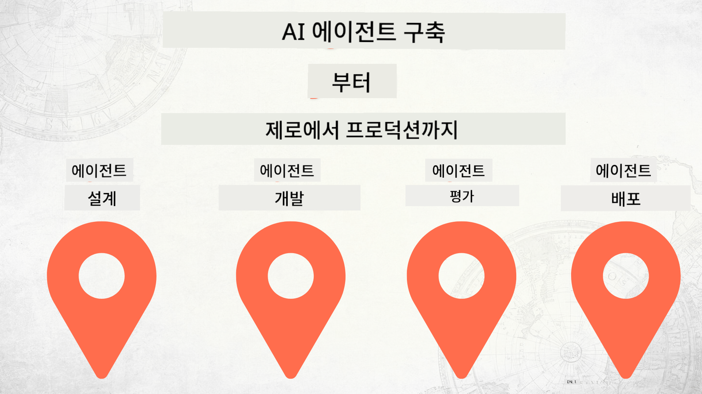

<!--
CO_OP_TRANSLATOR_METADATA:
{
  "original_hash": "73b37a335747d59d319b00aac130f073",
  "translation_date": "2025-12-24T23:00:51+00:00",
  "source_file": "README.md",
  "language_code": "ko"
}
-->
# 제로부터 프로덕션까지 AI 에이전트 구축

### 🌐 다국어 지원

#### GitHub Action을 통한 지원 (자동화 및 항상 최신 상태 유지)

<!-- CO-OP TRANSLATOR LANGUAGES TABLE START -->
[아랍어](../ar/README.md) | [벵골어](../bn/README.md) | [불가리아어](../bg/README.md) | [버마어(미얀마)](../my/README.md) | [중국어(간체)](../zh/README.md) | [중국어(번체, 홍콩)](../hk/README.md) | [중국어(번체, 마카오)](../mo/README.md) | [중국어(번체, 대만)](../tw/README.md) | [크로아티아어](../hr/README.md) | [체코어](../cs/README.md) | [덴마크어](../da/README.md) | [네덜란드어](../nl/README.md) | [에스토니아어](../et/README.md) | [핀란드어](../fi/README.md) | [프랑스어](../fr/README.md) | [독일어](../de/README.md) | [그리스어](../el/README.md) | [히브리어](../he/README.md) | [힌디어](../hi/README.md) | [헝가리어](../hu/README.md) | [인도네시아어](../id/README.md) | [이탈리아어](../it/README.md) | [일본어](../ja/README.md) | [칸나다어](../kn/README.md) | [한국어](./README.md) | [리투아니아어](../lt/README.md) | [말레이어](../ms/README.md) | [말라얄람어](../ml/README.md) | [마라티어](../mr/README.md) | [네팔어](../ne/README.md) | [나이지리아 피진어](../pcm/README.md) | [노르웨이어](../no/README.md) | [페르시아어(Farsi)](../fa/README.md) | [폴란드어](../pl/README.md) | [포르투갈어(브라질)](../br/README.md) | [포르투갈어(포르투갈)](../pt/README.md) | [펀자브어(구르무키)](../pa/README.md) | [루마니아어](../ro/README.md) | [러시아어](../ru/README.md) | [세르비아어(키릴)](../sr/README.md) | [슬로바키아어](../sk/README.md) | [슬로베니아어](../sl/README.md) | [스페인어](../es/README.md) | [스와힐리어](../sw/README.md) | [스웨덴어](../sv/README.md) | [타갈로그어(필리핀)](../tl/README.md) | [타밀어](../ta/README.md) | [텔루구어](../te/README.md) | [태국어](../th/README.md) | [터키어](../tr/README.md) | [우크라이나어](../uk/README.md) | [우르두어](../ur/README.md) | [베트남어](../vi/README.md)
<!-- CO-OP TRANSLATOR LANGUAGES TABLE END -->

## AI 에이전트 개발 수명주기의 기본을 가르치는 과정

## 🌱 시작하기

이 과정은 AI 에이전트를 구축하고 배포하는 기본 개념을 다루는 레슨들로 구성되어 있습니다.

각 레슨은 이전 레슨을 기반으로 구성되므로 처음부터 시작하여 끝까지 차근차근 진행하는 것을 권장합니다.

AI 에이전트 주제에 대해 더 알아보고 싶다면 [AI 에이전트 초보자 과정](https://aka.ms/ai-agents-beginners)을 확인하세요.

### 다른 학습자들을 만나고 질문에 대한 답을 얻으세요

문제에 막히거나 AI 에이전트 구축에 관해 질문이 있으면 전용 Discord 채널인 [Microsoft Foundry 디스코드](https://discord.gg/Kuaw3ktsu6)에 참여하세요.

### 필요 사항

각 레슨에는 로컬에서 실행할 수 있는 코드 샘플이 포함되어 있습니다. 자신의 복사본을 만들려면 [이 저장소를 포크하세요](https://github.com/microsoft/Building-AI-Agents-From-Zero-To-Production/fork).

이 과정에서는 현재 다음을 사용합니다:

- [Microsoft Agent Framework (MAF)](https://aka.ms/ai-agents-beginners/agent-framework)
- [Microsoft Foundry](https://azure.microsoft.com/products/ai-foundry)
- [Azure OpenAI Service](https://azure.microsoft.com/products/ai-foundry/models/openai)
- [Azure CLI](https://learn.microsoft.com/cli/azure/authenticate-azure-cli?view=azure-cli-latest)

시작하기 전에 이러한 서비스에 액세스할 수 있는지 확인하세요.

모델 호스팅 및 서비스에 대한 추가 옵션이 곧 제공될 예정입니다. 

## 🗃️ 레슨

| **레슨**         | **설명**                                                                                  |
|--------------------|--------------------------------------------------------------------------------------------------|
| [에이전트 설계](./lesson-1-agent-design/README.md)       | 우리의 "Developer Onboarding" 에이전트 사용 사례 소개와 효과적인 에이전트 설계 방법  |
| [에이전트 개발](./lesson-2-agent-development/README.md)  | Microsoft Agent Framework (MAF)를 사용하여 신규 개발자의 온보딩을 돕는 3개의 에이전트를 만듭니다.       |
| [에이전트 평가](./lesson-3-agent-evals/README.md)  | Microsoft Foundry를 사용하여 AI 에이전트의 성능을 평가하고 개선 방법을 알아봅니다. |
| [에이전트 배포](./lesson-4-agent-deployment/README.md)   | 호스티드 에이전트와 OpenAI Chatkit을 사용하여 AI 에이전트를 프로덕션에 배포하는 방법을 알아봅니다.       |

## 🎒 다른 과정

저희 팀은 다른 과정들도 제공합니다! 다음을 확인해 보세요:

<!-- CO-OP TRANSLATOR OTHER COURSES START -->
### LangChain

---

### Azure / Edge / MCP / 에이전트

---
 
### 생성형 AI 시리즈

[-9333EA?style=for-the-badge&labelColor=E5E7EB&color=9333EA)](https://github.com/microsoft/Generative-AI-for-beginners-dotnet?WT.mc_id=academic-105485-koreyst)
[-C084FC?style=for-the-badge&labelColor=E5E7EB&color=C084FC)](https://github.com/microsoft/generative-ai-for-beginners-java?WT.mc_id=academic-105485-koreyst)
[-E879F9?style=for-the-badge&labelColor=E5E7EB&color=E879F9)](https://github.com/microsoft/generative-ai-with-javascript?WT.mc_id=academic-105485-koreyst)

---
 
### 핵심 학습

---
 
### Copilot 시리즈

<!-- CO-OP TRANSLATOR OTHER COURSES END -->

## 기여하기

이 프로젝트는 기여와 제안을 환영합니다. 대부분의 기여는 기여자 라이선스 계약(CLA)에 동의해야 하며, 이는 귀하가 기여물을 사용할 권리가 있고 실제로 그 권리를 우리에게 부여한다는 것을 선언합니다. 자세한 내용은 <https://cla.opensource.microsoft.com>을(를) 참조하세요.

풀 리퀘스트를 제출하면 CLA 봇이 자동으로 CLA 제공 필요 여부를 판단하고 PR에 적절한 표시(예: 상태 검사, 코멘트)를 추가합니다. 봇이 제공하는 지침을 따르기만 하면 됩니다. 우리 CLA를 사용하는 모든 저장소에서 이 작업은 한 번만 수행하면 됩니다.

이 프로젝트는 [Microsoft 오픈 소스 행동 강령](https://opensource.microsoft.com/codeofconduct/)을 채택했습니다.
자세한 내용은 [행동 강령 FAQ](https://opensource.microsoft.com/codeofconduct/faq/)를 참조하거나 추가 질문이나 의견이 있으면 [opencode@microsoft.com](mailto:opencode@microsoft.com)으로 문의하세요.

## 상표

이 프로젝트에는 프로젝트, 제품 또는 서비스의 상표나 로고가 포함될 수 있습니다. Microsoft 상표나 로고의 허가된 사용은 [Microsoft의 상표 및 브랜드 가이드라인](https://www.microsoft.com/legal/intellectualproperty/trademarks/usage/general)의 적용을 받으며 이를 따라야 합니다. 이 프로젝트의 수정된 버전에서 Microsoft 상표나 로고를 사용하는 경우 혼동을 초래하거나 Microsoft의 후원을 암시해서는 안 됩니다. 제3자 상표나 로고의 사용은 해당 제3자의 정책을 따라야 합니다.

## 도움 받기

AI 앱을 만들다가 막히거나 질문이 있으면 참여하세요:

제품 피드백이나 개발 중 오류가 발생한 경우 방문하세요:

---

<!-- CO-OP TRANSLATOR DISCLAIMER START -->
면책사항:
이 문서는 AI 번역 서비스 [Co-op Translator](https://github.com/Azure/co-op-translator)를 사용하여 번역되었습니다. 정확성을 위해 최선을 다하고 있으나 자동 번역에는 오류나 부정확성이 포함될 수 있음을 유의해 주십시오. 중요한 정보의 경우에는 원문(원어) 문서를 권위 있는 출처로 간주해야 합니다. 중요한 내용에 대해서는 전문 번역가에 의한 번역을 권장합니다. 본 번역의 사용으로 인해 발생하는 오해나 잘못된 해석에 대해 당사는 책임을 지지 않습니다.
<!-- CO-OP TRANSLATOR DISCLAIMER END -->