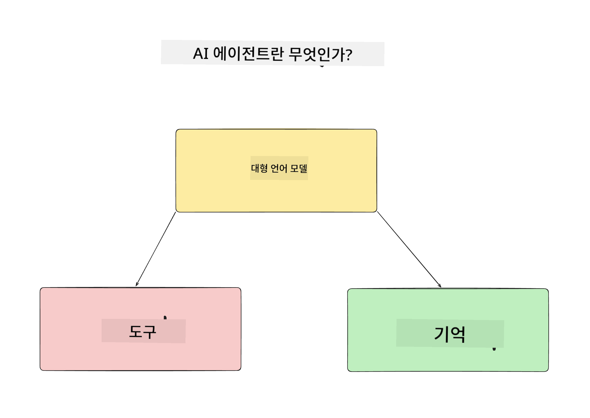
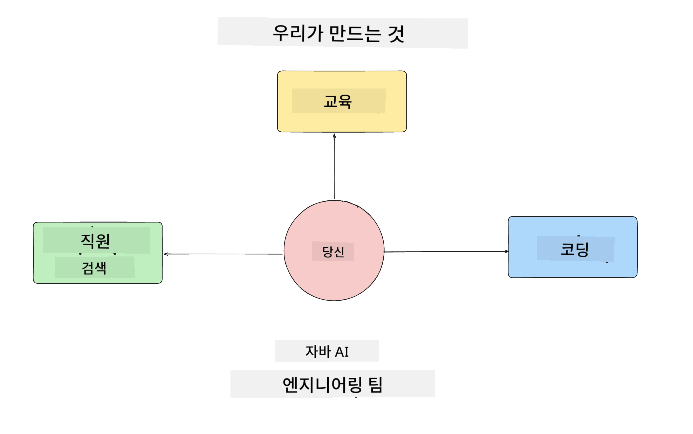
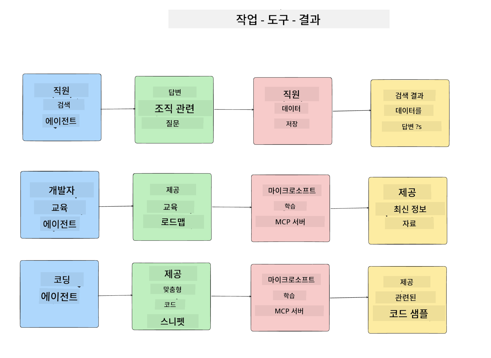
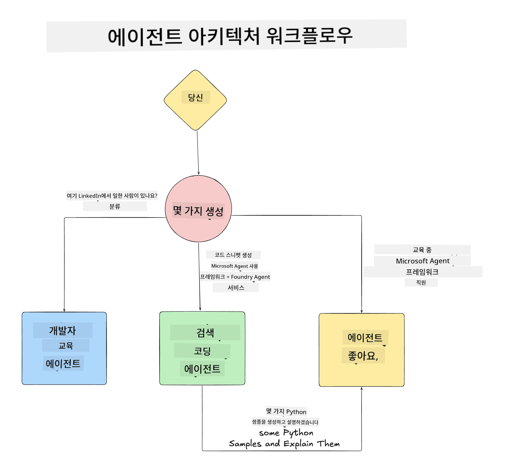

<!--
CO_OP_TRANSLATOR_METADATA:
{
  "original_hash": "99c07849641a850775c188c9333f31e5",
  "translation_date": "2025-12-12T18:21:03+00:00",
  "source_file": "lesson-1-agent-design/README.md",
  "language_code": "ko"
}
-->
# Lesson 1: AI 에이전트 설계

"제로부터 프로덕션까지 AI 에이전트 구축 과정"의 첫 번째 수업에 오신 것을 환영합니다!

이번 수업에서는 다음 내용을 다룹니다:

- AI 에이전트 정의하기
  
- 우리가 만들고 있는 AI 에이전트 애플리케이션 논의하기  

- 각 에이전트에 필요한 도구와 서비스 식별하기
  
- 에이전트 애플리케이션 아키텍처 설계하기
  
먼저 에이전트가 무엇인지, 그리고 왜 애플리케이션 내에서 사용하는지 정의해 보겠습니다.

## AI 에이전트란 무엇인가?

AI 에이전트를 처음 탐색하는 경우, AI 에이전트가 정확히 무엇인지 정의하는 방법에 대해 궁금할 수 있습니다.

AI 에이전트를 구성하는 요소로 간단히 정의하는 방법은 다음과 같습니다:

**대형 언어 모델(LLM)** - LLM은 사용자의 자연어를 처리하여 사용자가 완료하고자 하는 작업을 해석하는 능력과, 해당 작업을 수행하는 데 사용할 수 있는 도구들의 설명을 해석하는 능력을 모두 제공합니다.

**도구** - 함수, API, 데이터 저장소 및 기타 서비스로, LLM이 사용자가 요청한 작업을 완료하기 위해 선택하여 사용할 수 있습니다.

**메모리** - AI 에이전트와 사용자 간의 단기 및 장기 상호작용을 저장하는 방법입니다. 이 정보를 저장하고 검색하는 것은 시간이 지남에 따라 개선하고 사용자 선호도를 저장하는 데 중요합니다.

## 우리의 AI 에이전트 사용 사례

이 과정에서는 새로운 개발자가 AI 에이전트 개발 팀에 온보딩하는 데 도움을 주는 AI 에이전트 애플리케이션을 구축할 것입니다!

개발 작업을 시작하기 전에, 성공적인 AI 에이전트 애플리케이션을 만들기 위한 첫 번째 단계는 사용자가 AI 에이전트와 어떻게 상호작용할지에 대한 명확한 시나리오를 정의하는 것입니다.

이 애플리케이션에서는 다음 시나리오를 다룹니다:

**시나리오 1**: 새로운 직원이 조직에 합류하여 자신이 속한 팀과 팀과 연결하는 방법에 대해 알고 싶어합니다.

**시나리오 2:** 새로운 직원이 시작할 가장 적합한 첫 번째 작업이 무엇인지 알고 싶어합니다.

**시나리오 3:** 새로운 직원이 이 작업을 완료하는 데 도움이 될 학습 자료와 코드 샘플을 수집하고자 합니다.

## 도구 및 서비스 식별하기

이제 시나리오가 만들어졌으니, 다음 단계는 AI 에이전트가 이러한 작업을 완료하는 데 필요한 도구와 서비스에 매핑하는 것입니다.

이 과정은 컨텍스트 엔지니어링 범주에 속하며, AI 에이전트가 작업을 완료하는 데 적절한 시점에 올바른 컨텍스트를 갖도록 하는 데 중점을 둡니다.

시나리오별로 진행하며 각 에이전트의 작업, 도구 및 원하는 결과를 나열하여 좋은 에이전트 설계를 수행해 봅시다.

### 시나리오 1 - 직원 검색 에이전트

**작업** - 조직 내 직원에 대한 질문에 답변하기 (입사일, 현재 팀, 위치, 마지막 직책 등)

**도구** - 현재 직원 목록과 조직도 데이터 저장소

**결과** - 데이터 저장소에서 정보를 검색하여 일반 조직 질문과 특정 직원에 관한 질문에 답변할 수 있음

### 시나리오 2 - 작업 추천 에이전트

**작업** - 새로운 직원의 개발자 경험을 바탕으로, 새 직원이 작업할 수 있는 1~3개의 이슈를 제안

**도구** - GitHub MCP 서버를 사용하여 오픈 이슈를 가져오고 개발자 프로필 생성

**결과** - GitHub 프로필의 최근 5개 커밋과 GitHub 프로젝트의 오픈 이슈를 읽고 매칭을 기반으로 추천 가능

### 시나리오 3 - 코드 어시스턴트 에이전트

**작업** - "작업 추천" 에이전트가 추천한 오픈 이슈를 바탕으로 리소스를 조사하고 코드 스니펫을 생성하여 직원 지원

**도구** - Microsoft Learn MCP를 사용해 리소스를 찾고, Code Interpreter를 사용해 맞춤 코드 스니펫 생성

**결과** - 사용자가 추가 지원을 요청하면, Learn MCP 서버를 통해 리소스 링크와 스니펫을 제공하고, 이후 Code Interpreter 에이전트에 인계하여 설명이 포함된 작은 코드 스니펫을 생성

## 에이전트 애플리케이션 아키텍처 설계

각 에이전트를 정의했으니, 각 에이전트가 작업에 따라 어떻게 함께 또는 별도로 작동하는지 이해하는 데 도움이 될 아키텍처 다이어그램을 만들어 봅시다:

## 다음 단계

각 에이전트와 에이전트 시스템을 설계했으니, 다음 수업으로 넘어가 각 에이전트를 개발해 봅시다!

---

<!-- CO-OP TRANSLATOR DISCLAIMER START -->
**면책 조항**:  
이 문서는 AI 번역 서비스 [Co-op Translator](https://github.com/Azure/co-op-translator)를 사용하여 번역되었습니다. 정확성을 위해 최선을 다하고 있으나, 자동 번역에는 오류나 부정확성이 포함될 수 있음을 유의하시기 바랍니다. 원문 문서는 권위 있는 출처로 간주되어야 합니다. 중요한 정보의 경우 전문적인 인간 번역을 권장합니다. 본 번역 사용으로 인한 오해나 잘못된 해석에 대해 당사는 책임을 지지 않습니다.
<!-- CO-OP TRANSLATOR DISCLAIMER END -->