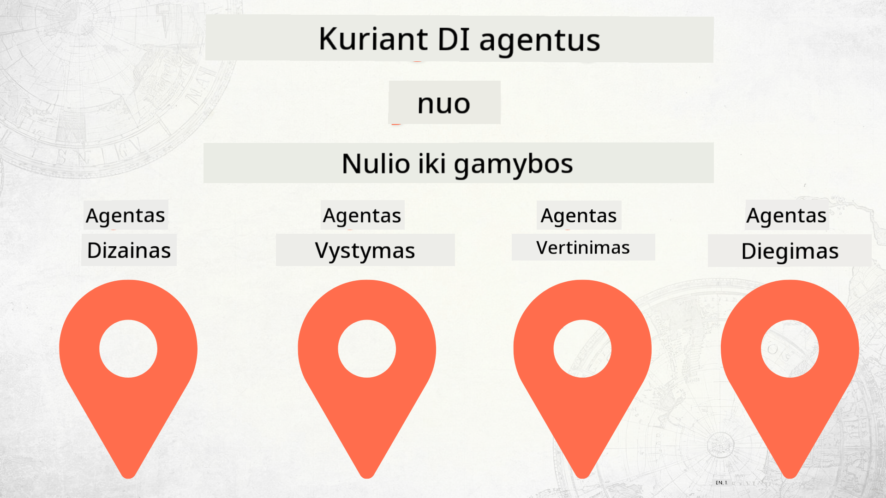

<!--
CO_OP_TRANSLATOR_METADATA:
{
  "original_hash": "f8ea8224e106540413202b4151bb2bcd",
  "translation_date": "2025-12-15T14:40:06+00:00",
  "source_file": "README.md",
  "language_code": "lt"
}
-->
# AI agentų kūrimas nuo nulio iki gamybos

### 🌐 Daugiakalbė palaikymas

#### Palaikoma per GitHub Action (automatizuota ir visada atnaujinta)

<!-- CO-OP TRANSLATOR LANGUAGES TABLE START -->
[Arabic](../ar/README.md) | [Bengali](../bn/README.md) | [Bulgarian](../bg/README.md) | [Burmese (Myanmar)](../my/README.md) | [Chinese (Simplified)](../zh/README.md) | [Chinese (Traditional, Hong Kong)](../hk/README.md) | [Chinese (Traditional, Macau)](../mo/README.md) | [Chinese (Traditional, Taiwan)](../tw/README.md) | [Croatian](../hr/README.md) | [Czech](../cs/README.md) | [Danish](../da/README.md) | [Dutch](../nl/README.md) | [Estonian](../et/README.md) | [Finnish](../fi/README.md) | [French](../fr/README.md) | [German](../de/README.md) | [Greek](../el/README.md) | [Hebrew](../he/README.md) | [Hindi](../hi/README.md) | [Hungarian](../hu/README.md) | [Indonesian](../id/README.md) | [Italian](../it/README.md) | [Japanese](../ja/README.md) | [Kannada](../kn/README.md) | [Korean](../ko/README.md) | [Lithuanian](./README.md) | [Malay](../ms/README.md) | [Malayalam](../ml/README.md) | [Marathi](../mr/README.md) | [Nepali](../ne/README.md) | [Nigerian Pidgin](../pcm/README.md) | [Norwegian](../no/README.md) | [Persian (Farsi)](../fa/README.md) | [Polish](../pl/README.md) | [Portuguese (Brazil)](../br/README.md) | [Portuguese (Portugal)](../pt/README.md) | [Punjabi (Gurmukhi)](../pa/README.md) | [Romanian](../ro/README.md) | [Russian](../ru/README.md) | [Serbian (Cyrillic)](../sr/README.md) | [Slovak](../sk/README.md) | [Slovenian](../sl/README.md) | [Spanish](../es/README.md) | [Swahili](../sw/README.md) | [Swedish](../sv/README.md) | [Tagalog (Filipino)](../tl/README.md) | [Tamil](../ta/README.md) | [Telugu](../te/README.md) | [Thai](../th/README.md) | [Turkish](../tr/README.md) | [Ukrainian](../uk/README.md) | [Urdu](../ur/README.md) | [Vietnamese](../vi/README.md)
<!-- CO-OP TRANSLATOR LANGUAGES TABLE END -->

## Kursas, mokantis AI agentų kūrimo ciklo pagrindų

## 🌱 Pradžia

Šiame kurse yra pamokos, apimančios AI agentų kūrimo ir diegimo pagrindus.

Kiekviena pamoka statoma ant ankstesnės, todėl rekomenduojame pradėti nuo pradžios ir eiti iki pabaigos.

Jei norite daugiau sužinoti apie AI agentų temas, galite peržiūrėti [AI agentų pradedančiųjų kursą](https://aka.ms/ai-agents-beginners).

### Susipažinkite su kitais besimokančiais, gaukite atsakymus į savo klausimus

Jei užstrigote arba turite klausimų apie AI agentų kūrimą, prisijunkite prie mūsų specialaus Discord kanalo [Microsoft Foundry Discord](https://discord.gg/Kuaw3ktsu6).

### Ko jums reikia

Kiekviena pamoka turi savo kodo pavyzdį, kurį galite paleisti vietoje. Galite [padaryti šio repozitorijos šaką](https://github.com/microsoft/Building-AI-Agents-From-Zero-To-Production/fork) ir sukurti savo kopiją.

Šis kursas šiuo metu naudoja:

- [Microsoft Agent Framework (MAF)](https://aka.ms/ai-agents-beginners/agent-framework)
- [Microsoft Foundry](https://azure.microsoft.com/products/ai-foundry)
- [Azure OpenAI Service](https://azure.microsoft.com/products/ai-foundry/models/openai)
- [Azure CLI](https://learn.microsoft.com/cli/azure/authenticate-azure-cli?view=azure-cli-latest)

Prieš pradėdami įsitikinkite, kad turite prieigą prie šių paslaugų.

Netrukus bus daugiau galimybių dėl modelių talpinimo ir paslaugų.

## 🗃️ Pamokos

| **Pamoka**         | **Aprašymas**                                                                                  |
|--------------------|--------------------------------------------------------------------------------------------------|
| [Agentų dizainas](./lesson-1-agent-design/README.md)       | Įvadas į mūsų „Kūrėjo įvedimo“ agento naudojimo atvejį ir kaip kurti efektyvius agentus  |
| [Agentų kūrimas](./lesson-2-agent-development/README.md)  | Naudojant Microsoft Agent Framework (MAF), sukurkite 3 agentus, kurie padės naujiems kūrėjams įsitraukti.       |
| [Agentų vertinimas](./lesson-3-agent-evals/README.md)  | Naudojant Microsoft Foundry, sužinokite, kaip gerai veikia mūsų AI agentai ir kaip juos patobulinti. |
| [Agentų diegimas](./lesson-4-agent-deployment/README.md)   | Naudojant talpinamus agentus ir OpenAI Chatkit, sužinokite, kaip diegti AI agentą gamyboje.       |

## Prisidėjimas

Šis projektas laukią indėlių ir pasiūlymų. Dauguma indėlių reikalauja, kad sutiktumėte su
Indėlio licencijos sutartimi (CLA), kurioje deklaruojate, kad turite teisę ir iš tikrųjų suteikiate mums
teisę naudoti jūsų indėlį. Daugiau informacijos rasite <https://cla.opensource.microsoft.com>.

Kai pateikiate pull request, CLA robotas automatiškai nustatys, ar jums reikia pateikti
CLA ir tinkamai pažymės PR (pvz., būsenos patikrinimas, komentaras). Tiesiog vykdykite roboto nurodymus.
Tai reikės padaryti tik vieną kartą visuose repozitorijuose, naudojančiuose mūsų CLA.

Šis projektas priėmė [Microsoft atvirojo kodo elgesio kodeksą](https://opensource.microsoft.com/codeofconduct/).
Daugiau informacijos rasite [Elgesio kodekso DUK](https://opensource.microsoft.com/codeofconduct/faq/) arba
kreipkitės el. paštu [opencode@microsoft.com](mailto:opencode@microsoft.com) su papildomais klausimais ar komentarais.

## Prekių ženklai

Šiame projekte gali būti prekių ženklų ar logotipų, skirtų projektams, produktams ar paslaugoms. Leidžiamas Microsoft
prekių ženklų ar logotipų naudojimas yra reglamentuojamas ir turi atitikti
[Microsoft prekių ženklų ir prekės ženklo gairių](https://www.microsoft.com/legal/intellectualproperty/trademarks/usage/general) reikalavimus.
Microsoft prekių ženklų ar logotipų naudojimas modifikuotose šio projekto versijose neturi sukelti painiavos ar reikšti Microsoft rėmimą.
Bet koks trečiųjų šalių prekių ženklų ar logotipų naudojimas yra reglamentuojamas tų trečiųjų šalių politikos.

## Pagalbos gavimas

Jei užstrigote arba turite klausimų apie AI programėlių kūrimą, prisijunkite:

Jei turite produkto atsiliepimų ar klaidų kūrimo metu, apsilankykite:

---

<!-- CO-OP TRANSLATOR DISCLAIMER START -->
**Atsakomybės apribojimas**:  
Šis dokumentas buvo išverstas naudojant dirbtinio intelekto vertimo paslaugą [Co-op Translator](https://github.com/Azure/co-op-translator). Nors stengiamės užtikrinti tikslumą, prašome atkreipti dėmesį, kad automatiniai vertimai gali turėti klaidų ar netikslumų. Originalus dokumentas gimtąja kalba turėtų būti laikomas autoritetingu šaltiniu. Svarbiai informacijai rekomenduojamas profesionalus žmogaus vertimas. Mes neatsakome už bet kokius nesusipratimus ar neteisingus aiškinimus, kilusius dėl šio vertimo naudojimo.
<!-- CO-OP TRANSLATOR DISCLAIMER END -->