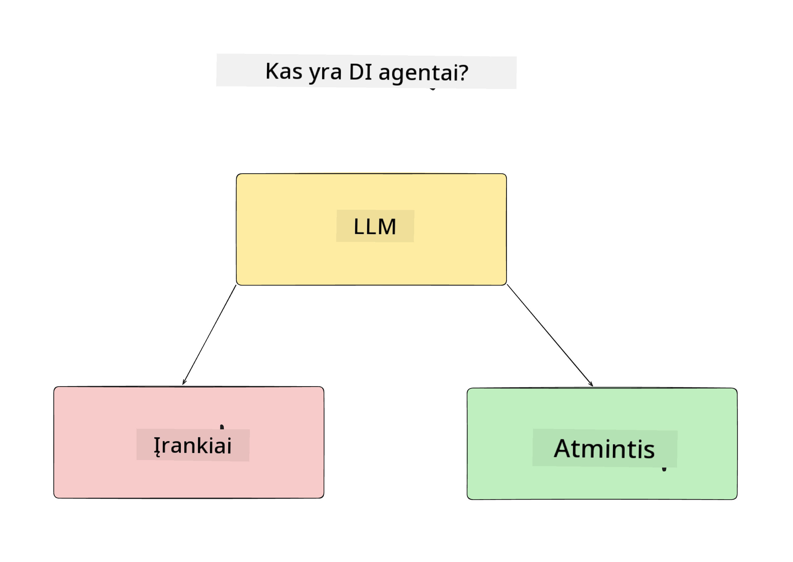
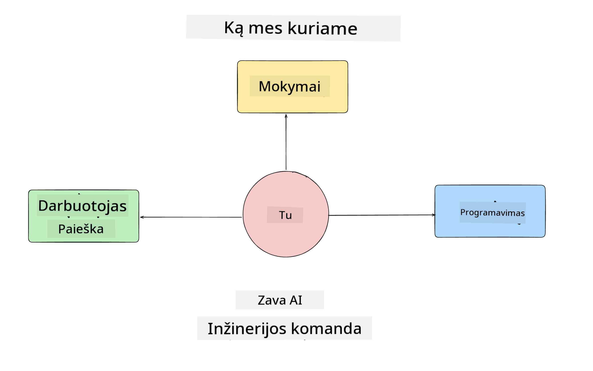
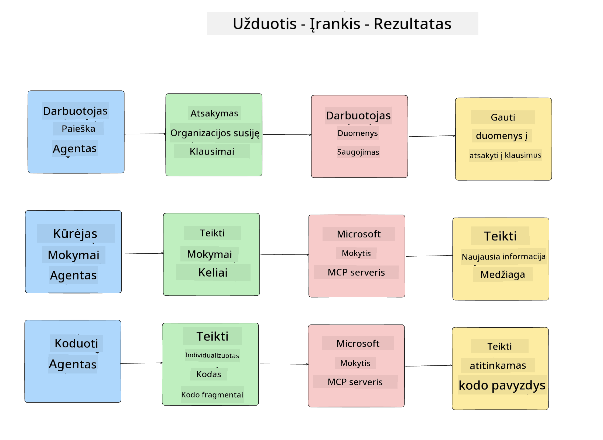
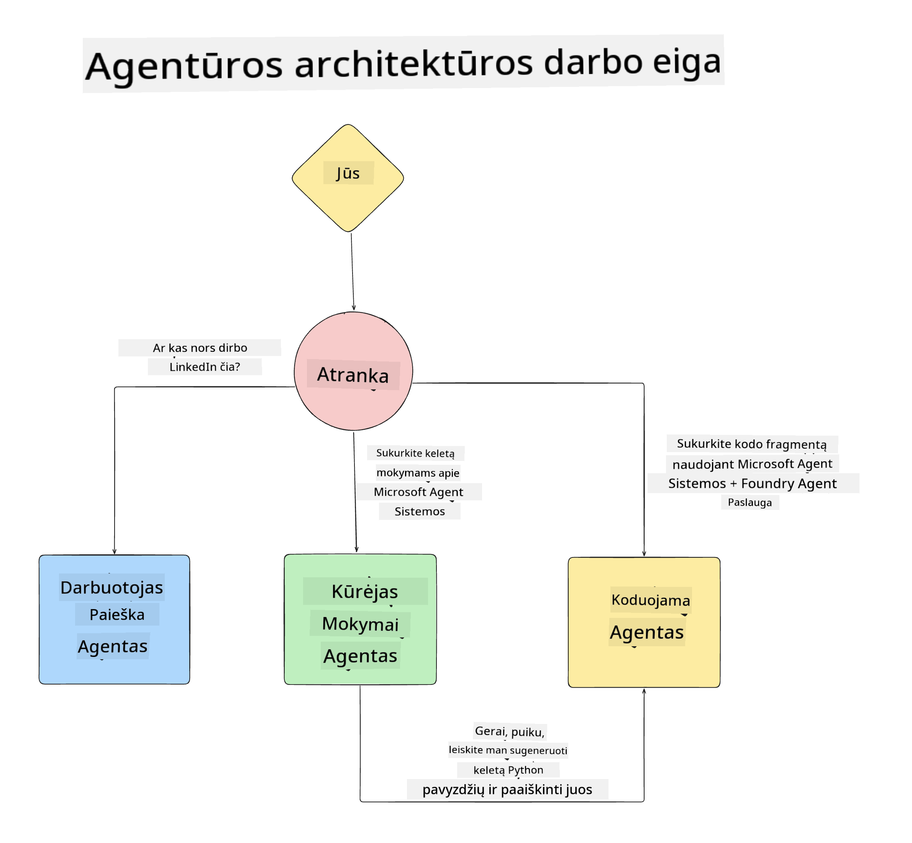

<!--
CO_OP_TRANSLATOR_METADATA:
{
  "original_hash": "99c07849641a850775c188c9333f31e5",
  "translation_date": "2025-12-12T18:44:26+00:00",
  "source_file": "lesson-1-agent-design/README.md",
  "language_code": "lt"
}
-->
# 1 pamoka: DI agentų dizainas

Sveiki atvykę į pirmąją „Dirbtinio intelekto agentų kūrimo nuo nulio iki gamybos“ kurso pamoką!

Šioje pamokoje aptarsime:

- Kas yra DI agentai

- Aptarsime DI agentų programą, kurią kuriame

- Nustatysime kiekvienam agentui reikalingus įrankius ir paslaugas

- Sukursime mūsų agentų programos architektūrą

Pradėkime nuo to, kas yra agentas ir kodėl jį naudotume programoje.

## Kas yra DI agentai?

Jei pirmą kartą tyrinėjate, kaip sukurti DI agentą, gali kilti klausimų, kaip tiksliai apibrėžti, kas yra DI agentas.

Paprastas būdas apibrėžti DI agentą – pagal jo sudedamąsias dalis:

**Didelis kalbos modelis** – LLM suteiks galimybę apdoroti natūralią vartotojo kalbą, interpretuoti užduotį, kurią jie nori atlikti, taip pat interpretuoti įrankių aprašymus, skirtus užduotims atlikti.

**Įrankiai** – tai funkcijos, API, duomenų saugyklos ir kitos paslaugos, kurias LLM gali pasirinkti naudoti, kad įvykdytų vartotojo užklausas.

**Atmintis** – tai, kaip saugome tiek trumpalaikius, tiek ilgalaikius DI agento ir vartotojo sąveikos duomenis. Šios informacijos saugojimas ir gavimas svarbus tobulinimui ir vartotojo pageidavimų išsaugojimui laikui bėgant.

## Mūsų DI agentų naudojimo atvejis

Šiam kursui kursime DI agentų programą, kuri padės naujiems kūrėjams prisijungti prie mūsų DI agentų kūrimo komandos!

Prieš pradėdami bet kokius kūrimo darbus, pirmas žingsnis kuriant sėkmingą DI agentų programą yra aiškiai apibrėžti scenarijus, kaip tikimės, kad vartotojai dirbs su mūsų DI agentais.

Šiai programai dirbsime su šiais scenarijais:

**Scenarijus 1**: Naujas darbuotojas prisijungia prie organizacijos ir nori sužinoti daugiau apie komandą, prie kurios prisijungė, ir kaip su ja susisiekti.

**Scenarijus 2:** Naujas darbuotojas nori sužinoti, kokia būtų geriausia pirmoji užduotis, nuo kurios pradėti darbą.

**Scenarijus 3:** Naujas darbuotojas nori surinkti mokymosi išteklius ir kodo pavyzdžius, kurie padėtų pradėti atlikti šią užduotį.

## Įrankių ir paslaugų nustatymas

Dabar, kai turime šiuos scenarijus, kitas žingsnis – susieti juos su įrankiais ir paslaugomis, kurių mūsų DI agentams reikės užduotims atlikti.

Šis procesas priklauso konteksto inžinerijos sričiai, nes sutelksime dėmesį į tai, kad mūsų DI agentai turėtų tinkamą kontekstą tinkamu laiku užduotims atlikti.

Padarykime tai scenarijus po scenarijaus ir atlikime gerą agentų dizainą, išvardindami kiekvieno agente užduotį, įrankius ir norimus rezultatus.

### Scenarijus 1 – Darbuotojų paieškos agentas

**Užduotis** – Atsakyti į klausimus apie organizacijos darbuotojus, pvz., prisijungimo datą, dabartinę komandą, vietą ir paskutinę pareigą.

**Įrankiai** – Dabartinių darbuotojų sąrašo ir organizacijos schemos duomenų saugykla

**Rezultatai** – Gebėjimas gauti informaciją iš duomenų saugyklos, kad būtų atsakyta į bendrus organizacijos klausimus ir konkrečius klausimus apie darbuotojus.

### Scenarijus 2 – Užduočių rekomendacijų agentas

**Užduotis** – Remiantis naujo darbuotojo kūrėjo patirtimi, pasiūlyti 1–3 problemas, kurias naujas darbuotojas galėtų spręsti.

**Įrankiai** – GitHub MCP serveris, skirtas gauti atviras problemas ir sukurti kūrėjo profilį

**Rezultatai** – Gebėjimas perskaityti paskutinius 5 GitHub profilio įsipareigojimus ir atviras problemas GitHub projekte bei pateikti rekomendacijas pagal atitikimą

### Scenarijus 3 – Kodo asistento agentas

**Užduotis** – Remiantis „Užduočių rekomendacijų“ agento pasiūlytomis atviromis problemomis, atlikti tyrimą, pateikti išteklius ir sugeneruoti kodo fragmentus, kurie padėtų darbuotojui.

**Įrankiai** – Microsoft Learn MCP išteklių paieškai ir Kodo interpretatorius, skirtas generuoti individualius kodo fragmentus.

**Rezultatai** – Jei vartotojas prašo papildomos pagalbos, darbo eiga turėtų naudoti Learn MCP serverį, kad pateiktų nuorodas ir ištraukas į išteklius, o tada perduoti Kodo interpretatoriaus agentui, kad sugeneruotų mažus kodo fragmentus su paaiškinimais.

## Mūsų agentų programos architektūra

Dabar, kai apibrėžėme kiekvieną agentą, sukurkime architektūros diagramą, kuri padės suprasti, kaip kiekvienas agentas veiks kartu ir atskirai, priklausomai nuo užduoties:

## Tolimesni žingsniai

Dabar, kai suprojektavome kiekvieną agentą ir mūsų agentų sistemą, pereikime prie kitos pamokos, kurioje kursime kiekvieną iš šių agentų!

---

<!-- CO-OP TRANSLATOR DISCLAIMER START -->
**Atsakomybės apribojimas**:
Šis dokumentas buvo išverstas naudojant dirbtinio intelekto vertimo paslaugą [Co-op Translator](https://github.com/Azure/co-op-translator). Nors siekiame tikslumo, prašome atkreipti dėmesį, kad automatiniai vertimai gali turėti klaidų ar netikslumų. Originalus dokumentas gimtąja kalba turėtų būti laikomas autoritetingu šaltiniu. Svarbiai informacijai rekomenduojama naudoti profesionalų žmogaus vertimą. Mes neatsakome už bet kokius nesusipratimus ar neteisingus aiškinimus, kilusius dėl šio vertimo naudojimo.
<!-- CO-OP TRANSLATOR DISCLAIMER END -->